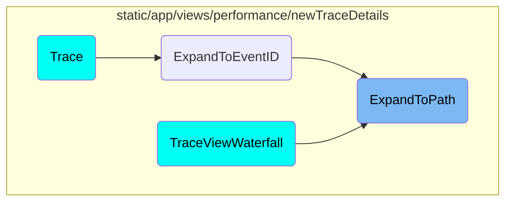

This document explains the <SwmToken path="static/app/views/performance/newTraceDetails/traceModels/traceTree.tsx" pos="1440:3:3" line-data="  static ExpandToPath(">`ExpandToPath`</SwmToken> function, which is responsible for navigating to a specific node in the trace tree based on a given path. It includes details on how the function works, the helper functions it uses, and the overall flow of the process.

The <SwmToken path="static/app/views/performance/newTraceDetails/traceModels/traceTree.tsx" pos="1440:3:3" line-data="  static ExpandToPath(">`ExpandToPath`</SwmToken> function helps you find a specific point in a tree-like structure by following a path. Imagine you have a map with many branches, and you want to reach a particular spot. <SwmToken path="static/app/views/performance/newTraceDetails/traceModels/traceTree.tsx" pos="1440:3:3" line-data="  static ExpandToPath(">`ExpandToPath`</SwmToken> uses a helper called <SwmToken path="static/app/views/performance/newTraceDetails/traceModels/traceTree.tsx" pos="1462:3:3" line-data="    const recurseToRow = async (): Promise&lt;{">`recurseToRow`</SwmToken> to go through each branch and open up the necessary paths. Once it finds the spot, it makes sure everything is visible and tells you where it is. If it needs more details, it uses another helper called <SwmToken path="static/app/views/performance/newTraceDetails/traceModels/traceTree.tsx" pos="1560:1:1" line-data="  zoomIn(">`zoomIn`</SwmToken> to get a closer look. This whole process ensures you can easily navigate and find what you're looking for in a complex structure.

Here is a high level diagram of the flow, showing only the most important functions:

```mermaid
graph TD;
      subgraph static/app
20d67da59164af6b37fd42d26ac26ab4df093db1f62fb276223fcdb650f8b44d(ExpandToPath):::mainFlowStyle --> d8a3480ad410997cc4a4f74a0a3b979b07a5c3ec29394c870a293374e496d6cd(recurseToRow):::mainFlowStyle
end

subgraph static/app
d8a3480ad410997cc4a4f74a0a3b979b07a5c3ec29394c870a293374e496d6cd(recurseToRow):::mainFlowStyle --> 92dea3acb654aef75539b9c90d0d1a3a7dd4c62d174bf34cdde6b1c612b2b8ce(zoomIn):::mainFlowStyle
end

subgraph static/app
92dea3acb654aef75539b9c90d0d1a3a7dd4c62d174bf34cdde6b1c612b2b8ce(zoomIn):::mainFlowStyle --> 26d264772b2128e9b3e50079a896014d209df8881d079a21b8d727ae3257a0e6(dispatch)
end

subgraph static/app
92dea3acb654aef75539b9c90d0d1a3a7dd4c62d174bf34cdde6b1c612b2b8ce(zoomIn):::mainFlowStyle --> 19f36ed21c8e013e7cf7948cbef65c6948e6a7f65ab2f56e9cd53a7eeede9f56(FromSpans)
end

subgraph static/app
92dea3acb654aef75539b9c90d0d1a3a7dd4c62d174bf34cdde6b1c612b2b8ce(zoomIn):::mainFlowStyle --> 950afc5078ac649b81a09c21a3495928104dc7a1c873e12567d8abc2df35d37f(fetchTransactionSpans):::mainFlowStyle
end

subgraph static/app
950afc5078ac649b81a09c21a3495928104dc7a1c873e12567d8abc2df35d37f(fetchTransactionSpans):::mainFlowStyle --> 1025c11ff078741e3a52849e4dc81510d630800b045c60aea951683433a1c993(requestPromise):::mainFlowStyle
end

subgraph static/app
1025c11ff078741e3a52849e4dc81510d630800b045c60aea951683433a1c993(requestPromise):::mainFlowStyle --> 4f5a67a71dfb71654db327ed24d5e8187187a49b58963a473eec18ecb0aef026(request):::mainFlowStyle
end

subgraph static/app
4f5a67a71dfb71654db327ed24d5e8187187a49b58963a473eec18ecb0aef026(request):::mainFlowStyle --> 2cd409575454572c7b228bde73d6eb55227f3d7b14d37cc7ca5415bbcb81e4e5(handler)
end

subgraph static/app
4f5a67a71dfb71654db327ed24d5e8187187a49b58963a473eec18ecb0aef026(request):::mainFlowStyle --> 4b2faee236c2e651d9932fa234f72966df49f7aa0f85eb9909d65f4b6d8ce1a6(parse):::mainFlowStyle
end

subgraph static/app
4b2faee236c2e651d9932fa234f72966df49f7aa0f85eb9909d65f4b6d8ce1a6(parse):::mainFlowStyle --> b2b47f6077e96a1ff47606d77c3fe70b18a84edc0ab0fa1349f7face4165d2ea(parseWidget):::mainFlowStyle
end

subgraph static/app
b2b47f6077e96a1ff47606d77c3fe70b18a84edc0ab0fa1349f7face4165d2ea(parseWidget):::mainFlowStyle --> 05bf2ddeab316943d2187e10bc3886949b4b03ae946f68d4f27a5bfc0025e132(mapToMetricsQuery):::mainFlowStyle
end

subgraph static/app
05bf2ddeab316943d2187e10bc3886949b4b03ae946f68d4f27a5bfc0025e132(mapToMetricsQuery):::mainFlowStyle --> 635bb507b11255a8fd7c2375dac3b6c46b736470cf89007061c6861fc973e73b(fetchAvailableTags)
end


      classDef mainFlowStyle color:#000000,fill:#7CB9F4
classDef rootsStyle color:#000000,fill:#00FFF4
classDef Style1 color:#000000,fill:#00FFAA
classDef Style2 color:#000000,fill:#FFFF00
classDef Style3 color:#000000,fill:#AA7CB9

%% Swimm:
%% graph TD;
%%       subgraph <SwmPath>[static/app/](static/app/)</SwmPath>
%% 20d67da59164af6b37fd42d26ac26ab4df093db1f62fb276223fcdb650f8b44d(ExpandToPath):::mainFlowStyle --> d8a3480ad410997cc4a4f74a0a3b979b07a5c3ec29394c870a293374e496d6cd(recurseToRow):::mainFlowStyle
%% end
%% 
%% subgraph <SwmPath>[static/app/](static/app/)</SwmPath>
%% d8a3480ad410997cc4a4f74a0a3b979b07a5c3ec29394c870a293374e496d6cd(recurseToRow):::mainFlowStyle --> 92dea3acb654aef75539b9c90d0d1a3a7dd4c62d174bf34cdde6b1c612b2b8ce(zoomIn):::mainFlowStyle
%% end
%% 
%% subgraph <SwmPath>[static/app/](static/app/)</SwmPath>
%% 92dea3acb654aef75539b9c90d0d1a3a7dd4c62d174bf34cdde6b1c612b2b8ce(zoomIn):::mainFlowStyle --> 26d264772b2128e9b3e50079a896014d209df8881d079a21b8d727ae3257a0e6(dispatch)
%% end
%% 
%% subgraph <SwmPath>[static/app/](static/app/)</SwmPath>
%% 92dea3acb654aef75539b9c90d0d1a3a7dd4c62d174bf34cdde6b1c612b2b8ce(zoomIn):::mainFlowStyle --> 19f36ed21c8e013e7cf7948cbef65c6948e6a7f65ab2f56e9cd53a7eeede9f56(FromSpans)
%% end
%% 
%% subgraph <SwmPath>[static/app/](static/app/)</SwmPath>
%% 92dea3acb654aef75539b9c90d0d1a3a7dd4c62d174bf34cdde6b1c612b2b8ce(zoomIn):::mainFlowStyle --> 950afc5078ac649b81a09c21a3495928104dc7a1c873e12567d8abc2df35d37f(fetchTransactionSpans):::mainFlowStyle
%% end
%% 
%% subgraph <SwmPath>[static/app/](static/app/)</SwmPath>
%% 950afc5078ac649b81a09c21a3495928104dc7a1c873e12567d8abc2df35d37f(fetchTransactionSpans):::mainFlowStyle --> 1025c11ff078741e3a52849e4dc81510d630800b045c60aea951683433a1c993(requestPromise):::mainFlowStyle
%% end
%% 
%% subgraph <SwmPath>[static/app/](static/app/)</SwmPath>
%% 1025c11ff078741e3a52849e4dc81510d630800b045c60aea951683433a1c993(requestPromise):::mainFlowStyle --> 4f5a67a71dfb71654db327ed24d5e8187187a49b58963a473eec18ecb0aef026(request):::mainFlowStyle
%% end
%% 
%% subgraph <SwmPath>[static/app/](static/app/)</SwmPath>
%% 4f5a67a71dfb71654db327ed24d5e8187187a49b58963a473eec18ecb0aef026(request):::mainFlowStyle --> 2cd409575454572c7b228bde73d6eb55227f3d7b14d37cc7ca5415bbcb81e4e5(handler)
%% end
%% 
%% subgraph <SwmPath>[static/app/](static/app/)</SwmPath>
%% 4f5a67a71dfb71654db327ed24d5e8187187a49b58963a473eec18ecb0aef026(request):::mainFlowStyle --> 4b2faee236c2e651d9932fa234f72966df49f7aa0f85eb9909d65f4b6d8ce1a6(parse):::mainFlowStyle
%% end
%% 
%% subgraph <SwmPath>[static/app/](static/app/)</SwmPath>
%% 4b2faee236c2e651d9932fa234f72966df49f7aa0f85eb9909d65f4b6d8ce1a6(parse):::mainFlowStyle --> b2b47f6077e96a1ff47606d77c3fe70b18a84edc0ab0fa1349f7face4165d2ea(parseWidget):::mainFlowStyle
%% end
%% 
%% subgraph <SwmPath>[static/app/](static/app/)</SwmPath>
%% b2b47f6077e96a1ff47606d77c3fe70b18a84edc0ab0fa1349f7face4165d2ea(parseWidget):::mainFlowStyle --> 05bf2ddeab316943d2187e10bc3886949b4b03ae946f68d4f27a5bfc0025e132(mapToMetricsQuery):::mainFlowStyle
%% end
%% 
%% subgraph <SwmPath>[static/app/](static/app/)</SwmPath>
%% 05bf2ddeab316943d2187e10bc3886949b4b03ae946f68d4f27a5bfc0025e132(mapToMetricsQuery):::mainFlowStyle --> 635bb507b11255a8fd7c2375dac3b6c46b736470cf89007061c6861fc973e73b(fetchAvailableTags)
%% end
%% 
%% 
%%       classDef mainFlowStyle color:#000000,fill:#7CB9F4
%% classDef rootsStyle color:#000000,fill:#00FFF4
%% classDef Style1 color:#000000,fill:#00FFAA
%% classDef Style2 color:#000000,fill:#FFFF00
%% classDef Style3 color:#000000,fill:#AA7CB9
```



# Flow drill down

First, we'll zoom into this section of the flow:

```mermaid
graph TD;
      subgraph static/app
20d67da59164af6b37fd42d26ac26ab4df093db1f62fb276223fcdb650f8b44d(ExpandToPath):::mainFlowStyle --> d8a3480ad410997cc4a4f74a0a3b979b07a5c3ec29394c870a293374e496d6cd(recurseToRow):::mainFlowStyle
end

subgraph static/app
d8a3480ad410997cc4a4f74a0a3b979b07a5c3ec29394c870a293374e496d6cd(recurseToRow):::mainFlowStyle --> 92dea3acb654aef75539b9c90d0d1a3a7dd4c62d174bf34cdde6b1c612b2b8ce(zoomIn):::mainFlowStyle
end

subgraph static/app
92dea3acb654aef75539b9c90d0d1a3a7dd4c62d174bf34cdde6b1c612b2b8ce(zoomIn):::mainFlowStyle --> 26d264772b2128e9b3e50079a896014d209df8881d079a21b8d727ae3257a0e6(dispatch)
end

subgraph static/app
92dea3acb654aef75539b9c90d0d1a3a7dd4c62d174bf34cdde6b1c612b2b8ce(zoomIn):::mainFlowStyle --> 19f36ed21c8e013e7cf7948cbef65c6948e6a7f65ab2f56e9cd53a7eeede9f56(FromSpans)
end

subgraph static/app
92dea3acb654aef75539b9c90d0d1a3a7dd4c62d174bf34cdde6b1c612b2b8ce(zoomIn):::mainFlowStyle --> 950afc5078ac649b81a09c21a3495928104dc7a1c873e12567d8abc2df35d37f(fetchTransactionSpans):::mainFlowStyle
end

subgraph static/app
950afc5078ac649b81a09c21a3495928104dc7a1c873e12567d8abc2df35d37f(fetchTransactionSpans):::mainFlowStyle --> ld2oc(...)
end

subgraph static/app
26d264772b2128e9b3e50079a896014d209df8881d079a21b8d727ae3257a0e6(dispatch) --> 2cd409575454572c7b228bde73d6eb55227f3d7b14d37cc7ca5415bbcb81e4e5(handler)
end

subgraph static/app
2cd409575454572c7b228bde73d6eb55227f3d7b14d37cc7ca5415bbcb81e4e5(handler) --> 559bfddfedaeb6eedd4a2b9c4af59508927a1a6190c13b585781a179d22a07a1(processEvent)
end


      classDef mainFlowStyle color:#000000,fill:#7CB9F4
classDef rootsStyle color:#000000,fill:#00FFF4
classDef Style1 color:#000000,fill:#00FFAA
classDef Style2 color:#000000,fill:#FFFF00
classDef Style3 color:#000000,fill:#AA7CB9

%% Swimm:
%% graph TD;
%%       subgraph <SwmPath>[static/app/](static/app/)</SwmPath>
%% 20d67da59164af6b37fd42d26ac26ab4df093db1f62fb276223fcdb650f8b44d(ExpandToPath):::mainFlowStyle --> d8a3480ad410997cc4a4f74a0a3b979b07a5c3ec29394c870a293374e496d6cd(recurseToRow):::mainFlowStyle
%% end
%% 
%% subgraph <SwmPath>[static/app/](static/app/)</SwmPath>
%% d8a3480ad410997cc4a4f74a0a3b979b07a5c3ec29394c870a293374e496d6cd(recurseToRow):::mainFlowStyle --> 92dea3acb654aef75539b9c90d0d1a3a7dd4c62d174bf34cdde6b1c612b2b8ce(zoomIn):::mainFlowStyle
%% end
%% 
%% subgraph <SwmPath>[static/app/](static/app/)</SwmPath>
%% 92dea3acb654aef75539b9c90d0d1a3a7dd4c62d174bf34cdde6b1c612b2b8ce(zoomIn):::mainFlowStyle --> 26d264772b2128e9b3e50079a896014d209df8881d079a21b8d727ae3257a0e6(dispatch)
%% end
%% 
%% subgraph <SwmPath>[static/app/](static/app/)</SwmPath>
%% 92dea3acb654aef75539b9c90d0d1a3a7dd4c62d174bf34cdde6b1c612b2b8ce(zoomIn):::mainFlowStyle --> 19f36ed21c8e013e7cf7948cbef65c6948e6a7f65ab2f56e9cd53a7eeede9f56(FromSpans)
%% end
%% 
%% subgraph <SwmPath>[static/app/](static/app/)</SwmPath>
%% 92dea3acb654aef75539b9c90d0d1a3a7dd4c62d174bf34cdde6b1c612b2b8ce(zoomIn):::mainFlowStyle --> 950afc5078ac649b81a09c21a3495928104dc7a1c873e12567d8abc2df35d37f(fetchTransactionSpans):::mainFlowStyle
%% end
%% 
%% subgraph <SwmPath>[static/app/](static/app/)</SwmPath>
%% 950afc5078ac649b81a09c21a3495928104dc7a1c873e12567d8abc2df35d37f(fetchTransactionSpans):::mainFlowStyle --> ld2oc(...)
%% end
%% 
%% subgraph <SwmPath>[static/app/](static/app/)</SwmPath>
%% 26d264772b2128e9b3e50079a896014d209df8881d079a21b8d727ae3257a0e6(dispatch) --> 2cd409575454572c7b228bde73d6eb55227f3d7b14d37cc7ca5415bbcb81e4e5(handler)
%% end
%% 
%% subgraph <SwmPath>[static/app/](static/app/)</SwmPath>
%% 2cd409575454572c7b228bde73d6eb55227f3d7b14d37cc7ca5415bbcb81e4e5(handler) --> 559bfddfedaeb6eedd4a2b9c4af59508927a1a6190c13b585781a179d22a07a1(processEvent)
%% end
%% 
%% 
%%       classDef mainFlowStyle color:#000000,fill:#7CB9F4
%% classDef rootsStyle color:#000000,fill:#00FFF4
%% classDef Style1 color:#000000,fill:#00FFAA
%% classDef Style2 color:#000000,fill:#FFFF00
%% classDef Style3 color:#000000,fill:#AA7CB9
```



<SwmSnippet path="/static/app/views/performance/newTraceDetails/traceModels/traceTree.tsx" line="1440">

---

## <SwmToken path="static/app/views/performance/newTraceDetails/traceModels/traceTree.tsx" pos="1440:3:3" line-data="  static ExpandToPath(">`ExpandToPath`</SwmToken>

The <SwmToken path="static/app/views/performance/newTraceDetails/traceModels/traceTree.tsx" pos="1440:3:3" line-data="  static ExpandToPath(">`ExpandToPath`</SwmToken> function is responsible for navigating to a specific node in the trace tree based on a given path. It uses the recursive helper function <SwmToken path="static/app/views/performance/newTraceDetails/traceModels/traceTree.tsx" pos="1462:3:3" line-data="    const recurseToRow = async (): Promise&lt;{">`recurseToRow`</SwmToken> to traverse the tree and expand nodes as needed. If the target node is found, it triggers a rerender and returns the node's index and reference.

```tsx
  static ExpandToPath(
    tree: TraceTree,
    scrollQueue: TraceTree.NodePath[],
    rerender: () => void,
    options: ViewManagerScrollToOptions
  ): Promise<{index: number; node: TraceTreeNode<TraceTree.NodeValue>} | null | null> {
    const segments = [...scrollQueue];
    const list = tree.list;

    if (!list) {
      return Promise.resolve(null);
    }

    if (segments.length === 1 && segments[0] === 'trace-root') {
      rerender();
      return Promise.resolve({index: 0, node: tree.root.children[0]});
    }

    // Keep parent reference as we traverse the tree so that we can only
    // perform searching in the current level and not the entire tree
    let parent: TraceTreeNode<TraceTree.NodeValue> = tree.root;
```

---

</SwmSnippet>

<SwmSnippet path="/static/app/views/performance/newTraceDetails/traceModels/traceTree.tsx" line="1462">

---

### <SwmToken path="static/app/views/performance/newTraceDetails/traceModels/traceTree.tsx" pos="1462:3:3" line-data="    const recurseToRow = async (): Promise&lt;{">`recurseToRow`</SwmToken>

The <SwmToken path="static/app/views/performance/newTraceDetails/traceModels/traceTree.tsx" pos="1462:3:3" line-data="    const recurseToRow = async (): Promise&lt;{">`recurseToRow`</SwmToken> function is a recursive helper used by <SwmToken path="static/app/views/performance/newTraceDetails/traceModels/traceTree.tsx" pos="1440:3:3" line-data="  static ExpandToPath(">`ExpandToPath`</SwmToken> to navigate through the trace tree. It handles various cases, such as expanding autogrouped nodes and zooming into transaction nodes, to ensure the correct node is found and made visible.

```tsx
    const recurseToRow = async (): Promise<{
      index: number;
      node: TraceTreeNode<TraceTree.NodeValue>;
    } | null | null> => {
      const path = segments.pop();
      let current = findInTreeFromSegment(parent, path!);

      if (!current) {
        // Some parts of the codebase link to span:span_id, txn:event_id, where span_id is
        // actally stored on the txn:event_id node. Since we cant tell from the link itself
        // that this is happening, we will perform a final check to see if we've actually already
        // arrived to the node in the previous search call.
        if (path) {
          const [type, id] = path.split('-');

          if (
            type === 'span' &&
            isTransactionNode(parent) &&
            parent.value.span_id === id
          ) {
            current = parent;
```

---

</SwmSnippet>

<SwmSnippet path="/static/app/views/performance/newTraceDetails/traceModels/traceTree.tsx" line="1560">

---

## <SwmToken path="static/app/views/performance/newTraceDetails/traceModels/traceTree.tsx" pos="1560:1:1" line-data="  zoomIn(">`zoomIn`</SwmToken>

The <SwmToken path="static/app/views/performance/newTraceDetails/traceModels/traceTree.tsx" pos="1560:1:1" line-data="  zoomIn(">`zoomIn`</SwmToken> function is used to load and display detailed span data for a given node in the trace tree. It fetches the span data, updates the tree structure, and adjusts the view to ensure all relevant spans are visible.

```tsx
  zoomIn(
    node: TraceTreeNode<TraceTree.NodeValue>,
    zoomedIn: boolean,
    options: {
      api: Client;
      organization: Organization;
    }
  ): Promise<Event | null> {
    if (zoomedIn === node.zoomedIn) {
      return Promise.resolve(null);
    }

    if (!zoomedIn) {
      const index = this._list.indexOf(node);

      if (index === -1) {
        return Promise.resolve(null);
      }

      const childrenCount = node.getVisibleChildrenCount();
      this._list.splice(index + 1, childrenCount);
```

---

</SwmSnippet>

<SwmSnippet path="/static/app/views/performance/newTraceDetails/traceModels/traceTree.tsx" line="1734">

---

## dispatch

The dispatch function handles event notifications within the trace tree. It invokes all registered event handlers for a given event, allowing different parts of the application to respond to changes in the trace tree.

```tsx
  dispatch<K extends keyof TraceTree.TraceTreeEvents>(
    event: K,
    ...args: ArgumentTypes<TraceTree.TraceTreeEvents[K]>
  ): void {
    if (!this.listeners[event]) {
      return;
    }

    for (const handler of this.listeners[event]) {
      // @ts-expect-error
      handler(...args);
    }
  }
```

---

</SwmSnippet>

<SwmSnippet path="/static/app/views/performance/newTraceDetails/traceModels/traceTree.tsx" line="892">

---

## <SwmToken path="static/app/views/performance/newTraceDetails/traceModels/traceTree.tsx" pos="892:3:3" line-data="  static FromSpans(">`FromSpans`</SwmToken>

The <SwmToken path="static/app/views/performance/newTraceDetails/traceModels/traceTree.tsx" pos="892:3:3" line-data="  static FromSpans(">`FromSpans`</SwmToken> function constructs the trace tree structure from span data. It processes the spans, creates tree nodes, and handles special cases such as reparenting transactions under their corresponding spans.

```tsx
  static FromSpans(
    parent: TraceTreeNode<TraceTree.NodeValue>,
    data: Event,
    spans: TraceTree.RawSpan[],
    options: {sdk: string | undefined} | undefined
  ): [TraceTreeNode<TraceTree.NodeValue>, [number, number] | null] {
    parent.invalidate(parent);
    const platformHasMissingSpans = shouldAddMissingInstrumentationSpan(options?.sdk);

    let min_span_start = Number.POSITIVE_INFINITY;
    let min_span_end = Number.NEGATIVE_INFINITY;

    const parentIsSpan = isSpanNode(parent);
    const lookuptable: Record<
      TraceTree.RawSpan['span_id'],
      TraceTreeNode<TraceTree.Span | TraceTree.Transaction>
    > = {};

    // If we've already fetched children, the tree is already assembled
    if (parent.spanChildren.length > 0) {
      parent.zoomedIn = true;
```

---

</SwmSnippet>

<SwmSnippet path="/static/app/components/replays/canvasReplayerPlugin.tsx" line="300">

---

## handler

The handler function manages canvas mutations during replay. It processes events, updates the canvas, and handles errors. This function ensures that the canvas state is correctly synchronized with the replayed events.

```tsx
    /**
     * Mutate canvas outside of iframe, then export the canvas as an image, and
     * draw inside of the image el inside of replay canvas.
     */
    handler: (e: eventWithTime, isSync: boolean, {replayer}: {replayer: Replayer}) => {
      const isCanvas = isCanvasMutationEvent(e);

      // isSync = true means it is fast forwarding vs playing
      // nothing to do when fast forwarding since canvas mutations for us are
      // image snapshots and do not depend on past events
      if (isSync) {
        // Set this to -1 to indicate that we will need to search
        // `canvasMutationEvents` for starting point of preloading
        //
        // Only do this when isSync is true, meaning there was a seek, since we
        // don't know where next index is
        nextPreloadIndex = -1;

        if (isCanvas) {
          processEventSync(e, {replayer});
        }
```

---

</SwmSnippet>

<SwmSnippet path="/static/app/components/replays/canvasReplayerPlugin.tsx" line="230">

---

## <SwmToken path="static/app/components/replays/canvasReplayerPlugin.tsx" pos="233:5:5" line-data="  async function processEvent(e: CanvasEventWithTime, {replayer}: {replayer: Replayer}) {">`processEvent`</SwmToken>

The <SwmToken path="static/app/components/replays/canvasReplayerPlugin.tsx" pos="233:5:5" line-data="  async function processEvent(e: CanvasEventWithTime, {replayer}: {replayer: Replayer}) {">`processEvent`</SwmToken> function processes individual canvas mutation events. It preloads the event data, updates the target canvas, and handles any errors that occur during the mutation process. This function is essential for maintaining the visual accuracy of the replayed canvas.

```tsx
  /**
   * Processes canvas mutation events
   */
  async function processEvent(e: CanvasEventWithTime, {replayer}: {replayer: Replayer}) {
    preload(e);

    const source = replayer.getMirror().getNode(e.data.id);
    const target =
      canvases.get(e.data.id) ||
      (source && cloneCanvas(e.data.id, source as HTMLCanvasElement));

    if (!target) {
      throw new InvalidCanvasNodeError('No canvas found for id');
    }

    await canvasMutation({
      event: e,
      mutation: e.data,
      target,
      imageMap,
      canvasEventMap,
```

---

</SwmSnippet>

Now, lets zoom into this section of the flow:

```mermaid
graph TD;
      subgraph static/app
950afc5078ac649b81a09c21a3495928104dc7a1c873e12567d8abc2df35d37f(fetchTransactionSpans):::mainFlowStyle --> 1025c11ff078741e3a52849e4dc81510d630800b045c60aea951683433a1c993(requestPromise):::mainFlowStyle
end

subgraph static/app
1025c11ff078741e3a52849e4dc81510d630800b045c60aea951683433a1c993(requestPromise):::mainFlowStyle --> 4f5a67a71dfb71654db327ed24d5e8187187a49b58963a473eec18ecb0aef026(request):::mainFlowStyle
end

subgraph static/app
4f5a67a71dfb71654db327ed24d5e8187187a49b58963a473eec18ecb0aef026(request):::mainFlowStyle --> 2cd409575454572c7b228bde73d6eb55227f3d7b14d37cc7ca5415bbcb81e4e5(handler)
end

subgraph static/app
4f5a67a71dfb71654db327ed24d5e8187187a49b58963a473eec18ecb0aef026(request):::mainFlowStyle --> 4b2faee236c2e651d9932fa234f72966df49f7aa0f85eb9909d65f4b6d8ce1a6(parse):::mainFlowStyle
end

subgraph static/app
4b2faee236c2e651d9932fa234f72966df49f7aa0f85eb9909d65f4b6d8ce1a6(parse):::mainFlowStyle --> b2b47f6077e96a1ff47606d77c3fe70b18a84edc0ab0fa1349f7face4165d2ea(parseWidget):::mainFlowStyle
end

subgraph static/app
2cd409575454572c7b228bde73d6eb55227f3d7b14d37cc7ca5415bbcb81e4e5(handler) --> 559bfddfedaeb6eedd4a2b9c4af59508927a1a6190c13b585781a179d22a07a1(processEvent)
end

subgraph static/app
b2b47f6077e96a1ff47606d77c3fe70b18a84edc0ab0fa1349f7face4165d2ea(parseWidget):::mainFlowStyle --> 05bf2ddeab316943d2187e10bc3886949b4b03ae946f68d4f27a5bfc0025e132(mapToMetricsQuery):::mainFlowStyle
end


      classDef mainFlowStyle color:#000000,fill:#7CB9F4
classDef rootsStyle color:#000000,fill:#00FFF4
classDef Style1 color:#000000,fill:#00FFAA
classDef Style2 color:#000000,fill:#FFFF00
classDef Style3 color:#000000,fill:#AA7CB9

%% Swimm:
%% graph TD;
%%       subgraph <SwmPath>[static/app/](static/app/)</SwmPath>
%% 950afc5078ac649b81a09c21a3495928104dc7a1c873e12567d8abc2df35d37f(fetchTransactionSpans):::mainFlowStyle --> 1025c11ff078741e3a52849e4dc81510d630800b045c60aea951683433a1c993(requestPromise):::mainFlowStyle
%% end
%% 
%% subgraph <SwmPath>[static/app/](static/app/)</SwmPath>
%% 1025c11ff078741e3a52849e4dc81510d630800b045c60aea951683433a1c993(requestPromise):::mainFlowStyle --> 4f5a67a71dfb71654db327ed24d5e8187187a49b58963a473eec18ecb0aef026(request):::mainFlowStyle
%% end
%% 
%% subgraph <SwmPath>[static/app/](static/app/)</SwmPath>
%% 4f5a67a71dfb71654db327ed24d5e8187187a49b58963a473eec18ecb0aef026(request):::mainFlowStyle --> 2cd409575454572c7b228bde73d6eb55227f3d7b14d37cc7ca5415bbcb81e4e5(handler)
%% end
%% 
%% subgraph <SwmPath>[static/app/](static/app/)</SwmPath>
%% 4f5a67a71dfb71654db327ed24d5e8187187a49b58963a473eec18ecb0aef026(request):::mainFlowStyle --> 4b2faee236c2e651d9932fa234f72966df49f7aa0f85eb9909d65f4b6d8ce1a6(parse):::mainFlowStyle
%% end
%% 
%% subgraph <SwmPath>[static/app/](static/app/)</SwmPath>
%% 4b2faee236c2e651d9932fa234f72966df49f7aa0f85eb9909d65f4b6d8ce1a6(parse):::mainFlowStyle --> b2b47f6077e96a1ff47606d77c3fe70b18a84edc0ab0fa1349f7face4165d2ea(parseWidget):::mainFlowStyle
%% end
%% 
%% subgraph <SwmPath>[static/app/](static/app/)</SwmPath>
%% 2cd409575454572c7b228bde73d6eb55227f3d7b14d37cc7ca5415bbcb81e4e5(handler) --> 559bfddfedaeb6eedd4a2b9c4af59508927a1a6190c13b585781a179d22a07a1(processEvent)
%% end
%% 
%% subgraph <SwmPath>[static/app/](static/app/)</SwmPath>
%% b2b47f6077e96a1ff47606d77c3fe70b18a84edc0ab0fa1349f7face4165d2ea(parseWidget):::mainFlowStyle --> 05bf2ddeab316943d2187e10bc3886949b4b03ae946f68d4f27a5bfc0025e132(mapToMetricsQuery):::mainFlowStyle
%% end
%% 
%% 
%%       classDef mainFlowStyle color:#000000,fill:#7CB9F4
%% classDef rootsStyle color:#000000,fill:#00FFF4
%% classDef Style1 color:#000000,fill:#00FFAA
%% classDef Style2 color:#000000,fill:#FFFF00
%% classDef Style3 color:#000000,fill:#AA7CB9
```



<SwmSnippet path="/static/app/views/performance/newTraceDetails/traceModels/traceTree.tsx" line="211">

---

## Fetching Transaction Spans

The function <SwmToken path="static/app/views/performance/newTraceDetails/traceModels/traceTree.tsx" pos="205:2:2" line-data="function fetchTransactionSpans(">`fetchTransactionSpans`</SwmToken> initiates the process of fetching transaction spans by making an API request to the endpoint that retrieves span data for a specific event. This is crucial for performance monitoring as it helps in identifying and analyzing the duration and self-time of spans within a transaction.

```tsx
  return api.requestPromise(
    `/organizations/${organization.slug}/events/${project_slug}:${event_id}/?averageColumn=span.self_time&averageColumn=span.duration`
  );
```

---

</SwmSnippet>

<SwmSnippet path="/static/app/api.tsx" line="671">

---

## Handling API Requests

The <SwmToken path="static/app/views/performance/newTraceDetails/traceModels/traceTree.tsx" pos="211:5:5" line-data="  return api.requestPromise(">`requestPromise`</SwmToken> function handles the API request by wrapping it in a promise. It ensures that the request is made and the response is processed correctly, resolving the promise with the data or rejecting it with an error.

```tsx
    return new Promise((resolve, reject) =>
      this.request(path, {
        ...options,
        preservedError,
        success: (data, textStatus, resp) => {
          if (includeAllArgs) {
            resolve([data, textStatus, resp] as any);
          } else {
            resolve(data);
          }
```

---

</SwmSnippet>

<SwmSnippet path="/static/app/api.tsx" line="420">

---

### Making the Request

The <SwmToken path="static/app/api.tsx" pos="420:1:1" line-data="  request(path: string, options: Readonly&lt;RequestOptions&gt; = {}): Request {">`request`</SwmToken> function constructs and sends the actual HTTP request. It builds the request URL, sets the method (GET or POST), and prepares the data and headers. This function is essential for making the API call initiated by <SwmToken path="static/app/views/performance/newTraceDetails/traceModels/traceTree.tsx" pos="205:2:2" line-data="function fetchTransactionSpans(">`fetchTransactionSpans`</SwmToken>.

```tsx
  request(path: string, options: Readonly<RequestOptions> = {}): Request {
    const method = options.method || (options.data ? 'POST' : 'GET');

    let fullUrl = buildRequestUrl(this.baseUrl, path, options);

    let data = options.data;

    if (data !== undefined && method !== 'GET' && !(data instanceof FormData)) {
      data = JSON.stringify(data);
    }

    // TODO(epurkhiser): Mimicking the old jQuery API, data could be a string /
    // object for GET requests. jQuery just sticks it onto the URL as query
    // parameters
    if (method === 'GET' && data) {
      const queryString = typeof data === 'string' ? data : qs.stringify(data);

      if (queryString.length > 0) {
        fullUrl = fullUrl + (fullUrl.includes('?') ? '&' : '?') + queryString;
      }
    }
```

---

</SwmSnippet>

<SwmSnippet path="/static/app/utils/metrics/dashboardImport.tsx" line="139">

---

## Parsing the Response

The <SwmToken path="static/app/utils/metrics/dashboardImport.tsx" pos="139:5:5" line-data="  public async parse() {">`parse`</SwmToken> function processes the response data. It validates the widget type, parses the widget, and handles any errors that occur during parsing. This step is crucial for transforming the raw response data into a usable format.

```tsx
  public async parse() {
    const {
      id,
      definition: {title, type: widgetType},
    } = this.importedWidget;

    try {
      if (!SUPPORTED_WIDGET_TYPES.has(widgetType)) {
        throw new Error(`widget - unsupported type ${widgetType}`);
      }
      const widget = await this.parseWidget();

      if (!widget || !widget.queries.length) {
        throw new Error('widget - no parseable queries found');
      }

      const outcome: ImportOutcome = this.errors.length ? 'warning' : 'success';

      return {
        report: {
          id,
```

---

</SwmSnippet>

<SwmSnippet path="/static/app/utils/metrics/dashboardImport.tsx" line="179">

---

### Parsing the Widget

The <SwmToken path="static/app/utils/metrics/dashboardImport.tsx" pos="179:5:5" line-data="  private async parseWidget() {">`parseWidget`</SwmToken> function further processes the parsed data by parsing individual requests and queries within the widget. It maps these queries to metrics queries and handles any equations present. This function ensures that the parsed data is correctly structured for further use.

```tsx
  private async parseWidget() {
    this.parseLegendColumns();

    const {title, requests = []} = this.importedWidget.definition as WidgetDefinition;

    const parsedRequests = requests.map(r => this.parseRequest(r));
    const parsedQueries = parsedRequests.flatMap(request => request.queries);

    const metricsQueries = await Promise.all(
      parsedQueries.map(async query => {
        const mapped = await this.mapToMetricsQuery(query);
        return {
          ...mapped,
        };
      })
    );

    const nonEmptyQueries = metricsQueries.filter(query => query.mri) as MetricsQuery[];

    if (!nonEmptyQueries.length) {
      return null;
```

---

</SwmSnippet>

<SwmSnippet path="/static/app/utils/metrics/dashboardImport.tsx" line="398">

---

## Mapping to Metrics Query

The <SwmToken path="static/app/utils/metrics/dashboardImport.tsx" pos="398:5:5" line-data="  private async mapToMetricsQuery(widget): Promise&lt;MetricsQuery | null&gt; {">`mapToMetricsQuery`</SwmToken> function maps the parsed queries to metrics queries. It fetches available tags, constructs the metric query filter, and groups the data. This step is essential for converting the parsed data into a format suitable for metrics analysis.

```tsx
  private async mapToMetricsQuery(widget): Promise<MetricsQuery | null> {
    const {metric, aggregation, filters} = widget;

    // @ts-expect-error name is actually defined on MetricMeta
    const metricMeta = this.availableMetrics.find(m => m.name === metric);

    if (!metricMeta) {
      this.errors.push(`widget.request.query - metric not found: ${metric}`);
      return null;
    }

    const availableTags = await this.fetchAvailableTags(metricMeta.mri);

    const query = this.constructMetricQueryFilter(filters, availableTags);
    const groupBy = this.constructMetricGroupBy(widget.groupBy, availableTags);

    return {
      mri: metricMeta.mri,
      aggregation,
      query,
      groupBy,
```

---

</SwmSnippet>

# Where is this flow used?

This flow is used multiple times in the codebase as represented in the following diagram:



&nbsp;

*This is an auto-generated document by Swimm AI 🌊 and has not yet been verified by a human*

<SwmMeta version="3.0.0" repo-id="Z2l0aHViJTNBJTNBc2VudHJ5LWRlbW8tMSUzQSUzQVN3aW1tLURlbW8=" repo-name="sentry-demo-1" doc-type="flows"><sup>Powered by [Swimm](/)</sup></SwmMeta>
