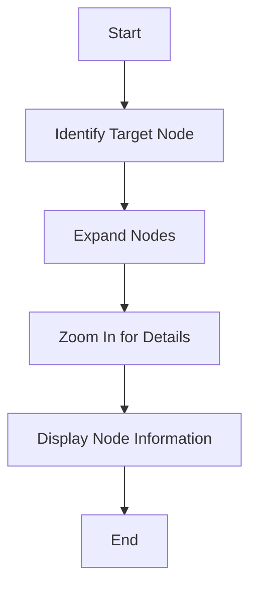

This document will cover the process of navigating the trace tree, which includes:

1. Understanding the purpose of the trace tree navigation
2. Steps involved in navigating the trace tree
3. How each step affects the end user

Technical document: <SwmLink doc-title="Navigating the Trace Tree">[Navigating the Trace Tree](/.swm/navigating-the-trace-tree.vbe0s498.sw.md)</SwmLink>

# [Understanding the purpose of the trace tree navigation](https://app.swimm.io/repos/Z2l0aHViJTNBJTNBc2VudHJ5LWRlbW8tMSUzQSUzQVN3aW1tLURlbW8=/docs/vbe0s498#expandtopath)

The trace tree navigation feature allows users to find and view specific nodes within a complex tree structure. This is particularly useful for performance monitoring and debugging, as it helps users quickly locate and analyze specific events or transactions within the trace.

# Steps involved in navigating the trace tree

The process of navigating the trace tree involves several key steps, each designed to ensure that users can efficiently find and view the information they need.

## [Identify Target Node](https://app.swimm.io/repos/Z2l0aHViJTNBJTNBc2VudHJ5LWRlbW8tMSUzQSUzQVN3aW1tLURlbW8=/docs/vbe0s498#expandtopath)

The first step in navigating the trace tree is to identify the target node based on a given path. This path acts as a guide, directing the navigation process to the specific node that the user wants to view.

## [Expand Nodes](https://app.swimm.io/repos/Z2l0aHViJTNBJTNBc2VudHJ5LWRlbW8tMSUzQSUzQVN3aW1tLURlbW8=/docs/vbe0s498#recursetorow)

Once the target node is identified, the next step is to expand the necessary nodes to make the target node visible. This involves traversing the tree and opening up the branches that lead to the target node. This step ensures that the user can see the entire path to the target node.

## [Zoom In for Details](https://app.swimm.io/repos/Z2l0aHViJTNBJTNBc2VudHJ5LWRlbW8tMSUzQSUzQVN3aW1tLURlbW8=/docs/vbe0s498#zoomin)

If the target node requires more detailed information, the system will zoom in to fetch and display additional data. This step is crucial for providing users with a comprehensive view of the node, including any relevant span data or transaction details.

## [Display Node Information](https://app.swimm.io/repos/Z2l0aHViJTNBJTNBc2VudHJ5LWRlbW8tMSUzQSUzQVN3aW1tLURlbW8=/docs/vbe0s498#dispatch)

Finally, the system displays the information of the target node to the user. This includes all the relevant details that were fetched and ensures that the user has a clear and complete view of the node's data.

&nbsp;

*This is an auto-generated document by Swimm AI 🌊 and has not yet been verified by a human*

<SwmMeta version="3.0.0" repo-id="Z2l0aHViJTNBJTNBc2VudHJ5LWRlbW8tMSUzQSUzQVN3aW1tLURlbW8=" repo-name="sentry-demo-1" doc-type="product-flows">Powered by [Swimm](/)</SwmMeta>
