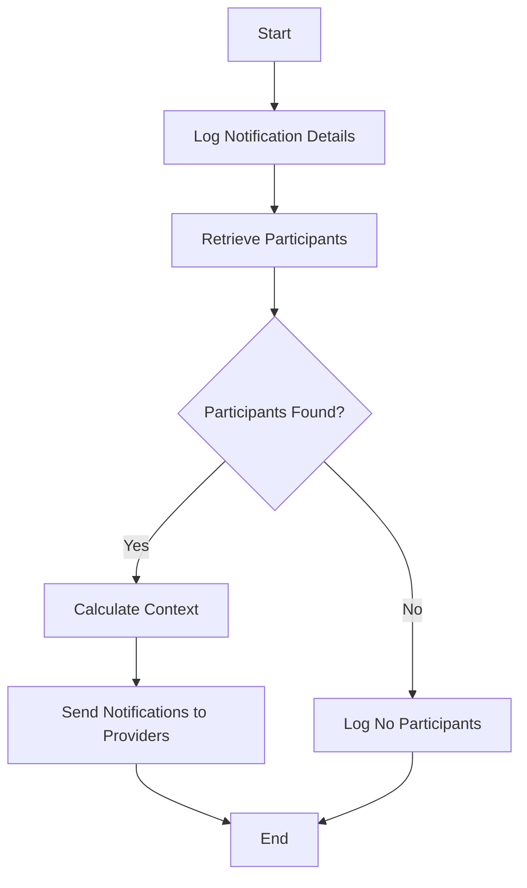

This document will cover the Notification Sending Process, which includes:

1. Logging notification details
2. Retrieving participants
3. Calculating context
4. Sending notifications to each provider.

Technical document: <SwmLink doc-title="Notification Sending Process">[Notification Sending Process](/.swm/notification-sending-process.wzkkf4dg.sw.md)</SwmLink>

# [Logging Notification Details](https://app.swimm.io/repos/Z2l0aHViJTNBJTNBc2VudHJ5LWRlbW8tMSUzQSUzQVN3aW1tLURlbW8=/docs/wzkkf4dg#logging-notification-details)

The process begins by logging the details of the notification. This includes information such as the target type, target identifier, group ID, project ID, organization ID, and a unique notification UUID. This step ensures that all relevant details about the notification are recorded for future reference and troubleshooting.

# [Retrieving Participants](https://app.swimm.io/repos/Z2l0aHViJTNBJTNBc2VudHJ5LWRlbW8tMSUzQSUzQVN3aW1tLURlbW8=/docs/wzkkf4dg#retrieving-participants)

Next, the system retrieves the participants who should receive the notification. This is done by calling a function that gathers necessary details such as the project, target type, and event to determine the eligible recipients. If no participants are found, the system logs this information and stops the process. This step ensures that notifications are only sent to relevant users.

# [Calculating Context](https://app.swimm.io/repos/Z2l0aHViJTNBJTNBc2VudHJ5LWRlbW8tMSUzQSUzQVN3aW1tLURlbW8=/docs/wzkkf4dg#calculating-context)

If participants are found, the system calculates the shared context for the notification. This context includes details about the project, event, and any related commits. It also considers the organization's privacy settings and any relevant rules. This step ensures that the notification contains all necessary information for the recipients.

# [Sending Notifications to Providers](https://app.swimm.io/repos/Z2l0aHViJTNBJTNBc2VudHJ5LWRlbW8tMSUzQSUzQVN3aW1tLURlbW8=/docs/wzkkf4dg#sending-notifications-to-providers)

Finally, the system sends the notifications to each provider. This involves ensuring that all relevant information is included in the notification and that it is delivered to the appropriate channels. This step ensures that the recipients receive the notification through their preferred communication method.

&nbsp;

*This is an auto-generated document by Swimm AI 🌊 and has not yet been verified by a human*

<SwmMeta version="3.0.0" repo-id="Z2l0aHViJTNBJTNBc2VudHJ5LWRlbW8tMSUzQSUzQVN3aW1tLURlbW8=" repo-name="sentry-demo-1" doc-type="product-flows">Powered by [Swimm](/)</SwmMeta>
