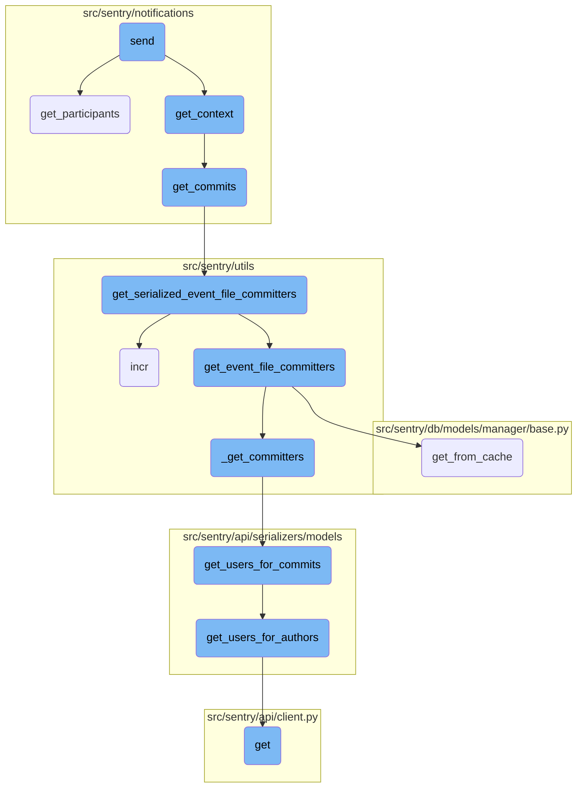
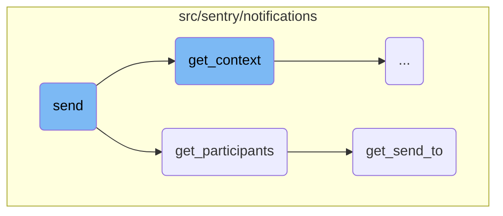
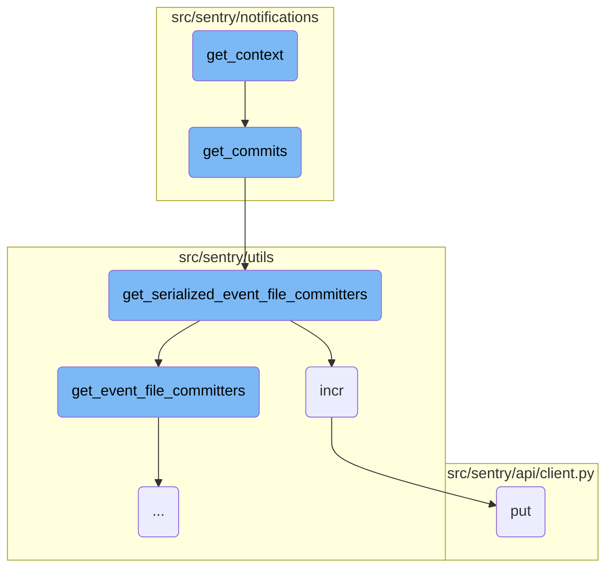
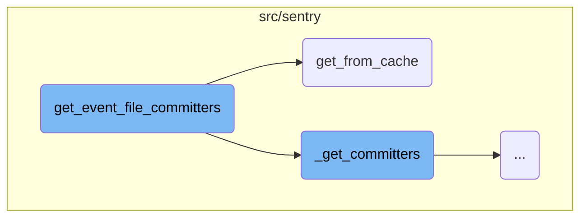
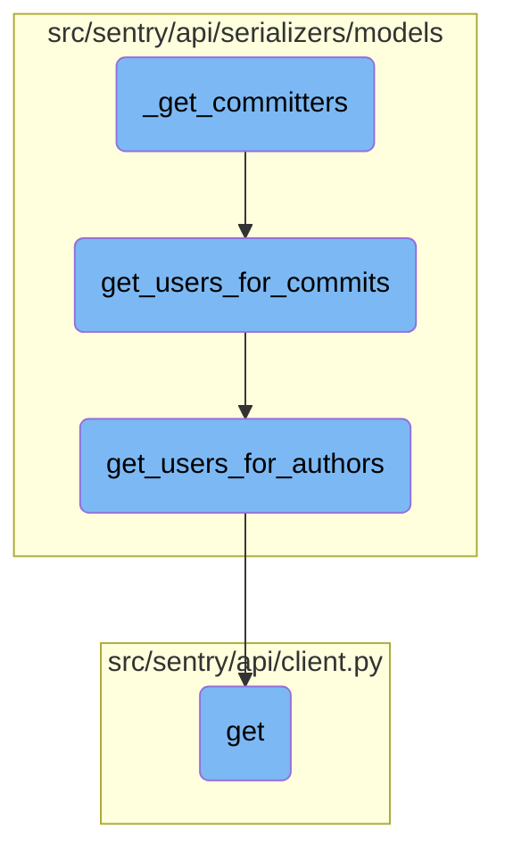

This document explains the process of sending notifications. It covers the steps involved in logging notification details, retrieving participants, calculating context, and sending notifications to each provider.

The process starts by logging the details of the notification. Then, it retrieves the participants who should receive the notification. If there are no participants, it logs this information and stops. If there are participants, it calculates the shared context, which includes details about the project, event, and any related commits. Finally, it sends the notifications to each provider, ensuring that all relevant information is included.

Here is a high level diagram of the flow, showing only the most important functions:



# Flow drill down

First, we'll zoom into this section of the flow:



<SwmSnippet path="/src/sentry/notifications/notifications/rules.py" line="295">

---

## Sending Notifications

The <SwmToken path="src/sentry/notifications/notifications/rules.py" pos="295:3:3" line-data="    def send(self) -&gt; None:">`send`</SwmToken> function is responsible for sending notifications. It first logs the notification details and retrieves the participants using the <SwmToken path="src/sentry/notifications/notifications/rules.py" pos="314:7:7" line-data="        participants_by_provider = self.get_participants()">`get_participants`</SwmToken> function. If there are no participants, it logs this information and exits. Otherwise, it calculates the shared context and sends notifications to each provider.

```python
    def send(self) -> None:
        from sentry.notifications.notify import notify

        metrics.incr("mail_adapter.notify")
        logger.info(
            "mail.adapter.notify",
            extra={
                "target_type": self.target_type.value,
                "target_identifier": self.target_identifier,
                "group": self.group.id,
                "project_id": self.project.id,
                "organization": self.organization.id,
                "fallthrough_choice": (
                    self.fallthrough_choice.value if self.fallthrough_choice else None
                ),
                "notification_uuid": self.notification_uuid,
            },
        )

        participants_by_provider = self.get_participants()
        if not participants_by_provider:
```

---

</SwmSnippet>

<SwmSnippet path="/src/sentry/notifications/notifications/rules.py" line="107">

---

### Retrieving Participants

The <SwmToken path="src/sentry/notifications/notifications/rules.py" pos="107:3:3" line-data="    def get_participants(self) -&gt; Mapping[ExternalProviders, Iterable[Actor]]:">`get_participants`</SwmToken> function retrieves the participants for the notification by calling the <SwmToken path="src/sentry/notifications/notifications/rules.py" pos="108:3:3" line-data="        return get_send_to(">`get_send_to`</SwmToken> function. This function gathers the necessary details such as project, target type, and event to determine the eligible recipients.

```python
    def get_participants(self) -> Mapping[ExternalProviders, Iterable[Actor]]:
        return get_send_to(
            project=self.project,
            target_type=self.target_type,
            target_identifier=self.target_identifier,
            event=self.event,
            notification_type_enum=self.notification_setting_type_enum,
            fallthrough_choice=self.fallthrough_choice,
            rules=self.rules,
            notification_uuid=self.notification_uuid,
        )
```

---

</SwmSnippet>

<SwmSnippet path="/src/sentry/notifications/utils/participants.py" line="363">

---

### Determining Eligible Recipients

The <SwmToken path="src/sentry/notifications/utils/participants.py" pos="363:2:2" line-data="def get_send_to(">`get_send_to`</SwmToken> function determines the eligible recipients for the notification. It first calls <SwmToken path="src/sentry/notifications/utils/participants.py" pos="373:5:5" line-data="    recipients = determine_eligible_recipients(">`determine_eligible_recipients`</SwmToken> to get the initial list of recipients. If there are any rules, it filters out the muted users. Finally, it returns the recipients grouped by their notification provider.

```python
def get_send_to(
    project: Project,
    target_type: ActionTargetType,
    target_identifier: int | None = None,
    event: Event | None = None,
    notification_type_enum: NotificationSettingEnum = NotificationSettingEnum.ISSUE_ALERTS,
    fallthrough_choice: FallthroughChoiceType | None = None,
    rules: Iterable[Rule] | None = None,
    notification_uuid: str | None = None,
) -> Mapping[ExternalProviders, set[Actor]]:
    recipients = determine_eligible_recipients(
        project, target_type, target_identifier, event, fallthrough_choice
    )

    if rules:
        rule_snoozes = RuleSnooze.objects.filter(Q(rule__in=rules))
        muted_user_ids = []
        for rule_snooze in rule_snoozes:
            if rule_snooze.user_id is None:
                return {}
            else:
```

---

</SwmSnippet>

Now, lets zoom into this section of the flow:



<SwmSnippet path="/src/sentry/notifications/notifications/rules.py" line="163">

---

## Extracting context information for notifications

The function <SwmToken path="src/sentry/notifications/notifications/rules.py" pos="162:3:3" line-data="    def get_context(self) -&gt; MutableMapping[str, Any]:">`get_context`</SwmToken> begins by extracting the environment tag from the event and checking the organization's privacy settings. It then retrieves rule details and appends Sentry query parameters to the rule <SwmToken path="src/sentry/api/client.py" pos="7:4:4" line-data="from django.urls import resolve">`urls`</SwmToken>.

```python
        environment = self.event.get_tag("environment")
        enhanced_privacy = self.organization.flags.enhanced_privacy
        rule_details = get_rules(self.rules, self.organization, self.project)
        sentry_query_params = self.get_sentry_query_params(ExternalProviders.EMAIL)
        for rule in rule_details:
            rule.url = rule.url + sentry_query_params
            rule.status_url = rule.url + sentry_query_params

```

---

</SwmSnippet>

<SwmSnippet path="/src/sentry/notifications/notifications/rules.py" line="171">

---

The function continues by determining the notification reason and setting up fallback parameters and group header text.

```python
        notification_reason = get_owner_reason(
            project=self.project,
            target_type=self.target_type,
            event=self.event,
            fallthrough_choice=self.fallthrough_choice,
        )
        fallback_params: MutableMapping[str, str] = {}
        group_header = get_group_substatus_text(self.group)

```

---

</SwmSnippet>

<SwmSnippet path="/src/sentry/notifications/notifications/rules.py" line="180">

---

The main context dictionary is constructed with various pieces of information such as project label, group details, event details, and links. It also includes commits related to the event by calling <SwmToken path="src/sentry/notifications/notifications/rules.py" pos="197:6:6" line-data="            &quot;commits&quot;: get_commits(self.project, self.event),">`get_commits`</SwmToken>.

```python
        notification_uuid = self.notification_uuid if hasattr(self, "notification_uuid") else None
        context = {
            "project_label": self.project.get_full_name(),
            "group": self.group,
            "group_header": group_header,
            "event": self.event,
            "link": get_group_settings_link(
                self.group,
                environment,
                rule_details,
                None,
                notification_uuid=notification_uuid,
                **fallback_params,
            ),
            "rules": rule_details,
            "has_integrations": has_integrations(self.organization, self.project),
            "enhanced_privacy": enhanced_privacy,
            "commits": get_commits(self.project, self.event),
            "environment": environment,
            "slack_link": get_integration_link(self.organization, "slack", self.notification_uuid),
            "notification_reason": notification_reason,
```

---

</SwmSnippet>

<SwmSnippet path="/src/sentry/notifications/notifications/rules.py" line="211">

---

If enhanced privacy is not enabled, additional data such as tags and interfaces are added to the context.

```python
        # if the organization has enabled enhanced privacy controls we don't send
        # data which may show PII or source code
        if not enhanced_privacy:
            context.update({"tags": self.event.tags, "interfaces": get_interface_list(self.event)})

```

---

</SwmSnippet>

<SwmSnippet path="/src/sentry/notifications/notifications/rules.py" line="216">

---

The function checks for session replay features and updates the context with issue replay <SwmToken path="src/sentry/api/client.py" pos="7:4:4" line-data="from django.urls import resolve">`urls`</SwmToken> if applicable.

```python
        has_session_replay = features.has("organizations:session-replay", self.organization)
        show_replay_link = features.has(
            "organizations:session-replay-issue-emails", self.organization
        )
        if has_session_replay and show_replay_link and get_replay_id(self.event):
            context.update(
                {
                    "issue_replays_url": get_issue_replay_link(self.group, sentry_query_params),
                }
            )
```

---

</SwmSnippet>

<SwmSnippet path="/src/sentry/notifications/notifications/rules.py" line="227">

---

Additional context updates are made based on the event's occurrence and issue category, including transaction data for performance issues.

```python
        template_name = (
            self.event.occurrence.evidence_data.get("template_name")
            if isinstance(self.event, GroupEvent) and self.event.occurrence
            else None
        )

        if self.group.issue_category == GroupCategory.PERFORMANCE and template_name != "profile":
            # This can't use data from the occurrence at the moment, so we'll keep fetching the event
            # and gathering span evidence.

            # Regression issues don't have span evidence
            if self.group.issue_type not in [
                PerformanceP95EndpointRegressionGroupType,
                ProfileFunctionRegressionType,
            ]:
                context.update(
                    {
                        "transaction_data": [
                            ("Span Evidence", get_transaction_data(self.event), None)
                        ],
                    }
```

---

</SwmSnippet>

<SwmSnippet path="/src/sentry/notifications/notifications/rules.py" line="255">

---

If there are rules, the context is updated with snooze alert information and <SwmToken path="src/sentry/api/client.py" pos="7:4:4" line-data="from django.urls import resolve">`urls`</SwmToken>.

```python
        if len(self.rules) > 0:
            context["snooze_alert"] = True
            context[
                "snooze_alert_url"
            ] = f"/organizations/{self.organization.slug}/alerts/rules/{self.project.slug}/{self.rules[0].id}/details/{sentry_query_params}&{urlencode({'mute': '1'})}"

        if isinstance(self.event, GroupEvent) and self.event.occurrence:
            context["issue_title"] = self.event.occurrence.issue_title
            context["subtitle"] = self.event.occurrence.subtitle
```

---

</SwmSnippet>

<SwmSnippet path="/src/sentry/notifications/notifications/rules.py" line="264">

---

Finally, the function adds generic issue data to the context if the issue category is not custom and returns the constructed context.

```python
            context["culprit"] = self.event.occurrence.culprit

        if self.group.issue_category not in GROUP_CATEGORIES_CUSTOM_EMAIL:
            generic_issue_data_html = get_generic_data(self.event)
            if generic_issue_data_html:
                context.update(
                    {
                        "generic_issue_data": [("Issue Data", generic_issue_data_html, None)],
                    }
                )

```

---

</SwmSnippet>

Now, lets zoom into this section of the flow:



<SwmSnippet path="/src/sentry/utils/committers.py" line="240">

---

## Retrieving and processing commit data

The function <SwmToken path="src/sentry/utils/committers.py" pos="232:2:2" line-data="def get_event_file_committers(">`get_event_file_committers`</SwmToken> begins by retrieving the group associated with the given <SwmToken path="src/sentry/utils/committers.py" pos="240:13:13" line-data="    group = Group.objects.get_from_cache(id=group_id)">`group_id`</SwmToken> from the cache using <SwmToken path="src/sentry/utils/committers.py" pos="240:5:9" line-data="    group = Group.objects.get_from_cache(id=group_id)">`Group.objects.get_from_cache`</SwmToken>. It then fetches the first release version for the group. If no release version is found, a <SwmToken path="src/sentry/utils/committers.py" pos="244:3:5" line-data="        raise Release.DoesNotExist">`Release.DoesNotExist`</SwmToken> exception is raised.

```python
    group = Group.objects.get_from_cache(id=group_id)

    first_release_version = group.get_first_release()
    if not first_release_version:
        raise Release.DoesNotExist

```

---

</SwmSnippet>

<SwmSnippet path="/src/sentry/utils/committers.py" line="246">

---

Next, the function retrieves previous releases for the project and the first release version using <SwmToken path="src/sentry/utils/committers.py" pos="246:5:5" line-data="    releases = get_previous_releases(project, first_release_version)">`get_previous_releases`</SwmToken>. If no previous releases are found, another <SwmToken path="src/sentry/utils/committers.py" pos="248:3:5" line-data="        raise Release.DoesNotExist">`Release.DoesNotExist`</SwmToken> exception is raised. The function then fetches commits associated with these releases using <SwmToken path="src/sentry/utils/committers.py" pos="250:5:5" line-data="    commits = _get_commits(releases)">`_get_commits`</SwmToken>. If no commits are found, a <SwmToken path="src/sentry/utils/committers.py" pos="252:3:5" line-data="        raise Commit.DoesNotExist">`Commit.DoesNotExist`</SwmToken> exception is raised.

```python
    releases = get_previous_releases(project, first_release_version)
    if not releases:
        raise Release.DoesNotExist

    commits = _get_commits(releases)
    if not commits:
        raise Commit.DoesNotExist
```

---

</SwmSnippet>

<SwmSnippet path="/src/sentry/utils/committers.py" line="254">

---

The function processes the event frames to extract application frames. It limits the number of frames to the specified <SwmToken path="src/sentry/utils/committers.py" pos="258:33:33" line-data="    app_frames = [frame for frame in frames if frame and frame.get(&quot;in_app&quot;)][-frame_limit:]">`frame_limit`</SwmToken> and ensures that only frames marked as <SwmToken path="src/sentry/utils/committers.py" pos="258:27:27" line-data="    app_frames = [frame for frame in frames if frame and frame.get(&quot;in_app&quot;)][-frame_limit:]">`in_app`</SwmToken> are considered. If no application frames are found, it defaults to using the last <SwmToken path="src/sentry/utils/committers.py" pos="258:33:33" line-data="    app_frames = [frame for frame in frames if frame and frame.get(&quot;in_app&quot;)][-frame_limit:]">`frame_limit`</SwmToken> frames.

```python
    frames = event_frames or []
    munged = munged_filename_and_frames(event_platform, frames, "munged_filename", sdk_name)
    if munged:
        frames = munged[1]
    app_frames = [frame for frame in frames if frame and frame.get("in_app")][-frame_limit:]
    if not app_frames:
        app_frames = [frame for frame in frames][-frame_limit:]
```

---

</SwmSnippet>

<SwmSnippet path="/src/sentry/utils/committers.py" line="262">

---

The function then constructs a set of file paths from the stack trace frames using <SwmToken path="src/sentry/utils/committers.py" pos="266:13:13" line-data="        str(f) for f in (get_stacktrace_path_from_event_frame(frame) for frame in app_frames) if f">`get_stacktrace_path_from_event_frame`</SwmToken>. This set of paths is used to identify relevant file changes in the commits.

```python
    # TODO(maxbittker) return this set instead of annotated frames
    # XXX(dcramer): frames may not define a filepath. For example, in Java its common
    # to only have a module name/path
    path_set = {
        str(f) for f in (get_stacktrace_path_from_event_frame(frame) for frame in app_frames) if f
    }
```

---

</SwmSnippet>

<SwmSnippet path="/src/sentry/utils/committers.py" line="269">

---

The function retrieves file changes from the commits that match the paths in the path set using <SwmToken path="src/sentry/utils/committers.py" pos="270:1:1" line-data="        _get_commit_file_changes(commits, path_set) if path_set else []">`_get_commit_file_changes`</SwmToken>. It then matches these file changes to the paths and constructs a mapping of paths to commit matches using <SwmToken path="src/sentry/utils/committers.py" pos="274:4:4" line-data="        path: _match_commits_path(file_changes, path) for path in path_set">`_match_commits_path`</SwmToken>.

```python
    file_changes: Sequence[CommitFileChange] = (
        _get_commit_file_changes(commits, path_set) if path_set else []
    )

    commit_path_matches: Mapping[str, Sequence[tuple[Commit, int]]] = {
        path: _match_commits_path(file_changes, path) for path in path_set
    }
```

---

</SwmSnippet>

<SwmSnippet path="/src/sentry/utils/committers.py" line="277">

---

The function annotates the frames with the matching commits. Each frame is associated with the commits that match its file path.

```python
    annotated_frames: Sequence[AnnotatedFrame] = [
        {
            "frame": str(frame),
            "commits": commit_path_matches.get(
                str(get_stacktrace_path_from_event_frame(frame)),
                [],
            ),
        }
        for frame in app_frames
    ]
```

---

</SwmSnippet>

<SwmSnippet path="/src/sentry/utils/committers.py" line="288">

---

Finally, the function collects all relevant commits from the commit path matches and calls <SwmToken path="src/sentry/utils/committers.py" pos="292:3:3" line-data="    return _get_committers(annotated_frames, relevant_commits)">`_get_committers`</SwmToken> to retrieve the committers for these commits. The result is a sequence of <SwmToken path="src/sentry/utils/committers.py" pos="152:6:6" line-data=") -&gt; Sequence[AuthorCommits]:">`AuthorCommits`</SwmToken>.

```python
    relevant_commits: Sequence[tuple[Commit, int]] = [
        match for matches in commit_path_matches.values() for match in matches
    ]

    return _get_committers(annotated_frames, relevant_commits)
```

---

</SwmSnippet>

<SwmSnippet path="/src/sentry/db/models/manager/base.py" line="284">

---

### Caching mechanism

The function <SwmToken path="src/sentry/db/models/manager/base.py" pos="284:3:3" line-data="    def get_from_cache(">`get_from_cache`</SwmToken> is a wrapper around <SwmToken path="src/sentry/db/models/manager/base.py" pos="288:5:7" line-data="        Wrapper around QuerySet.get which supports caching of the">`QuerySet.get`</SwmToken> that supports caching of the intermediate value. It ensures that the cache key is cleared on save and handles local and Django-level caching. If the cache does not contain the requested value, it retrieves the value from the database and stores it in the cache.

```python
    def get_from_cache(
        self, use_replica: bool = settings.SENTRY_MODEL_CACHE_USE_REPLICA, **kwargs: Any
    ) -> M:
        """
        Wrapper around QuerySet.get which supports caching of the
        intermediate value.  Callee is responsible for making sure
        the cache key is cleared on save.
        """
        if not self.cache_fields:
            raise ValueError("We cannot cache this query. Just hit the database.")

        key, pk_name, value = self._get_cacheable_kv_from_kwargs(kwargs)
        if key not in self.cache_fields and key != pk_name:
            raise ValueError("We cannot cache this query. Just hit the database.")

        cache_key = self.__get_lookup_cache_key(**{key: value})
        local_cache = self._get_local_cache()

        def validate_result(inst: Any) -> M:
            if isinstance(inst, self.model) and (key != pk_name or int(value) == inst.pk):
                return inst
```

---

</SwmSnippet>

Now, lets zoom into this section of the flow:



<SwmSnippet path="/src/sentry/utils/committers.py" line="149">

---

## <SwmToken path="src/sentry/utils/committers.py" pos="149:2:2" line-data="def _get_committers(">`_get_committers`</SwmToken>

The <SwmToken path="src/sentry/utils/committers.py" pos="149:2:2" line-data="def _get_committers(">`_get_committers`</SwmToken> function identifies unique committers from a list of annotated frames and commits. It organizes committers based on a heuristic where the first frame is worth more points than subsequent frames. The function then retrieves user information for these committers using <SwmToken path="src/sentry/utils/committers.py" pos="169:14:14" line-data="    author_users: Mapping[str, Author] = get_users_for_commits([c for c, _ in commits])">`get_users_for_commits`</SwmToken> and returns a list of authors along with their associated commits.

```python
def _get_committers(
    annotated_frames: Sequence[AnnotatedFrame],
    commits: Sequence[tuple[Commit, int]],
) -> Sequence[AuthorCommits]:
    # extract the unique committers and return their serialized sentry accounts
    committers: MutableMapping[int, int] = defaultdict(int)

    # organize them by this heuristic (first frame is worth 5 points, second is worth 4, etc.)
    limit = 5
    for annotated_frame in annotated_frames:
        if limit == 0:
            break
        for commit, score in annotated_frame["commits"]:
            if not commit.author_id:
                continue
            committers[commit.author_id] += limit
            limit -= 1
            if limit == 0:
                break

    author_users: Mapping[str, Author] = get_users_for_commits([c for c, _ in commits])
```

---

</SwmSnippet>

<SwmSnippet path="/src/sentry/api/serializers/models/commit.py" line="12">

---

## <SwmToken path="src/sentry/api/serializers/models/commit.py" pos="12:2:2" line-data="def get_users_for_commits(item_list, user=None) -&gt; Mapping[str, Author]:">`get_users_for_commits`</SwmToken>

The <SwmToken path="src/sentry/api/serializers/models/commit.py" pos="12:2:2" line-data="def get_users_for_commits(item_list, user=None) -&gt; Mapping[str, Author]:">`get_users_for_commits`</SwmToken> function fetches author information for a list of commits. It retrieves commit authors from the cache and, if they belong to a single organization, calls <SwmToken path="src/sentry/api/serializers/models/commit.py" pos="20:3:3" line-data="            return get_users_for_authors(organization_id=org_ids.pop(), authors=authors, user=user)">`get_users_for_authors`</SwmToken> to get detailed user information.

```python
def get_users_for_commits(item_list, user=None) -> Mapping[str, Author]:
    authors = list(
        CommitAuthor.objects.get_many_from_cache([i.author_id for i in item_list if i.author_id])
    )

    if authors:
        org_ids = {item.organization_id for item in item_list}
        if len(org_ids) == 1:
            return get_users_for_authors(organization_id=org_ids.pop(), authors=authors, user=user)
    return {}
```

---

</SwmSnippet>

<SwmSnippet path="/src/sentry/api/serializers/models/release.py" line="224">

---

## <SwmToken path="src/sentry/api/serializers/models/release.py" pos="224:2:2" line-data="def get_users_for_authors(organization_id, authors, user=None) -&gt; Mapping[str, Author]:">`get_users_for_authors`</SwmToken>

The <SwmToken path="src/sentry/api/serializers/models/release.py" pos="224:2:2" line-data="def get_users_for_authors(organization_id, authors, user=None) -&gt; Mapping[str, Author]:">`get_users_for_authors`</SwmToken> function returns a dictionary mapping author <SwmToken path="src/sentry/notifications/utils/participants.py" pos="178:9:9" line-data="    # filter those user ids by verified emails">`ids`</SwmToken> to user information. It first checks the cache for existing user data and fetches any missing data from the database. The function ensures that users are active and belong to the relevant organization, and it caches the results for future use.

```python
def get_users_for_authors(organization_id, authors, user=None) -> Mapping[str, Author]:
    """
    Returns a dictionary of author_id => user, if a Sentry
    user object exists for that email. If there is no matching
    Sentry user, a {user, email} dict representation of that
    author is returned.
    e.g.
    {
        '<author-id-1>': serialized(<User id=1, ...>),
        '<author-id-2>': {'email': 'not-a-user@example.com', 'name': 'dunno'},
        '<author-id-3>': serialized(<User id=3, ...>),
        ...
    }
    """
    results = {}

    fetched = cache.get_many(
        [_user_to_author_cache_key(organization_id, author) for author in authors]
    )
    if fetched:
        missed = []
```

---

</SwmSnippet>

<SwmSnippet path="/src/sentry/api/client.py" line="113">

---

## get

The <SwmToken path="src/sentry/api/client.py" pos="113:3:3" line-data="    def get(self, *args, **kwargs):">`get`</SwmToken> function is a simple wrapper around the <SwmToken path="src/sentry/api/client.py" pos="114:5:5" line-data="        return self.request(&quot;GET&quot;, *args, **kwargs)">`request`</SwmToken> method, making a GET request with the provided arguments and keyword arguments.

```python
    def get(self, *args, **kwargs):
        return self.request("GET", *args, **kwargs)
```

---

</SwmSnippet>

&nbsp;

*This is an auto-generated document by Swimm AI 🌊 and has not yet been verified by a human*

<SwmMeta version="3.0.0" repo-id="Z2l0aHViJTNBJTNBc2VudHJ5LWRlbW8tMSUzQSUzQVN3aW1tLURlbW8=" repo-name="sentry-demo-1" doc-type="flows"><sup>Powered by [Swimm](/)</sup></SwmMeta>
