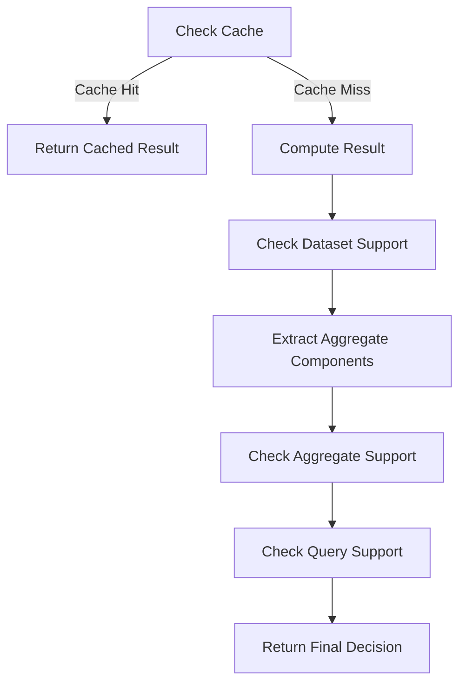

This document will cover the purpose and functionality of the 'should_use_on_demand_metrics' feature, which includes:

1. Caching Mechanism
2. Support Checks for On-Demand Metrics
3. Extracting Aggregate Components
4. Parsing Function
5. Aggregate Support Check
6. Argument Support Check
7. Parsing Search Queries
8. Cleaning Up Search Queries

Technical document: <SwmLink doc-title="Understanding should_use_on_demand_metrics">[Understanding should_use_on_demand_metrics](/.swm/understanding-should_use_on_demand_metrics.3s0uegjl.sw.md)</SwmLink>

# [Caching Mechanism](https://app.swimm.io/repos/Z2l0aHViJTNBJTNBc2VudHJ5LWRlbW8tMSUzQSUzQVN3aW1tLURlbW8=/docs/3s0uegjl#caching-mechanism)

The 'should_use_on_demand_metrics' feature first checks if the result is already cached. If a cached result is found, it is returned immediately, improving performance by avoiding redundant calculations. If not, it logs a cache miss and proceeds to compute the result.

# [Support Checks for On-Demand Metrics](https://app.swimm.io/repos/Z2l0aHViJTNBJTNBc2VudHJ5LWRlbW8tMSUzQSUzQVN3aW1tLURlbW8=/docs/3s0uegjl#support-checks-for-on-demand-metrics)

The feature determines if on-demand metrics should be used by checking if the dataset, aggregate, query, and groupbys are supported. It combines the support checks for the aggregate, query, and groupbys to make the final decision.

# [Extracting Aggregate Components](https://app.swimm.io/repos/Z2l0aHViJTNBJTNBc2VudHJ5LWRlbW8tMSUzQSUzQVN3aW1tLURlbW8=/docs/3s0uegjl#extracting-aggregate-components)

The feature parses the aggregate string to extract its components, which are then used to determine support for on-demand metrics.

# [Parsing Function](https://app.swimm.io/repos/Z2l0aHViJTNBJTNBc2VudHJ5LWRlbW8tMSUzQSUzQVN3aW1tLURlbW8=/docs/3s0uegjl#parsing-function)

The feature uses a parsing function to parse the aggregate string and return its function and arguments.

# [Aggregate Support Check](https://app.swimm.io/repos/Z2l0aHViJTNBJTNBc2VudHJ5LWRlbW8tMSUzQSUzQVN3aW1tLURlbW8=/docs/3s0uegjl#aggregate-support-check)

The feature checks if the aggregate function and its arguments are supported by on-demand metrics.

# [Argument Support Check](https://app.swimm.io/repos/Z2l0aHViJTNBJTNBc2VudHJ5LWRlbW8tMSUzQSUzQVN3aW1tLURlbW8=/docs/3s0uegjl#argument-support-check)

The feature checks if the arguments used in the aggregate function are supported by on-demand metrics.

# [Parsing Search Queries](https://app.swimm.io/repos/Z2l0aHViJTNBJTNBc2VudHJ5LWRlbW8tMSUzQSUzQVN3aW1tLURlbW8=/docs/3s0uegjl#parsing-search-queries)

The feature is responsible for parsing a search query string using the discover grammar and performing transformations on the Abstract Syntax Tree (AST) to handle edge cases.

# [Cleaning Up Search Queries](https://app.swimm.io/repos/Z2l0aHViJTNBJTNBc2VudHJ5LWRlbW8tMSUzQSUzQVN3aW1tLURlbW8=/docs/3s0uegjl#cleaning-up-search-queries)

The feature ensures that the search query remains valid after removing certain filters. It removes empty parentheses, redundant logical operators (AND/OR) at the start, end, or in succession, and reconstructs a valid query string.

&nbsp;

*This is an auto-generated document by Swimm AI 🌊 and has not yet been verified by a human*

<SwmMeta version="3.0.0" repo-id="Z2l0aHViJTNBJTNBc2VudHJ5LWRlbW8tMSUzQSUzQVN3aW1tLURlbW8=" repo-name="sentry-demo-1" doc-type="product-flows">Powered by [Swimm](/)</SwmMeta>
