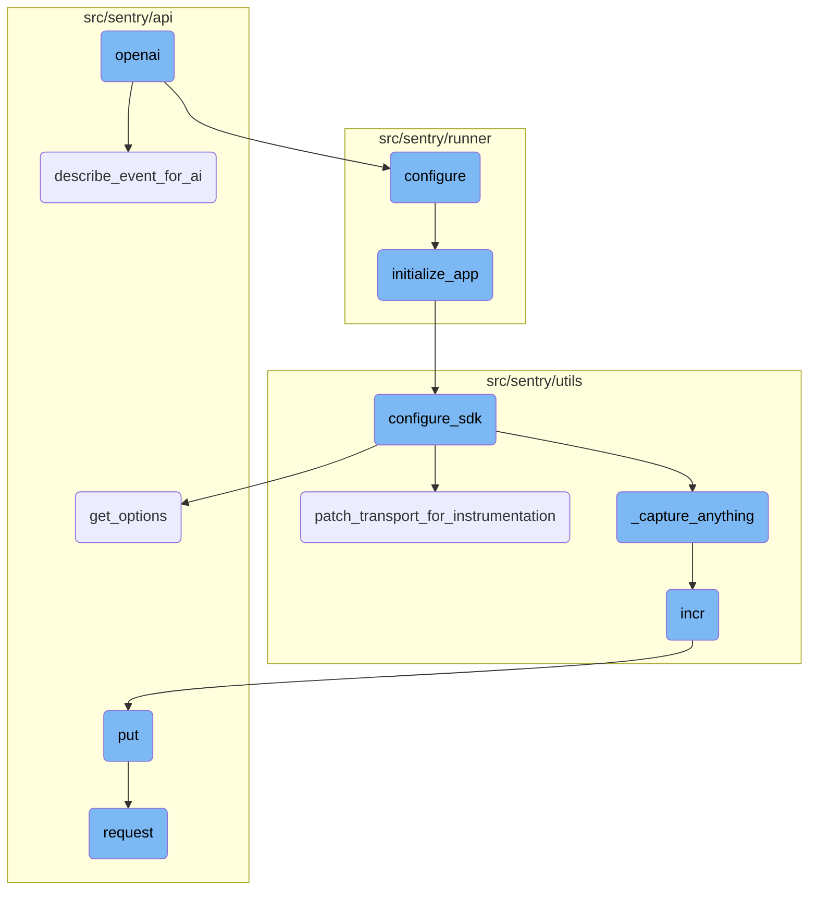
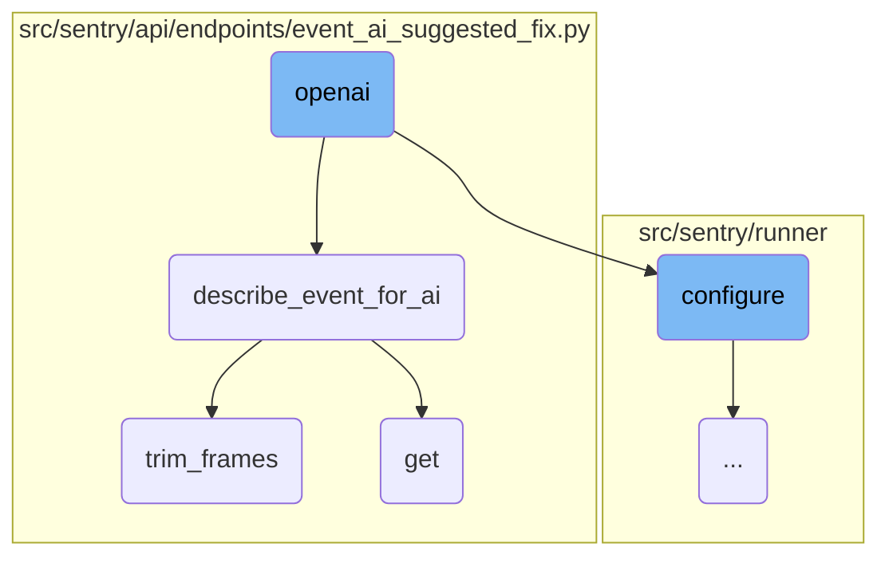
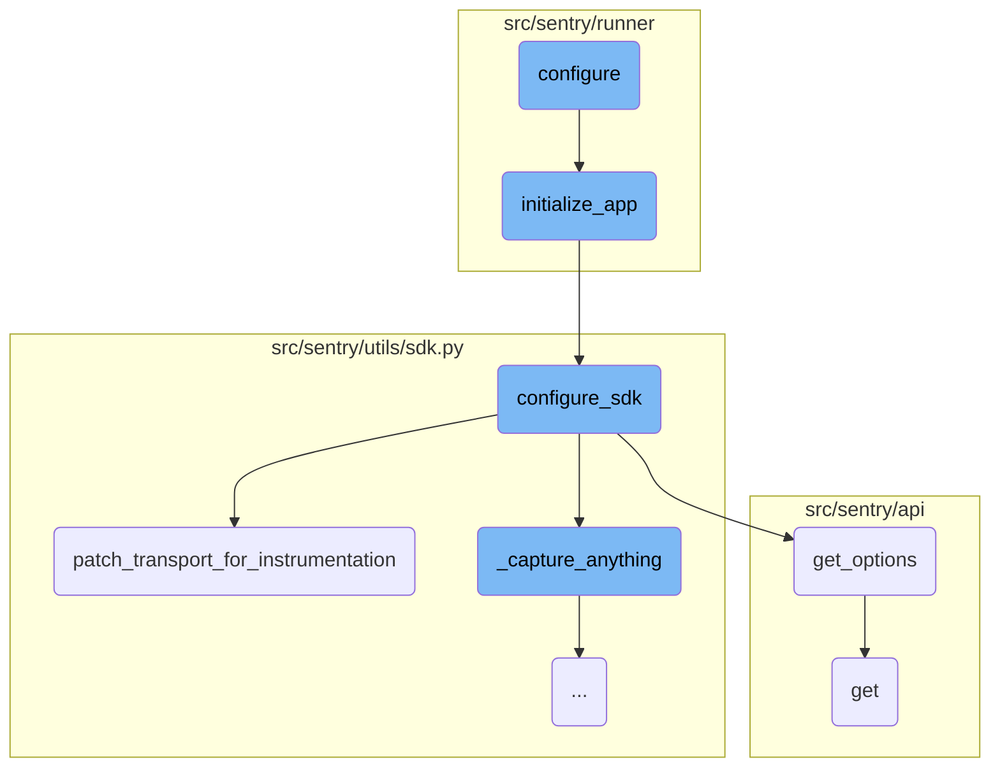
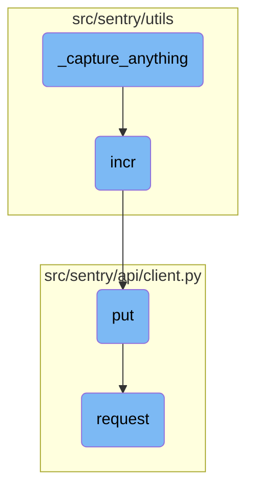

This document explains how <SwmToken path="src/sentry/runner/commands/openai.py" pos="12:2:2" line-data="def openai(event: IO[str], model: str, dump_prompt: bool) -&gt; None:">`openai`</SwmToken> is integrated and utilized within the Sentry project. It covers the configuration, event processing, and interaction with the <SwmToken path="src/sentry/runner/commands/openai.py" pos="12:2:2" line-data="def openai(event: IO[str], model: str, dump_prompt: bool) -&gt; None:">`openai`</SwmToken> API to provide AI-driven suggestions and fixes for events.

The flow starts with configuring the Sentry environment. Once configured, the event data is processed and described in detail for the AI model. Depending on the settings, the event description is either printed or sent to <SwmToken path="src/sentry/runner/commands/openai.py" pos="12:2:2" line-data="def openai(event: IO[str], model: str, dump_prompt: bool) -&gt; None:">`openai`</SwmToken> for suggestions. The AI model then provides suggestions or fixes, which are streamed back to the client.

Here is a high level diagram of the flow, showing only the most important functions:



# Flow drill down

First, we'll zoom into this section of the flow:



<SwmSnippet path="/src/sentry/runner/commands/openai.py" line="12">

---

## <SwmToken path="src/sentry/runner/commands/openai.py" pos="12:2:2" line-data="def openai(event: IO[str], model: str, dump_prompt: bool) -&gt; None:">`openai`</SwmToken> Interaction

The <SwmToken path="src/sentry/runner/commands/openai.py" pos="12:2:2" line-data="def openai(event: IO[str], model: str, dump_prompt: bool) -&gt; None:">`openai`</SwmToken> function is responsible for running the <SwmToken path="src/sentry/runner/commands/openai.py" pos="12:2:2" line-data="def openai(event: IO[str], model: str, dump_prompt: bool) -&gt; None:">`openai`</SwmToken> assistant against a JSON event payload. It first configures the Sentry environment and then processes the event data. Depending on the <SwmToken path="src/sentry/runner/commands/openai.py" pos="12:19:19" line-data="def openai(event: IO[str], model: str, dump_prompt: bool) -&gt; None:">`dump_prompt`</SwmToken> flag, it either prints the event description or streams the suggested fix from <SwmToken path="src/sentry/runner/commands/openai.py" pos="12:2:2" line-data="def openai(event: IO[str], model: str, dump_prompt: bool) -&gt; None:">`openai`</SwmToken>.

```python
def openai(event: IO[str], model: str, dump_prompt: bool) -> None:
    """
    Runs the OpenAI assistent against a JSON event payload.
    """
    from sentry.runner import configure

    configure()

    from sentry.api.endpoints.event_ai_suggested_fix import describe_event_for_ai, suggest_fix

    event_data = json.load(event)
    if dump_prompt:
        click.echo(json.dumps(describe_event_for_ai(event_data, model=model), indent=2))
    else:
        resp = suggest_fix(event_data, stream=True, model=model)
        for chunk in resp:
            click.echo(chunk, nl=False)
        click.echo()
```

---

</SwmSnippet>

<SwmSnippet path="/src/sentry/api/endpoints/event_ai_suggested_fix.py" line="190">

---

## Event Description for AI

The <SwmToken path="src/sentry/api/endpoints/event_ai_suggested_fix.py" pos="190:2:2" line-data="def describe_event_for_ai(event, model):">`describe_event_for_ai`</SwmToken> function generates a detailed description of an event for the AI model. It extracts relevant information such as the message, platform, exceptions, and stack traces. This detailed data is then used to help the AI understand the context of the event.

```python
def describe_event_for_ai(event, model):
    detailed = model.startswith("gpt-4")
    data = {}

    msg = event.get("logentry")
    if msg:
        data["message"] = msg

    platform = event.get("platform")
    if platform and platform != "other":
        data["language"] = platform

    exceptions = data.setdefault("exceptions", [])
    for idx, exc in enumerate(
        reversed((event.get("exception", {})).get("values", ())[:MAX_EXCEPTIONS])
    ):
        exception: dict[str, Any] = {}
        if idx > 0:
            exception["raised_during_handling_of_previous_exception"] = True
        exception["num"] = idx + 1
        exc_type = exc.get("type")
```

---

</SwmSnippet>

<SwmSnippet path="/src/sentry/api/endpoints/event_ai_suggested_fix.py" line="151">

---

### Trimming Stack Frames

The <SwmToken path="src/sentry/api/endpoints/event_ai_suggested_fix.py" pos="151:2:2" line-data="def trim_frames(frames, frame_allowance=MAX_STACKTRACE_FRAMES):">`trim_frames`</SwmToken> function is used to limit the number of stack frames in the event data. It prioritizes keeping application frames over system frames and ensures that the total number of frames does not exceed a specified allowance.

```python
def trim_frames(frames, frame_allowance=MAX_STACKTRACE_FRAMES):
    frames_len = 0
    app_frames = []
    system_frames = []

    for frame in frames:
        frames_len += 1
        if frame.get("in_app"):
            app_frames.append(frame)
        else:
            system_frames.append(frame)

    if frames_len <= frame_allowance:
        return frames

    remaining = frames_len - frame_allowance
    app_count = len(app_frames)
    system_allowance = max(frame_allowance - app_count, 0)
    if system_allowance:
        half_max = int(system_allowance / 2)
        # prioritize trimming system frames
```

---

</SwmSnippet>

<SwmSnippet path="/src/sentry/api/endpoints/event_ai_suggested_fix.py" line="311">

---

## Getting AI Suggestions

The <SwmToken path="src/sentry/api/endpoints/event_ai_suggested_fix.py" pos="311:3:3" line-data="    def get(self, request: Request, project, event_id) -&gt; HttpResponse | StreamingHttpResponse:">`get`</SwmToken> function handles HTTP requests to get AI suggestions for an event. It checks for the necessary <SwmToken path="src/sentry/api/endpoints/event_ai_suggested_fix.py" pos="319:15:15" line-data="        # To use this feature you need openai to be configured">`openai`</SwmToken> configuration and policies, retrieves the event data, and then either returns a cached suggestion or generates a new one. If streaming is enabled, it streams the response back to the client.

`````````````````````````````````````````python
    def get(self, request: Request, project, event_id) -> HttpResponse | StreamingHttpResponse:
        """
        Makes AI make suggestions about an event
        ````````````````````````````````````````

        This endpoint returns a JSON response that provides helpful suggestions about how to
        understand or resolve an event.
        """
        # To use this feature you need openai to be configured
        if not settings.OPENAI_API_KEY:
            raise ResourceDoesNotExist

        event = eventstore.backend.get_event_by_id(project.id, event_id)
        if event is None:
            raise ResourceDoesNotExist

        # Check the OpenAI access policy
        policy = get_openai_policy(
            request.organization,
            request.user,
            pii_certified=request.GET.get("pii_certified") == "yes",
`````````````````````````````````````````

---

</SwmSnippet>

Now, lets zoom into this section of the flow:



<SwmSnippet path="/src/sentry/runner/settings.py" line="53">

---

## Configuration

The <SwmToken path="src/sentry/runner/settings.py" pos="53:2:2" line-data="def configure(">`configure`</SwmToken> function sets up the environment by loading configuration files, setting environment variables, and initializing the application. It ensures that warnings are displayed, adds additional MIME types, and validates the existence of configuration files. If the configuration file is a YAML file, it sets up auto-reloading. Finally, it calls <SwmToken path="src/sentry/runner/initializer.py" pos="306:2:2" line-data="def initialize_app(config: dict[str, Any], skip_service_validation: bool = False) -&gt; None:">`initialize_app`</SwmToken> to complete the setup.

```python
def configure(
    ctx: click.Context | None, py: str, yaml: str | None, skip_service_validation: bool = False
) -> None:
    """
    Given the two different config files, set up the environment.

    NOTE: Will only execute once, so it's safe to call multiple times.
    """
    global __installed
    if __installed:
        return

    # Make sure that our warnings are always displayed.
    warnings.filterwarnings("default", "", Warning, r"^sentry")

    # Add in additional mimetypes that are useful for our static files
    # which aren't common in default system registries
    import mimetypes

    for type, ext in (
        ("application/json", "map"),
```

---

</SwmSnippet>

<SwmSnippet path="/src/sentry/runner/initializer.py" line="306">

---

## Application Initialization

The <SwmToken path="src/sentry/runner/initializer.py" pos="306:2:2" line-data="def initialize_app(config: dict[str, Any], skip_service_validation: bool = False) -&gt; None:">`initialize_app`</SwmToken> function takes the configuration settings and performs various initialization tasks. It updates options, configures logging, sets up security settings, and validates configurations. It also initializes Django, sets up services, and configures the SDK. This function ensures that the application is correctly initialized and ready to run.

```python
def initialize_app(config: dict[str, Any], skip_service_validation: bool = False) -> None:
    settings = config["settings"]

    # Just reuse the integration app for Single Org / Self-Hosted as
    # it doesn't make much sense to use 2 separate apps for SSO and
    # integration.
    if settings.SENTRY_SINGLE_ORGANIZATION:
        options_mapper.update(
            {
                "github-app.client-id": "GITHUB_APP_ID",
                "github-app.client-secret": "GITHUB_API_SECRET",
            }
        )

    bootstrap_options(settings, config["options"])

    logging.raiseExceptions = settings.DEBUG

    configure_structlog()

    # Commonly setups don't correctly configure themselves for production envs
```

---

</SwmSnippet>

<SwmSnippet path="/src/sentry/utils/sdk.py" line="280">

---

## SDK Configuration

The <SwmToken path="src/sentry/utils/sdk.py" pos="280:2:2" line-data="def configure_sdk():">`configure_sdk`</SwmToken> function configures the Sentry SDK by setting up transports and capturing events. It includes a <SwmToken path="src/sentry/utils/sdk.py" pos="313:3:3" line-data="    class MultiplexingTransport(sentry_sdk.transport.Transport):">`MultiplexingTransport`</SwmToken> class that handles event capturing and metrics recording. This function ensures that the SDK is properly configured to capture and send events to Sentry.

```python
def configure_sdk():
    """
    Setup and initialize the Sentry SDK.
    """
    sdk_options, dsns = _get_sdk_options()

    internal_project_key = get_project_key()

    if dsns.sentry4sentry:
        transport = make_transport(get_options(dsn=dsns.sentry4sentry, **sdk_options))
        sentry4sentry_transport = patch_transport_for_instrumentation(transport, "upstream")
    else:
        sentry4sentry_transport = None

    if dsns.sentry_saas:
        transport = make_transport(get_options(dsn=dsns.sentry_saas, **sdk_options))
        sentry_saas_transport = patch_transport_for_instrumentation(transport, "relay")
    elif settings.IS_DEV and not settings.SENTRY_USE_RELAY:
        sentry_saas_transport = None
    elif internal_project_key and internal_project_key.dsn_private:
        transport = make_transport(get_options(dsn=internal_project_key.dsn_private, **sdk_options))
```

---

</SwmSnippet>

<SwmSnippet path="/src/sentry/utils/sdk.py" line="242">

---

### Patching Transport for Instrumentation

The <SwmToken path="src/sentry/utils/sdk.py" pos="244:2:2" line-data="def patch_transport_for_instrumentation(transport, transport_name):">`patch_transport_for_instrumentation`</SwmToken> function patches the transport's <SwmToken path="src/sentry/utils/sdk.py" pos="245:1:1" line-data="    _send_request = transport._send_request">`_send_request`</SwmToken> method to add metrics for events sent to the ingest. This helps in measuring SDK requests versus ingested events, providing better resolution around event handling.

```python
# Patches transport functions to add metrics to improve resolution around events sent to our ingest.
# Leaving this in to keep a permanent measurement of sdk requests vs ingest.
def patch_transport_for_instrumentation(transport, transport_name):
    _send_request = transport._send_request
    if _send_request:

        def patched_send_request(*args, **kwargs):
            metrics.incr(f"internal.sent_requests.{transport_name}.events")
            return _send_request(*args, **kwargs)

        transport._send_request = patched_send_request
    return transport
```

---

</SwmSnippet>

<SwmSnippet path="/src/sentry/api/serializers/models/project.py" line="478">

---

## Getting Options

The <SwmToken path="src/sentry/api/serializers/models/project.py" pos="478:3:3" line-data="    def get_options(self, projects):">`get_options`</SwmToken> function retrieves project-specific options from the database. It filters the options based on a predefined list and returns them in a dictionary format. This function is useful for fetching configuration options for specific projects.

```python
    def get_options(self, projects):
        # no options specified
        option_list = []

        # must be a safe key
        if self.expand_context.get("options"):
            option_list = self.expand_context.get("options")
            option_list = [option for option in option_list if option in OPTION_KEYS]

        queryset = ProjectOption.objects.filter(project__in=projects, key__in=option_list)

        options_by_project = defaultdict(dict)
        for option in queryset:
            options_by_project[option.project_id][option.key] = option.value

        return options_by_project
```

---

</SwmSnippet>

<SwmSnippet path="/src/sentry/api/client.py" line="113">

---

## Making GET Requests

The <SwmToken path="src/sentry/api/client.py" pos="113:3:3" line-data="    def get(self, *args, **kwargs):">`get`</SwmToken> function is a simple wrapper around the <SwmToken path="src/sentry/api/client.py" pos="114:5:5" line-data="        return self.request(&quot;GET&quot;, *args, **kwargs)">`request`</SwmToken> method, specifically for making GET requests. It simplifies the process of making GET requests to the API.

```python
    def get(self, *args, **kwargs):
        return self.request("GET", *args, **kwargs)
```

---

</SwmSnippet>

Now, lets zoom into this section of the flow:



<SwmSnippet path="/src/sentry/utils/sdk.py" line="343">

---

## Capturing Events

The <SwmToken path="src/sentry/utils/sdk.py" pos="343:3:3" line-data="        def _capture_anything(self, method_name, *args, **kwargs):">`_capture_anything`</SwmToken> function is responsible for capturing events and sending them to the appropriate transport. It first checks if the <SwmToken path="src/sentry/utils/sdk.py" pos="346:3:3" line-data="            if sentry4sentry_transport:">`sentry4sentry_transport`</SwmToken> is available and increments the internal metrics for captured events. It then filters out certain metrics based on the configuration and sends the event to the <SwmToken path="src/sentry/utils/sdk.py" pos="346:3:3" line-data="            if sentry4sentry_transport:">`sentry4sentry_transport`</SwmToken>. If the <SwmToken path="src/sentry/utils/sdk.py" pos="296:1:1" line-data="        sentry_saas_transport = patch_transport_for_instrumentation(transport, &quot;relay&quot;)">`sentry_saas_transport`</SwmToken> is available, it checks if the current event is safe and either increments the metrics for captured events or logs the event as uncaptured due to safety concerns.

```python
        def _capture_anything(self, method_name, *args, **kwargs):
            # Sentry4Sentry (upstream) should get the event first because
            # it is most isolated from the sentry installation.
            if sentry4sentry_transport:
                metrics.incr("internal.captured.events.upstream")
                # TODO(mattrobenolt): Bring this back safely.
                # from sentry import options
                # install_id = options.get('sentry:install-id')
                # if install_id:
                #     event.setdefault('tags', {})['install-id'] = install_id
                s4s_args = args
                # We want to control whether we want to send metrics at the s4s upstream.
                if (
                    not settings.SENTRY_SDK_UPSTREAM_METRICS_ENABLED
                    and method_name == "capture_envelope"
                ):
                    args_list = list(args)
                    envelope = args_list[0]
                    # We filter out all the statsd envelope items, which contain custom metrics sent by the SDK.
                    # unless we allow them via a separate sample rate.
                    safe_items = [
```

---

</SwmSnippet>

<SwmSnippet path="/src/sentry/utils/metrics.py" line="98">

---

## Incrementing Metrics

The <SwmToken path="src/sentry/utils/metrics.py" pos="98:3:3" line-data="    def incr(">`incr`</SwmToken> function is used to increment internal metrics. It takes various parameters such as the key, instance, tags, amount, and sample rate. The function ensures that the metrics system is started and then puts the metric data into a queue for processing.

```python
    def incr(
        self,
        key: str,
        instance: str | None = None,
        tags: Tags | None = None,
        amount: int = 1,
        sample_rate: float = settings.SENTRY_METRICS_SAMPLE_RATE,
    ) -> None:
        if not self._started:
            self._start()
        self.q.put((key, instance, tags, amount, sample_rate))
```

---

</SwmSnippet>

<SwmSnippet path="/src/sentry/api/client.py" line="119">

---

## Sending PUT Request

The <SwmToken path="src/sentry/api/client.py" pos="119:3:3" line-data="    def put(self, *args, **kwargs):">`put`</SwmToken> function is a wrapper around the <SwmToken path="src/sentry/api/client.py" pos="120:5:5" line-data="        return self.request(&quot;PUT&quot;, *args, **kwargs)">`request`</SwmToken> function that sends a PUT request. It simplifies making PUT requests by internally calling the <SwmToken path="src/sentry/api/client.py" pos="120:5:5" line-data="        return self.request(&quot;PUT&quot;, *args, **kwargs)">`request`</SwmToken> function with the method set to 'PUT'.

```python
    def put(self, *args, **kwargs):
        return self.request("PUT", *args, **kwargs)
```

---

</SwmSnippet>

<SwmSnippet path="/src/sentry/api/client.py" line="32">

---

## Making API Requests

The <SwmToken path="src/sentry/api/client.py" pos="32:3:3" line-data="    def request(">`request`</SwmToken> function is a general-purpose function for making API requests. It constructs the full path for the request, resolves the callback, and prepares a mock request object. The function handles various aspects such as authentication, session management, and superuser checks. It then calls the appropriate callback with the mock request and returns the response if successful, otherwise, it raises an error.

```python
    def request(
        self,
        method,
        path,
        user=None,
        auth=None,
        params=None,
        data=None,
        is_sudo=None,
        is_superuser=None,
        request=None,
    ):
        if self.prefix not in path:
            full_path = self.prefix + path
        else:
            full_path = path

        # we explicitly do not allow you to override the request *and* the user
        # as then other checks like is_superuser would need overwritten
        assert not (request and (user or auth)), "use either request or auth"

```

---

</SwmSnippet>

&nbsp;

*This is an auto-generated document by Swimm AI 🌊 and has not yet been verified by a human*

<SwmMeta version="3.0.0" repo-id="Z2l0aHViJTNBJTNBc2VudHJ5LWRlbW8tMSUzQSUzQVN3aW1tLURlbW8=" repo-name="sentry-demo-1" doc-type="flows"><sup>Powered by [Swimm](/)</sup></SwmMeta>
