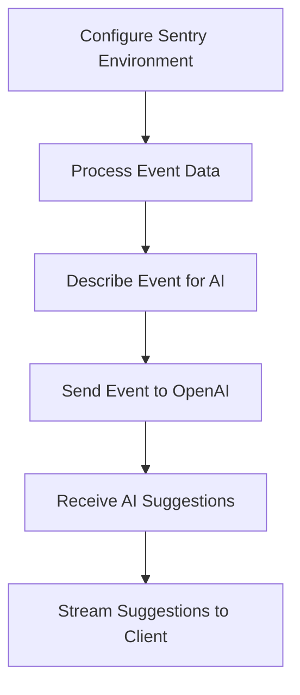

This document will cover the OpenAI Integration feature, which includes:

1. Configuring the Sentry environment
2. Processing event data
3. Interacting with the OpenAI API to provide AI-driven suggestions and fixes for events.

Technical document: <SwmLink doc-title="OpenAI Integration">[OpenAI Integration](/.swm/openai-integration.7qyrvjk8.sw.md)</SwmLink>

# [Configuring the Sentry Environment](https://app.swimm.io/repos/Z2l0aHViJTNBJTNBc2VudHJ5LWRlbW8tMSUzQSUzQVN3aW1tLURlbW8=/docs/7qyrvjk8#configuration)

The configuration step involves setting up the Sentry environment by loading configuration files, setting environment variables, and initializing the application. This ensures that the Sentry platform is ready to process events and interact with the OpenAI API. The configuration also includes setting up logging, security settings, and validating the existence of necessary files.

# [Processing Event Data](https://app.swimm.io/repos/Z2l0aHViJTNBJTNBc2VudHJ5LWRlbW8tMSUzQSUzQVN3aW1tLURlbW8=/docs/7qyrvjk8#event-description-for-ai)

Once the Sentry environment is configured, the next step is to process the event data. This involves extracting relevant information from the event, such as the message, platform, exceptions, and stack traces. This detailed data is then used to help the AI understand the context of the event. The event data is described in a way that the AI model can comprehend and provide meaningful suggestions.

# [Interacting with the OpenAI API](https://app.swimm.io/repos/Z2l0aHViJTNBJTNBc2VudHJ5LWRlbW8tMSUzQSUzQVN3aW1tLURlbW8=/docs/7qyrvjk8#openai-interaction)

After processing the event data, the next step is to interact with the OpenAI API. Depending on the settings, the event description is either printed or sent to OpenAI for suggestions. The AI model then provides suggestions or fixes, which are streamed back to the client. This interaction allows Sentry to leverage AI-driven insights to help users understand and resolve issues more efficiently.

# [Streaming AI Suggestions to the Client](https://app.swimm.io/repos/Z2l0aHViJTNBJTNBc2VudHJ5LWRlbW8tMSUzQSUzQVN3aW1tLURlbW8=/docs/7qyrvjk8#getting-ai-suggestions)

The final step in the flow is to stream the AI suggestions back to the client. This involves handling HTTP requests to get AI suggestions for an event, checking for the necessary OpenAI configuration and policies, retrieving the event data, and then either returning a cached suggestion or generating a new one. If streaming is enabled, the response is streamed back to the client, providing real-time AI-driven insights.

&nbsp;

*This is an auto-generated document by Swimm AI 🌊 and has not yet been verified by a human*

<SwmMeta version="3.0.0" repo-id="Z2l0aHViJTNBJTNBc2VudHJ5LWRlbW8tMSUzQSUzQVN3aW1tLURlbW8=" repo-name="sentry-demo-1" doc-type="product-flows">Powered by [Swimm](/)</SwmMeta>
