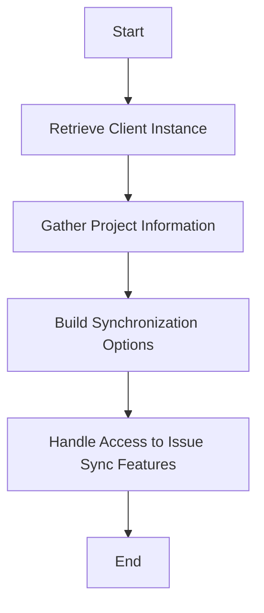

This document will cover the Organization Configuration Flow, which includes:

1. Retrieving the client instance
2. Gathering project information
3. Building synchronization options
4. Handling access to issue sync features.

Technical document: <SwmLink doc-title="Organization Configuration Flow">[Organization Configuration Flow](/.swm/organization-configuration-flow.hyjz2zkr.sw.md)</SwmLink>

# [Retrieving the Client Instance](https://app.swimm.io/repos/Z2l0aHViJTNBJTNBc2VudHJ5LWRlbW8tMSUzQSUzQVN3aW1tLURlbW8=/docs/hyjz2zkr#get_client)

The first step in the organization configuration flow is to retrieve the client instance. This involves initializing a client that will be used to interact with the Azure DevOps services. The client instance is essential for making API calls to gather necessary data about the projects and their states.

# [Gathering Project Information](https://app.swimm.io/repos/Z2l0aHViJTNBJTNBc2VudHJ5LWRlbW8tMSUzQSUzQVN3aW1tLURlbW8=/docs/hyjz2zkr#fetching-project-states)

Once the client instance is retrieved, the next step is to gather information about the projects. This includes fetching the list of projects and their respective states. The project information is crucial for understanding the different work item states that exist within each project. This data is used to build a comprehensive list of all possible states across projects.

# [Building Synchronization Options](https://app.swimm.io/repos/Z2l0aHViJTNBJTNBc2VudHJ5LWRlbW8tMSUzQSUzQVN3aW1tLURlbW8=/docs/hyjz2zkr#get_organization_config)

After gathering the project information, the next step is to build a list of fields that define various synchronization options. These options include syncing statuses, assignments, and comments between Sentry and Azure DevOps. The synchronization options are essential for ensuring that the data between the two platforms is consistent and up-to-date.

# [Handling Access to Issue Sync Features](https://app.swimm.io/repos/Z2l0aHViJTNBJTNBc2VudHJ5LWRlbW8tMSUzQSUzQVN3aW1tLURlbW8=/docs/hyjz2zkr#get_organization_config)

The final step in the organization configuration flow is to handle access to issue sync features. If the organization does not have access to these features, the synchronization fields are disabled. This ensures that only organizations with the necessary permissions can utilize the issue sync capabilities. Handling access to issue sync features is important for maintaining security and compliance within the organization.

&nbsp;

*This is an auto-generated document by Swimm AI 🌊 and has not yet been verified by a human*

<SwmMeta version="3.0.0" repo-id="Z2l0aHViJTNBJTNBc2VudHJ5LWRlbW8tMSUzQSUzQVN3aW1tLURlbW8=" repo-name="sentry-demo-1" doc-type="product-flows">Powered by [Swimm](/)</SwmMeta>
