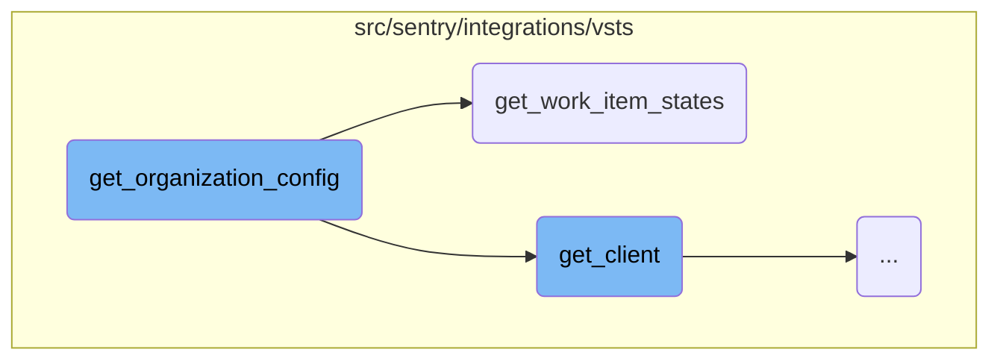
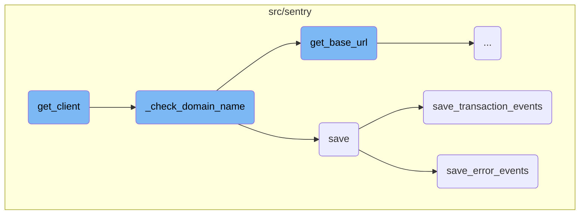
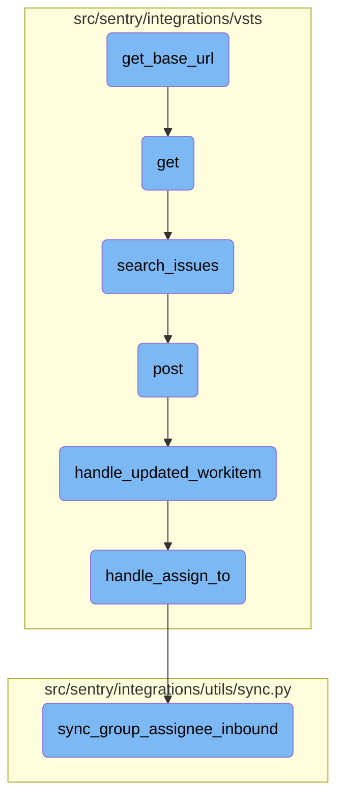

This document provides an overview of the <SwmToken path="src/sentry/integrations/vsts/integration.py" pos="154:3:3" line-data="    def get_organization_config(self) -&gt; Sequence[Mapping[str, Any]]:">`get_organization_config`</SwmToken> function, which is responsible for fetching and constructing the configuration for an organization. It explains how the function retrieves client instances, gathers project information, and builds a list of fields that define various synchronization options between Sentry and Azure <SwmToken path="src/sentry/integrations/vsts/client.py" pos="299:9:9" line-data="        # Sentry to Azure DevOps, we need will attempt to use the sequence below. There are certain">`DevOps`</SwmToken>.

The flow starts with the <SwmToken path="src/sentry/integrations/vsts/integration.py" pos="154:3:3" line-data="    def get_organization_config(self) -&gt; Sequence[Mapping[str, Any]]:">`get_organization_config`</SwmToken> function, which first retrieves a client instance. It then gathers information about different projects and their states. This information is used to build a list of fields that define various synchronization options, such as syncing statuses, assignments, and comments. If the organization does not have access to issue sync features, these fields are disabled. The function ensures that all necessary data is collected and formatted correctly to provide a comprehensive configuration for the organization.

Here is a high level diagram of the flow, showing only the most important functions:

```mermaid
graph TD;
      subgraph src/sentry/integrations/vsts
796410bcfcc893ae19254c4f35e7723a48ca7a3c018a1ae73a2b49dce20862bd(get_organization_config):::mainFlowStyle --> f114dfafa7f8cd05b9267aff317a754b0a77d80caa24c2218ab994742751ef38(get_work_item_states)
end

subgraph src/sentry/integrations/vsts
796410bcfcc893ae19254c4f35e7723a48ca7a3c018a1ae73a2b49dce20862bd(get_organization_config):::mainFlowStyle --> 0929df67669e089b92a784392a4caa0c21baeadfd85263fa34c49a09c193b3d1(get_client):::mainFlowStyle
end

subgraph src/sentry/integrations/vsts
0929df67669e089b92a784392a4caa0c21baeadfd85263fa34c49a09c193b3d1(get_client):::mainFlowStyle --> 7f10adeb955518d0b9ce9a18ae73cf60c8e87d6b2b7bc87f5b2addc217981d21(_check_domain_name):::mainFlowStyle
end

subgraph src/sentry/event_manager.py
7f10adeb955518d0b9ce9a18ae73cf60c8e87d6b2b7bc87f5b2addc217981d21(_check_domain_name):::mainFlowStyle --> 5086692df24257d76a0adf892eba843feac14033d92b4a32022b125d5a725f9b(save)
end

subgraph src/sentry/integrations/vsts
7f10adeb955518d0b9ce9a18ae73cf60c8e87d6b2b7bc87f5b2addc217981d21(_check_domain_name):::mainFlowStyle --> 3a40802301e1642b0a2d0ce06ddee674da6a7fd8353ad71b1c436be19e6563d6(get_base_url):::mainFlowStyle
end

subgraph src/sentry/integrations/vsts
3a40802301e1642b0a2d0ce06ddee674da6a7fd8353ad71b1c436be19e6563d6(get_base_url):::mainFlowStyle --> c9f1b6abd5b86b248deafac3aa63eb8d055350bf49cbe100c54a0d94ee13361a(get):::mainFlowStyle
end

subgraph src/sentry/integrations/vsts
c9f1b6abd5b86b248deafac3aa63eb8d055350bf49cbe100c54a0d94ee13361a(get):::mainFlowStyle --> fc4a2a7e5f1b5a9d6230778920f9b62f4b7f3caa80ebd97c89444e007895b382(search_issues):::mainFlowStyle
end

subgraph src/sentry/integrations/vsts
fc4a2a7e5f1b5a9d6230778920f9b62f4b7f3caa80ebd97c89444e007895b382(search_issues):::mainFlowStyle --> a0445eff32744589c21cfe40b46d7b4346893653994134be4a340aaaf32b3f6d(post):::mainFlowStyle
end

subgraph src/sentry/integrations/vsts
a0445eff32744589c21cfe40b46d7b4346893653994134be4a340aaaf32b3f6d(post):::mainFlowStyle --> 66e049c83c1ca3a7a23933e320651f77196243d817b62c1a401dfd7205f9a929(handle_updated_workitem):::mainFlowStyle
end

subgraph src/sentry/integrations/vsts
66e049c83c1ca3a7a23933e320651f77196243d817b62c1a401dfd7205f9a929(handle_updated_workitem):::mainFlowStyle --> 66c307c65db74ab637ed0ed1623cc34d22110f0911938f86a52ccb8f5e8009dd(handle_assign_to):::mainFlowStyle
end

subgraph src/sentry/integrations/utils/sync.py
66c307c65db74ab637ed0ed1623cc34d22110f0911938f86a52ccb8f5e8009dd(handle_assign_to):::mainFlowStyle --> dd6f2c6555a3ad00a0aed3ab34055c7026063e3a2a74b2537fcf2a1223ffa577(sync_group_assignee_inbound):::mainFlowStyle
end


      classDef mainFlowStyle color:#000000,fill:#7CB9F4
classDef rootsStyle color:#000000,fill:#00FFF4
classDef Style1 color:#000000,fill:#00FFAA
classDef Style2 color:#000000,fill:#FFFF00
classDef Style3 color:#000000,fill:#AA7CB9

%% Swimm:
%% graph TD;
%%       subgraph <SwmPath>[src/sentry/integrations/vsts/](src/sentry/integrations/vsts/)</SwmPath>
%% 796410bcfcc893ae19254c4f35e7723a48ca7a3c018a1ae73a2b49dce20862bd(get_organization_config):::mainFlowStyle --> f114dfafa7f8cd05b9267aff317a754b0a77d80caa24c2218ab994742751ef38(get_work_item_states)
%% end
%% 
%% subgraph <SwmPath>[src/sentry/integrations/vsts/](src/sentry/integrations/vsts/)</SwmPath>
%% 796410bcfcc893ae19254c4f35e7723a48ca7a3c018a1ae73a2b49dce20862bd(get_organization_config):::mainFlowStyle --> 0929df67669e089b92a784392a4caa0c21baeadfd85263fa34c49a09c193b3d1(get_client):::mainFlowStyle
%% end
%% 
%% subgraph <SwmPath>[src/sentry/integrations/vsts/](src/sentry/integrations/vsts/)</SwmPath>
%% 0929df67669e089b92a784392a4caa0c21baeadfd85263fa34c49a09c193b3d1(get_client):::mainFlowStyle --> 7f10adeb955518d0b9ce9a18ae73cf60c8e87d6b2b7bc87f5b2addc217981d21(_check_domain_name):::mainFlowStyle
%% end
%% 
%% subgraph <SwmPath>[src/sentry/event_manager.py](src/sentry/event_manager.py)</SwmPath>
%% 7f10adeb955518d0b9ce9a18ae73cf60c8e87d6b2b7bc87f5b2addc217981d21(_check_domain_name):::mainFlowStyle --> 5086692df24257d76a0adf892eba843feac14033d92b4a32022b125d5a725f9b(save)
%% end
%% 
%% subgraph <SwmPath>[src/sentry/integrations/vsts/](src/sentry/integrations/vsts/)</SwmPath>
%% 7f10adeb955518d0b9ce9a18ae73cf60c8e87d6b2b7bc87f5b2addc217981d21(_check_domain_name):::mainFlowStyle --> 3a40802301e1642b0a2d0ce06ddee674da6a7fd8353ad71b1c436be19e6563d6(get_base_url):::mainFlowStyle
%% end
%% 
%% subgraph <SwmPath>[src/sentry/integrations/vsts/](src/sentry/integrations/vsts/)</SwmPath>
%% 3a40802301e1642b0a2d0ce06ddee674da6a7fd8353ad71b1c436be19e6563d6(get_base_url):::mainFlowStyle --> c9f1b6abd5b86b248deafac3aa63eb8d055350bf49cbe100c54a0d94ee13361a(get):::mainFlowStyle
%% end
%% 
%% subgraph <SwmPath>[src/sentry/integrations/vsts/](src/sentry/integrations/vsts/)</SwmPath>
%% c9f1b6abd5b86b248deafac3aa63eb8d055350bf49cbe100c54a0d94ee13361a(get):::mainFlowStyle --> fc4a2a7e5f1b5a9d6230778920f9b62f4b7f3caa80ebd97c89444e007895b382(search_issues):::mainFlowStyle
%% end
%% 
%% subgraph <SwmPath>[src/sentry/integrations/vsts/](src/sentry/integrations/vsts/)</SwmPath>
%% fc4a2a7e5f1b5a9d6230778920f9b62f4b7f3caa80ebd97c89444e007895b382(search_issues):::mainFlowStyle --> a0445eff32744589c21cfe40b46d7b4346893653994134be4a340aaaf32b3f6d(post):::mainFlowStyle
%% end
%% 
%% subgraph <SwmPath>[src/sentry/integrations/vsts/](src/sentry/integrations/vsts/)</SwmPath>
%% a0445eff32744589c21cfe40b46d7b4346893653994134be4a340aaaf32b3f6d(post):::mainFlowStyle --> 66e049c83c1ca3a7a23933e320651f77196243d817b62c1a401dfd7205f9a929(handle_updated_workitem):::mainFlowStyle
%% end
%% 
%% subgraph <SwmPath>[src/sentry/integrations/vsts/](src/sentry/integrations/vsts/)</SwmPath>
%% 66e049c83c1ca3a7a23933e320651f77196243d817b62c1a401dfd7205f9a929(handle_updated_workitem):::mainFlowStyle --> 66c307c65db74ab637ed0ed1623cc34d22110f0911938f86a52ccb8f5e8009dd(handle_assign_to):::mainFlowStyle
%% end
%% 
%% subgraph <SwmPath>[src/sentry/integrations/utils/sync.py](src/sentry/integrations/utils/sync.py)</SwmPath>
%% 66c307c65db74ab637ed0ed1623cc34d22110f0911938f86a52ccb8f5e8009dd(handle_assign_to):::mainFlowStyle --> dd6f2c6555a3ad00a0aed3ab34055c7026063e3a2a74b2537fcf2a1223ffa577(sync_group_assignee_inbound):::mainFlowStyle
%% end
%% 
%% 
%%       classDef mainFlowStyle color:#000000,fill:#7CB9F4
%% classDef rootsStyle color:#000000,fill:#00FFF4
%% classDef Style1 color:#000000,fill:#00FFAA
%% classDef Style2 color:#000000,fill:#FFFF00
%% classDef Style3 color:#000000,fill:#AA7CB9
```



# Flow drill down

First, we'll zoom into this section of the flow:



<SwmSnippet path="/src/sentry/integrations/vsts/integration.py" line="154">

---

## <SwmToken path="src/sentry/integrations/vsts/integration.py" pos="154:3:3" line-data="    def get_organization_config(self) -&gt; Sequence[Mapping[str, Any]]:">`get_organization_config`</SwmToken>

The <SwmToken path="src/sentry/integrations/vsts/integration.py" pos="154:3:3" line-data="    def get_organization_config(self) -&gt; Sequence[Mapping[str, Any]]:">`get_organization_config`</SwmToken> function is responsible for fetching and constructing the configuration for an organization. It first retrieves the client instance and then gathers project information and states. The function builds a list of fields that define various synchronization options between Sentry and Azure <SwmToken path="src/sentry/integrations/vsts/client.py" pos="299:9:9" line-data="        # Sentry to Azure DevOps, we need will attempt to use the sequence below. There are certain">`DevOps`</SwmToken>, such as syncing statuses, assignments, and comments. If the organization does not have access to issue sync features, the fields are disabled.

```python
    def get_organization_config(self) -> Sequence[Mapping[str, Any]]:
        client = self.get_client()

        project_selector = []
        all_states_set = set()
        try:
            projects = client.get_projects()
            for idx, project in enumerate(projects):
                project_selector.append({"value": project["id"], "label": project["name"]})
                # only request states for the first 5 projects to limit number
                # of requests
                if idx <= 5:
                    project_states = client.get_work_item_states(project["id"])["value"]
                    for state in project_states:
                        all_states_set.add(state["name"])

            all_states = [(state, state) for state in all_states_set]
            disabled = False
        except (ApiError, IdentityNotValid):
            all_states = []
            disabled = True
```

---

</SwmSnippet>

<SwmSnippet path="/src/sentry/integrations/vsts/integration.py" line="160">

---

### Fetching Project States

Within <SwmToken path="src/sentry/integrations/vsts/integration.py" pos="154:3:3" line-data="    def get_organization_config(self) -&gt; Sequence[Mapping[str, Any]]:">`get_organization_config`</SwmToken>, the function iterates over the projects and fetches the work item states for each project using <SwmToken path="src/sentry/integrations/vsts/integration.py" pos="166:7:7" line-data="                    project_states = client.get_work_item_states(project[&quot;id&quot;])[&quot;value&quot;]">`get_work_item_states`</SwmToken>. This helps in building a comprehensive list of all possible states across projects.

```python
            projects = client.get_projects()
            for idx, project in enumerate(projects):
                project_selector.append({"value": project["id"], "label": project["name"]})
                # only request states for the first 5 projects to limit number
                # of requests
                if idx <= 5:
                    project_states = client.get_work_item_states(project["id"])["value"]
                    for state in project_states:
                        all_states_set.add(state["name"])
```

---

</SwmSnippet>

<SwmSnippet path="/src/sentry/integrations/vsts/client.py" line="297">

---

## <SwmToken path="src/sentry/integrations/vsts/client.py" pos="297:3:3" line-data="    def get_work_item_states(self, project: str) -&gt; Response:">`get_work_item_states`</SwmToken>

The <SwmToken path="src/sentry/integrations/vsts/client.py" pos="297:3:3" line-data="    def get_work_item_states(self, project: str) -&gt; Response:">`get_work_item_states`</SwmToken> function is used to retrieve the states of work items for a given project. It attempts to fetch states for different work item types <SwmToken path="src/sentry/event_manager.py" pos="2729:17:20" line-data="        # If the attachment is a crash report (e.g. minidump), we need to honor">`(e.g`</SwmToken>., Bug, Issue, Task) until it finds a match. This ensures compatibility with various Azure <SwmToken path="src/sentry/integrations/vsts/client.py" pos="299:9:9" line-data="        # Sentry to Azure DevOps, we need will attempt to use the sequence below. There are certain">`DevOps`</SwmToken> configurations that might not have all work item types.

```python
    def get_work_item_states(self, project: str) -> Response:
        # XXX: Until we add the option to enter the 'WorkItemType' for syncing status changes from
        # Sentry to Azure DevOps, we need will attempt to use the sequence below. There are certain
        # ADO configurations which don't have 'Bug' or 'Issue', hence iterating until we find a match.
        check_sequence = ["Bug", "Issue", "Task"]
        response = None
        for check_type in check_sequence:
            response = self.get(
                VstsApiPath.work_item_states.format(
                    instance=self.base_url,
                    project=project,
                    type=check_type,
                ),
                api_preview=True,
            )
            if response.get("count", 0) > 0:
                break
        return response
```

---

</SwmSnippet>

Now, lets zoom into this section of the flow:



<SwmSnippet path="/src/sentry/integrations/vsts/integration.py" line="135">

---

## Initializing <SwmToken path="src/sentry/integrations/vsts/integration.py" pos="145:3:3" line-data="        return VstsApiClient(">`VstsApiClient`</SwmToken>

The <SwmToken path="src/sentry/integrations/vsts/integration.py" pos="155:7:7" line-data="        client = self.get_client()">`get_client`</SwmToken> function initializes a <SwmToken path="src/sentry/integrations/vsts/integration.py" pos="145:3:3" line-data="        return VstsApiClient(">`VstsApiClient`</SwmToken> instance. It first checks the current mode and ensures that the default identity is set. If not, it retrieves the default identity and verifies the domain name. It also checks if <SwmToken path="src/sentry/integrations/vsts/integration.py" pos="141:5:5" line-data="        if self.org_integration is None:">`org_integration`</SwmToken> and its <SwmToken path="src/sentry/integrations/vsts/integration.py" pos="143:7:7" line-data="        if self.org_integration.default_auth_id is None:">`default_auth_id`</SwmToken> are defined. Finally, it returns a <SwmToken path="src/sentry/integrations/vsts/integration.py" pos="145:3:3" line-data="        return VstsApiClient(">`VstsApiClient`</SwmToken> instance with the necessary parameters.

```python
        base_url = self.instance
        if SiloMode.get_current_mode() != SiloMode.REGION:
            if self.default_identity is None:
                self.default_identity = self.get_default_identity()
            self._check_domain_name(self.default_identity)

        if self.org_integration is None:
            raise Exception("self.org_integration is not defined")
        if self.org_integration.default_auth_id is None:
            raise Exception("self.org_integration.default_auth_id is not defined")
        return VstsApiClient(
            base_url=base_url,
            oauth_redirect_url=VstsIntegrationProvider.oauth_redirect_url,
            org_integration_id=self.org_integration.id,
            identity_id=self.org_integration.default_auth_id,
        )
```

---

</SwmSnippet>

<SwmSnippet path="/src/sentry/integrations/vsts/integration.py" line="358">

---

## Checking Domain Name

The <SwmToken path="src/sentry/integrations/vsts/integration.py" pos="358:3:3" line-data="    def _check_domain_name(self, default_identity: RpcIdentity) -&gt; None:">`_check_domain_name`</SwmToken> function ensures that the domain name is correctly formatted. If the domain name does not match the expected pattern, it retrieves the base URL using the access token and external ID, updates the domain name, and saves the model.

```python
    def _check_domain_name(self, default_identity: RpcIdentity) -> None:
        if re.match("^https://.+/$", self.model.metadata["domain_name"]):
            return

        base_url = VstsIntegrationProvider.get_base_url(
            default_identity.data["access_token"], self.model.external_id
        )
        self.model.metadata["domain_name"] = base_url
        self.model.save()
```

---

</SwmSnippet>

<SwmSnippet path="/src/sentry/event_manager.py" line="448">

---

## Saving Event Data

The <SwmToken path="src/sentry/event_manager.py" pos="448:3:3" line-data="    def save(">`save`</SwmToken> function processes and saves event data. It normalizes the event if needed, retrieves the project and organization details, and processes the event based on its type. For transaction events, it calls <SwmToken path="src/sentry/event_manager.py" pos="3040:2:2" line-data="def save_transaction_events(jobs: Sequence[Job], projects: ProjectsMapping) -&gt; Sequence[Job]:">`save_transaction_events`</SwmToken>, and for generic events, it calls <SwmToken path="src/sentry/event_manager.py" pos="517:5:5" line-data="            jobs = save_generic_events([job], projects)">`save_generic_events`</SwmToken>.

```python
    def save(
        self,
        project_id: int | None,
        raw: bool = False,
        assume_normalized: bool = False,
        start_time: float | None = None,
        cache_key: str | None = None,
        skip_send_first_transaction: bool = False,
        has_attachments: bool = False,
    ) -> Event:
        """
        After normalizing and processing an event, save adjacent models such as
        releases and environments to postgres and write the event into
        eventstream. From there it will be picked up by Snuba and
        post-processing.

        We re-insert events with duplicate IDs into Snuba, which is responsible
        for deduplicating events. Since deduplication in Snuba is on the primary
        key (based on event ID, project ID and day), events with same IDs are only
        deduplicated if their timestamps fall on the same day. The latest event
        always wins and overwrites the value of events received earlier in that day.
```

---

</SwmSnippet>

<SwmSnippet path="/src/sentry/event_manager.py" line="3040">

---

### Saving Transaction Events

The <SwmToken path="src/sentry/event_manager.py" pos="3040:2:2" line-data="def save_transaction_events(jobs: Sequence[Job], projects: ProjectsMapping) -&gt; Sequence[Job]:">`save_transaction_events`</SwmToken> function processes and saves transaction events. It retrieves and sets various related data, such as releases, event users, and environments. It also records metrics and inserts the events into the event stream.

```python
def save_transaction_events(jobs: Sequence[Job], projects: ProjectsMapping) -> Sequence[Job]:
    organization_ids = {project.organization_id for project in projects.values()}
    organizations = {o.id: o for o in Organization.objects.get_many_from_cache(organization_ids)}

    for project in projects.values():
        try:
            project.set_cached_field_value("organization", organizations[project.organization_id])
        except KeyError:
            continue

    set_measurement(measurement_name="jobs", value=len(jobs))
    set_measurement(measurement_name="projects", value=len(projects))

    _get_or_create_release_many(jobs, projects)
    _get_event_user_many(jobs, projects)
    _derive_plugin_tags_many(jobs, projects)
    _derive_interface_tags_many(jobs)
    _calculate_span_grouping(jobs, projects)
    _materialize_metadata_many(jobs)
    _get_or_create_environment_many(jobs, projects)
    _get_or_create_release_associated_models(jobs, projects)
```

---

</SwmSnippet>

<SwmSnippet path="/src/sentry/event_manager.py" line="544">

---

### Saving Error Events

The <SwmToken path="src/sentry/event_manager.py" pos="544:3:3" line-data="    def save_error_events(">`save_error_events`</SwmToken> function processes and saves error events. It handles sample events, retrieves and sets related data, assigns the event to a group, and records metrics. It also ensures that attachments are saved and tracks the outcome of the event.

```python
    def save_error_events(
        self,
        project: Project,
        job: Job,
        projects: ProjectsMapping,
        metric_tags: MutableTags,
        raw: bool = False,
        cache_key: str | None = None,
        has_attachments: bool = False,
    ) -> Event:
        jobs = [job]

        if is_sample_event(job):
            logger.info(
                "save_error_events: processing sample event",
                extra={
                    "event.id": job["event"].event_id,
                    "project_id": project.id,
                    "sample_event": True,
                },
            )
```

---

</SwmSnippet>

Now, lets zoom into this section of the flow:



<SwmSnippet path="/src/sentry/integrations/vsts/integration.py" line="542">

---

## Retrieving the base URL for VSTS integration

The function <SwmToken path="src/sentry/integrations/vsts/integration.py" pos="362:7:7" line-data="        base_url = VstsIntegrationProvider.get_base_url(">`get_base_url`</SwmToken> constructs the URL for the VSTS account lookup using the provided <SwmToken path="src/sentry/integrations/vsts/integration.py" pos="542:11:11" line-data="        url = VstsIntegrationProvider.VSTS_ACCOUNT_LOOKUP_URL % account_id">`account_id`</SwmToken>. It then makes an HTTP GET request to this URL with the <SwmToken path="src/sentry/integrations/vsts/integration.py" pos="548:11:11" line-data="                    &quot;Authorization&quot;: f&quot;Bearer {access_token}&quot;,">`access_token`</SwmToken> in the authorization header. If the response status is 200, it extracts and returns the <SwmToken path="src/sentry/integrations/vsts/integration.py" pos="552:10:10" line-data="            return response.json()[&quot;locationUrl&quot;]">`locationUrl`</SwmToken> from the JSON response.

```python
        url = VstsIntegrationProvider.VSTS_ACCOUNT_LOOKUP_URL % account_id
        with http.build_session() as session:
            response = session.get(
                url,
                headers={
                    "Content-Type": "application/json",
                    "Authorization": f"Bearer {access_token}",
                },
            )
        if response.status_code == 200:
            return response.json()["locationUrl"]
```

---

</SwmSnippet>

<SwmSnippet path="/src/sentry/integrations/vsts/integration.py" line="554">

---

## Handling the response

If the response status is not 200, the function logs the response code and returns `None`. This logging helps in debugging issues related to fetching the base URL.

```python
        logger.info("vsts.get_base_url", extra={"responseCode": response.status_code})
        return None
```

---

</SwmSnippet>

&nbsp;

*This is an auto-generated document by Swimm AI 🌊 and has not yet been verified by a human*

<SwmMeta version="3.0.0" repo-id="Z2l0aHViJTNBJTNBc2VudHJ5LWRlbW8tMSUzQSUzQVN3aW1tLURlbW8=" repo-name="sentry-demo-1" doc-type="flows"><sup>Powered by [Swimm](/)</sup></SwmMeta>
