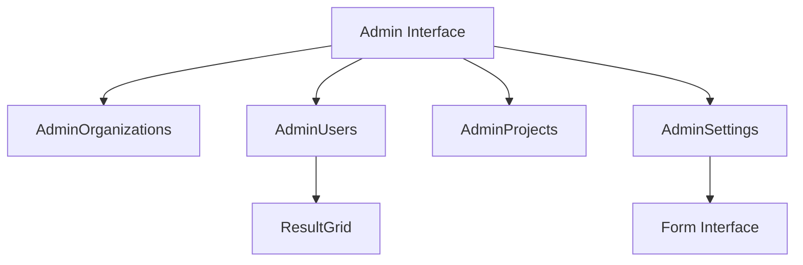

# What is Admin in Views

Admin refers to the administrative interface and functionalities provided for managing various aspects of the application. It includes components like <SwmToken path="static/app/views/admin/adminOrganizations.tsx" pos="19:2:2" line-data="function AdminOrganizations(props: Props) {">`AdminOrganizations`</SwmToken>, <SwmToken path="static/app/views/admin/adminUsers.tsx" pos="34:2:2" line-data="function AdminUsers(props: Props) {">`AdminUsers`</SwmToken>, `AdminProjects`, and <SwmToken path="static/app/views/admin/adminSettings.tsx" pos="72:6:6" line-data="export default function AdminSettings() {">`AdminSettings`</SwmToken>, each responsible for managing different entities such as organizations, users, projects, and settings respectively.

## Admin Layout

The `AdminLayout` component provides the overall layout and navigation for the admin interface, including sections for system status and management of different entities. The `renderAdminNavigation` function defines the navigation structure for the admin interface, categorizing items under 'System Status' and 'Manage'.

<SwmSnippet path="/static/app/views/admin/adminOrganizations.tsx" line="19">

---

## Managing Organizations

The <SwmToken path="static/app/views/admin/adminOrganizations.tsx" pos="19:2:2" line-data="function AdminOrganizations(props: Props) {">`AdminOrganizations`</SwmToken> function is responsible for managing and displaying a list of organizations. It uses the <SwmToken path="static/app/views/admin/adminOrganizations.tsx" pos="23:2:2" line-data="      &lt;ResultGrid">`ResultGrid`</SwmToken> component to provide functionalities like search, sorting, and filtering.

```tsx
function AdminOrganizations(props: Props) {
  return (
    <div>
      <h3>{t('Organizations')}</h3>
      <ResultGrid
        path="/manage/organizations/"
        endpoint="/organizations/?show=all"
        method="GET"
        columns={[<th key="column-org">Organization</th>]}
        columnsForRow={getRow}
        hasSearch
        sortOptions={[
          ['date', 'Date Joined'],
          ['members', 'Members'],
          ['events', 'Events'],
          ['projects', 'Projects'],
          ['employees', 'Employees'],
        ]}
        defaultSort="date"
        {...props}
      />
```

---

</SwmSnippet>

<SwmSnippet path="/static/app/views/admin/adminUsers.tsx" line="34">

---

## Managing Users

The <SwmToken path="static/app/views/admin/adminUsers.tsx" pos="34:2:2" line-data="function AdminUsers(props: Props) {">`AdminUsers`</SwmToken> function manages and displays a list of users. It also uses the <SwmToken path="static/app/views/admin/adminUsers.tsx" pos="48:2:2" line-data="      &lt;ResultGrid">`ResultGrid`</SwmToken> component to offer functionalities such as search, sorting, and filtering.

```tsx
function AdminUsers(props: Props) {
  const columns = [
    <th key="username">User</th>,
    <th key="dateJoined" style={{textAlign: 'center', width: 150}}>
      Joined
    </th>,
    <th key="lastLogin" style={{textAlign: 'center', width: 150}}>
      Last Login
    </th>,
  ];

  return (
    <div>
      <h3>{t('Users')}</h3>
      <ResultGrid
        path="/manage/users/"
        endpoint="/users/"
        method="GET"
        columns={columns}
        columnsForRow={getRow}
        hasSearch
```

---

</SwmSnippet>

<SwmSnippet path="/static/app/views/admin/adminSettings.tsx" line="88">

---

## Managing Settings

The <SwmToken path="static/app/views/admin/adminSettings.tsx" pos="72:6:6" line-data="export default function AdminSettings() {">`AdminSettings`</SwmToken> component allows for the configuration of various system and performance settings through a form interface.

```tsx
  const initialData = {};
  const fields = {};
  for (const key of optionsAvailable) {
    // TODO(dcramer): we should not be mutating options
    const option = data[key] ?? {field: {}, value: undefined};

    if (option.value === undefined || option.value === '') {
      const defn = getOption(key);
      initialData[key] = defn.defaultValue ? defn.defaultValue() : '';
    } else {
      initialData[key] = option.value;
    }
    fields[key] = getOptionField(key, option.field);
  }

  return (
    <div>
      <h3>{t('Settings')}</h3>

      <Form
        apiMethod="PUT"
```

---

</SwmSnippet>

<SwmSnippet path="/static/app/views/admin/adminUserEdit.tsx" line="130">

---

### <SwmToken path="static/app/views/admin/adminUserEdit.tsx" pos="129:2:2" line-data="class AdminUserEdit extends DeprecatedAsyncView&lt;Props, State&gt; {">`AdminUserEdit`</SwmToken>

The <SwmToken path="static/app/views/admin/adminUserEdit.tsx" pos="129:2:2" line-data="class AdminUserEdit extends DeprecatedAsyncView&lt;Props, State&gt; {">`AdminUserEdit`</SwmToken> component defines an endpoint for editing user details. The <SwmToken path="static/app/views/admin/adminUserEdit.tsx" pos="130:3:3" line-data="  get userEndpoint() {">`userEndpoint`</SwmToken> method constructs the URL for a specific user based on their ID, and the <SwmToken path="static/app/views/admin/adminUserEdit.tsx" pos="135:1:1" line-data="  getEndpoints(): ReturnType&lt;DeprecatedAsyncView[&#39;getEndpoints&#39;]&gt; {">`getEndpoints`</SwmToken> method returns this endpoint for use in API requests.

```tsx
  get userEndpoint() {
    const {params} = this.props;
    return `/users/${params.id}/`;
  }

  getEndpoints(): ReturnType<DeprecatedAsyncView['getEndpoints']> {
    return [['user', this.userEndpoint]];
  }
```

---

</SwmSnippet>

<SwmSnippet path="/static/app/views/admin/adminMail.tsx" line="21">

---

### <SwmToken path="static/app/views/admin/adminMail.tsx" pos="20:6:6" line-data="export default class AdminMail extends DeprecatedAsyncView&lt;{}, State&gt; {">`AdminMail`</SwmToken>

The <SwmToken path="static/app/views/admin/adminMail.tsx" pos="20:6:6" line-data="export default class AdminMail extends DeprecatedAsyncView&lt;{}, State&gt; {">`AdminMail`</SwmToken> component defines an endpoint for managing mail settings. The <SwmToken path="static/app/views/admin/adminMail.tsx" pos="21:1:1" line-data="  getEndpoints(): ReturnType&lt;DeprecatedAsyncView[&#39;getEndpoints&#39;]&gt; {">`getEndpoints`</SwmToken> method returns the endpoint <SwmPath>[src/sentry/mail/](src/sentry/mail/)</SwmPath> for fetching and updating mail configuration data.

```tsx
  getEndpoints(): ReturnType<DeprecatedAsyncView['getEndpoints']> {
    return [['data', '/internal/mail/']];
  }
```

---

</SwmSnippet>

&nbsp;

*This is an auto-generated document by Swimm AI 🌊 and has not yet been verified by a human*

<SwmMeta version="3.0.0" repo-id="Z2l0aHViJTNBJTNBc2VudHJ5LWRlbW8tMSUzQSUzQVN3aW1tLURlbW8=" repo-name="sentry-demo-1" doc-type="overview"><sup>Powered by [Swimm](/)</sup></SwmMeta>
