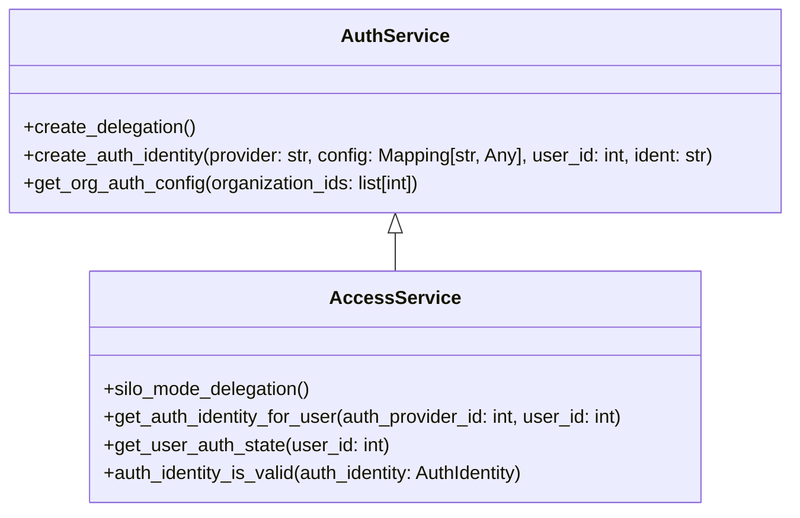

# Overview

Auth Services are responsible for handling various authentication-related operations within the application. These services ensure that users are authenticated correctly and securely, managing their identities and permissions.

# <SwmToken path="src/sentry/auth/services/auth/service.py" pos="15:2:2" line-data="class AuthService(RpcService):">`AuthService`</SwmToken>

The <SwmToken path="src/sentry/auth/services/auth/service.py" pos="15:2:2" line-data="class AuthService(RpcService):">`AuthService`</SwmToken> class is a key component that handles various authentication-related operations. It is instantiated using the <SwmToken path="src/sentry/auth/services/auth/service.py" pos="111:4:8" line-data="auth_service = AuthService.create_delegation()">`AuthService.create_delegation()`</SwmToken> method.

<SwmSnippet path="/src/sentry/auth/services/auth/service.py" line="15">

---

The <SwmToken path="src/sentry/auth/services/auth/service.py" pos="15:2:2" line-data="class AuthService(RpcService):">`AuthService`</SwmToken> class is defined here, with its key and local mode set. The <SwmToken path="src/sentry/auth/services/auth/service.py" pos="20:3:3" line-data="    def get_local_implementation(cls) -&gt; RpcService:">`get_local_implementation`</SwmToken> method returns an instance of <SwmToken path="src/sentry/auth/services/auth/service.py" pos="21:15:15" line-data="        from sentry.auth.services.auth.impl import DatabaseBackedAuthService">`DatabaseBackedAuthService`</SwmToken>.

```python
class AuthService(RpcService):
    key = "auth"
    local_mode = SiloMode.CONTROL

    @classmethod
    def get_local_implementation(cls) -> RpcService:
        from sentry.auth.services.auth.impl import DatabaseBackedAuthService

        return DatabaseBackedAuthService()
```

---

</SwmSnippet>

# <SwmToken path="src/sentry/auth/services/auth/service.py" pos="98:3:3" line-data="    def create_auth_identity(">`create_auth_identity`</SwmToken>

The <SwmToken path="src/sentry/auth/services/auth/service.py" pos="98:3:3" line-data="    def create_auth_identity(">`create_auth_identity`</SwmToken> function is used to create an authentication identity for a user based on the provided provider, configuration, user ID, and identifier.

<SwmSnippet path="/src/sentry/auth/services/auth/service.py" line="98">

---

The <SwmToken path="src/sentry/auth/services/auth/service.py" pos="98:3:3" line-data="    def create_auth_identity(">`create_auth_identity`</SwmToken> function is defined here, but its implementation is not provided in this snippet.

```python
    def create_auth_identity(
        self, *, provider: str, config: Mapping[str, Any], user_id: int, ident: str
    ) -> None:
        pass
```

---

</SwmSnippet>

# <SwmToken path="src/sentry/auth/services/auth/service.py" pos="27:3:3" line-data="    def get_org_auth_config(">`get_org_auth_config`</SwmToken>

The <SwmToken path="src/sentry/auth/services/auth/service.py" pos="27:3:3" line-data="    def get_org_auth_config(">`get_org_auth_config`</SwmToken> function retrieves the authentication configuration for a list of organization <SwmToken path="src/sentry/auth/services/auth/service.py" pos="38:15:15" line-data="        This method returns a list of org ids that have scim enabled">`ids`</SwmToken>.

<SwmSnippet path="/src/sentry/auth/services/auth/service.py" line="27">

---

The <SwmToken path="src/sentry/auth/services/auth/service.py" pos="27:3:3" line-data="    def get_org_auth_config(">`get_org_auth_config`</SwmToken> function is defined here, but its implementation is not provided in this snippet.

```python
    def get_org_auth_config(
        self, *, organization_ids: list[int]
    ) -> list[RpcOrganizationAuthConfig]:
        pass
```

---

</SwmSnippet>

# <SwmToken path="src/sentry/auth/services/access/service.py" pos="134:8:8" line-data="def impl_by_control_resources() -&gt; AccessService:">`AccessService`</SwmToken>

The <SwmToken path="src/sentry/auth/services/access/service.py" pos="134:8:8" line-data="def impl_by_control_resources() -&gt; AccessService:">`AccessService`</SwmToken> class is responsible for managing access-related operations. It is configured using the <SwmToken path="src/sentry/auth/services/access/service.py" pos="13:10:10" line-data="from sentry.hybridcloud.rpc import silo_mode_delegation">`silo_mode_delegation`</SwmToken> method, which sets up the service based on different silo modes such as REGION, CONTROL, and MONOLITH.

<SwmSnippet path="/src/sentry/auth/services/access/service.py" line="134">

---

The <SwmToken path="src/sentry/auth/services/access/service.py" pos="134:2:2" line-data="def impl_by_control_resources() -&gt; AccessService:">`impl_by_control_resources`</SwmToken> method returns an instance of <SwmToken path="src/sentry/auth/services/access/service.py" pos="135:15:15" line-data="    from sentry.auth.services.access.impl import ControlAccessService">`ControlAccessService`</SwmToken>.

```python
def impl_by_control_resources() -> AccessService:
    from sentry.auth.services.access.impl import ControlAccessService

    return ControlAccessService()
```

---

</SwmSnippet>

# <SwmToken path="src/sentry/auth/services/access/service.py" pos="27:3:3" line-data="    def get_auth_identity_for_user(">`get_auth_identity_for_user`</SwmToken>

The <SwmToken path="src/sentry/auth/services/access/service.py" pos="27:3:3" line-data="    def get_auth_identity_for_user(">`get_auth_identity_for_user`</SwmToken> function retrieves the authentication identity for a user based on the authentication provider ID and user ID.

<SwmSnippet path="/src/sentry/auth/services/access/service.py" line="134">

---

The <SwmToken path="src/sentry/auth/services/access/service.py" pos="134:2:2" line-data="def impl_by_control_resources() -&gt; AccessService:">`impl_by_control_resources`</SwmToken> method is defined here, but its implementation is not provided in this snippet.

```python
def impl_by_control_resources() -> AccessService:
    from sentry.auth.services.access.impl import ControlAccessService

    return ControlAccessService()
```

---

</SwmSnippet>

# <SwmToken path="src/sentry/auth/services/access/service.py" pos="99:3:3" line-data="    def get_user_auth_state(">`get_user_auth_state`</SwmToken>

The <SwmToken path="src/sentry/auth/services/access/service.py" pos="99:3:3" line-data="    def get_user_auth_state(">`get_user_auth_state`</SwmToken> function determines the authentication state of a user, including their SSO state and permissions.

# <SwmToken path="src/sentry/auth/services/access/service.py" pos="41:3:3" line-data="    def auth_identity_is_valid(">`auth_identity_is_valid`</SwmToken>

The <SwmToken path="src/sentry/auth/services/access/service.py" pos="41:3:3" line-data="    def auth_identity_is_valid(">`auth_identity_is_valid`</SwmToken> function checks if an authentication identity is valid based on various criteria such as the last verification time and specific provider requirements.

&nbsp;

*This is an auto-generated document by Swimm AI 🌊 and has not yet been verified by a human*

<SwmMeta version="3.0.0" repo-id="Z2l0aHViJTNBJTNBc2VudHJ5LWRlbW8tMSUzQSUzQVN3aW1tLURlbW8=" repo-name="sentry-demo-1" doc-type="overview"><sup>Powered by [Swimm](/)</sup></SwmMeta>
