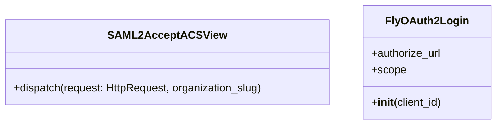

# Overview of Auth Providers

Providers are components responsible for handling authentication logic. They define how users authenticate with different identity providers. Providers manage the authentication flow, including redirecting users to the identity provider, handling callbacks, and processing user information. They also handle the configuration and setup required for integrating with various identity providers, such as <SwmToken path="src/sentry/auth/providers/fly/views.py" pos="7:8:8" line-data="from sentry.auth.providers.oauth2 import OAuth2Login">`oauth2`</SwmToken> or SAML. Providers ensure that the authenticated user's identity is correctly mapped and stored within the application.

## <SwmToken path="src/sentry/auth/providers/saml2/provider.py" pos="36:12:12" line-data="def get_provider(organization_slug: str) -&gt; SAML2Provider | None:">`SAML2Provider`</SwmToken> Class

The <SwmToken path="src/sentry/auth/providers/saml2/provider.py" pos="36:12:12" line-data="def get_provider(organization_slug: str) -&gt; SAML2Provider | None:">`SAML2Provider`</SwmToken> class is an example of a provider that handles <SwmToken path="src/sentry/auth/providers/saml2/provider.py" pos="16:4:4" line-data="from onelogin.saml2.auth import OneLogin_Saml2_Auth, OneLogin_Saml2_Settings">`saml2`</SwmToken> authentication. It implements methods like <SwmToken path="src/sentry/auth/providers/dummy.py" pos="26:3:3" line-data="    def get_auth_pipeline(self):">`get_auth_pipeline`</SwmToken>, <SwmToken path="src/sentry/auth/providers/saml2/provider.py" pos="253:3:3" line-data="    def get_setup_pipeline(self):">`get_setup_pipeline`</SwmToken>, and <SwmToken path="src/sentry/auth/providers/saml2/provider.py" pos="284:3:3" line-data="    def build_identity(self, state):">`build_identity`</SwmToken> to manage the authentication flow and map user attributes.

## Attribute Mapping

The <SwmToken path="src/sentry/auth/providers/saml2/provider.py" pos="284:3:3" line-data="    def build_identity(self, state):">`build_identity`</SwmToken> method in the <SwmToken path="src/sentry/auth/providers/saml2/provider.py" pos="36:12:12" line-data="def get_provider(organization_slug: str) -&gt; SAML2Provider | None:">`SAML2Provider`</SwmToken> class maps the attributes from the identity provider to the application's user model. It ensures that essential attributes like email and identifier are correctly mapped.

<SwmSnippet path="/src/sentry/auth/providers/saml2/provider.py" line="284">

---

The <SwmToken path="src/sentry/auth/providers/saml2/provider.py" pos="284:3:3" line-data="    def build_identity(self, state):">`build_identity`</SwmToken> method processes the raw attributes from the identity provider and maps them to the application's user model. It ensures that critical attributes like email and identifier are correctly mapped, raising an error if they are not.

```python
    def build_identity(self, state):
        raw_attributes = state["auth_attributes"]
        attributes = {}

        # map configured provider attributes
        for key, provider_key in self.config["attribute_mapping"].items():
            attribute_list = raw_attributes.get(provider_key, [""])
            attributes[key] = attribute_list[0] if len(attribute_list) > 0 else ""

        # Email and identifier MUST be correctly mapped
        if not attributes[Attributes.IDENTIFIER] or not attributes[Attributes.USER_EMAIL]:
            error_msg_keys = ", ".join(repr(key) for key in sorted(raw_attributes.keys()))
            raise IdentityNotValid(
                _(
                    f"Failed to map SAML attributes. Assertion returned the following attribute keys: {error_msg_keys}"
                )
            )

        name_gen = (attributes[k] for k in (Attributes.FIRST_NAME, Attributes.LAST_NAME))
        name = " ".join(_f for _f in name_gen if _f)
```

---

</SwmSnippet>

## <SwmToken path="src/sentry/auth/providers/dummy.py" pos="23:2:2" line-data="class DummyProvider(Provider):">`DummyProvider`</SwmToken> Class

The <SwmToken path="src/sentry/auth/providers/dummy.py" pos="23:2:2" line-data="class DummyProvider(Provider):">`DummyProvider`</SwmToken> class is a simple example of a provider that can be used for testing. It implements the necessary methods to handle authentication and map user attributes.

<SwmSnippet path="/src/sentry/auth/providers/dummy.py" line="23">

---

The <SwmToken path="src/sentry/auth/providers/dummy.py" pos="23:2:2" line-data="class DummyProvider(Provider):">`DummyProvider`</SwmToken> class defines a basic provider for testing purposes. It includes methods like <SwmToken path="src/sentry/auth/providers/dummy.py" pos="26:3:3" line-data="    def get_auth_pipeline(self):">`get_auth_pipeline`</SwmToken>, <SwmToken path="src/sentry/auth/providers/dummy.py" pos="29:3:3" line-data="    def build_identity(self, state):">`build_identity`</SwmToken>, and <SwmToken path="src/sentry/auth/providers/dummy.py" pos="39:3:3" line-data="    def refresh_identity(self, auth_identity):">`refresh_identity`</SwmToken> to handle the authentication flow and user attribute mapping.

```python
class DummyProvider(Provider):
    name = "Dummy"

    def get_auth_pipeline(self):
        return [AskEmail()]

    def build_identity(self, state):
        return {
            "id": MigratingIdentityId(
                id=state.get("id", state["email"]), legacy_id=state.get("legacy_email")
            ),
            "email": state["email"],
            "email_verified": state["email_verified"],
            "name": "Dummy",
        }

    def refresh_identity(self, auth_identity):
        pass

    def build_config(self, state):
        return {}
```

---

</SwmSnippet>

## Provider Endpoints

Provider endpoints are specific routes that handle various parts of the authentication process. These endpoints are crucial for managing the authentication flow with different identity providers.

### <SwmToken path="src/sentry/auth/providers/saml2/provider.py" pos="84:2:2" line-data="class SAML2AcceptACSView(BaseView):">`SAML2AcceptACSView`</SwmToken>

The <SwmToken path="src/sentry/auth/providers/saml2/provider.py" pos="84:2:2" line-data="class SAML2AcceptACSView(BaseView):">`SAML2AcceptACSView`</SwmToken> class defines an endpoint for handling SAML authentication assertions posted directly to the ACS URL. This endpoint is essential for initializing the authentication flow when the Identity Provider initiates the SSO request.

<SwmSnippet path="/src/sentry/auth/providers/saml2/provider.py" line="84">

---

The <SwmToken path="src/sentry/auth/providers/saml2/provider.py" pos="84:2:2" line-data="class SAML2AcceptACSView(BaseView):">`SAML2AcceptACSView`</SwmToken> class handles SAML authentication assertions posted to the ACS URL, initiating the authentication flow.

```python
class SAML2AcceptACSView(BaseView):
    @method_decorator(csrf_exempt)
    def dispatch(self, request: HttpRequest, organization_slug):
```

---

</SwmSnippet>

### <SwmToken path="src/sentry/auth/providers/fly/views.py" pos="19:2:2" line-data="class FlyOAuth2Login(OAuth2Login):">`FlyOAuth2Login`</SwmToken>

The <SwmToken path="src/sentry/auth/providers/fly/views.py" pos="19:2:2" line-data="class FlyOAuth2Login(OAuth2Login):">`FlyOAuth2Login`</SwmToken> class defines an endpoint for initiating the <SwmToken path="src/sentry/auth/providers/fly/views.py" pos="7:8:8" line-data="from sentry.auth.providers.oauth2 import OAuth2Login">`oauth2`</SwmToken> login process with Fly. It sets the authorization URL and scope required for the <SwmToken path="src/sentry/auth/providers/fly/views.py" pos="7:8:8" line-data="from sentry.auth.providers.oauth2 import OAuth2Login">`oauth2`</SwmToken> flow.

<SwmSnippet path="/src/sentry/auth/providers/fly/views.py" line="19">

---

The <SwmToken path="src/sentry/auth/providers/fly/views.py" pos="19:2:2" line-data="class FlyOAuth2Login(OAuth2Login):">`FlyOAuth2Login`</SwmToken> class sets up the <SwmToken path="src/sentry/auth/providers/fly/views.py" pos="7:8:8" line-data="from sentry.auth.providers.oauth2 import OAuth2Login">`oauth2`</SwmToken> login process with Fly, defining the authorization URL and scope.

```python
class FlyOAuth2Login(OAuth2Login):
    authorize_url = AUTHORIZE_URL
    scope = SCOPE

    def __init__(self, client_id):
        super().__init__(client_id=client_id)
```

---

</SwmSnippet>

&nbsp;

*This is an auto-generated document by Swimm AI 🌊 and has not yet been verified by a human*

<SwmMeta version="3.0.0" repo-id="Z2l0aHViJTNBJTNBc2VudHJ5LWRlbW8tMSUzQSUzQVN3aW1tLURlbW8=" repo-name="sentry-demo-1" doc-type="overview"><sup>Powered by [Swimm](/)</sup></SwmMeta>
