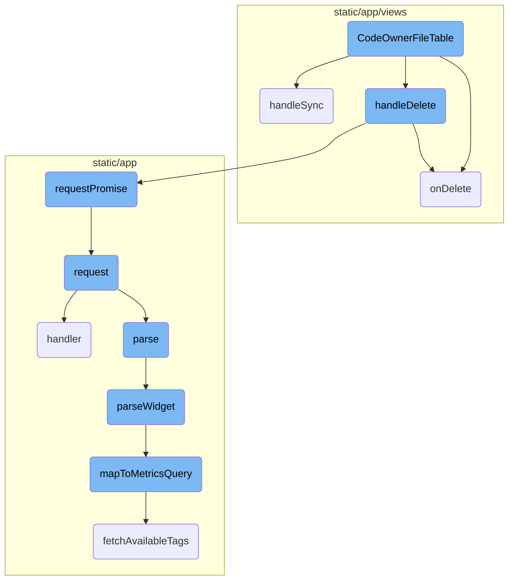
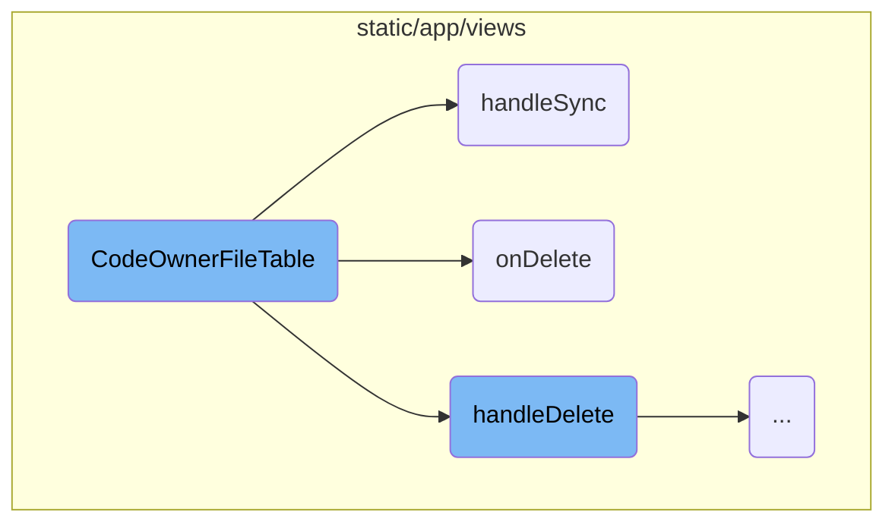
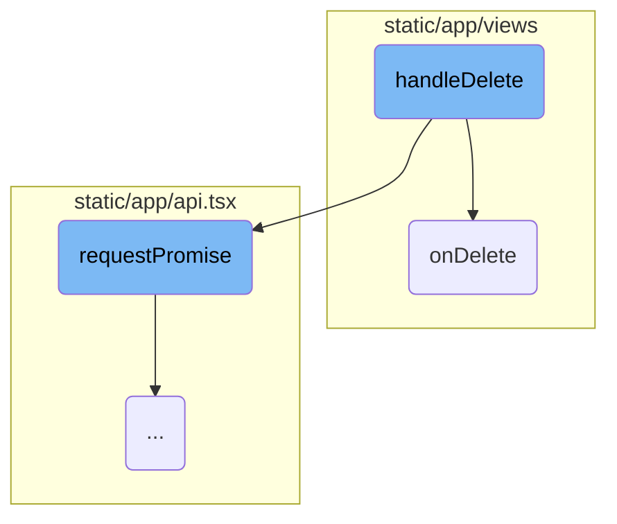

```mermaid
graph TD;
      subgraph static/app
1025c11ff078741e3a52849e4dc81510d630800b045c60aea951683433a1c993(requestPromise):::mainFlowStyle --> 4f5a67a71dfb71654db327ed24d5e8187187a49b58963a473eec18ecb0aef026(request):::mainFlowStyle
end

subgraph static/app
4f5a67a71dfb71654db327ed24d5e8187187a49b58963a473eec18ecb0aef026(request):::mainFlowStyle --> 2cd409575454572c7b228bde73d6eb55227f3d7b14d37cc7ca5415bbcb81e4e5(handler)
end

subgraph static/app
4f5a67a71dfb71654db327ed24d5e8187187a49b58963a473eec18ecb0aef026(request):::mainFlowStyle --> 4b2faee236c2e651d9932fa234f72966df49f7aa0f85eb9909d65f4b6d8ce1a6(parse):::mainFlowStyle
end

subgraph static/app
4b2faee236c2e651d9932fa234f72966df49f7aa0f85eb9909d65f4b6d8ce1a6(parse):::mainFlowStyle --> b2b47f6077e96a1ff47606d77c3fe70b18a84edc0ab0fa1349f7face4165d2ea(parseWidget):::mainFlowStyle
end

subgraph static/app
2cd409575454572c7b228bde73d6eb55227f3d7b14d37cc7ca5415bbcb81e4e5(handler) --> 559bfddfedaeb6eedd4a2b9c4af59508927a1a6190c13b585781a179d22a07a1(processEvent)
end

subgraph static/app
b2b47f6077e96a1ff47606d77c3fe70b18a84edc0ab0fa1349f7face4165d2ea(parseWidget):::mainFlowStyle --> 05bf2ddeab316943d2187e10bc3886949b4b03ae946f68d4f27a5bfc0025e132(mapToMetricsQuery):::mainFlowStyle
end


      classDef mainFlowStyle color:#000000,fill:#7CB9F4
classDef rootsStyle color:#000000,fill:#00FFF4
classDef Style1 color:#000000,fill:#00FFAA
classDef Style2 color:#000000,fill:#FFFF00
classDef Style3 color:#000000,fill:#AA7CB9

%% Swimm:
%% graph TD;
%%       subgraph <SwmPath>[static/app/](static/app/)</SwmPath>
%% 1025c11ff078741e3a52849e4dc81510d630800b045c60aea951683433a1c993(requestPromise):::mainFlowStyle --> 4f5a67a71dfb71654db327ed24d5e8187187a49b58963a473eec18ecb0aef026(request):::mainFlowStyle
%% end
%% 
%% subgraph <SwmPath>[static/app/](static/app/)</SwmPath>
%% 4f5a67a71dfb71654db327ed24d5e8187187a49b58963a473eec18ecb0aef026(request):::mainFlowStyle --> 2cd409575454572c7b228bde73d6eb55227f3d7b14d37cc7ca5415bbcb81e4e5(handler)
%% end
%% 
%% subgraph <SwmPath>[static/app/](static/app/)</SwmPath>
%% 4f5a67a71dfb71654db327ed24d5e8187187a49b58963a473eec18ecb0aef026(request):::mainFlowStyle --> 4b2faee236c2e651d9932fa234f72966df49f7aa0f85eb9909d65f4b6d8ce1a6(parse):::mainFlowStyle
%% end
%% 
%% subgraph <SwmPath>[static/app/](static/app/)</SwmPath>
%% 4b2faee236c2e651d9932fa234f72966df49f7aa0f85eb9909d65f4b6d8ce1a6(parse):::mainFlowStyle --> b2b47f6077e96a1ff47606d77c3fe70b18a84edc0ab0fa1349f7face4165d2ea(parseWidget):::mainFlowStyle
%% end
%% 
%% subgraph <SwmPath>[static/app/](static/app/)</SwmPath>
%% 2cd409575454572c7b228bde73d6eb55227f3d7b14d37cc7ca5415bbcb81e4e5(handler) --> 559bfddfedaeb6eedd4a2b9c4af59508927a1a6190c13b585781a179d22a07a1(processEvent)
%% end
%% 
%% subgraph <SwmPath>[static/app/](static/app/)</SwmPath>
%% b2b47f6077e96a1ff47606d77c3fe70b18a84edc0ab0fa1349f7face4165d2ea(parseWidget):::mainFlowStyle --> 05bf2ddeab316943d2187e10bc3886949b4b03ae946f68d4f27a5bfc0025e132(mapToMetricsQuery):::mainFlowStyle
%% end
%% 
%% 
%%       classDef mainFlowStyle color:#000000,fill:#7CB9F4
%% classDef rootsStyle color:#000000,fill:#00FFF4
%% classDef Style1 color:#000000,fill:#00FFAA
%% classDef Style2 color:#000000,fill:#FFFF00
%% classDef Style3 color:#000000,fill:#AA7CB9
```

This document provides an overview of the <SwmToken path="static/app/views/settings/project/projectOwnership/codeOwnerFileTable.tsx" pos="33:4:4" line-data="export function CodeOwnerFileTable({">`CodeOwnerFileTable`</SwmToken> component, which is responsible for rendering and managing the table of code owner files. It includes details on how the component initializes the API and organization context, and how it handles viewing, synchronizing, and deleting code owner files.

The <SwmToken path="static/app/views/settings/project/projectOwnership/codeOwnerFileTable.tsx" pos="33:4:4" line-data="export function CodeOwnerFileTable({">`CodeOwnerFileTable`</SwmToken> component is designed to display a list of code owner files. When the component is initialized, it sets up the API and organization context. If there are no code owner files, it simply returns null. The component includes handlers for various actions: viewing a code owner file opens a modal with the file's details, synchronizing a code owner file fetches the latest version from the server and updates the project, and deleting a code owner file removes it from the server and updates the UI accordingly.

Here is a high level diagram of the flow, showing only the most important functions:



# Flow drill down

First, we'll zoom into this section of the flow:



<SwmSnippet path="/static/app/views/settings/project/projectOwnership/codeOwnerFileTable.tsx" line="33">

---

## <SwmToken path="static/app/views/settings/project/projectOwnership/codeOwnerFileTable.tsx" pos="33:4:4" line-data="export function CodeOwnerFileTable({">`CodeOwnerFileTable`</SwmToken>

The <SwmToken path="static/app/views/settings/project/projectOwnership/codeOwnerFileTable.tsx" pos="33:4:4" line-data="export function CodeOwnerFileTable({">`CodeOwnerFileTable`</SwmToken> component is responsible for rendering the table of code owner files. It initializes the API and organization context and defines handlers for viewing, synchronizing, and deleting code owner files.

```tsx
export function CodeOwnerFileTable({
  codeowners,
  project,
  onUpdate,
  onDelete,
  disabled,
}: CodeOwnerFileTableProps) {
  const api = useApi();
  const organization = useOrganization();

  // Do we need an empty state instead?
  if (codeowners.length === 0) {
    return null;
  }

  const handleView = (codeowner: CodeOwner) => () => {
    // Open modal with codeowner file
    openModal(deps => <ViewCodeOwnerModal {...deps} codeowner={codeowner} />, {modalCss});
  };
```

---

</SwmSnippet>

<SwmSnippet path="/static/app/views/settings/project/projectOwnership/codeOwnerFileTable.tsx" line="53">

---

## <SwmToken path="static/app/views/settings/project/projectOwnership/codeOwnerFileTable.tsx" pos="53:3:3" line-data="  const handleSync = (codeowner: CodeOwner) =&gt; async () =&gt; {">`handleSync`</SwmToken>

The <SwmToken path="static/app/views/settings/project/projectOwnership/codeOwnerFileTable.tsx" pos="53:3:3" line-data="  const handleSync = (codeowner: CodeOwner) =&gt; async () =&gt; {">`handleSync`</SwmToken> function is used to synchronize the code owner file with the server. It makes a GET request to fetch the latest code owner file and then updates the project with this file using a PUT request. If successful, it updates the UI and shows a success message; otherwise, it shows an error message.

```tsx
  const handleSync = (codeowner: CodeOwner) => async () => {
    try {
      const codeownerFile: CodeownersFile = await api.requestPromise(
        `/organizations/${organization.slug}/code-mappings/${codeowner.codeMappingId}/codeowners/`,
        {
          method: 'GET',
        }
      );

      const data = await api.requestPromise(
        `/projects/${organization.slug}/${project.slug}/codeowners/${codeowner.id}/`,
        {
          method: 'PUT',
          data: {raw: codeownerFile.raw, date_updated: new Date().toISOString()},
        }
      );
      onUpdate({...codeowner, ...data});
      addSuccessMessage(t('CODEOWNERS file sync successful.'));
    } catch (_err) {
      addErrorMessage(t('An error occurred trying to sync CODEOWNERS file.'));
    }
```

---

</SwmSnippet>

<SwmSnippet path="/static/app/views/admin/adminRelays.tsx" line="32">

---

## <SwmToken path="static/app/views/admin/adminRelays.tsx" pos="32:1:1" line-data="  onDelete(key: string) {">`onDelete`</SwmToken>

The <SwmToken path="static/app/views/admin/adminRelays.tsx" pos="32:1:1" line-data="  onDelete(key: string) {">`onDelete`</SwmToken> method handles the deletion of a relay by making a DELETE request to the server. It updates the component's state to show a loading indicator while the request is in progress and resets it once the request completes, regardless of success or failure.

```tsx
  onDelete(key: string) {
    this.setState({loading: true});
    this.props.api.request(`/relays/${key}/`, {
      method: 'DELETE',
      success: () => this.setState({loading: false}),
      error: () => this.setState({loading: false}),
    });
  }
```

---

</SwmSnippet>

Now, lets zoom into this section of the flow:



<SwmSnippet path="/static/app/views/settings/project/projectOwnership/codeOwnerFileTable.tsx" line="76">

---

## Handling deletion of a code owner

The <SwmToken path="static/app/views/settings/project/projectOwnership/codeOwnerFileTable.tsx" pos="76:3:3" line-data="  const handleDelete = (codeowner: CodeOwner) =&gt; async () =&gt; {">`handleDelete`</SwmToken> function is responsible for handling the deletion of a code owner. It makes an asynchronous request to the API to delete the specified code owner and handles the response. If the deletion is successful, it calls the <SwmToken path="static/app/views/settings/project/projectOwnership/codeOwnerFileTable.tsx" pos="84:1:1" line-data="      onDelete(codeowner);">`onDelete`</SwmToken> function and displays a success message. If an error occurs, it displays an error message.

```tsx
  const handleDelete = (codeowner: CodeOwner) => async () => {
    try {
      await api.requestPromise(
        `/projects/${organization.slug}/${project.slug}/codeowners/${codeowner.id}/`,
        {
          method: 'DELETE',
        }
      );
      onDelete(codeowner);
      addSuccessMessage(t('Deletion successful'));
    } catch {
      // no 4xx errors should happen on delete
      addErrorMessage(t('An error occurred'));
    }
  };
```

---

</SwmSnippet>

Now, lets zoom into this section of the flow:



<SwmSnippet path="/static/app/api.tsx" line="656">

---

## Handling API Requests

The <SwmToken path="static/app/api.tsx" pos="656:1:1" line-data="  requestPromise&lt;IncludeAllArgsType extends boolean&gt;(">`requestPromise`</SwmToken> function is responsible for handling API requests. It creates a new promise and calls the <SwmToken path="static/app/api.tsx" pos="669:14:14" line-data="    const preservedError = new Error(&#39;API Request Error&#39;);">`Request`</SwmToken> function, passing along the necessary parameters. If the request is successful, it resolves the promise with the data. If there is an error, it rejects the promise with an error object.

```tsx
  requestPromise<IncludeAllArgsType extends boolean>(
    path: string,
    {
      includeAllArgs,
      ...options
    }: {includeAllArgs?: IncludeAllArgsType} & Readonly<RequestOptions> = {}
  ): Promise<IncludeAllArgsType extends true ? ApiResult : any> {
    // Create an error object here before we make any async calls so that we
    // have a helpful stack trace if it errors
    //
    // This *should* get logged to Sentry only if the promise rejection is not handled
    // (since SDK captures unhandled rejections). Ideally we explicitly ignore rejection
    // or handle with a user friendly error message
    const preservedError = new Error('API Request Error');

    return new Promise((resolve, reject) =>
      this.request(path, {
        ...options,
        preservedError,
        success: (data, textStatus, resp) => {
          if (includeAllArgs) {
```

---

</SwmSnippet>

<SwmSnippet path="/static/app/api.tsx" line="420">

---

### Sending API Request

The <SwmToken path="static/app/api.tsx" pos="420:1:1" line-data="  request(path: string, options: Readonly&lt;RequestOptions&gt; = {}): Request {">`request`</SwmToken> function constructs and sends the actual API request. It builds the request URL, sets up the request headers, and handles the response. Depending on the response status, it either calls the success handler or the error handler.

```tsx
  request(path: string, options: Readonly<RequestOptions> = {}): Request {
    const method = options.method || (options.data ? 'POST' : 'GET');

    let fullUrl = buildRequestUrl(this.baseUrl, path, options);

    let data = options.data;

    if (data !== undefined && method !== 'GET' && !(data instanceof FormData)) {
      data = JSON.stringify(data);
    }

    // TODO(epurkhiser): Mimicking the old jQuery API, data could be a string /
    // object for GET requests. jQuery just sticks it onto the URL as query
    // parameters
    if (method === 'GET' && data) {
      const queryString = typeof data === 'string' ? data : qs.stringify(data);

      if (queryString.length > 0) {
        fullUrl = fullUrl + (fullUrl.includes('?') ? '&' : '?') + queryString;
      }
    }
```

---

</SwmSnippet>

<SwmSnippet path="/static/app/components/replays/canvasReplayerPlugin.tsx" line="233">

---

## Processing Events

The <SwmToken path="static/app/components/replays/canvasReplayerPlugin.tsx" pos="233:5:5" line-data="  async function processEvent(e: CanvasEventWithTime, {replayer}: {replayer: Replayer}) {">`processEvent`</SwmToken> function processes canvas mutation events. It preloads the event, retrieves the target canvas node, and applies the canvas mutation. If there is an error during the mutation, it captures the exception using Sentry. Finally, it updates the image source and prunes the event.

```tsx
  async function processEvent(e: CanvasEventWithTime, {replayer}: {replayer: Replayer}) {
    preload(e);

    const source = replayer.getMirror().getNode(e.data.id);
    const target =
      canvases.get(e.data.id) ||
      (source && cloneCanvas(e.data.id, source as HTMLCanvasElement));

    if (!target) {
      throw new InvalidCanvasNodeError('No canvas found for id');
    }

    await canvasMutation({
      event: e,
      mutation: e.data,
      target,
      imageMap,
      canvasEventMap,
      errorHandler: (err: unknown) => {
        if (err instanceof Error) {
          Sentry.captureException(err);
```

---

</SwmSnippet>

<SwmSnippet path="/static/app/components/replays/canvasReplayerPlugin.tsx" line="300">

---

### Handling Event

The <SwmToken path="static/app/components/replays/canvasReplayerPlugin.tsx" pos="304:1:1" line-data="    handler: (e: eventWithTime, isSync: boolean, {replayer}: {replayer: Replayer}) =&gt; {">`handler`</SwmToken> function determines how to handle different types of events. If the event is a canvas mutation and is not in sync mode, it processes the event asynchronously. Otherwise, it prunes the event.

```tsx
    /**
     * Mutate canvas outside of iframe, then export the canvas as an image, and
     * draw inside of the image el inside of replay canvas.
     */
    handler: (e: eventWithTime, isSync: boolean, {replayer}: {replayer: Replayer}) => {
      const isCanvas = isCanvasMutationEvent(e);

      // isSync = true means it is fast forwarding vs playing
      // nothing to do when fast forwarding since canvas mutations for us are
      // image snapshots and do not depend on past events
      if (isSync) {
        // Set this to -1 to indicate that we will need to search
        // `canvasMutationEvents` for starting point of preloading
        //
        // Only do this when isSync is true, meaning there was a seek, since we
        // don't know where next index is
        nextPreloadIndex = -1;

        if (isCanvas) {
          processEventSync(e, {replayer});
        }
```

---

</SwmSnippet>

&nbsp;

*This is an auto-generated document by Swimm AI 🌊 and has not yet been verified by a human*

<SwmMeta version="3.0.0" repo-id="Z2l0aHViJTNBJTNBc2VudHJ5LWRlbW8tMSUzQSUzQVN3aW1tLURlbW8=" repo-name="sentry-demo-1" doc-type="flows"><sup>Powered by [Swimm](/)</sup></SwmMeta>
