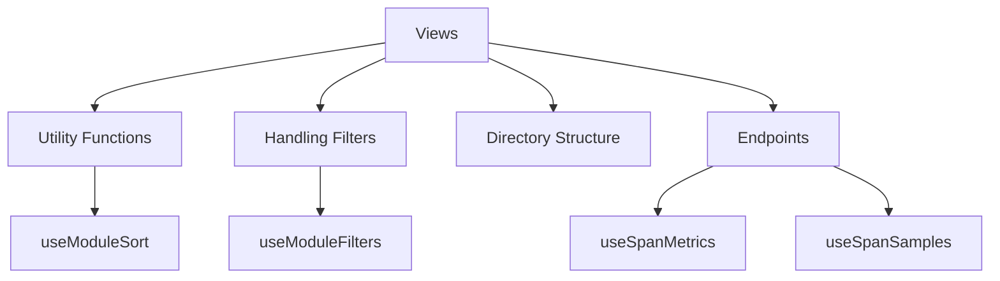

# Overview of Common Views

Views are components that render specific parts of the user interface. They are used to display data and handle user interactions. Views in the common directory are shared across different parts of the application to ensure consistency and reusability. These views often include utility functions and components that are used by multiple other views. They help in maintaining a clean and organized codebase by centralizing common functionalities.

## Utility Functions in Views

The file <SwmPath>[static/app/views/insights/common/views/spans/useModuleSort.ts](static/app/views/insights/common/views/spans/useModuleSort.ts)</SwmPath> contains a utility function <SwmToken path="static/app/views/insights/common/views/spans/useModuleSort.ts" pos="27:4:4" line-data="export function useModuleSort(">`useModuleSort`</SwmToken> that parses a <SwmToken path="static/app/views/insights/common/views/spans/useModuleSort.ts" pos="1:5:5" line-data="import type {Sort} from &#39;sentry/utils/discover/fields&#39;;">`Sort`</SwmToken> object from the URL and ensures that only valid sorts are used. This function is essential for handling sorting in the user interface.

<SwmSnippet path="/static/app/views/insights/common/views/spans/useModuleSort.ts" line="1">

---

The <SwmToken path="static/app/views/insights/common/views/spans/useModuleSort.ts" pos="27:4:4" line-data="export function useModuleSort(">`useModuleSort`</SwmToken> function imports necessary types and functions, decodes sorts from the URL, and ensures that only valid sorts are used. This is crucial for maintaining the integrity of sorting functionality in the user interface.

```typescript
import type {Sort} from 'sentry/utils/discover/fields';
import {decodeSorts} from 'sentry/utils/queryString';
import {useLocation} from 'sentry/utils/useLocation';
import type {QueryParameterNames} from 'sentry/views/insights/common/views/queryParameters';
import {SpanFunction, SpanMetricsField} from 'sentry/views/insights/types';

type Query = {
  [QueryParameterNames.SPANS_SORT]?: string;
  [QueryParameterNames.ENDPOINTS_SORT]?: string;
};

const SORTABLE_FIELDS = [
  `avg(${SpanMetricsField.SPAN_SELF_TIME})`,
  `${SpanFunction.HTTP_ERROR_COUNT}()`,
  `${SpanFunction.SPM}()`,
  `${SpanFunction.TIME_SPENT_PERCENTAGE}()`,
] as const;

export type ValidSort = Sort & {
  field: (typeof SORTABLE_FIELDS)[number];
};
```

---

</SwmSnippet>

## Handling Filters in Views

The file <SwmPath>[static/app/views/insights/common/views/spans/useModuleFilters.ts](static/app/views/insights/common/views/spans/useModuleFilters.ts)</SwmPath> provides a utility function `useModuleFilters` that extracts and decodes filter parameters from the URL. This function is used to manage filters in the user interface, ensuring that only relevant data is displayed.

## Directory Structure

The directory <SwmPath>[static/app/views/insights/common/views/spans/](static/app/views/insights/common/views/spans/)</SwmPath> contains various files and subdirectories that define different views and their associated utility functions. This structure helps in organizing the code and making it easier to maintain.

## Endpoints of Views

Endpoints in views are used to fetch data required for rendering the user interface. These endpoints take various parameters and return data that is used by the views.

### <SwmToken path="static/app/views/insights/common/views/spanSummaryPage/sampleList/sampleTable/sampleTable.tsx" pos="79:15:15" line-data="  const {data, isFetching: isFetchingSpanMetrics} = useSpanMetrics(">`useSpanMetrics`</SwmToken>

The <SwmToken path="static/app/views/insights/common/views/spanSummaryPage/sampleList/sampleTable/sampleTable.tsx" pos="79:15:15" line-data="  const {data, isFetching: isFetchingSpanMetrics} = useSpanMetrics(">`useSpanMetrics`</SwmToken> endpoint is used to fetch span metrics data. It takes filters and additional filters as parameters and returns data related to span metrics, such as average span self-time and span operation.

<SwmSnippet path="/static/app/views/insights/common/views/spanSummaryPage/sampleList/sampleTable/sampleTable.tsx" line="79">

---

The <SwmToken path="static/app/views/insights/common/views/spanSummaryPage/sampleList/sampleTable/sampleTable.tsx" pos="79:15:15" line-data="  const {data, isFetching: isFetchingSpanMetrics} = useSpanMetrics(">`useSpanMetrics`</SwmToken> function fetches span metrics data based on the provided filters and additional filters. This data is essential for displaying span metrics in the user interface.

```tsx
  const {data, isFetching: isFetchingSpanMetrics} = useSpanMetrics(
    {
      search: MutableSearch.fromQueryObject({...filters, ...additionalFilters}),
      fields: [`avg(${SPAN_SELF_TIME})`, SPAN_OP],
      enabled: Object.values({...filters, ...additionalFilters}).every(value =>
        Boolean(value)
      ),
    },
    'api.starfish.span-summary-panel-samples-table-avg'
  );
```

---

</SwmSnippet>

### <SwmToken path="static/app/views/insights/common/views/spanSummaryPage/sampleList/sampleTable/sampleTable.tsx" pos="102:5:5" line-data="  } = useSpanSamples({">`useSpanSamples`</SwmToken>

The <SwmToken path="static/app/views/insights/common/views/spanSummaryPage/sampleList/sampleTable/sampleTable.tsx" pos="102:5:5" line-data="  } = useSpanSamples({">`useSpanSamples`</SwmToken> endpoint is used to fetch span samples data. It takes parameters like <SwmToken path="static/app/views/insights/common/views/spanSummaryPage/sampleList/sampleTable/sampleTable.tsx" pos="103:1:1" line-data="    groupId,">`groupId`</SwmToken>, <SwmToken path="static/app/views/insights/common/views/spanSummaryPage/sampleList/sampleTable/sampleTable.tsx" pos="104:1:1" line-data="    transactionName,">`transactionName`</SwmToken>, <SwmToken path="static/app/views/insights/common/views/spanSummaryPage/sampleList/sampleTable/sampleTable.tsx" pos="105:1:1" line-data="    transactionMethod,">`transactionMethod`</SwmToken>, and additional fields to return data related to span samples.

<SwmSnippet path="/static/app/views/insights/common/views/spanSummaryPage/sampleList/sampleTable/sampleTable.tsx" line="102">

---

The <SwmToken path="static/app/views/insights/common/views/spanSummaryPage/sampleList/sampleTable/sampleTable.tsx" pos="102:5:5" line-data="  } = useSpanSamples({">`useSpanSamples`</SwmToken> function fetches span samples data based on the provided parameters. This data is used to display span samples in the user interface.

```tsx
  } = useSpanSamples({
    groupId,
    transactionName,
    transactionMethod,
    subregions,
    release,
    spanSearch,
    additionalFields,
  });
```

---

</SwmSnippet>

&nbsp;

*This is an auto-generated document by Swimm AI 🌊 and has not yet been verified by a human*

<SwmMeta version="3.0.0" repo-id="Z2l0aHViJTNBJTNBc2VudHJ5LWRlbW8tMSUzQSUzQVN3aW1tLURlbW8=" repo-name="sentry-demo-1" doc-type="overview"><sup>Powered by [Swimm](/)</sup></SwmMeta>
