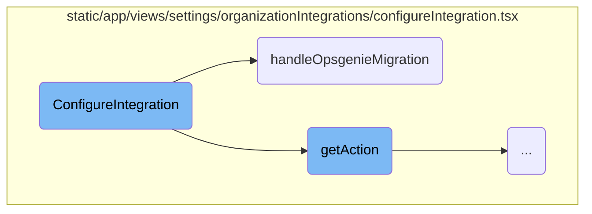
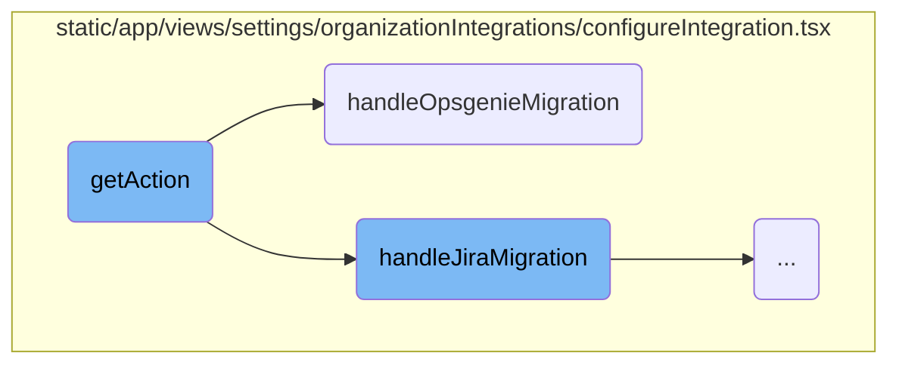

```mermaid
graph TD;
      subgraph static/app
695b77c705869f825d1615c3e5c65576e787eaf3573931c2f8f64f7a7916c1c1(handleJiraMigration):::mainFlowStyle --> 1025c11ff078741e3a52849e4dc81510d630800b045c60aea951683433a1c993(requestPromise):::mainFlowStyle
end

subgraph static/app
1025c11ff078741e3a52849e4dc81510d630800b045c60aea951683433a1c993(requestPromise):::mainFlowStyle --> 4f5a67a71dfb71654db327ed24d5e8187187a49b58963a473eec18ecb0aef026(request):::mainFlowStyle
end

subgraph static/app
4f5a67a71dfb71654db327ed24d5e8187187a49b58963a473eec18ecb0aef026(request):::mainFlowStyle --> 2cd409575454572c7b228bde73d6eb55227f3d7b14d37cc7ca5415bbcb81e4e5(handler)
end

subgraph static/app
4f5a67a71dfb71654db327ed24d5e8187187a49b58963a473eec18ecb0aef026(request):::mainFlowStyle --> 4b2faee236c2e651d9932fa234f72966df49f7aa0f85eb9909d65f4b6d8ce1a6(parse):::mainFlowStyle
end

subgraph static/app
4b2faee236c2e651d9932fa234f72966df49f7aa0f85eb9909d65f4b6d8ce1a6(parse):::mainFlowStyle --> b2b47f6077e96a1ff47606d77c3fe70b18a84edc0ab0fa1349f7face4165d2ea(parseWidget):::mainFlowStyle
end

subgraph static/app
2cd409575454572c7b228bde73d6eb55227f3d7b14d37cc7ca5415bbcb81e4e5(handler) --> 559bfddfedaeb6eedd4a2b9c4af59508927a1a6190c13b585781a179d22a07a1(processEvent)
end

subgraph static/app
b2b47f6077e96a1ff47606d77c3fe70b18a84edc0ab0fa1349f7face4165d2ea(parseWidget):::mainFlowStyle --> 05bf2ddeab316943d2187e10bc3886949b4b03ae946f68d4f27a5bfc0025e132(mapToMetricsQuery):::mainFlowStyle
end


      classDef mainFlowStyle color:#000000,fill:#7CB9F4
classDef rootsStyle color:#000000,fill:#00FFF4
classDef Style1 color:#000000,fill:#00FFAA
classDef Style2 color:#000000,fill:#FFFF00
classDef Style3 color:#000000,fill:#AA7CB9

%% Swimm:
%% graph TD;
%%       subgraph <SwmPath>[static/app/](static/app/)</SwmPath>
%% 695b77c705869f825d1615c3e5c65576e787eaf3573931c2f8f64f7a7916c1c1(handleJiraMigration):::mainFlowStyle --> 1025c11ff078741e3a52849e4dc81510d630800b045c60aea951683433a1c993(requestPromise):::mainFlowStyle
%% end
%% 
%% subgraph <SwmPath>[static/app/](static/app/)</SwmPath>
%% 1025c11ff078741e3a52849e4dc81510d630800b045c60aea951683433a1c993(requestPromise):::mainFlowStyle --> 4f5a67a71dfb71654db327ed24d5e8187187a49b58963a473eec18ecb0aef026(request):::mainFlowStyle
%% end
%% 
%% subgraph <SwmPath>[static/app/](static/app/)</SwmPath>
%% 4f5a67a71dfb71654db327ed24d5e8187187a49b58963a473eec18ecb0aef026(request):::mainFlowStyle --> 2cd409575454572c7b228bde73d6eb55227f3d7b14d37cc7ca5415bbcb81e4e5(handler)
%% end
%% 
%% subgraph <SwmPath>[static/app/](static/app/)</SwmPath>
%% 4f5a67a71dfb71654db327ed24d5e8187187a49b58963a473eec18ecb0aef026(request):::mainFlowStyle --> 4b2faee236c2e651d9932fa234f72966df49f7aa0f85eb9909d65f4b6d8ce1a6(parse):::mainFlowStyle
%% end
%% 
%% subgraph <SwmPath>[static/app/](static/app/)</SwmPath>
%% 4b2faee236c2e651d9932fa234f72966df49f7aa0f85eb9909d65f4b6d8ce1a6(parse):::mainFlowStyle --> b2b47f6077e96a1ff47606d77c3fe70b18a84edc0ab0fa1349f7face4165d2ea(parseWidget):::mainFlowStyle
%% end
%% 
%% subgraph <SwmPath>[static/app/](static/app/)</SwmPath>
%% 2cd409575454572c7b228bde73d6eb55227f3d7b14d37cc7ca5415bbcb81e4e5(handler) --> 559bfddfedaeb6eedd4a2b9c4af59508927a1a6190c13b585781a179d22a07a1(processEvent)
%% end
%% 
%% subgraph <SwmPath>[static/app/](static/app/)</SwmPath>
%% b2b47f6077e96a1ff47606d77c3fe70b18a84edc0ab0fa1349f7face4165d2ea(parseWidget):::mainFlowStyle --> 05bf2ddeab316943d2187e10bc3886949b4b03ae946f68d4f27a5bfc0025e132(mapToMetricsQuery):::mainFlowStyle
%% end
%% 
%% 
%%       classDef mainFlowStyle color:#000000,fill:#7CB9F4
%% classDef rootsStyle color:#000000,fill:#00FFF4
%% classDef Style1 color:#000000,fill:#00FFAA
%% classDef Style2 color:#000000,fill:#FFFF00
%% classDef Style3 color:#000000,fill:#AA7CB9
```

This document provides an overview of the <SwmToken path="static/app/views/settings/organizationIntegrations/configureIntegration.tsx" pos="77:2:2" line-data="function ConfigureIntegration({params, router, routes, location}: Props) {">`ConfigureIntegration`</SwmToken> function, which is responsible for initializing and managing different integration providers within an organization. It includes details on how the function sets up necessary hooks, handles tab changes, updates integrations, and manages specific provider configurations.

The <SwmToken path="static/app/views/settings/organizationIntegrations/configureIntegration.tsx" pos="77:2:2" line-data="function ConfigureIntegration({params, router, routes, location}: Props) {">`ConfigureIntegration`</SwmToken> function starts by setting up essential tools and data needed for the integration process. It then determines which integration provider is being configured and sets up the necessary environment for it. When users switch tabs, it updates the displayed content accordingly. The function also handles updates to the integration by refreshing the relevant data. For specific providers like <SwmToken path="static/app/views/settings/organizationIntegrations/configureIntegration.tsx" pos="230:11:11" line-data="    if (provider.key === &#39;pagerduty&#39;) {">`pagerduty`</SwmToken>, Discord, Jira, and Opsgenie, it includes special handling to manage their unique integration requirements, such as migrating data or setting up new services.

Here is a high level diagram of the flow, showing only the most important functions:

```mermaid
graph TD;
      subgraph static/app
cff5763eb2a0f9e8d53103c35aec33e3b8621fa58a95ddd29a4d7ab98487ce2e(ConfigureIntegration):::mainFlowStyle --> 62e0847dfcf54707c403807d828a6f3fd511de8115e25513d886b3a201d88a19(handleOpsgenieMigration)
end

subgraph static/app
cff5763eb2a0f9e8d53103c35aec33e3b8621fa58a95ddd29a4d7ab98487ce2e(ConfigureIntegration):::mainFlowStyle --> 1141b243b2ea54e8dd39eb0ae8d782898c98cc1809da04307fe259bdb5777fc4(getAction):::mainFlowStyle
end

subgraph static/app
1141b243b2ea54e8dd39eb0ae8d782898c98cc1809da04307fe259bdb5777fc4(getAction):::mainFlowStyle --> 62e0847dfcf54707c403807d828a6f3fd511de8115e25513d886b3a201d88a19(handleOpsgenieMigration)
end

subgraph static/app
1141b243b2ea54e8dd39eb0ae8d782898c98cc1809da04307fe259bdb5777fc4(getAction):::mainFlowStyle --> 695b77c705869f825d1615c3e5c65576e787eaf3573931c2f8f64f7a7916c1c1(handleJiraMigration):::mainFlowStyle
end

subgraph static/app
695b77c705869f825d1615c3e5c65576e787eaf3573931c2f8f64f7a7916c1c1(handleJiraMigration):::mainFlowStyle --> 1025c11ff078741e3a52849e4dc81510d630800b045c60aea951683433a1c993(requestPromise):::mainFlowStyle
end

subgraph static/app
1025c11ff078741e3a52849e4dc81510d630800b045c60aea951683433a1c993(requestPromise):::mainFlowStyle --> 4f5a67a71dfb71654db327ed24d5e8187187a49b58963a473eec18ecb0aef026(request):::mainFlowStyle
end

subgraph static/app
4f5a67a71dfb71654db327ed24d5e8187187a49b58963a473eec18ecb0aef026(request):::mainFlowStyle --> 2cd409575454572c7b228bde73d6eb55227f3d7b14d37cc7ca5415bbcb81e4e5(handler)
end

subgraph static/app
4f5a67a71dfb71654db327ed24d5e8187187a49b58963a473eec18ecb0aef026(request):::mainFlowStyle --> 4b2faee236c2e651d9932fa234f72966df49f7aa0f85eb9909d65f4b6d8ce1a6(parse):::mainFlowStyle
end

subgraph static/app
4b2faee236c2e651d9932fa234f72966df49f7aa0f85eb9909d65f4b6d8ce1a6(parse):::mainFlowStyle --> b2b47f6077e96a1ff47606d77c3fe70b18a84edc0ab0fa1349f7face4165d2ea(parseWidget):::mainFlowStyle
end

subgraph static/app
b2b47f6077e96a1ff47606d77c3fe70b18a84edc0ab0fa1349f7face4165d2ea(parseWidget):::mainFlowStyle --> 05bf2ddeab316943d2187e10bc3886949b4b03ae946f68d4f27a5bfc0025e132(mapToMetricsQuery):::mainFlowStyle
end

subgraph static/app
05bf2ddeab316943d2187e10bc3886949b4b03ae946f68d4f27a5bfc0025e132(mapToMetricsQuery):::mainFlowStyle --> 635bb507b11255a8fd7c2375dac3b6c46b736470cf89007061c6861fc973e73b(fetchAvailableTags)
end


      classDef mainFlowStyle color:#000000,fill:#7CB9F4
classDef rootsStyle color:#000000,fill:#00FFF4
classDef Style1 color:#000000,fill:#00FFAA
classDef Style2 color:#000000,fill:#FFFF00
classDef Style3 color:#000000,fill:#AA7CB9

%% Swimm:
%% graph TD;
%%       subgraph <SwmPath>[static/app/](static/app/)</SwmPath>
%% cff5763eb2a0f9e8d53103c35aec33e3b8621fa58a95ddd29a4d7ab98487ce2e(ConfigureIntegration):::mainFlowStyle --> 62e0847dfcf54707c403807d828a6f3fd511de8115e25513d886b3a201d88a19(handleOpsgenieMigration)
%% end
%% 
%% subgraph <SwmPath>[static/app/](static/app/)</SwmPath>
%% cff5763eb2a0f9e8d53103c35aec33e3b8621fa58a95ddd29a4d7ab98487ce2e(ConfigureIntegration):::mainFlowStyle --> 1141b243b2ea54e8dd39eb0ae8d782898c98cc1809da04307fe259bdb5777fc4(getAction):::mainFlowStyle
%% end
%% 
%% subgraph <SwmPath>[static/app/](static/app/)</SwmPath>
%% 1141b243b2ea54e8dd39eb0ae8d782898c98cc1809da04307fe259bdb5777fc4(getAction):::mainFlowStyle --> 62e0847dfcf54707c403807d828a6f3fd511de8115e25513d886b3a201d88a19(handleOpsgenieMigration)
%% end
%% 
%% subgraph <SwmPath>[static/app/](static/app/)</SwmPath>
%% 1141b243b2ea54e8dd39eb0ae8d782898c98cc1809da04307fe259bdb5777fc4(getAction):::mainFlowStyle --> 695b77c705869f825d1615c3e5c65576e787eaf3573931c2f8f64f7a7916c1c1(handleJiraMigration):::mainFlowStyle
%% end
%% 
%% subgraph <SwmPath>[static/app/](static/app/)</SwmPath>
%% 695b77c705869f825d1615c3e5c65576e787eaf3573931c2f8f64f7a7916c1c1(handleJiraMigration):::mainFlowStyle --> 1025c11ff078741e3a52849e4dc81510d630800b045c60aea951683433a1c993(requestPromise):::mainFlowStyle
%% end
%% 
%% subgraph <SwmPath>[static/app/](static/app/)</SwmPath>
%% 1025c11ff078741e3a52849e4dc81510d630800b045c60aea951683433a1c993(requestPromise):::mainFlowStyle --> 4f5a67a71dfb71654db327ed24d5e8187187a49b58963a473eec18ecb0aef026(request):::mainFlowStyle
%% end
%% 
%% subgraph <SwmPath>[static/app/](static/app/)</SwmPath>
%% 4f5a67a71dfb71654db327ed24d5e8187187a49b58963a473eec18ecb0aef026(request):::mainFlowStyle --> 2cd409575454572c7b228bde73d6eb55227f3d7b14d37cc7ca5415bbcb81e4e5(handler)
%% end
%% 
%% subgraph <SwmPath>[static/app/](static/app/)</SwmPath>
%% 4f5a67a71dfb71654db327ed24d5e8187187a49b58963a473eec18ecb0aef026(request):::mainFlowStyle --> 4b2faee236c2e651d9932fa234f72966df49f7aa0f85eb9909d65f4b6d8ce1a6(parse):::mainFlowStyle
%% end
%% 
%% subgraph <SwmPath>[static/app/](static/app/)</SwmPath>
%% 4b2faee236c2e651d9932fa234f72966df49f7aa0f85eb9909d65f4b6d8ce1a6(parse):::mainFlowStyle --> b2b47f6077e96a1ff47606d77c3fe70b18a84edc0ab0fa1349f7face4165d2ea(parseWidget):::mainFlowStyle
%% end
%% 
%% subgraph <SwmPath>[static/app/](static/app/)</SwmPath>
%% b2b47f6077e96a1ff47606d77c3fe70b18a84edc0ab0fa1349f7face4165d2ea(parseWidget):::mainFlowStyle --> 05bf2ddeab316943d2187e10bc3886949b4b03ae946f68d4f27a5bfc0025e132(mapToMetricsQuery):::mainFlowStyle
%% end
%% 
%% subgraph <SwmPath>[static/app/](static/app/)</SwmPath>
%% 05bf2ddeab316943d2187e10bc3886949b4b03ae946f68d4f27a5bfc0025e132(mapToMetricsQuery):::mainFlowStyle --> 635bb507b11255a8fd7c2375dac3b6c46b736470cf89007061c6861fc973e73b(fetchAvailableTags)
%% end
%% 
%% 
%%       classDef mainFlowStyle color:#000000,fill:#7CB9F4
%% classDef rootsStyle color:#000000,fill:#00FFF4
%% classDef Style1 color:#000000,fill:#00FFAA
%% classDef Style2 color:#000000,fill:#FFFF00
%% classDef Style3 color:#000000,fill:#AA7CB9
```



# Flow drill down

First, we'll zoom into this section of the flow:



<SwmSnippet path="/static/app/views/settings/organizationIntegrations/configureIntegration.tsx" line="77">

---

## Configuring Integration

The <SwmToken path="static/app/views/settings/organizationIntegrations/configureIntegration.tsx" pos="77:2:2" line-data="function ConfigureIntegration({params, router, routes, location}: Props) {">`ConfigureIntegration`</SwmToken> function initializes various hooks and constants such as <SwmToken path="static/app/views/settings/organizationIntegrations/configureIntegration.tsx" pos="78:7:7" line-data="  const api = useApi();">`useApi`</SwmToken>, <SwmToken path="static/app/views/settings/organizationIntegrations/configureIntegration.tsx" pos="79:7:7" line-data="  const queryClient = useQueryClient();">`useQueryClient`</SwmToken>, and <SwmToken path="static/app/views/settings/organizationIntegrations/configureIntegration.tsx" pos="80:7:7" line-data="  const organization = useOrganization();">`useOrganization`</SwmToken>. These hooks are essential for making API requests, managing query states, and accessing organization-specific data.

```tsx
function ConfigureIntegration({params, router, routes, location}: Props) {
  const api = useApi();
  const queryClient = useQueryClient();
  const organization = useOrganization();
  const tab: Tab = TABS.includes(location.query.tab) ? location.query.tab : 'repos';
  const {integrationId, providerKey} = params;
  const {
    data: config = {providers: []},
```

---

</SwmSnippet>

<SwmSnippet path="/static/app/views/settings/organizationIntegrations/configureIntegration.tsx" line="112">

---

The <SwmToken path="static/app/views/settings/organizationIntegrations/configureIntegration.tsx" pos="112:3:3" line-data="  const provider = config.providers.find(p =&gt; p.key === integration?.provider.key);">`provider`</SwmToken> is determined by finding the matching provider key from the configuration providers. This is crucial for identifying which integration provider is being configured.

```tsx
  const provider = config.providers.find(p => p.key === integration?.provider.key);
  const {projects} = useProjects();
```

---

</SwmSnippet>

<SwmSnippet path="/static/app/views/settings/organizationIntegrations/configureIntegration.tsx" line="156">

---

The <SwmToken path="static/app/views/settings/organizationIntegrations/configureIntegration.tsx" pos="156:3:3" line-data="  const onTabChange = (value: Tab) =&gt; {">`onTabChange`</SwmToken> function updates the router's path and query parameters when the user switches tabs. This ensures that the correct tab content is displayed.

```tsx
  const onTabChange = (value: Tab) => {
    router.push({
      pathname: location.pathname,
      query: {...location.query, tab: value},
```

---

</SwmSnippet>

<SwmSnippet path="/static/app/views/settings/organizationIntegrations/configureIntegration.tsx" line="166">

---

The <SwmToken path="static/app/views/settings/organizationIntegrations/configureIntegration.tsx" pos="166:3:3" line-data="  const onUpdateIntegration = () =&gt; {">`onUpdateIntegration`</SwmToken> function handles the integration update process by removing and refetching plugins. This ensures that the latest plugin data is available.

```tsx
  const onUpdateIntegration = () => {
    removePlugins();
    refetchPlugins();

```

---

</SwmSnippet>

<SwmSnippet path="/static/app/views/settings/organizationIntegrations/configureIntegration.tsx" line="177">

---

## Handling Opsgenie Migration

The <SwmToken path="static/app/views/settings/organizationIntegrations/configureIntegration.tsx" pos="177:3:3" line-data="  const handleOpsgenieMigration = async () =&gt; {">`handleOpsgenieMigration`</SwmToken> function is responsible for migrating Opsgenie integrations. It makes an API request to the migration endpoint and updates the query data to reflect the migration status. Success and error messages are displayed based on the outcome of the migration.

```tsx
  const handleOpsgenieMigration = async () => {
    try {
      await api.requestPromise(
        `/organizations/${organization.slug}/integrations/${integrationId}/migrate-opsgenie/`,
        {
          method: 'PUT',
        }
      );
      setApiQueryData<PluginWithProjectList[] | null>(
        queryClient,
        makePluginQuery(organization),
        oldData => {
          return oldData?.filter(({id}) => id === 'opsgenie') ?? [];
        }
      );
      addSuccessMessage(t('Migration in progress.'));
    } catch (error) {
      addErrorMessage(t('Something went wrong! Please try again.'));
    }
  };
```

---

</SwmSnippet>

Now, lets zoom into this section of the flow:



<SwmSnippet path="/static/app/views/settings/organizationIntegrations/configureIntegration.tsx" line="230">

---

## Handling <SwmToken path="static/app/views/settings/organizationIntegrations/configureIntegration.tsx" pos="230:11:11" line-data="    if (provider.key === &#39;pagerduty&#39;) {">`pagerduty`</SwmToken> Integration

When the provider key is 'pagerduty', the function returns an <SwmToken path="static/app/views/settings/organizationIntegrations/configureIntegration.tsx" pos="232:2:2" line-data="        &lt;AddIntegration">`AddIntegration`</SwmToken> component. This component is responsible for adding the <SwmToken path="static/app/views/settings/organizationIntegrations/configureIntegration.tsx" pos="230:11:11" line-data="    if (provider.key === &#39;pagerduty&#39;) {">`pagerduty`</SwmToken> integration to the organization. It includes a button labeled 'Add Services' that triggers the integration process when clicked.

```tsx
    if (provider.key === 'pagerduty') {
      return (
        <AddIntegration
          provider={provider}
          onInstall={onUpdateIntegration}
          account={integration.domainName}
          organization={organization}
        >
          {onClick => (
            <Button
              priority="primary"
              size="sm"
              icon={<IconAdd isCircled />}
              onClick={() => onClick()}
            >
              {t('Add Services')}
            </Button>
          )}
        </AddIntegration>
      );
```

---

</SwmSnippet>

<SwmSnippet path="/static/app/views/settings/organizationIntegrations/configureIntegration.tsx" line="252">

---

## Handling Discord Integration

For the 'discord' provider, the function returns a <SwmToken path="static/app/views/settings/organizationIntegrations/configureIntegration.tsx" pos="254:2:2" line-data="        &lt;LinkButton">`LinkButton`</SwmToken> that opens the Discord server in the Discord app. The button is labeled 'Open in Discord' and uses the <SwmToken path="static/app/views/settings/organizationIntegrations/configureIntegration.tsx" pos="257:14:16" line-data="          href={`discord://discord.com/channels/${integration.externalId}`}">`integration.externalId`</SwmToken> to generate the appropriate URL.

```tsx
    if (provider.key === 'discord') {
      return (
        <LinkButton
          aria-label={t('Open this server in the Discord app')}
          size="sm"
          href={`discord://discord.com/channels/${integration.externalId}`}
        >
          {t('Open in Discord')}
        </LinkButton>
      );
```

---

</SwmSnippet>

<SwmSnippet path="/static/app/views/settings/organizationIntegrations/configureIntegration.tsx" line="264">

---

## Handling Jira Plugin Migration

If the provider key is 'jira' or <SwmToken path="static/app/views/settings/organizationIntegrations/configureIntegration.tsx" pos="265:8:8" line-data="      [&#39;jira&#39;, &#39;jira_server&#39;].includes(provider.key) &amp;&amp;">`jira_server`</SwmToken> and a Jira plugin is found, the function returns a <SwmToken path="static/app/views/settings/organizationIntegrations/configureIntegration.tsx" pos="271:2:2" line-data="            &lt;Confirm">`Confirm`</SwmToken> component. This component prompts the user to migrate linked issues from Jira plugins to the new integration. Upon confirmation, the <SwmToken path="static/app/views/settings/organizationIntegrations/configureIntegration.tsx" pos="198:3:3" line-data="  const handleJiraMigration = async () =&gt; {">`handleJiraMigration`</SwmToken> function is called to perform the migration.

```tsx
    const canMigrateJiraPlugin =
      ['jira', 'jira_server'].includes(provider.key) &&
      (plugins || []).find(({id}) => id === 'jira');
    if (canMigrateJiraPlugin) {
      return (
        <Access access={['org:integrations']}>
          {({hasAccess}) => (
            <Confirm
              disabled={!hasAccess}
              header="Migrate Linked Issues from Jira Plugins"
              renderMessage={() => (
                <Fragment>
                  <p>
                    {t(
                      'This will automatically associate all the Linked Issues of your Jira Plugins to this integration.'
                    )}
                  </p>
                  <p>
                    {t(
                      'If the Jira Plugins had the option checked to automatically create a Jira ticket for every new Sentry issue checked, you will need to create alert rules to recreate this behavior. Jira Server does not have this feature.'
                    )}
```

---

</SwmSnippet>

<SwmSnippet path="/static/app/views/settings/organizationIntegrations/configureIntegration.tsx" line="306">

---

## Handling Opsgenie Plugin Migration

For the 'opsgenie' provider, if an Opsgenie plugin is installed, the function returns a <SwmToken path="static/app/views/settings/organizationIntegrations/configureIntegration.tsx" pos="312:2:2" line-data="            &lt;Confirm">`Confirm`</SwmToken> component. This component prompts the user to migrate API keys and alert rules from Opsgenie plugins to the new integration. Upon confirmation, the <SwmToken path="static/app/views/settings/organizationIntegrations/configureIntegration.tsx" pos="177:3:3" line-data="  const handleOpsgenieMigration = async () =&gt; {">`handleOpsgenieMigration`</SwmToken> function is called to perform the migration.

```tsx
    const canMigrateOpsgeniePlugin =
      provider.key === 'opsgenie' && isOpsgeniePluginInstalled();
    if (canMigrateOpsgeniePlugin) {
      return (
        <Access access={['org:integrations']}>
          {({hasAccess}) => (
            <Confirm
              disabled={!hasAccess}
              header="Migrate API Keys and Alert Rules from Opsgenie"
              renderMessage={() => (
                <Fragment>
                  <p>
                    {t(
                      'This will automatically associate all the API keys and Alert Rules of your Opsgenie Plugins to this integration.'
                    )}
                  </p>
                  <p>
                    {t(
                      'API keys will be automatically named after one of the projects with which they were associated.'
                    )}
                  </p>
```

---

</SwmSnippet>

Now, lets zoom into this section of the flow:



<SwmSnippet path="/static/app/views/settings/organizationIntegrations/configureIntegration.tsx" line="199">

---

## Handling Jira Migration

The function <SwmToken path="static/app/views/settings/organizationIntegrations/configureIntegration.tsx" pos="198:3:3" line-data="  const handleJiraMigration = async () =&gt; {">`handleJiraMigration`</SwmToken> is responsible for initiating the migration process for Jira issues. It makes an API request to update the issues associated with a specific integration and organization. If the request is successful, it updates the query data to filter out non-Jira plugins and displays a success message. If the request fails, it shows an error message.

```tsx
    try {
      await api.requestPromise(
        `/organizations/${organization.slug}/integrations/${integrationId}/issues/`,
        {
          method: 'PUT',
          data: {},
        }
      );
      setApiQueryData<PluginWithProjectList[] | null>(
        queryClient,
        makePluginQuery(organization),
        oldData => {
          return oldData?.filter(({id}) => id === 'jira') ?? [];
        }
      );
      addSuccessMessage(t('Migration in progress.'));
    } catch (error) {
      addErrorMessage(t('Something went wrong! Please try again.'));
    }
  };
```

---

</SwmSnippet>

<SwmSnippet path="/static/app/api.tsx" line="656">

---

## Making API Requests

The <SwmToken path="static/app/api.tsx" pos="656:1:1" line-data="  requestPromise&lt;IncludeAllArgsType extends boolean&gt;(">`requestPromise`</SwmToken> function is used to make API requests. It wraps the <SwmToken path="static/app/api.tsx" pos="669:14:14" line-data="    const preservedError = new Error(&#39;API Request Error&#39;);">`Request`</SwmToken> function in a promise, handling both success and error cases. On success, it resolves the promise with the response data. On error, it rejects the promise with a <SwmToken path="static/app/api.tsx" pos="18:2:2" line-data="import RequestError from &#39;sentry/utils/requestError/requestError&#39;;">`RequestError`</SwmToken> object.

```tsx
  requestPromise<IncludeAllArgsType extends boolean>(
    path: string,
    {
      includeAllArgs,
      ...options
    }: {includeAllArgs?: IncludeAllArgsType} & Readonly<RequestOptions> = {}
  ): Promise<IncludeAllArgsType extends true ? ApiResult : any> {
    // Create an error object here before we make any async calls so that we
    // have a helpful stack trace if it errors
    //
    // This *should* get logged to Sentry only if the promise rejection is not handled
    // (since SDK captures unhandled rejections). Ideally we explicitly ignore rejection
    // or handle with a user friendly error message
    const preservedError = new Error('API Request Error');

    return new Promise((resolve, reject) =>
      this.request(path, {
        ...options,
        preservedError,
        success: (data, textStatus, resp) => {
          if (includeAllArgs) {
```

---

</SwmSnippet>

<SwmSnippet path="/static/app/api.tsx" line="420">

---

### Sending API Requests

The <SwmToken path="static/app/api.tsx" pos="420:1:1" line-data="  request(path: string, options: Readonly&lt;RequestOptions&gt; = {}): Request {">`request`</SwmToken> function constructs and sends an API request. It builds the full URL, sets up request headers, and handles the response. Depending on the response status, it either calls the success handler or the error handler.

```tsx
  request(path: string, options: Readonly<RequestOptions> = {}): Request {
    const method = options.method || (options.data ? 'POST' : 'GET');

    let fullUrl = buildRequestUrl(this.baseUrl, path, options);

    let data = options.data;

    if (data !== undefined && method !== 'GET' && !(data instanceof FormData)) {
      data = JSON.stringify(data);
    }

    // TODO(epurkhiser): Mimicking the old jQuery API, data could be a string /
    // object for GET requests. jQuery just sticks it onto the URL as query
    // parameters
    if (method === 'GET' && data) {
      const queryString = typeof data === 'string' ? data : qs.stringify(data);

      if (queryString.length > 0) {
        fullUrl = fullUrl + (fullUrl.includes('?') ? '&' : '?') + queryString;
      }
    }
```

---

</SwmSnippet>

<SwmSnippet path="/static/app/components/replays/canvasReplayerPlugin.tsx" line="233">

---

## Processing Canvas Events

The <SwmToken path="static/app/components/replays/canvasReplayerPlugin.tsx" pos="233:5:5" line-data="  async function processEvent(e: CanvasEventWithTime, {replayer}: {replayer: Replayer}) {">`processEvent`</SwmToken> function processes canvas mutation events. It preloads the event, retrieves the target canvas, and applies the mutation. If an error occurs during the mutation, it is captured by Sentry. The function also updates the image source with the mutated canvas data.

```tsx
  async function processEvent(e: CanvasEventWithTime, {replayer}: {replayer: Replayer}) {
    preload(e);

    const source = replayer.getMirror().getNode(e.data.id);
    const target =
      canvases.get(e.data.id) ||
      (source && cloneCanvas(e.data.id, source as HTMLCanvasElement));

    if (!target) {
      throw new InvalidCanvasNodeError('No canvas found for id');
    }

    await canvasMutation({
      event: e,
      mutation: e.data,
      target,
      imageMap,
      canvasEventMap,
      errorHandler: (err: unknown) => {
        if (err instanceof Error) {
          Sentry.captureException(err);
```

---

</SwmSnippet>

<SwmSnippet path="/static/app/utils/metrics/dashboardImport.tsx" line="139">

---

## Parsing Widgets

The <SwmToken path="static/app/utils/metrics/dashboardImport.tsx" pos="139:5:5" line-data="  public async parse() {">`parse`</SwmToken> function parses the imported widget. It checks if the widget type is supported, parses the widget, and returns a report with the parsing outcome. If there are errors during parsing, they are included in the report.

```tsx
  public async parse() {
    const {
      id,
      definition: {title, type: widgetType},
    } = this.importedWidget;

    try {
      if (!SUPPORTED_WIDGET_TYPES.has(widgetType)) {
        throw new Error(`widget - unsupported type ${widgetType}`);
      }
      const widget = await this.parseWidget();

      if (!widget || !widget.queries.length) {
        throw new Error('widget - no parseable queries found');
      }

      const outcome: ImportOutcome = this.errors.length ? 'warning' : 'success';

      return {
        report: {
          id,
```

---

</SwmSnippet>

<SwmSnippet path="/static/app/utils/metrics/dashboardImport.tsx" line="179">

---

### Parsing Widget Details

The <SwmToken path="static/app/utils/metrics/dashboardImport.tsx" pos="179:5:5" line-data="  private async parseWidget() {">`parseWidget`</SwmToken> function parses the details of a widget. It processes the widget's legend columns, requests, and queries. It then maps the queries to metrics queries and returns a dashboard widget if there are non-empty queries.

```tsx
  private async parseWidget() {
    this.parseLegendColumns();

    const {title, requests = []} = this.importedWidget.definition as WidgetDefinition;

    const parsedRequests = requests.map(r => this.parseRequest(r));
    const parsedQueries = parsedRequests.flatMap(request => request.queries);

    const metricsQueries = await Promise.all(
      parsedQueries.map(async query => {
        const mapped = await this.mapToMetricsQuery(query);
        return {
          ...mapped,
        };
      })
    );

    const nonEmptyQueries = metricsQueries.filter(query => query.mri) as MetricsQuery[];

    if (!nonEmptyQueries.length) {
      return null;
```

---

</SwmSnippet>

<SwmSnippet path="/static/app/utils/metrics/dashboardImport.tsx" line="398">

---

## Mapping to Metrics Query

The <SwmToken path="static/app/utils/metrics/dashboardImport.tsx" pos="398:5:5" line-data="  private async mapToMetricsQuery(widget): Promise&lt;MetricsQuery | null&gt; {">`mapToMetricsQuery`</SwmToken> function maps a widget to a metrics query. It retrieves the metric metadata, fetches available tags, constructs the query filter and group by, and returns the metrics query.

```tsx
  private async mapToMetricsQuery(widget): Promise<MetricsQuery | null> {
    const {metric, aggregation, filters} = widget;

    // @ts-expect-error name is actually defined on MetricMeta
    const metricMeta = this.availableMetrics.find(m => m.name === metric);

    if (!metricMeta) {
      this.errors.push(`widget.request.query - metric not found: ${metric}`);
      return null;
    }

    const availableTags = await this.fetchAvailableTags(metricMeta.mri);

    const query = this.constructMetricQueryFilter(filters, availableTags);
    const groupBy = this.constructMetricGroupBy(widget.groupBy, availableTags);

    return {
      mri: metricMeta.mri,
      aggregation,
      query,
      groupBy,
```

---

</SwmSnippet>

&nbsp;

*This is an auto-generated document by Swimm AI 🌊 and has not yet been verified by a human*

<SwmMeta version="3.0.0" repo-id="Z2l0aHViJTNBJTNBc2VudHJ5LWRlbW8tMSUzQSUzQVN3aW1tLURlbW8=" repo-name="sentry-demo-1" doc-type="flows"><sup>Powered by [Swimm](/)</sup></SwmMeta>
