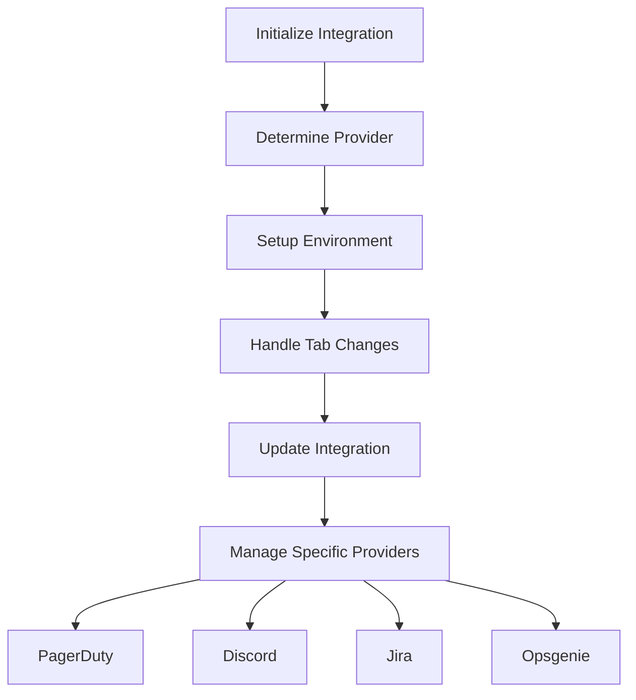

This document will cover the ConfigureIntegration function, which includes:

1. Initializing and managing integration providers
2. Handling tab changes
3. Updating integrations
4. Managing specific provider configurations.

Technical document: <SwmLink doc-title="Overview of ConfigureIntegration Function">[Overview of ConfigureIntegration Function](/.swm/overview-of-configureintegration-function.v9gmkwh0.sw.md)</SwmLink>

# [Initializing and Managing Integration Providers](https://app.swimm.io/repos/Z2l0aHViJTNBJTNBc2VudHJ5LWRlbW8tMSUzQSUzQVN3aW1tLURlbW8=/docs/v9gmkwh0#configuring-integration)

The ConfigureIntegration function is responsible for initializing various hooks and constants that are essential for making API requests, managing query states, and accessing organization-specific data. This setup ensures that the integration process has all the necessary tools and data to function correctly.

# [Determining the Provider](https://app.swimm.io/repos/Z2l0aHViJTNBJTNBc2VudHJ5LWRlbW8tMSUzQSUzQVN3aW1tLURlbW8=/docs/v9gmkwh0#configuring-integration)

The function determines which integration provider is being configured by matching the provider key from the configuration providers. This step is crucial for identifying the specific integration provider and setting up the appropriate environment for it.

# [Handling Tab Changes](https://app.swimm.io/repos/Z2l0aHViJTNBJTNBc2VudHJ5LWRlbW8tMSUzQSUzQVN3aW1tLURlbW8=/docs/v9gmkwh0#configuring-integration)

When users switch tabs, the onTabChange function updates the router's path and query parameters. This ensures that the correct tab content is displayed, providing a seamless user experience as they navigate through different sections of the integration settings.

# [Updating Integrations](https://app.swimm.io/repos/Z2l0aHViJTNBJTNBc2VudHJ5LWRlbW8tMSUzQSUzQVN3aW1tLURlbW8=/docs/v9gmkwh0#configuring-integration)

The onUpdateIntegration function handles the process of updating the integration by removing and refetching plugins. This ensures that the latest plugin data is available, keeping the integration up-to-date with any changes or new features.

# [Managing Specific Provider Configurations](https://app.swimm.io/repos/Z2l0aHViJTNBJTNBc2VudHJ5LWRlbW8tMSUzQSUzQVN3aW1tLURlbW8=/docs/v9gmkwh0#handling-pagerduty-integration)

For specific providers like PagerDuty, Discord, Jira, and Opsgenie, the function includes special handling to manage their unique integration requirements. For example, the function returns an AddIntegration component for PagerDuty, a LinkButton for Discord, and a Confirm component for Jira and Opsgenie to handle migrations and setup new services.

# [Handling PagerDuty Integration](https://app.swimm.io/repos/Z2l0aHViJTNBJTNBc2VudHJ5LWRlbW8tMSUzQSUzQVN3aW1tLURlbW8=/docs/v9gmkwh0#handling-pagerduty-integration)

When the provider key is 'pagerduty', the function returns an AddIntegration component. This component is responsible for adding the PagerDuty integration to the organization. It includes a button labeled 'Add Services' that triggers the integration process when clicked.

# [Handling Discord Integration](https://app.swimm.io/repos/Z2l0aHViJTNBJTNBc2VudHJ5LWRlbW8tMSUzQSUzQVN3aW1tLURlbW8=/docs/v9gmkwh0#handling-discord-integration)

For the 'discord' provider, the function returns a LinkButton that opens the Discord server in the Discord app. The button is labeled 'Open in Discord' and uses the integration.externalId to generate the appropriate URL.

# [Handling Jira Plugin Migration](https://app.swimm.io/repos/Z2l0aHViJTNBJTNBc2VudHJ5LWRlbW8tMSUzQSUzQVN3aW1tLURlbW8=/docs/v9gmkwh0#handling-jira-plugin-migration)

If the provider key is 'jira' or 'jira_server' and a Jira plugin is found, the function returns a Confirm component. This component prompts the user to migrate linked issues from Jira plugins to the new integration. Upon confirmation, the handleJiraMigration function is called to perform the migration.

# [Handling Opsgenie Plugin Migration](https://app.swimm.io/repos/Z2l0aHViJTNBJTNBc2VudHJ5LWRlbW8tMSUzQSUzQVN3aW1tLURlbW8=/docs/v9gmkwh0#handling-opsgenie-plugin-migration)

For the 'opsgenie' provider, if an Opsgenie plugin is installed, the function returns a Confirm component. This component prompts the user to migrate API keys and alert rules from Opsgenie plugins to the new integration. Upon confirmation, the handleOpsgenieMigration function is called to perform the migration.

&nbsp;

*This is an auto-generated document by Swimm AI 🌊 and has not yet been verified by a human*

<SwmMeta version="3.0.0" repo-id="Z2l0aHViJTNBJTNBc2VudHJ5LWRlbW8tMSUzQSUzQVN3aW1tLURlbW8=" repo-name="sentry-demo-1" doc-type="product-flows">Powered by [Swimm](/)</SwmMeta>
