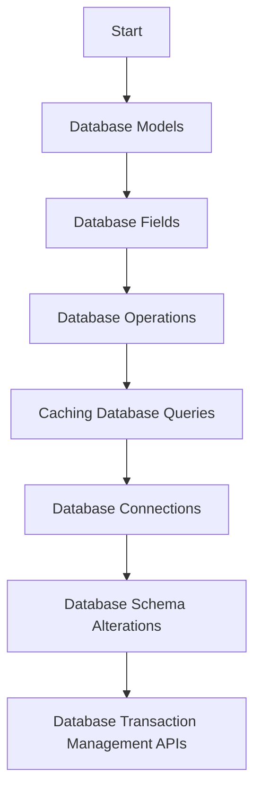

# Database Models

Database models are defined using the <SwmToken path="src/sentry/db/models/manager/base.py" pos="13:2:6" line-data="from django.db.models import Model">`django.db.models`</SwmToken> module. These models represent the structure of the database tables and are used to create, read, update, and delete records in the database.

# Database Fields

The <SwmToken path="src/sentry/db/models/fields/text.py" pos="24:3:3" line-data="    def db_type(self, connection: BaseDatabaseWrapper) -&gt; str:">`db_type`</SwmToken> function in the <SwmToken path="src/sentry/db/models/fields/text.py" pos="23:2:2" line-data="class TextType:">`TextType`</SwmToken> class specifies the database type for a text field, returning 'text'.

<SwmSnippet path="/src/sentry/db/models/fields/text.py" line="23">

---

The <SwmToken path="src/sentry/db/models/fields/text.py" pos="24:3:3" line-data="    def db_type(self, connection: BaseDatabaseWrapper) -&gt; str:">`db_type`</SwmToken> function in the <SwmToken path="src/sentry/db/models/fields/text.py" pos="23:2:2" line-data="class TextType:">`TextType`</SwmToken> class specifies the database type for a text field, returning 'text'.

```python
class TextType:
    def db_type(self, connection: BaseDatabaseWrapper) -> str:
        return "text"
```

---

</SwmSnippet>

# Database Operations

The `allow_migrate` function determines if a migration operation is allowed on a specific database, ensuring that migrations are applied correctly.

# Caching Database Queries

The <SwmToken path="src/sentry/db/models/manager/base.py" pos="363:3:3" line-data="    def get_many_from_cache(self, values: Collection[str | int], key: str = &quot;pk&quot;) -&gt; Sequence[Any]:">`get_many_from_cache`</SwmToken> function is a wrapper around <SwmToken path="src/sentry/db/models/manager/base.py" pos="365:6:8" line-data="        Wrapper around `QuerySet.filter(pk__in=values)` which supports caching of">`QuerySet.filter`</SwmToken> that supports caching of intermediate values, improving query performance.

<SwmSnippet path="/src/sentry/db/models/manager/base.py" line="363">

---

The <SwmToken path="src/sentry/db/models/manager/base.py" pos="363:3:3" line-data="    def get_many_from_cache(self, values: Collection[str | int], key: str = &quot;pk&quot;) -&gt; Sequence[Any]:">`get_many_from_cache`</SwmToken> function is a wrapper around <SwmToken path="src/sentry/db/models/manager/base.py" pos="365:6:8" line-data="        Wrapper around `QuerySet.filter(pk__in=values)` which supports caching of">`QuerySet.filter`</SwmToken> that supports caching of intermediate values, improving query performance.

```python
    def get_many_from_cache(self, values: Collection[str | int], key: str = "pk") -> Sequence[Any]:
        """
        Wrapper around `QuerySet.filter(pk__in=values)` which supports caching of
        the intermediate value.  Callee is responsible for making sure the
        cache key is cleared on save.

        NOTE: We can only query by primary key or some other unique identifier.
        It is not possible to e.g. run `Project.objects.get_many_from_cache([1,
        2, 3], key="organization_id")` and get back all projects belonging to
        those orgs. The length of the return value is bounded by the length of
        `values`.

        For most models, if one attempts to use a non-PK value this will just
        degrade to a DB query, like with `get_from_cache`.
        """
```

---

</SwmSnippet>

# Database Connections

The <SwmToken path="src/sentry/db/postgres/base.py" pos="69:3:3" line-data="    def __init__(self, db, cursor):">`__init__`</SwmToken> function in the database connection class initializes the database connection and cursor, providing a way to execute SQL commands.

<SwmSnippet path="/src/sentry/db/postgres/base.py" line="67">

---

The <SwmToken path="src/sentry/db/postgres/base.py" pos="69:3:3" line-data="    def __init__(self, db, cursor):">`__init__`</SwmToken> function in the database connection class initializes the database connection and cursor, providing a way to execute SQL commands.

```python
    """

    def __init__(self, db, cursor):
        self.db = db
        self.cursor = cursor
```

---

</SwmSnippet>

# Database Schema Alterations

The <SwmToken path="src/sentry/db/postgres/schema.py" pos="72:3:3" line-data="    def alter_db_table(self, model, old_db_table, new_db_table):">`alter_db_table`</SwmToken> function raises an exception when attempting to rename a table, as this operation is considered unsafe.

<SwmSnippet path="/src/sentry/db/postgres/schema.py" line="72">

---

The <SwmToken path="src/sentry/db/postgres/schema.py" pos="72:3:3" line-data="    def alter_db_table(self, model, old_db_table, new_db_table):">`alter_db_table`</SwmToken> function raises an exception when attempting to rename a table, as this operation is considered unsafe.

```python
    def alter_db_table(self, model, old_db_table, new_db_table):
        """
        This didn't work correctly in  django_zero_downtime_migrations, so implementing here. This
        method is only used to modify table name, so we just need to raise.
        """
        raise UnsafeOperationException(
            f"Renaming table for model {model.__name__} from {old_db_table} to {new_db_table} is unsafe.\n"
            "More info here: https://develop.sentry.dev/database-migrations/#renaming-tables"
        )
```

---

</SwmSnippet>

# Database Transaction Management APIs

Database Transaction Management APIs ensure that database operations are executed in a controlled and consistent manner.

## <SwmToken path="src/sentry/db/postgres/transactions.py" pos="15:2:2" line-data="def django_test_transaction_water_mark(using: str | None = None):">`django_test_transaction_water_mark`</SwmToken>

The <SwmToken path="src/sentry/db/postgres/transactions.py" pos="15:2:2" line-data="def django_test_transaction_water_mark(using: str | None = None):">`django_test_transaction_water_mark`</SwmToken> function is a context manager used to simulate <SwmToken path="src/sentry/db/postgres/transactions.py" pos="17:15:17" line-data="    Hybrid cloud outbox flushing depends heavily on transaction.on_commit logic, but our tests do not follow">`transaction.on_commit`</SwmToken> semantics in tests. It ensures that inter-transaction work behaves correctly in a test environment by managing transaction watermarks.

<SwmSnippet path="/src/sentry/db/postgres/transactions.py" line="14">

---

The <SwmToken path="src/sentry/db/postgres/transactions.py" pos="15:2:2" line-data="def django_test_transaction_water_mark(using: str | None = None):">`django_test_transaction_water_mark`</SwmToken> function is a context manager used to simulate <SwmToken path="src/sentry/db/postgres/transactions.py" pos="17:15:17" line-data="    Hybrid cloud outbox flushing depends heavily on transaction.on_commit logic, but our tests do not follow">`transaction.on_commit`</SwmToken> semantics in tests. It ensures that inter-transaction work behaves correctly in a test environment by managing transaction watermarks.

```python
@contextlib.contextmanager
def django_test_transaction_water_mark(using: str | None = None):
    """
    Hybrid cloud outbox flushing depends heavily on transaction.on_commit logic, but our tests do not follow
    production in terms of isolation (TestCase uses two outer transactions, and stubbed RPCs cannot simulate
    transactional isolation without breaking other test case assumptions).  Therefore, in order to correctly
    simulate transaction.on_commit semantics, use this context in any place where we "simulate" inter transaction
    work that in tests should behave that way.

    This method has no effect in production.
    """
    if not in_test_environment():
        yield
        return

    if using is None:
        with contextlib.ExitStack() as stack:
            for db_name in settings.DATABASES:
                stack.enter_context(django_test_transaction_water_mark(db_name))
            yield
        return
```

---

</SwmSnippet>

## <SwmToken path="src/sentry/db/postgres/transactions.py" pos="107:2:2" line-data="def enforce_constraints(transaction: Atomic):">`enforce_constraints`</SwmToken>

The <SwmToken path="src/sentry/db/postgres/transactions.py" pos="107:2:2" line-data="def enforce_constraints(transaction: Atomic):">`enforce_constraints`</SwmToken> function is a context manager that forces constraints to be checked at the end of a transaction or savepoint, even if nested. This ensures that <SwmToken path="src/sentry/db/postgres/transactions.py" pos="109:24:24" line-data="    Nested transaction in Django do not check constraints by default, meaning IntegrityErrors can &#39;float&#39; to callers">`IntegrityErrors`</SwmToken> are handled correctly within nested transactions.

<SwmSnippet path="/src/sentry/db/postgres/transactions.py" line="106">

---

The <SwmToken path="src/sentry/db/postgres/transactions.py" pos="107:2:2" line-data="def enforce_constraints(transaction: Atomic):">`enforce_constraints`</SwmToken> function is a context manager that forces constraints to be checked at the end of a transaction or savepoint, even if nested. This ensures that <SwmToken path="src/sentry/db/postgres/transactions.py" pos="109:24:24" line-data="    Nested transaction in Django do not check constraints by default, meaning IntegrityErrors can &#39;float&#39; to callers">`IntegrityErrors`</SwmToken> are handled correctly within nested transactions.

```python
@contextlib.contextmanager
def enforce_constraints(transaction: Atomic):
    """
    Nested transaction in Django do not check constraints by default, meaning IntegrityErrors can 'float' to callers
    of functions that happen to wrap with additional transaction scopes.  Using this context manager around a transaction
    will force constraints to be checked at the end of that transaction (or savepoint) even if it happens to be nested,
    allowing you to handle the IntegrityError correctly.
    """
    with transaction:
        yield
        get_connection(transaction.using or "default").check_constraints()
```

---

</SwmSnippet>

&nbsp;

*This is an auto-generated document by Swimm AI 🌊 and has not yet been verified by a human*

<SwmMeta version="3.0.0" repo-id="Z2l0aHViJTNBJTNBc2VudHJ5LWRlbW8tMSUzQSUzQVN3aW1tLURlbW8=" repo-name="sentry-demo-1" doc-type="overview"><sup>Powered by [Swimm](/)</sup></SwmMeta>
