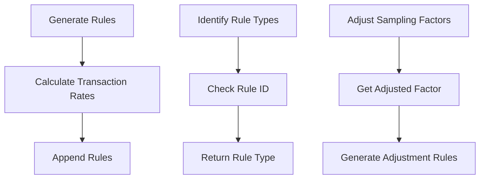

# Overview of Dynamic Sampling Rules

Dynamic sampling rules are used to define specific conditions and actions for sampling events in Sentry. These rules help determine which events should be sampled and at what rate. By using combinators, rules can be combined to create complex sampling strategies.

<SwmSnippet path="/src/sentry/dynamic_sampling/rules/biases/boost_low_volume_transactions_bias.py" line="10">

---

The <SwmToken path="src/sentry/dynamic_sampling/rules/biases/boost_low_volume_transactions_bias.py" pos="10:3:3" line-data="    def generate_rules(self, project: Project, base_sample_rate: float) -&gt; list[PolymorphicRule]:">`generate_rules`</SwmToken> function calculates transaction rates and appends rules to the return value based on these rates. It ensures that rules are only generated if there are transactions to sample and a base sample rate is provided.

```python
    def generate_rules(self, project: Project, base_sample_rate: float) -> list[PolymorphicRule]:
        proj_id = project.id
        org_id = project.organization.id

        transaction_map, base_implicit_rate = get_transactions_resampling_rates(
            org_id=org_id, proj_id=proj_id, default_rate=base_sample_rate
        )

        ret_val: list[Rule] = []

        if len(transaction_map) == 0:
            return ret_val  # no point returning any rules the project rule should take over

        if base_sample_rate == 0:
            return ret_val  # we can't deal without a base_sample_rate

        if base_implicit_rate == 0.0:
            base_implicit_rate = 1.0

        # The implicit rate that we compute is transformed to a factor, so that when the rate is multiplied by the last
        # sample rate rule, the value will be `base_implicit_rate`.
```

---

</SwmSnippet>

# Identifying Rule Types

The <SwmToken path="src/sentry/dynamic_sampling/rules/utils.py" pos="114:2:2" line-data="def get_rule_type(rule: Rule) -&gt; RuleType | None:">`get_rule_type`</SwmToken> function identifies the type of rule based on its ID. It checks if the rule ID falls within specific bounds and returns the corresponding rule type.

<SwmSnippet path="/src/sentry/dynamic_sampling/rules/utils.py" line="114">

---

The <SwmToken path="src/sentry/dynamic_sampling/rules/utils.py" pos="114:2:2" line-data="def get_rule_type(rule: Rule) -&gt; RuleType | None:">`get_rule_type`</SwmToken> function checks if the rule ID falls within specific bounds and returns the corresponding rule type. This helps in categorizing rules for better management.

```python
def get_rule_type(rule: Rule) -> RuleType | None:
    # Edge case handled naively in which we check if the ID is within the possible bounds. This is done because the
    # latest release rules have ids from 1500 to 1500 + (limit - 1). For example if the limit is 2, we will only have
    # ids: 1500, 1501.
    #
    # This implementation MUST be changed in case we change the logic of rule ids.
    if (
        RESERVED_IDS[RuleType.BOOST_LATEST_RELEASES_RULE]
        <= rule["id"]
        < RESERVED_IDS[RuleType.BOOST_LATEST_RELEASES_RULE] + BOOSTED_RELEASES_LIMIT
    ):
        return RuleType.BOOST_LATEST_RELEASES_RULE
    elif (
        RESERVED_IDS[RuleType.BOOST_LOW_VOLUME_TRANSACTIONS_RULE]
        <= rule["id"]
        < RESERVED_IDS[RuleType.BOOST_LATEST_RELEASES_RULE]
    ):
        return RuleType.BOOST_LOW_VOLUME_TRANSACTIONS_RULE

    return REVERSE_RESERVED_IDS.get(rule["id"], None)
```

---

</SwmSnippet>

# Adjusting Sampling Factors

The <SwmToken path="src/sentry/dynamic_sampling/rules/biases/recalibration_bias.py" pos="7:2:2" line-data="class RecalibrationBias(Bias):">`RecalibrationBias`</SwmToken> class generates rules to adjust the overall sampling rate for an organization. It uses the <SwmToken path="src/sentry/dynamic_sampling/rules/biases/recalibration_bias.py" pos="20:5:5" line-data="        adjusted_factor = get_adjusted_factor(project.organization.id)">`get_adjusted_factor`</SwmToken> function to determine the necessary adjustment.

<SwmSnippet path="/src/sentry/dynamic_sampling/rules/biases/recalibration_bias.py" line="7">

---

The <SwmToken path="src/sentry/dynamic_sampling/rules/biases/recalibration_bias.py" pos="7:2:2" line-data="class RecalibrationBias(Bias):">`RecalibrationBias`</SwmToken> class generates rules to adjust the overall sampling rate for an organization. It ensures that the overall sampling rate aligns with the desired rate by using the <SwmToken path="src/sentry/dynamic_sampling/rules/biases/recalibration_bias.py" pos="20:5:5" line-data="        adjusted_factor = get_adjusted_factor(project.organization.id)">`get_adjusted_factor`</SwmToken> function.

```python
class RecalibrationBias(Bias):
    """
    Correction bias that tries to bring the overall sampling rate for the organisation to the
    desired sampling rate.

    Various biases boost and shrink different transactions in order to obtain an appropriate
    number of samples from all areas of the application, doing this changes the overall sampling
    rate from the desired sampling rate, this bias tries to rectify the overall organisation sampling
    rate and bring it to the desired sampling rate,it uses the previous interval rate to figure out
    how this should be done.
    """

    def generate_rules(self, project: Project, base_sample_rate: float) -> list[PolymorphicRule]:
        adjusted_factor = get_adjusted_factor(project.organization.id)
        # We don't want to generate any rule in case the factor is 1.0 since we should multiply the factor and 1.0
        # is the identity of the multiplication.
        if adjusted_factor == 1.0:
            return []

        return [
            {
```

---

</SwmSnippet>

&nbsp;

*This is an auto-generated document by Swimm AI 🌊 and has not yet been verified by a human*

<SwmMeta version="3.0.0" repo-id="Z2l0aHViJTNBJTNBc2VudHJ5LWRlbW8tMSUzQSUzQVN3aW1tLURlbW8=" repo-name="sentry-demo-1" doc-type="overview"><sup>Powered by [Swimm](/)</sup></SwmMeta>
