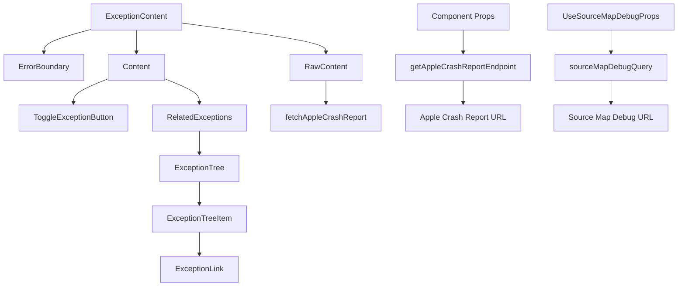

# Introduction to Exception in Crash Content

Exception refers to an error or unexpected event that occurs during the execution of a program. In the crash content, exceptions are captured and displayed to help developers understand what went wrong.

# <SwmToken path="static/app/components/events/interfaces/crashContent/exception/index.tsx" pos="22:4:4" line-data="export function ExceptionContent({">`ExceptionContent`</SwmToken> Component

The <SwmToken path="static/app/components/events/interfaces/crashContent/exception/index.tsx" pos="22:4:4" line-data="export function ExceptionContent({">`ExceptionContent`</SwmToken> component is responsible for rendering the details of an exception. It uses an <SwmToken path="static/app/components/events/interfaces/crashContent/exception/content.tsx" pos="5:2:2" line-data="import ErrorBoundary from &#39;sentry/components/errorBoundary&#39;;">`ErrorBoundary`</SwmToken> to catch any errors that occur during rendering and display either raw or formatted content based on the <SwmToken path="static/app/components/events/interfaces/crashContent/exception/content.tsx" pos="125:1:1" line-data="  stackView,">`stackView`</SwmToken> property.

# <SwmToken path="static/app/components/events/interfaces/crashContent/exception/relatedExceptions.tsx" pos="147:4:4" line-data="export function RelatedExceptions({">`RelatedExceptions`</SwmToken> Component

The <SwmToken path="static/app/components/events/interfaces/crashContent/exception/relatedExceptions.tsx" pos="147:4:4" line-data="export function RelatedExceptions({">`RelatedExceptions`</SwmToken> component displays a tree structure of related exceptions, allowing developers to see the hierarchy and relationships between different exceptions. It uses various props to manage the display order and handle user interactions.

<SwmSnippet path="/static/app/components/events/interfaces/crashContent/exception/relatedExceptions.tsx" line="147">

---

The <SwmToken path="static/app/components/events/interfaces/crashContent/exception/relatedExceptions.tsx" pos="147:4:4" line-data="export function RelatedExceptions({">`RelatedExceptions`</SwmToken> component finds and displays parent, current, and child exceptions based on the <SwmToken path="static/app/components/events/interfaces/crashContent/exception/relatedExceptions.tsx" pos="149:1:1" line-data="  mechanism,">`mechanism`</SwmToken> prop.

```tsx
export function RelatedExceptions({
  allExceptions,
  mechanism,
  newestFirst,
  onExceptionClick,
}: ExceptionGroupContextProps) {
  if (!mechanism || !mechanism.is_exception_group) {
    return null;
  }

  const parentException = allExceptions.find(
    exc => exc.mechanism?.exception_id === mechanism.parent_id
  );
  const exception = allExceptions.find(
    exc => exc.mechanism?.exception_id === mechanism.exception_id
  );
  const childExceptions = allExceptions.filter(
    exc => exc.mechanism?.parent_id === mechanism.exception_id
  );

  if (newestFirst) {
```

---

</SwmSnippet>

<SwmSnippet path="/static/app/components/events/interfaces/crashContent/exception/content.tsx" line="122">

---

The <SwmToken path="static/app/components/events/interfaces/crashContent/exception/content.tsx" pos="122:4:4" line-data="export function Content({">`Content`</SwmToken> component uses hooks like <SwmToken path="static/app/components/events/interfaces/crashContent/exception/content.tsx" pos="134:1:1" line-data="    useCollapsedExceptions(values);">`useCollapsedExceptions`</SwmToken> and <SwmToken path="static/app/components/events/interfaces/crashContent/exception/content.tsx" pos="136:7:7" line-data="  const sourceMapDebuggerData = useSourceMapDebuggerData(event, projectSlug);">`useSourceMapDebuggerData`</SwmToken> to manage the state and data for rendering exception details.

```tsx
export function Content({
  newestFirst,
  event,
  stackView,
  groupingCurrentLevel,
  projectSlug,
  values,
  type,
  meta,
  threadId,
}: Props) {
  const {collapsedExceptions, toggleException, expandException} =
    useCollapsedExceptions(values);

  const sourceMapDebuggerData = useSourceMapDebuggerData(event, projectSlug);

  const isSampleError = useIsSampleEvent();

  // Organization context may be unavailable for the shared event view, so we
  // avoid using the `useOrganization` hook here and directly useContext
  // instead.
```

---

</SwmSnippet>

# <SwmToken path="static/app/components/events/interfaces/crashContent/exception/index.tsx" pos="36:2:2" line-data="        &lt;RawContent">`RawContent`</SwmToken> Component

The <SwmToken path="static/app/components/events/interfaces/crashContent/exception/index.tsx" pos="36:2:2" line-data="        &lt;RawContent">`RawContent`</SwmToken> component fetches and displays raw crash reports, particularly for native exceptions. It updates the crash report when the component mounts or when the exception type changes.

<SwmSnippet path="/static/app/components/events/interfaces/crashContent/exception/index.tsx" line="36">

---

The <SwmToken path="static/app/components/events/interfaces/crashContent/exception/index.tsx" pos="36:2:2" line-data="        &lt;RawContent">`RawContent`</SwmToken> component is used within <SwmToken path="static/app/components/events/interfaces/crashContent/exception/index.tsx" pos="22:4:4" line-data="export function ExceptionContent({">`ExceptionContent`</SwmToken> to display raw crash reports based on the <SwmToken path="static/app/components/events/interfaces/crashContent/exception/index.tsx" pos="39:4:4" line-data="          type={stackType}">`stackType`</SwmToken> and other props.

```tsx
        <RawContent
          eventId={event.id}
          projectSlug={projectSlug}
          type={stackType}
          values={values}
          platform={event.platform}
        />
```

---

</SwmSnippet>

# Exception Endpoints

Exception endpoints are used to fetch specific data related to exceptions, such as crash reports and source map debugging information.

## <SwmToken path="static/app/components/events/interfaces/crashContent/exception/rawContent.tsx" pos="60:1:1" line-data="  getAppleCrashReportEndpoint(organization: Organization) {">`getAppleCrashReportEndpoint`</SwmToken>

The <SwmToken path="static/app/components/events/interfaces/crashContent/exception/rawContent.tsx" pos="60:1:1" line-data="  getAppleCrashReportEndpoint(organization: Organization) {">`getAppleCrashReportEndpoint`</SwmToken> function constructs the endpoint URL for fetching Apple crash reports. It uses the organization slug, project slug, and event ID from the component's props to build the URL.

<SwmSnippet path="/static/app/components/events/interfaces/crashContent/exception/rawContent.tsx" line="60">

---

The <SwmToken path="static/app/components/events/interfaces/crashContent/exception/rawContent.tsx" pos="60:1:1" line-data="  getAppleCrashReportEndpoint(organization: Organization) {">`getAppleCrashReportEndpoint`</SwmToken> function builds the URL for fetching Apple crash reports based on the provided props.

```tsx
  getAppleCrashReportEndpoint(organization: Organization) {
    const {type, projectSlug, eventId} = this.props;

    const minified = type === 'minified';
    return `/projects/${organization.slug}/${projectSlug}/events/${eventId}/apple-crash-report?minified=${minified}`;
  }
```

---

</SwmSnippet>

## <SwmToken path="static/app/components/events/interfaces/crashContent/exception/useSourceMapDebug.tsx" pos="75:2:2" line-data="const sourceMapDebugQuery = ({">`sourceMapDebugQuery`</SwmToken>

The <SwmToken path="static/app/components/events/interfaces/crashContent/exception/useSourceMapDebug.tsx" pos="75:2:2" line-data="const sourceMapDebugQuery = ({">`sourceMapDebugQuery`</SwmToken> function constructs the endpoint URL for debugging source maps. It takes various properties such as organization slug, project slug, event ID, frame index, and exception index to build the query parameters for the URL.

<SwmSnippet path="/static/app/components/events/interfaces/crashContent/exception/useSourceMapDebug.tsx" line="75">

---

The <SwmToken path="static/app/components/events/interfaces/crashContent/exception/useSourceMapDebug.tsx" pos="75:2:2" line-data="const sourceMapDebugQuery = ({">`sourceMapDebugQuery`</SwmToken> function builds the URL for source map debugging based on the provided properties.

```tsx
const sourceMapDebugQuery = ({
  orgSlug,
  projectSlug,
  eventId,
  frameIdx,
  exceptionIdx,
}: UseSourceMapDebugProps): ApiQueryKey => [
  `/projects/${orgSlug}/${projectSlug}/events/${eventId}/source-map-debug/`,
  {
    query: {
      frame_idx: `${frameIdx}`,
      exception_idx: `${exceptionIdx}`,
    },
  },
];
```

---

</SwmSnippet>

&nbsp;

*This is an auto-generated document by Swimm AI 🌊 and has not yet been verified by a human*

<SwmMeta version="3.0.0" repo-id="Z2l0aHViJTNBJTNBc2VudHJ5LWRlbW8tMSUzQSUzQVN3aW1tLURlbW8=" repo-name="sentry-demo-1" doc-type="overview"><sup>Powered by [Swimm](/)</sup></SwmMeta>
