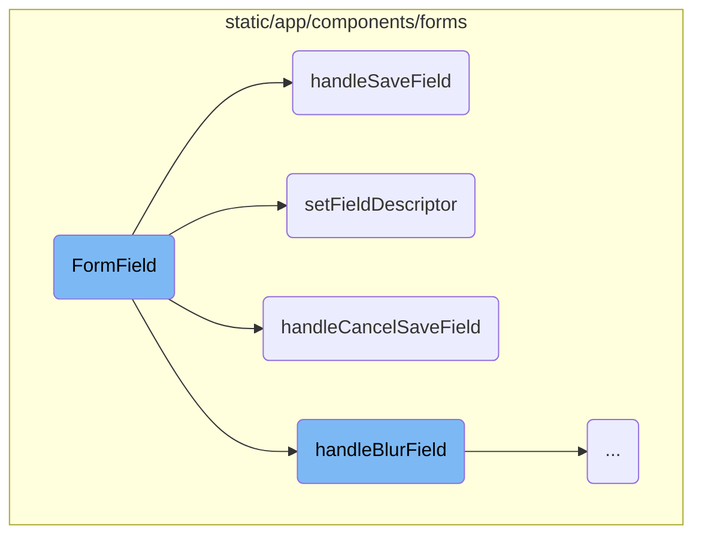

```mermaid
graph TD;
      subgraph static/app/components/forms/model.tsx
bfde69f343527f4838e200e75dcac85ea19606b5a167591399c7b99ac186ebaf(handleBlurField):::mainFlowStyle --> f015bfd80a6964fe55eee359e898e335f0166863e2e94994673e2c9a07f06224(saveField):::mainFlowStyle
end

subgraph static/app/components/forms/model.tsx
f015bfd80a6964fe55eee359e898e335f0166863e2e94994673e2c9a07f06224(saveField):::mainFlowStyle --> a161d996767be936bd7376ea542aa0393b5ce34c789be88d7139ddd99f81d533(saveFieldRequest):::mainFlowStyle
end

subgraph static/app/components/forms/model.tsx
a161d996767be936bd7376ea542aa0393b5ce34c789be88d7139ddd99f81d533(saveFieldRequest):::mainFlowStyle --> 3d43b573114e63fa56fa8da62c1d5427b12527ba9a0494eb33857fdf4737371a(doApiRequest)
end

subgraph static/app/components/forms/model.tsx
a161d996767be936bd7376ea542aa0393b5ce34c789be88d7139ddd99f81d533(saveFieldRequest):::mainFlowStyle --> 6658ff8720d856419e5c61d79ccb331bb96e3ebef7a1b1ae38b24192f3d2fb0a(error)
end

subgraph static/app/components/forms/model.tsx
a161d996767be936bd7376ea542aa0393b5ce34c789be88d7139ddd99f81d533(saveFieldRequest):::mainFlowStyle --> 5365dff7094791699b966b10508444bab15bcb9a4999d2e3b2d73230ca95c6ec(setValue):::mainFlowStyle
end

subgraph static/app/components/forms/model.tsx
5365dff7094791699b966b10508444bab15bcb9a4999d2e3b2d73230ca95c6ec(setValue):::mainFlowStyle --> 2jwze(...)
end


      classDef mainFlowStyle color:#000000,fill:#7CB9F4
classDef rootsStyle color:#000000,fill:#00FFF4
classDef Style1 color:#000000,fill:#00FFAA
classDef Style2 color:#000000,fill:#FFFF00
classDef Style3 color:#000000,fill:#AA7CB9

%% Swimm:
%% graph TD;
%%       subgraph <SwmPath>[static/app/components/forms/model.tsx](static/app/components/forms/model.tsx)</SwmPath>
%% bfde69f343527f4838e200e75dcac85ea19606b5a167591399c7b99ac186ebaf(handleBlurField):::mainFlowStyle --> f015bfd80a6964fe55eee359e898e335f0166863e2e94994673e2c9a07f06224(saveField):::mainFlowStyle
%% end
%% 
%% subgraph <SwmPath>[static/app/components/forms/model.tsx](static/app/components/forms/model.tsx)</SwmPath>
%% f015bfd80a6964fe55eee359e898e335f0166863e2e94994673e2c9a07f06224(saveField):::mainFlowStyle --> a161d996767be936bd7376ea542aa0393b5ce34c789be88d7139ddd99f81d533(saveFieldRequest):::mainFlowStyle
%% end
%% 
%% subgraph <SwmPath>[static/app/components/forms/model.tsx](static/app/components/forms/model.tsx)</SwmPath>
%% a161d996767be936bd7376ea542aa0393b5ce34c789be88d7139ddd99f81d533(saveFieldRequest):::mainFlowStyle --> 3d43b573114e63fa56fa8da62c1d5427b12527ba9a0494eb33857fdf4737371a(doApiRequest)
%% end
%% 
%% subgraph <SwmPath>[static/app/components/forms/model.tsx](static/app/components/forms/model.tsx)</SwmPath>
%% a161d996767be936bd7376ea542aa0393b5ce34c789be88d7139ddd99f81d533(saveFieldRequest):::mainFlowStyle --> 6658ff8720d856419e5c61d79ccb331bb96e3ebef7a1b1ae38b24192f3d2fb0a(error)
%% end
%% 
%% subgraph <SwmPath>[static/app/components/forms/model.tsx](static/app/components/forms/model.tsx)</SwmPath>
%% a161d996767be936bd7376ea542aa0393b5ce34c789be88d7139ddd99f81d533(saveFieldRequest):::mainFlowStyle --> 5365dff7094791699b966b10508444bab15bcb9a4999d2e3b2d73230ca95c6ec(setValue):::mainFlowStyle
%% end
%% 
%% subgraph <SwmPath>[static/app/components/forms/model.tsx](static/app/components/forms/model.tsx)</SwmPath>
%% 5365dff7094791699b966b10508444bab15bcb9a4999d2e3b2d73230ca95c6ec(setValue):::mainFlowStyle --> 2jwze(...)
%% end
%% 
%% 
%%       classDef mainFlowStyle color:#000000,fill:#7CB9F4
%% classDef rootsStyle color:#000000,fill:#00FFF4
%% classDef Style1 color:#000000,fill:#00FFAA
%% classDef Style2 color:#000000,fill:#FFFF00
%% classDef Style3 color:#000000,fill:#AA7CB9
```

```mermaid
graph TD;
      subgraph static/app/components
5365dff7094791699b966b10508444bab15bcb9a4999d2e3b2d73230ca95c6ec(setValue):::mainFlowStyle --> a341473e82c596df0a888228f5d5bb9e0c73f008155db77fa4ee9694d6d6a5ab(validateField):::mainFlowStyle
end

subgraph static/app/components
a341473e82c596df0a888228f5d5bb9e0c73f008155db77fa4ee9694d6d6a5ab(validateField):::mainFlowStyle --> 2e89079da00a6905ab753c09d597626d2199069f49ee0821eccbcd5f14422ce9(validate):::mainFlowStyle
end

subgraph static/app
2e89079da00a6905ab753c09d597626d2199069f49ee0821eccbcd5f14422ce9(validate):::mainFlowStyle --> 4b2faee236c2e651d9932fa234f72966df49f7aa0f85eb9909d65f4b6d8ce1a6(parse):::mainFlowStyle
end

subgraph static/app
4b2faee236c2e651d9932fa234f72966df49f7aa0f85eb9909d65f4b6d8ce1a6(parse):::mainFlowStyle --> b2b47f6077e96a1ff47606d77c3fe70b18a84edc0ab0fa1349f7face4165d2ea(parseWidget):::mainFlowStyle
end

subgraph static/app
b2b47f6077e96a1ff47606d77c3fe70b18a84edc0ab0fa1349f7face4165d2ea(parseWidget):::mainFlowStyle --> 05bf2ddeab316943d2187e10bc3886949b4b03ae946f68d4f27a5bfc0025e132(mapToMetricsQuery):::mainFlowStyle
end

subgraph static/app
05bf2ddeab316943d2187e10bc3886949b4b03ae946f68d4f27a5bfc0025e132(mapToMetricsQuery):::mainFlowStyle --> 635bb507b11255a8fd7c2375dac3b6c46b736470cf89007061c6861fc973e73b(fetchAvailableTags):::mainFlowStyle
end

subgraph static/app
635bb507b11255a8fd7c2375dac3b6c46b736470cf89007061c6861fc973e73b(fetchAvailableTags):::mainFlowStyle --> 1025c11ff078741e3a52849e4dc81510d630800b045c60aea951683433a1c993(requestPromise):::mainFlowStyle
end

subgraph static/app
1025c11ff078741e3a52849e4dc81510d630800b045c60aea951683433a1c993(requestPromise):::mainFlowStyle --> 4f5a67a71dfb71654db327ed24d5e8187187a49b58963a473eec18ecb0aef026(request):::mainFlowStyle
end


      classDef mainFlowStyle color:#000000,fill:#7CB9F4
classDef rootsStyle color:#000000,fill:#00FFF4
classDef Style1 color:#000000,fill:#00FFAA
classDef Style2 color:#000000,fill:#FFFF00
classDef Style3 color:#000000,fill:#AA7CB9

%% Swimm:
%% graph TD;
%%       subgraph <SwmPath>[static/app/components/](static/app/components/)</SwmPath>
%% 5365dff7094791699b966b10508444bab15bcb9a4999d2e3b2d73230ca95c6ec(setValue):::mainFlowStyle --> a341473e82c596df0a888228f5d5bb9e0c73f008155db77fa4ee9694d6d6a5ab(validateField):::mainFlowStyle
%% end
%% 
%% subgraph <SwmPath>[static/app/components/](static/app/components/)</SwmPath>
%% a341473e82c596df0a888228f5d5bb9e0c73f008155db77fa4ee9694d6d6a5ab(validateField):::mainFlowStyle --> 2e89079da00a6905ab753c09d597626d2199069f49ee0821eccbcd5f14422ce9(validate):::mainFlowStyle
%% end
%% 
%% subgraph <SwmPath>[static/app/](static/app/)</SwmPath>
%% 2e89079da00a6905ab753c09d597626d2199069f49ee0821eccbcd5f14422ce9(validate):::mainFlowStyle --> 4b2faee236c2e651d9932fa234f72966df49f7aa0f85eb9909d65f4b6d8ce1a6(parse):::mainFlowStyle
%% end
%% 
%% subgraph <SwmPath>[static/app/](static/app/)</SwmPath>
%% 4b2faee236c2e651d9932fa234f72966df49f7aa0f85eb9909d65f4b6d8ce1a6(parse):::mainFlowStyle --> b2b47f6077e96a1ff47606d77c3fe70b18a84edc0ab0fa1349f7face4165d2ea(parseWidget):::mainFlowStyle
%% end
%% 
%% subgraph <SwmPath>[static/app/](static/app/)</SwmPath>
%% b2b47f6077e96a1ff47606d77c3fe70b18a84edc0ab0fa1349f7face4165d2ea(parseWidget):::mainFlowStyle --> 05bf2ddeab316943d2187e10bc3886949b4b03ae946f68d4f27a5bfc0025e132(mapToMetricsQuery):::mainFlowStyle
%% end
%% 
%% subgraph <SwmPath>[static/app/](static/app/)</SwmPath>
%% 05bf2ddeab316943d2187e10bc3886949b4b03ae946f68d4f27a5bfc0025e132(mapToMetricsQuery):::mainFlowStyle --> 635bb507b11255a8fd7c2375dac3b6c46b736470cf89007061c6861fc973e73b(fetchAvailableTags):::mainFlowStyle
%% end
%% 
%% subgraph <SwmPath>[static/app/](static/app/)</SwmPath>
%% 635bb507b11255a8fd7c2375dac3b6c46b736470cf89007061c6861fc973e73b(fetchAvailableTags):::mainFlowStyle --> 1025c11ff078741e3a52849e4dc81510d630800b045c60aea951683433a1c993(requestPromise):::mainFlowStyle
%% end
%% 
%% subgraph <SwmPath>[static/app/](static/app/)</SwmPath>
%% 1025c11ff078741e3a52849e4dc81510d630800b045c60aea951683433a1c993(requestPromise):::mainFlowStyle --> 4f5a67a71dfb71654db327ed24d5e8187187a49b58963a473eec18ecb0aef026(request):::mainFlowStyle
%% end
%% 
%% 
%%       classDef mainFlowStyle color:#000000,fill:#7CB9F4
%% classDef rootsStyle color:#000000,fill:#00FFF4
%% classDef Style1 color:#000000,fill:#00FFAA
%% classDef Style2 color:#000000,fill:#FFFF00
%% classDef Style3 color:#000000,fill:#AA7CB9
```

This document provides an overview of the <SwmToken path="static/app/components/forms/formField/index.tsx" pos="191:2:2" line-data="function FormField(props: FormFieldProps) {">`FormField`</SwmToken> component, which is responsible for managing individual form fields within a form. It covers the initialization of the form field, handling changes, blur events, saving, and canceling save operations.

The <SwmToken path="static/app/components/forms/formField/index.tsx" pos="191:2:2" line-data="function FormField(props: FormFieldProps) {">`FormField`</SwmToken> component is used to manage individual fields in a form. When a form field is initialized, it sets up references, context, and state. When a user changes the value of a field, the <SwmToken path="static/app/components/forms/formField/index.tsx" pos="231:3:3" line-data="  const handleChange = useCallback(">`handleChange`</SwmToken> function updates the form model with the new value. If the field loses focus, the <SwmToken path="static/app/components/forms/formField/index.tsx" pos="243:3:3" line-data="  const handleBlur = useCallback(">`handleBlur`</SwmToken> function notifies the form model. If the field needs to be saved, the <SwmToken path="static/app/components/forms/formField/index.tsx" pos="273:3:3" line-data="  const handleSaveField = useCallback(">`handleSaveField`</SwmToken> function triggers the save operation. If the user cancels the save, the <SwmToken path="static/app/components/forms/model.tsx" pos="721:1:1" line-data="  handleCancelSaveField(id: string) {">`handleCancelSaveField`</SwmToken> function reverts the field value to its initial state.

Here is a high level diagram of the flow, showing only the most important functions:

```mermaid
graph TD;
      subgraph static/app/components/forms
b550232029b263549b29895a0aa92834643ae269afb42404ac6a2b1186edf2db(FormField):::mainFlowStyle --> 215561e5c1b8b46d3147af7af117697e9393e5d731336243ca245bc6ac98c642(handleSaveField)
end

subgraph static/app/components/forms
b550232029b263549b29895a0aa92834643ae269afb42404ac6a2b1186edf2db(FormField):::mainFlowStyle --> bfc62def200d022f0638ec6b347db909d14730b3ae0f41bed3eea1860f5f6d35(setFieldDescriptor)
end

subgraph static/app/components/forms
b550232029b263549b29895a0aa92834643ae269afb42404ac6a2b1186edf2db(FormField):::mainFlowStyle --> baa5a834efc2c4c638bc95f998249610bb6ef3a5d0bc06d41a7c9d799e26ae31(handleCancelSaveField)
end

subgraph static/app/components/forms
b550232029b263549b29895a0aa92834643ae269afb42404ac6a2b1186edf2db(FormField):::mainFlowStyle --> bfde69f343527f4838e200e75dcac85ea19606b5a167591399c7b99ac186ebaf(handleBlurField):::mainFlowStyle
end

subgraph static/app/components/forms
bfde69f343527f4838e200e75dcac85ea19606b5a167591399c7b99ac186ebaf(handleBlurField):::mainFlowStyle --> f015bfd80a6964fe55eee359e898e335f0166863e2e94994673e2c9a07f06224(saveField):::mainFlowStyle
end

subgraph static/app/components/forms
f015bfd80a6964fe55eee359e898e335f0166863e2e94994673e2c9a07f06224(saveField):::mainFlowStyle --> a161d996767be936bd7376ea542aa0393b5ce34c789be88d7139ddd99f81d533(saveFieldRequest):::mainFlowStyle
end

subgraph static/app/components/forms
a161d996767be936bd7376ea542aa0393b5ce34c789be88d7139ddd99f81d533(saveFieldRequest):::mainFlowStyle --> 3d43b573114e63fa56fa8da62c1d5427b12527ba9a0494eb33857fdf4737371a(doApiRequest)
end

subgraph static/app/components/forms
a161d996767be936bd7376ea542aa0393b5ce34c789be88d7139ddd99f81d533(saveFieldRequest):::mainFlowStyle --> 6658ff8720d856419e5c61d79ccb331bb96e3ebef7a1b1ae38b24192f3d2fb0a(error)
end

subgraph static/app/components/forms
a161d996767be936bd7376ea542aa0393b5ce34c789be88d7139ddd99f81d533(saveFieldRequest):::mainFlowStyle --> 5365dff7094791699b966b10508444bab15bcb9a4999d2e3b2d73230ca95c6ec(setValue):::mainFlowStyle
end

subgraph static/app/components/forms
5365dff7094791699b966b10508444bab15bcb9a4999d2e3b2d73230ca95c6ec(setValue):::mainFlowStyle --> a341473e82c596df0a888228f5d5bb9e0c73f008155db77fa4ee9694d6d6a5ab(validateField):::mainFlowStyle
end

subgraph static/app/components/events/highlights/highlightsSettingsForm.tsx
a341473e82c596df0a888228f5d5bb9e0c73f008155db77fa4ee9694d6d6a5ab(validateField):::mainFlowStyle --> 2e89079da00a6905ab753c09d597626d2199069f49ee0821eccbcd5f14422ce9(validate):::mainFlowStyle
end

subgraph static/app
2e89079da00a6905ab753c09d597626d2199069f49ee0821eccbcd5f14422ce9(validate):::mainFlowStyle --> 4b2faee236c2e651d9932fa234f72966df49f7aa0f85eb9909d65f4b6d8ce1a6(parse):::mainFlowStyle
end

subgraph static/app
4b2faee236c2e651d9932fa234f72966df49f7aa0f85eb9909d65f4b6d8ce1a6(parse):::mainFlowStyle --> b2b47f6077e96a1ff47606d77c3fe70b18a84edc0ab0fa1349f7face4165d2ea(parseWidget):::mainFlowStyle
end

subgraph static/app
b2b47f6077e96a1ff47606d77c3fe70b18a84edc0ab0fa1349f7face4165d2ea(parseWidget):::mainFlowStyle --> 05bf2ddeab316943d2187e10bc3886949b4b03ae946f68d4f27a5bfc0025e132(mapToMetricsQuery):::mainFlowStyle
end

subgraph static/app
05bf2ddeab316943d2187e10bc3886949b4b03ae946f68d4f27a5bfc0025e132(mapToMetricsQuery):::mainFlowStyle --> 635bb507b11255a8fd7c2375dac3b6c46b736470cf89007061c6861fc973e73b(fetchAvailableTags):::mainFlowStyle
end

subgraph static/app
635bb507b11255a8fd7c2375dac3b6c46b736470cf89007061c6861fc973e73b(fetchAvailableTags):::mainFlowStyle --> 1025c11ff078741e3a52849e4dc81510d630800b045c60aea951683433a1c993(requestPromise):::mainFlowStyle
end

subgraph static/app
1025c11ff078741e3a52849e4dc81510d630800b045c60aea951683433a1c993(requestPromise):::mainFlowStyle --> 4f5a67a71dfb71654db327ed24d5e8187187a49b58963a473eec18ecb0aef026(request):::mainFlowStyle
end


      classDef mainFlowStyle color:#000000,fill:#7CB9F4
classDef rootsStyle color:#000000,fill:#00FFF4
classDef Style1 color:#000000,fill:#00FFAA
classDef Style2 color:#000000,fill:#FFFF00
classDef Style3 color:#000000,fill:#AA7CB9

%% Swimm:
%% graph TD;
%%       subgraph <SwmPath>[static/app/components/forms/](static/app/components/forms/)</SwmPath>
%% b550232029b263549b29895a0aa92834643ae269afb42404ac6a2b1186edf2db(FormField):::mainFlowStyle --> 215561e5c1b8b46d3147af7af117697e9393e5d731336243ca245bc6ac98c642(handleSaveField)
%% end
%% 
%% subgraph <SwmPath>[static/app/components/forms/](static/app/components/forms/)</SwmPath>
%% b550232029b263549b29895a0aa92834643ae269afb42404ac6a2b1186edf2db(FormField):::mainFlowStyle --> bfc62def200d022f0638ec6b347db909d14730b3ae0f41bed3eea1860f5f6d35(setFieldDescriptor)
%% end
%% 
%% subgraph <SwmPath>[static/app/components/forms/](static/app/components/forms/)</SwmPath>
%% b550232029b263549b29895a0aa92834643ae269afb42404ac6a2b1186edf2db(FormField):::mainFlowStyle --> baa5a834efc2c4c638bc95f998249610bb6ef3a5d0bc06d41a7c9d799e26ae31(handleCancelSaveField)
%% end
%% 
%% subgraph <SwmPath>[static/app/components/forms/](static/app/components/forms/)</SwmPath>
%% b550232029b263549b29895a0aa92834643ae269afb42404ac6a2b1186edf2db(FormField):::mainFlowStyle --> bfde69f343527f4838e200e75dcac85ea19606b5a167591399c7b99ac186ebaf(handleBlurField):::mainFlowStyle
%% end
%% 
%% subgraph <SwmPath>[static/app/components/forms/](static/app/components/forms/)</SwmPath>
%% bfde69f343527f4838e200e75dcac85ea19606b5a167591399c7b99ac186ebaf(handleBlurField):::mainFlowStyle --> f015bfd80a6964fe55eee359e898e335f0166863e2e94994673e2c9a07f06224(saveField):::mainFlowStyle
%% end
%% 
%% subgraph <SwmPath>[static/app/components/forms/](static/app/components/forms/)</SwmPath>
%% f015bfd80a6964fe55eee359e898e335f0166863e2e94994673e2c9a07f06224(saveField):::mainFlowStyle --> a161d996767be936bd7376ea542aa0393b5ce34c789be88d7139ddd99f81d533(saveFieldRequest):::mainFlowStyle
%% end
%% 
%% subgraph <SwmPath>[static/app/components/forms/](static/app/components/forms/)</SwmPath>
%% a161d996767be936bd7376ea542aa0393b5ce34c789be88d7139ddd99f81d533(saveFieldRequest):::mainFlowStyle --> 3d43b573114e63fa56fa8da62c1d5427b12527ba9a0494eb33857fdf4737371a(doApiRequest)
%% end
%% 
%% subgraph <SwmPath>[static/app/components/forms/](static/app/components/forms/)</SwmPath>
%% a161d996767be936bd7376ea542aa0393b5ce34c789be88d7139ddd99f81d533(saveFieldRequest):::mainFlowStyle --> 6658ff8720d856419e5c61d79ccb331bb96e3ebef7a1b1ae38b24192f3d2fb0a(error)
%% end
%% 
%% subgraph <SwmPath>[static/app/components/forms/](static/app/components/forms/)</SwmPath>
%% a161d996767be936bd7376ea542aa0393b5ce34c789be88d7139ddd99f81d533(saveFieldRequest):::mainFlowStyle --> 5365dff7094791699b966b10508444bab15bcb9a4999d2e3b2d73230ca95c6ec(setValue):::mainFlowStyle
%% end
%% 
%% subgraph <SwmPath>[static/app/components/forms/](static/app/components/forms/)</SwmPath>
%% 5365dff7094791699b966b10508444bab15bcb9a4999d2e3b2d73230ca95c6ec(setValue):::mainFlowStyle --> a341473e82c596df0a888228f5d5bb9e0c73f008155db77fa4ee9694d6d6a5ab(validateField):::mainFlowStyle
%% end
%% 
%% subgraph <SwmPath>[static/app/components/events/highlights/highlightsSettingsForm.tsx](static/app/components/events/highlights/highlightsSettingsForm.tsx)</SwmPath>
%% a341473e82c596df0a888228f5d5bb9e0c73f008155db77fa4ee9694d6d6a5ab(validateField):::mainFlowStyle --> 2e89079da00a6905ab753c09d597626d2199069f49ee0821eccbcd5f14422ce9(validate):::mainFlowStyle
%% end
%% 
%% subgraph <SwmPath>[static/app/](static/app/)</SwmPath>
%% 2e89079da00a6905ab753c09d597626d2199069f49ee0821eccbcd5f14422ce9(validate):::mainFlowStyle --> 4b2faee236c2e651d9932fa234f72966df49f7aa0f85eb9909d65f4b6d8ce1a6(parse):::mainFlowStyle
%% end
%% 
%% subgraph <SwmPath>[static/app/](static/app/)</SwmPath>
%% 4b2faee236c2e651d9932fa234f72966df49f7aa0f85eb9909d65f4b6d8ce1a6(parse):::mainFlowStyle --> b2b47f6077e96a1ff47606d77c3fe70b18a84edc0ab0fa1349f7face4165d2ea(parseWidget):::mainFlowStyle
%% end
%% 
%% subgraph <SwmPath>[static/app/](static/app/)</SwmPath>
%% b2b47f6077e96a1ff47606d77c3fe70b18a84edc0ab0fa1349f7face4165d2ea(parseWidget):::mainFlowStyle --> 05bf2ddeab316943d2187e10bc3886949b4b03ae946f68d4f27a5bfc0025e132(mapToMetricsQuery):::mainFlowStyle
%% end
%% 
%% subgraph <SwmPath>[static/app/](static/app/)</SwmPath>
%% 05bf2ddeab316943d2187e10bc3886949b4b03ae946f68d4f27a5bfc0025e132(mapToMetricsQuery):::mainFlowStyle --> 635bb507b11255a8fd7c2375dac3b6c46b736470cf89007061c6861fc973e73b(fetchAvailableTags):::mainFlowStyle
%% end
%% 
%% subgraph <SwmPath>[static/app/](static/app/)</SwmPath>
%% 635bb507b11255a8fd7c2375dac3b6c46b736470cf89007061c6861fc973e73b(fetchAvailableTags):::mainFlowStyle --> 1025c11ff078741e3a52849e4dc81510d630800b045c60aea951683433a1c993(requestPromise):::mainFlowStyle
%% end
%% 
%% subgraph <SwmPath>[static/app/](static/app/)</SwmPath>
%% 1025c11ff078741e3a52849e4dc81510d630800b045c60aea951683433a1c993(requestPromise):::mainFlowStyle --> 4f5a67a71dfb71654db327ed24d5e8187187a49b58963a473eec18ecb0aef026(request):::mainFlowStyle
%% end
%% 
%% 
%%       classDef mainFlowStyle color:#000000,fill:#7CB9F4
%% classDef rootsStyle color:#000000,fill:#00FFF4
%% classDef Style1 color:#000000,fill:#00FFAA
%% classDef Style2 color:#000000,fill:#FFFF00
%% classDef Style3 color:#000000,fill:#AA7CB9
```



# Flow drill down

First, we'll zoom into this section of the flow:



<SwmSnippet path="/static/app/components/forms/formField/index.tsx" line="191">

---

## <SwmToken path="static/app/components/forms/formField/index.tsx" pos="191:2:2" line-data="function FormField(props: FormFieldProps) {">`FormField`</SwmToken> Initialization

The <SwmToken path="static/app/components/forms/formField/index.tsx" pos="191:2:2" line-data="function FormField(props: FormFieldProps) {">`FormField`</SwmToken> function initializes the form field by setting up references, context, and state. It registers the field within the form model and ensures that the field descriptor is set and removed appropriately.

```tsx
function FormField(props: FormFieldProps) {
  const initialProps = useRef(props);

  const {name, onBlur, onChange, onKeyDown} = props;

  const context = useContext(FormContext);
  const inputRef = useRef<HTMLElement>();

  const [model] = useState<FormModel>(
    // XXX: MockModel doesn't fully implement the FormModel interface
    () => context.form ?? (new MockModel(props) as any)
  );

  // XXX(epurkhiser): This is a ***HUGE*** hack.
  //
  // When this was a class component it would re-create the MockModel every
  // time and inject the new props into it. Now that it's  a FC we cannot just
  // re-create the mockModel every time as it will invalidate many use*
  // dependnecies.
  //
  // We get around this by just updating the mock model props every render so
```

---

</SwmSnippet>

<SwmSnippet path="/static/app/components/forms/formField/index.tsx" line="231">

---

## Handling Field Changes

The <SwmToken path="static/app/components/forms/formField/index.tsx" pos="231:3:3" line-data="  const handleChange = useCallback(">`handleChange`</SwmToken> function updates the field value in the form model whenever a change event occurs. It extracts the value from the event and calls the <SwmToken path="static/app/components/forms/formField/index.tsx" pos="234:1:1" line-data="      onChange?.(value, event);">`onChange`</SwmToken> prop and <SwmToken path="static/app/components/forms/formField/index.tsx" pos="235:1:3" line-data="      model.setValue(name, value);">`model.setValue`</SwmToken> to update the model.

```tsx
  const handleChange = useCallback(
    (...args) => {
      const {value, event} = getValueFromEvent(...args);
      onChange?.(value, event);
      model.setValue(name, value);
    },
    [model, onChange, name]
  );
```

---

</SwmSnippet>

<SwmSnippet path="/static/app/components/forms/formField/index.tsx" line="244">

---

## Handling Field Blur

The <SwmToken path="static/app/components/forms/formField/index.tsx" pos="243:3:3" line-data="  const handleBlur = useCallback(">`handleBlur`</SwmToken> function notifies the form model when a field loses focus. It extracts the value from the event, calls the <SwmToken path="static/app/components/forms/formField/index.tsx" pos="247:1:1" line-data="      onBlur?.(value, event);">`onBlur`</SwmToken> prop, and invokes <SwmToken path="static/app/components/forms/formField/index.tsx" pos="249:1:3" line-data="      model.handleBlurField(name, value);">`model.handleBlurField`</SwmToken> to handle the blur event in the model.

```tsx
    (...args) => {
      const {value, event} = getValueFromEvent(...args);

      onBlur?.(value, event);
      // Always call this, so model can decide what to do
      model.handleBlurField(name, value);
    },
    [model, onBlur, name]
  );
```

---

</SwmSnippet>

<SwmSnippet path="/static/app/components/forms/formField/index.tsx" line="273">

---

## Handling Save Field

The <SwmToken path="static/app/components/forms/formField/index.tsx" pos="273:3:3" line-data="  const handleSaveField = useCallback(">`handleSaveField`</SwmToken> function triggers the save operation for the field by calling <SwmToken path="static/app/components/forms/formField/index.tsx" pos="274:6:8" line-data="    () =&gt; model.handleSaveField(name, model.getValue(name)),">`model.handleSaveField`</SwmToken> with the field name and its current value.

```tsx
  const handleSaveField = useCallback(
    () => model.handleSaveField(name, model.getValue(name)),
    [model, name]
  );
```

---

</SwmSnippet>

<SwmSnippet path="/static/app/components/forms/model.tsx" line="703">

---

## Saving Field in Model

The <SwmToken path="static/app/components/forms/model.tsx" pos="706:1:1" line-data="  handleSaveField(id: string, currentValue: FieldValue) {">`handleSaveField`</SwmToken> method in the form model handles the save operation for fields that do not save on blur. It calls <SwmToken path="static/app/components/forms/model.tsx" pos="707:9:9" line-data="    const savePromise = this.saveField(id, currentValue);">`saveField`</SwmToken> and updates the field state to hide the save button once the save is complete.

```tsx
  /**
   * This is called when a field does not saveOnBlur and has an individual "Save" button
   */
  handleSaveField(id: string, currentValue: FieldValue) {
    const savePromise = this.saveField(id, currentValue);

    if (!savePromise) {
      return null;
    }

    return savePromise.then(() => {
      this.setFieldState(id, 'showSave', false);
    });
  }
```

---

</SwmSnippet>

<SwmSnippet path="/static/app/components/forms/model.tsx" line="247">

---

## Setting Field Descriptor

The <SwmToken path="static/app/components/forms/model.tsx" pos="250:1:1" line-data="  setFieldDescriptor(id: string, props) {">`setFieldDescriptor`</SwmToken> method sets the properties of a field in the form model. It initializes the field's default value and validates the form's completion status.

```tsx
  /**
   * Set field properties
   */
  setFieldDescriptor(id: string, props) {
    // TODO(TS): add type to props
    this.fieldDescriptor.set(id, props);

    // Set default value if initialData for field is undefined
    // This must take place before checking for `props.setValue` so that it can
    // be applied to `defaultValue`
    if (
      typeof props.defaultValue !== 'undefined' &&
      typeof this.initialData[id] === 'undefined'
    ) {
      this.initialData[id] =
        typeof props.defaultValue === 'function'
          ? props.defaultValue()
          : props.defaultValue;

      this.fields.set(id, this.initialData[id]);
    }
```

---

</SwmSnippet>

<SwmSnippet path="/static/app/components/forms/model.tsx" line="718">

---

## Canceling Save Field

The <SwmToken path="static/app/components/forms/model.tsx" pos="721:1:1" line-data="  handleCancelSaveField(id: string) {">`handleCancelSaveField`</SwmToken> method reverts the field value back to its initial value and updates the field state to hide the save button.

```tsx
  /**
   * Cancel "Save Field" state and revert form value back to initial value
   */
  handleCancelSaveField(id: string) {
    this.setValue(id, this.initialData[id]);
    this.setFieldState(id, 'showSave', false);
  }
```

---

</SwmSnippet>

Now, lets zoom into this section of the flow:



<SwmSnippet path="/static/app/components/forms/model.tsx" line="679">

---

## Handling Field Blur

The <SwmToken path="static/app/components/forms/model.tsx" pos="684:1:1" line-data="  handleBlurField(id: string, currentValue: FieldValue) {">`handleBlurField`</SwmToken> function is triggered when a field loses focus. If the <SwmToken path="static/app/components/forms/model.tsx" pos="682:6:6" line-data="   * If `saveOnBlur` is set then call `saveField` and handle form callbacks accordingly">`saveOnBlur`</SwmToken> option is enabled, it calls the <SwmToken path="static/app/components/forms/model.tsx" pos="682:18:18" line-data="   * If `saveOnBlur` is set then call `saveField` and handle form callbacks accordingly">`saveField`</SwmToken> function to save the field's current value. This ensures that any changes made to the field are persisted when the user navigates away from the field.

```tsx
  /**
   * This is called when a field is blurred
   *
   * If `saveOnBlur` is set then call `saveField` and handle form callbacks accordingly
   */
  handleBlurField(id: string, currentValue: FieldValue) {
    // Nothing to do if `saveOnBlur` is not on
    if (!this.options.saveOnBlur) {
      return null;
    }

    // Fields can individually set `saveOnBlur` to `false` (note this is ignored when `undefined`)
    const saveOnBlurFieldOverride = this.getDescriptor(id, 'saveOnBlur');
    if (typeof saveOnBlurFieldOverride !== 'undefined' && !saveOnBlurFieldOverride) {
      return null;
    }

    return this.saveField(id, currentValue);
  }
```

---

</SwmSnippet>

<SwmSnippet path="/static/app/components/forms/model.tsx" line="533">

---

## Saving Field Data

The <SwmToken path="static/app/components/forms/model.tsx" pos="538:1:1" line-data="  saveField(id: string, currentValue: FieldValue) {">`saveField`</SwmToken> function attempts to save the field's current value. It first retrieves the old value and then calls <SwmToken path="static/app/components/forms/model.tsx" pos="540:9:9" line-data="    const savePromise = this.saveFieldRequest(id, currentValue);">`saveFieldRequest`</SwmToken> to perform the actual save operation. If the save is successful, it handles undo functionality and calls success callbacks. In case of an error, it calls error callbacks.

```tsx
  /**
   * Attempts to save field and show undo message if necessary.
   * Calls submit handlers.
   * TODO(billy): This should return a promise that resolves (instead of null)
   */
  saveField(id: string, currentValue: FieldValue) {
    const oldValue = this.initialData[id];
    const savePromise = this.saveFieldRequest(id, currentValue);

    if (!savePromise) {
      return null;
    }

    return savePromise
      .then(resp => {
        const newValue = this.getValue(id);
        const change = {old: oldValue, new: newValue};

        // Only use `allowUndo` option if explicitly defined
        if (typeof this.options.allowUndo === 'undefined' || this.options.allowUndo) {
          saveOnBlurUndoMessage(change, this, id);
```

---

</SwmSnippet>

<SwmSnippet path="/static/app/components/forms/model.tsx" line="570">

---

### Performing Save Request

The <SwmToken path="static/app/components/forms/model.tsx" pos="579:1:1" line-data="  saveFieldRequest(id: string, currentValue: FieldValue) {">`saveFieldRequest`</SwmToken> function performs the actual save operation. It checks if the field value has changed and validates the field. If valid, it creates a snapshot, sets the saving state, and makes an API request using <SwmToken path="static/app/components/forms/model.tsx" pos="396:1:1" line-data="  doApiRequest({">`doApiRequest`</SwmToken>. On success, it updates the initial data and resets the save state. On failure, it handles error states and may reset the field value.

```tsx
  /**
   * Saves a field with new value
   *
   * If field has changes, field does not have errors, then it will:
   * Save a snapshot, apply any data transforms, perform api request.
   *
   * If successful then: 1) reset save state, 2) update `initialData`, 3) save snapshot
   * If failed then: 1) reset save state, 2) add error state
   */
  saveFieldRequest(id: string, currentValue: FieldValue) {
    const initialValue = this.initialData[id];

    // Don't save if field hasn't changed
    // Don't need to check for error state since initialData wouldn't have updated since last error
    if (
      currentValue === initialValue ||
      (currentValue === '' && !defined(initialValue))
    ) {
      return null;
    }

```

---

</SwmSnippet>

<SwmSnippet path="/static/app/components/forms/model.tsx" line="396">

---

### Making API Request

The <SwmToken path="static/app/components/forms/model.tsx" pos="396:1:1" line-data="  doApiRequest({">`doApiRequest`</SwmToken> function makes an API request to save the field data. It constructs the request using the provided endpoint, method, and data, and returns a promise that resolves on success and rejects on error.

```tsx
  doApiRequest({
    apiEndpoint,
    apiMethod,
    data,
  }: {
    data: object;
    apiEndpoint?: string;
    apiMethod?: APIRequestMethod;
  }) {
    const endpoint = apiEndpoint || this.options.apiEndpoint || '';
    const method = apiMethod || this.options.apiMethod;

    return new Promise((resolve, reject) =>
      this.api.request(endpoint, {
        method,
        data,
        success: response => resolve(response),
        error: error => reject(error),
      })
    );
  }
```

---

</SwmSnippet>

<SwmSnippet path="/static/app/components/forms/model.tsx" line="411">

---

### Handling Errors

The <SwmToken path="static/app/components/forms/model.tsx" pos="413:1:1" line-data="        error: error =&gt; reject(error),">`error`</SwmToken> function is used within the <SwmToken path="static/app/components/forms/model.tsx" pos="396:1:1" line-data="  doApiRequest({">`doApiRequest`</SwmToken> function to handle any errors that occur during the API request. It rejects the promise with the error response.

```tsx
        data,
        success: response => resolve(response),
        error: error => reject(error),
      })
```

---

</SwmSnippet>

Now, lets zoom into this section of the flow:



<SwmSnippet path="/static/app/components/forms/model.tsx" line="418">

---

## Setting Form Field Values

The <SwmToken path="static/app/components/forms/model.tsx" pos="422:1:1" line-data="  setValue(id: string, value: FieldValue, {quiet}: {quiet?: boolean} = {}) {">`setValue`</SwmToken> function is responsible for setting the value of a form field. It optionally skips callbacks and validations if the <SwmToken path="static/app/components/forms/model.tsx" pos="420:5:5" line-data="   * if quiet is true, we skip callbacks, validations">`quiet`</SwmToken> parameter is true. The function also transforms the input value if a transformation function is defined, updates the field value, triggers the <SwmToken path="static/app/components/forms/model.tsx" pos="433:8:8" line-data="    if (this.options.onFieldChange) {">`onFieldChange`</SwmToken> callback if defined, and finally calls <SwmToken path="static/app/components/forms/model.tsx" pos="437:3:3" line-data="    this.validateField(id);">`validateField`</SwmToken> to validate the field.

```tsx
  /**
   * Set the value of the form field
   * if quiet is true, we skip callbacks, validations
   */
  setValue(id: string, value: FieldValue, {quiet}: {quiet?: boolean} = {}) {
    const transformInput = this.getDescriptor(id, 'transformInput');
    const finalValue =
      typeof transformInput === 'function' ? transformInput(value) : value;

    this.fields.set(id, finalValue);

    if (quiet) {
      return;
    }

    if (this.options.onFieldChange) {
      this.options.onFieldChange(id, finalValue);
    }

    this.validateField(id);
    this.updateShowSaveState(id, finalValue);
```

---

</SwmSnippet>

<SwmSnippet path="/static/app/components/forms/model.tsx" line="441">

---

## Validating Form Fields

The <SwmToken path="static/app/components/forms/model.tsx" pos="441:1:1" line-data="  validateField(id: string) {">`validateField`</SwmToken> function validates a specific form field. It retrieves the validation function for the field and executes it, collecting any errors. It also checks if the field is required and adds an error if it is not valid. Finally, it sets the error messages for the field.

```tsx
  validateField(id: string) {
    const validate = this.getDescriptor(id, 'validate');
    let errors: any[] = [];

    if (typeof validate === 'function') {
      // Returns "tuples" of [id, error string]
      errors = validate({model: this, id, form: this.getData()}) || [];
    }

    if (!this.isValidRequiredField(id)) {
      errors.push([id, fieldIsRequiredMessage]);
    }

    // If we have no errors, ensure we clear the field
    errors = errors.length === 0 ? [[id, null]] : errors;

    errors.forEach(([field, errorMessage]) => this.setError(field, errorMessage));
    return undefined;
  }
```

---

</SwmSnippet>

<SwmSnippet path="/static/app/components/events/highlights/highlightsSettingsForm.tsx" line="105">

---

### Custom Validation Logic

The <SwmToken path="static/app/components/events/highlights/highlightsSettingsForm.tsx" pos="105:1:1" line-data="            validate: ({id, form}) =&gt; {">`validate`</SwmToken> function provides custom validation logic for a form field. In this case, it checks if the <SwmToken path="static/app/components/events/highlights/highlightsSettingsForm.tsx" pos="106:6:6" line-data="              if (form.highlightContext) {">`highlightContext`</SwmToken> field contains valid JSON. If the JSON is invalid, it returns an error message.

```tsx
            validate: ({id, form}) => {
              if (form.highlightContext) {
                try {
                  JSON.parse(form.highlightContext);
                } catch (e) {
                  return [[id, 'Invalid JSON']];
                }
              }
              return [];
            },
```

---

</SwmSnippet>

&nbsp;

*This is an auto-generated document by Swimm AI 🌊 and has not yet been verified by a human*

<SwmMeta version="3.0.0" repo-id="Z2l0aHViJTNBJTNBc2VudHJ5LWRlbW8tMSUzQSUzQVN3aW1tLURlbW8=" repo-name="sentry-demo-1" doc-type="flows"><sup>Powered by [Swimm](/)</sup></SwmMeta>
