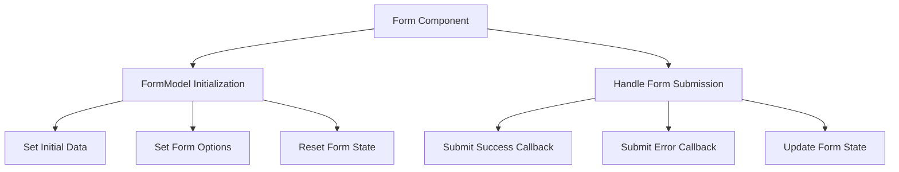

# Overview

Forms are used to manage user input and handle form submissions. They provide a structured way to collect data from users and process it accordingly.

# Form Component

The <SwmToken path="static/app/components/forms/form.tsx" pos="112:2:2" line-data="function Form({">`Form`</SwmToken> component initializes a <SwmToken path="static/app/components/forms/form.tsx" pos="184:1:1" line-data="      formModel.submitSuccess(data);">`formModel`</SwmToken> instance, which manages the state and behavior of the form. This includes setting initial data, handling form options, and resetting the form state.

<SwmSnippet path="/static/app/components/forms/form.tsx" line="112">

---

The <SwmToken path="static/app/components/forms/form.tsx" pos="112:2:2" line-data="function Form({">`Form`</SwmToken> component uses various props to customize its behavior, such as <SwmToken path="static/app/components/forms/form.tsx" pos="114:1:1" line-data="  allowUndo,">`allowUndo`</SwmToken>, <SwmToken path="static/app/components/forms/form.tsx" pos="26:4:4" line-data="    | &#39;resetOnError&#39;">`resetOnError`</SwmToken>, <SwmToken path="static/app/components/forms/form.tsx" pos="27:4:4" line-data="    | &#39;saveOnBlur&#39;">`saveOnBlur`</SwmToken>, and <SwmToken path="static/app/components/forms/form.tsx" pos="115:1:1" line-data="  apiEndpoint,">`apiEndpoint`</SwmToken>. These options are passed to the <SwmToken path="static/app/components/forms/form.tsx" pos="184:1:1" line-data="      formModel.submitSuccess(data);">`formModel`</SwmToken> to configure its behavior.

```tsx
function Form({
  'data-test-id': dataTestId,
  allowUndo,
  apiEndpoint,
  apiMethod,
  cancelLabel,
  children,
  className,
  extraButton,
  footerClass,
  footerStyle,
  hideFooter,
  initialData,
  model,
  onCancel,
  onFieldChange,
  onPreSubmit,
  onSubmit,
  onSubmitError,
  onSubmitSuccess,
  preventFormResetOnUnmount,
```

---

</SwmSnippet>

# <SwmToken path="static/app/components/forms/form.tsx" pos="184:1:1" line-data="      formModel.submitSuccess(data);">`formModel`</SwmToken> Class

The <SwmToken path="static/app/components/forms/form.tsx" pos="184:1:1" line-data="      formModel.submitSuccess(data);">`formModel`</SwmToken> class is responsible for maintaining the form's state, including field values, errors, and snapshots. It provides methods to set initial data, reset the form, and handle form submissions.

<SwmSnippet path="/static/app/components/forms/model.tsx" line="83">

---

The <SwmToken path="static/app/components/forms/model.tsx" pos="83:2:2" line-data="class FormModel {">`FormModel`</SwmToken> class maintains the form's state, including field values, errors, and snapshots. It provides methods to set initial data, reset the form, and handle form submissions.

```tsx
class FormModel {
  /**
   * Map of field name -> value
   */
  fields: ObservableMap<string, FieldValue> = observable.map();

  /**
   * Errors for individual fields
   * Note we don't keep error in `this.fieldState` so that we can easily
   * See if the form is in an "error" state with the `isError` getter
   */
  errors = new Map();

  /**
   * State of individual fields
   *
   * Map of field name -> object
   */
  fieldState = new Map();

  /**
```

---

</SwmSnippet>

# Form Submission Handling

The <SwmToken path="static/app/components/forms/form.tsx" pos="112:2:2" line-data="function Form({">`Form`</SwmToken> component also handles form submission events, calling the appropriate callbacks for success or error scenarios. It ensures that the form state is updated based on the submission outcome.

<SwmSnippet path="/static/app/components/forms/form.tsx" line="183">

---

The <SwmToken path="static/app/components/forms/form.tsx" pos="112:2:2" line-data="function Form({">`Form`</SwmToken> component handles form submission events, calling the appropriate callbacks for success or error scenarios. It ensures that the form state is updated based on the submission outcome.

```tsx
    data => {
      formModel.submitSuccess(data);
      onSubmitSuccess?.(data, formModel);
    },
    [formModel, onSubmitSuccess]
  );

  const handleSubmitError = useCallback(
    error => {
      formModel.submitError(error);
      onSubmitError?.(error, formModel);
    },
    [formModel, onSubmitError]
  );

  const handleSubmit = useCallback(
    e => {
      if (!skipPreventDefault) {
        e.preventDefault();
      }
      if (formModel.isSaving) {
```

---

</SwmSnippet>

# Form Endpoints

The <SwmToken path="static/app/components/forms/form.tsx" pos="115:1:1" line-data="  apiEndpoint,">`apiEndpoint`</SwmToken> in <SwmToken path="static/app/components/forms/model.tsx" pos="27:4:4" line-data="export type FormOptions = {">`FormOptions`</SwmToken> is an optional property that specifies the URL endpoint for form submissions. This endpoint is used by the <SwmToken path="static/app/components/forms/form.tsx" pos="184:1:1" line-data="      formModel.submitSuccess(data);">`formModel`</SwmToken> to send form data to the server.

<SwmSnippet path="/static/app/components/forms/model.tsx" line="27">

---

The <SwmToken path="static/app/components/forms/model.tsx" pos="35:1:1" line-data="  apiEndpoint?: string;">`apiEndpoint`</SwmToken> in <SwmToken path="static/app/components/forms/model.tsx" pos="27:4:4" line-data="export type FormOptions = {">`FormOptions`</SwmToken> specifies the URL endpoint for form submissions. This endpoint is used by the <SwmToken path="static/app/components/forms/form.tsx" pos="184:1:1" line-data="      formModel.submitSuccess(data);">`formModel`</SwmToken> to send form data to the server.

```tsx
export type FormOptions = {
  /**
   * Does the form support undo?
   */
  allowUndo?: boolean;
  /**
   * API endpoint use when saving the form model
   */
  apiEndpoint?: string;
  /**
   * API method used to save the form model
   */
  apiMethod?: APIRequestMethod;
  /**
   * Options passed to the API Client
   */
  apiOptions?: ConstructorParameters<typeof Client>[0];
  /**
   * Initial form data
   */
  initialData?: Record<string, FieldValue>;
```

---

</SwmSnippet>

# <SwmToken path="static/app/components/forms/apiForm.tsx" pos="23:2:2" line-data="function ApiForm({onSubmit, apiMethod, apiEndpoint, hostOverride, ...otherProps}: Props) {">`ApiForm`</SwmToken> Component

The <SwmToken path="static/app/components/forms/form.tsx" pos="115:1:1" line-data="  apiEndpoint,">`apiEndpoint`</SwmToken> in <SwmToken path="static/app/components/forms/apiForm.tsx" pos="23:2:2" line-data="function ApiForm({onSubmit, apiMethod, apiEndpoint, hostOverride, ...otherProps}: Props) {">`ApiForm`</SwmToken> is a required property that defines the URL endpoint for the API request. The <SwmToken path="static/app/components/forms/apiForm.tsx" pos="23:2:2" line-data="function ApiForm({onSubmit, apiMethod, apiEndpoint, hostOverride, ...otherProps}: Props) {">`ApiForm`</SwmToken> component uses this endpoint to submit form data to the server.

<SwmSnippet path="/static/app/components/forms/apiForm.tsx" line="10">

---

The <SwmToken path="static/app/components/forms/apiForm.tsx" pos="11:1:1" line-data="  apiEndpoint: string;">`apiEndpoint`</SwmToken> in <SwmToken path="static/app/components/forms/apiForm.tsx" pos="23:2:2" line-data="function ApiForm({onSubmit, apiMethod, apiEndpoint, hostOverride, ...otherProps}: Props) {">`ApiForm`</SwmToken> defines the URL endpoint for the API request. The <SwmToken path="static/app/components/forms/apiForm.tsx" pos="23:2:2" line-data="function ApiForm({onSubmit, apiMethod, apiEndpoint, hostOverride, ...otherProps}: Props) {">`ApiForm`</SwmToken> component uses this endpoint to submit form data to the server.

```tsx
type Props = FormProps & {
  apiEndpoint: string;
  apiMethod: string;
  hostOverride?: string;
  onSubmit?: (data: Record<string, any>) => any | void;
};

/**
 * @deprecated
 *
 * DO NOT USE THIS. Prefer using `Form` instead. Form already supports API
 * requests, this is quite old and should be removed
 */
function ApiForm({onSubmit, apiMethod, apiEndpoint, hostOverride, ...otherProps}: Props) {
  const api = useApi();

  const handleSubmit = useCallback(
    (
      data: Record<string, any>,
      onSuccess: (response: Record<string, any>) => void,
      onError: (error: any) => void
```

---

</SwmSnippet>

&nbsp;

*This is an auto-generated document by Swimm AI 🌊 and has not yet been verified by a human*

<SwmMeta version="3.0.0" repo-id="Z2l0aHViJTNBJTNBc2VudHJ5LWRlbW8tMSUzQSUzQVN3aW1tLURlbW8=" repo-name="sentry-demo-1" doc-type="overview"><sup>Powered by [Swimm](/)</sup></SwmMeta>
