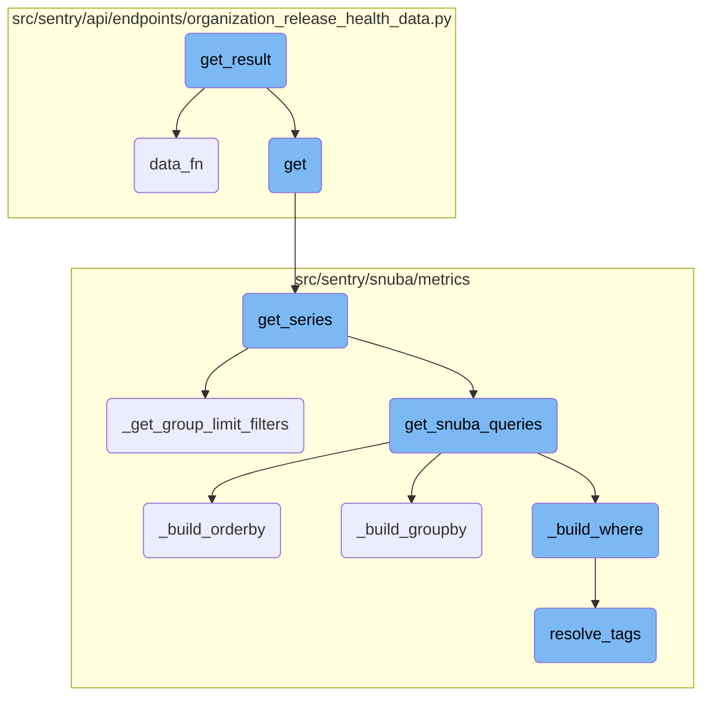
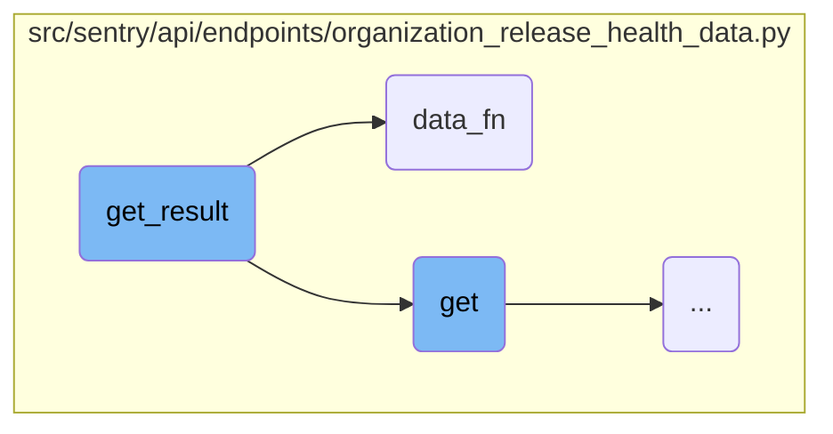
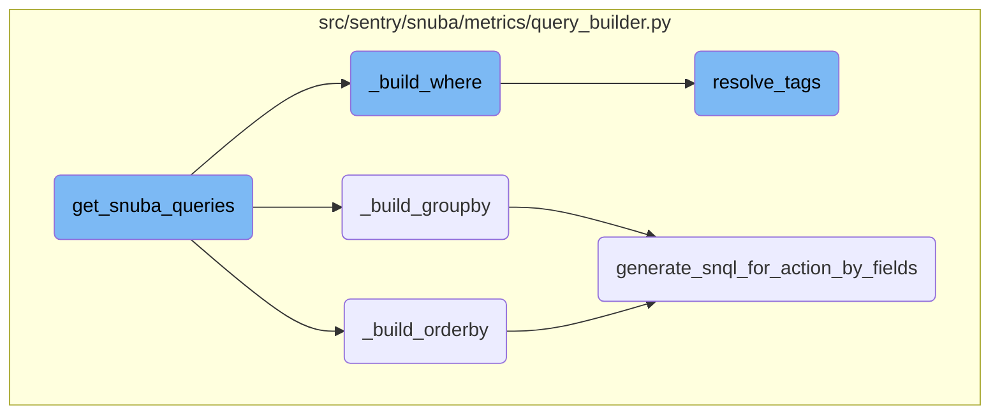

```mermaid
graph TD;
      subgraph src/sentry/snuba/metrics
41cc12395ce176f3abd1605ec3b59c474cfa8089284309a69157467dc53ca726(get):::mainFlowStyle --> 8b7dfb2384b18eb86c6bd433cfe8281dcfd665cd038938bba5731a71caad3d38(get_series):::mainFlowStyle
end

subgraph src/sentry/snuba/metrics
8b7dfb2384b18eb86c6bd433cfe8281dcfd665cd038938bba5731a71caad3d38(get_series):::mainFlowStyle --> fe7d7ced62c4c8a87bc9f53d59224a519081a1308af798355f032c6a05b467a1(_get_group_limit_filters)
end

subgraph src/sentry/snuba/metrics
8b7dfb2384b18eb86c6bd433cfe8281dcfd665cd038938bba5731a71caad3d38(get_series):::mainFlowStyle --> 35d12040966934efdd76bd3363426bc13b8433a48d9753f7f3250c37f1369ff1(get_snuba_queries):::mainFlowStyle
end

subgraph src/sentry/snuba/metrics
35d12040966934efdd76bd3363426bc13b8433a48d9753f7f3250c37f1369ff1(get_snuba_queries):::mainFlowStyle --> t6vor(...)
end

subgraph src/sentry/snuba/metrics
fe7d7ced62c4c8a87bc9f53d59224a519081a1308af798355f032c6a05b467a1(_get_group_limit_filters) --> 0393eb7d2af0dfb37758db1603039181af0acca01c00e1c1e2aea7e4dd0ebcf3(generate_snql_for_action_by_fields)
end


      classDef mainFlowStyle color:#000000,fill:#7CB9F4
classDef rootsStyle color:#000000,fill:#00FFF4
classDef Style1 color:#000000,fill:#00FFAA
classDef Style2 color:#000000,fill:#FFFF00
classDef Style3 color:#000000,fill:#AA7CB9

%% Swimm:
%% graph TD;
%%       subgraph <SwmPath>[src/sentry/snuba/metrics/](src/sentry/snuba/metrics/)</SwmPath>
%% 41cc12395ce176f3abd1605ec3b59c474cfa8089284309a69157467dc53ca726(get):::mainFlowStyle --> 8b7dfb2384b18eb86c6bd433cfe8281dcfd665cd038938bba5731a71caad3d38(get_series):::mainFlowStyle
%% end
%% 
%% subgraph <SwmPath>[src/sentry/snuba/metrics/](src/sentry/snuba/metrics/)</SwmPath>
%% 8b7dfb2384b18eb86c6bd433cfe8281dcfd665cd038938bba5731a71caad3d38(get_series):::mainFlowStyle --> fe7d7ced62c4c8a87bc9f53d59224a519081a1308af798355f032c6a05b467a1(_get_group_limit_filters)
%% end
%% 
%% subgraph <SwmPath>[src/sentry/snuba/metrics/](src/sentry/snuba/metrics/)</SwmPath>
%% 8b7dfb2384b18eb86c6bd433cfe8281dcfd665cd038938bba5731a71caad3d38(get_series):::mainFlowStyle --> 35d12040966934efdd76bd3363426bc13b8433a48d9753f7f3250c37f1369ff1(get_snuba_queries):::mainFlowStyle
%% end
%% 
%% subgraph <SwmPath>[src/sentry/snuba/metrics/](src/sentry/snuba/metrics/)</SwmPath>
%% 35d12040966934efdd76bd3363426bc13b8433a48d9753f7f3250c37f1369ff1(get_snuba_queries):::mainFlowStyle --> t6vor(...)
%% end
%% 
%% subgraph <SwmPath>[src/sentry/snuba/metrics/](src/sentry/snuba/metrics/)</SwmPath>
%% fe7d7ced62c4c8a87bc9f53d59224a519081a1308af798355f032c6a05b467a1(_get_group_limit_filters) --> 0393eb7d2af0dfb37758db1603039181af0acca01c00e1c1e2aea7e4dd0ebcf3(generate_snql_for_action_by_fields)
%% end
%% 
%% 
%%       classDef mainFlowStyle color:#000000,fill:#7CB9F4
%% classDef rootsStyle color:#000000,fill:#00FFF4
%% classDef Style1 color:#000000,fill:#00FFAA
%% classDef Style2 color:#000000,fill:#FFFF00
%% classDef Style3 color:#000000,fill:#AA7CB9
```

This document provides an overview of the <SwmToken path="src/sentry/api/endpoints/organization_release_health_data.py" pos="118:3:3" line-data="    def get_result(self, limit, cursor=None):">`get_result`</SwmToken> function, which is responsible for fetching and processing a paginated set of data. It includes details on how the function calculates offsets, retrieves data, handles pagination, and constructs the final result.

The <SwmToken path="src/sentry/api/endpoints/organization_release_health_data.py" pos="118:3:3" line-data="    def get_result(self, limit, cursor=None):">`get_result`</SwmToken> function starts by determining the offset based on the provided cursor. It then calls another function to fetch the data. If the data includes a list of groups, it checks if there are more items than the limit, indicating that pagination is needed. Finally, it creates and returns an object that includes the data and pagination details.

Here is a high level diagram of the flow, showing only the most important functions:



# Flow drill down

First, we'll zoom into this section of the flow:



<SwmSnippet path="/src/sentry/api/endpoints/organization_release_health_data.py" line="118">

---

## <SwmToken path="src/sentry/api/endpoints/organization_release_health_data.py" pos="118:3:3" line-data="    def get_result(self, limit, cursor=None):">`get_result`</SwmToken>

The <SwmToken path="src/sentry/api/endpoints/organization_release_health_data.py" pos="118:3:3" line-data="    def get_result(self, limit, cursor=None):">`get_result`</SwmToken> function is responsible for fetching and processing a paginated set of data. It first calculates the offset based on the provided cursor, then calls the <SwmToken path="src/sentry/api/endpoints/organization_release_health_data.py" pos="121:7:7" line-data="        data = self.data_fn(offset=offset, limit=limit + 1)">`data_fn`</SwmToken> function to retrieve the data. If the data contains a list of groups, it checks if there are more items than the limit, indicating pagination. It then constructs and returns a <SwmToken path="src/sentry/api/endpoints/organization_release_health_data.py" pos="130:3:3" line-data="        return CursorResult(">`CursorResult`</SwmToken> object, which includes the data and pagination information.

```python
    def get_result(self, limit, cursor=None):
        assert limit > 0
        offset = cursor.offset if cursor is not None else 0
        data = self.data_fn(offset=offset, limit=limit + 1)

        if isinstance(data.get("groups"), list):
            has_more = len(data["groups"]) == limit + 1
            if has_more:
                data["groups"].pop()
        else:
            raise NotImplementedError

        return CursorResult(
            data,
            prev=Cursor(0, max(0, offset - limit), True, offset > 0),
            next=Cursor(0, max(0, offset + limit), False, has_more),
        )
```

---

</SwmSnippet>

<SwmSnippet path="/src/sentry/api/endpoints/organization_release_health_data.py" line="78">

---

## <SwmToken path="src/sentry/api/endpoints/organization_release_health_data.py" pos="78:3:3" line-data="        def data_fn(offset: int, limit: int):">`data_fn`</SwmToken>

The <SwmToken path="src/sentry/api/endpoints/organization_release_health_data.py" pos="78:3:3" line-data="        def data_fn(offset: int, limit: int):">`data_fn`</SwmToken> function is tasked with querying and retrieving the data based on the provided offset and limit. It constructs a <SwmToken path="src/sentry/api/endpoints/organization_release_health_data.py" pos="80:5:5" line-data="                query = QueryDefinition(">`QueryDefinition`</SwmToken> object and uses it to fetch the data via the <SwmToken path="src/sentry/api/endpoints/organization_release_health_data.py" pos="86:5:5" line-data="                data = get_series(">`get_series`</SwmToken> function. The function also ensures that the crash rate values are within valid bounds and handles any exceptions that may arise during the query process. Finally, it returns the retrieved data.

```python
        def data_fn(offset: int, limit: int):
            try:
                query = QueryDefinition(
                    projects,
                    request.GET,
                    allow_mri=True,
                    paginator_kwargs={"limit": limit, "offset": offset},
                )
                data = get_series(
                    projects,
                    metrics_query=query.to_metrics_query(),
                    use_case_id=get_use_case_id(request),
                    tenant_ids={"organization_id": organization.id},
                )
                # due to possible data corruption crash free value can be less than 0 or greater than 1,
                # which is not valid behavior, so those values have to be capped
                metrics.ensure_crash_rate_in_bounds(
                    data, request, organization, SessionMetricKey.CRASH_RATE.value
                )
                metrics.ensure_crash_rate_in_bounds(
                    data, request, organization, SessionMetricKey.CRASH_FREE_RATE.value
```

---

</SwmSnippet>

Now, lets zoom into this section of the flow:



<SwmSnippet path="/src/sentry/api/endpoints/organization_release_health_data.py" line="74">

---

## Fetching and processing metrics data

The <SwmToken path="src/sentry/api/endpoints/organization_release_health_data.py" pos="74:3:3" line-data="    def get(self, request: Request, organization) -&gt; Response:">`get`</SwmToken> function is responsible for fetching and processing metrics data. It first retrieves the projects and validates the request fields. Then, it defines a <SwmToken path="src/sentry/api/endpoints/organization_release_health_data.py" pos="78:3:3" line-data="        def data_fn(offset: int, limit: int):">`data_fn`</SwmToken> function that constructs a <SwmToken path="src/sentry/api/endpoints/organization_release_health_data.py" pos="80:5:5" line-data="                query = QueryDefinition(">`QueryDefinition`</SwmToken> and calls <SwmToken path="src/sentry/api/endpoints/organization_release_health_data.py" pos="86:5:5" line-data="                data = get_series(">`get_series`</SwmToken> to fetch the metrics data. The data is then validated and capped to ensure crash rates are within bounds. Finally, the data is paginated and returned.

```python
    def get(self, request: Request, organization) -> Response:
        projects = self.get_projects(request, organization)
        self._validate_fields(request)

        def data_fn(offset: int, limit: int):
            try:
                query = QueryDefinition(
                    projects,
                    request.GET,
                    allow_mri=True,
                    paginator_kwargs={"limit": limit, "offset": offset},
                )
                data = get_series(
                    projects,
                    metrics_query=query.to_metrics_query(),
                    use_case_id=get_use_case_id(request),
                    tenant_ids={"organization_id": organization.id},
                )
                # due to possible data corruption crash free value can be less than 0 or greater than 1,
                # which is not valid behavior, so those values have to be capped
                metrics.ensure_crash_rate_in_bounds(
```

---

</SwmSnippet>

<SwmSnippet path="/src/sentry/snuba/metrics/datasource.py" line="897">

---

### Fetching time series data

The <SwmToken path="src/sentry/snuba/metrics/datasource.py" pos="897:2:2" line-data="def get_series(">`get_series`</SwmToken> function fetches time series data for the given query. It constructs the necessary intervals and queries Snuba for the metrics data. The function handles various scenarios, such as ordering by fields and grouping by columns, to ensure accurate and efficient data retrieval. The results are then converted and returned.

```python
def get_series(
    projects: Sequence[Project],
    metrics_query: DeprecatingMetricsQuery,
    use_case_id: UseCaseID,
    include_meta: bool = False,
    tenant_ids: dict[str, Any] | None = None,
) -> dict:
    """Get time series for the given query"""

    organization_id = projects[0].organization_id if projects else None
    tenant_ids = dict()
    if organization_id is not None:
        tenant_ids["organization_id"] = organization_id
    tenant_ids["use_case_id"] = use_case_id.value

    if metrics_query.interval is not None:
        interval = metrics_query.interval
    else:
        interval = metrics_query.granularity.granularity

    start, end, _num_intervals = to_intervals(metrics_query.start, metrics_query.end, interval)
```

---

</SwmSnippet>

<SwmSnippet path="/src/sentry/snuba/metrics/datasource.py" line="763">

---

### Applying group limit filters

The <SwmToken path="src/sentry/snuba/metrics/datasource.py" pos="763:2:2" line-data="def _get_group_limit_filters(">`_get_group_limit_filters`</SwmToken> function generates filters based on the group by fields and the results. It creates conditions to filter the data down to the relevant groups, ensuring efficient querying and accurate results.

```python
def _get_group_limit_filters(
    metrics_query: DeprecatingMetricsQuery,
    results: list[Mapping[str, int]],
    use_case_id: UseCaseID,
) -> GroupLimitFilters | None:
    if not metrics_query.groupby or not results:
        return None

    # Creates a mapping of groupBy fields to their equivalent SnQL
    key_to_condition_dict: dict[Groupable, Any] = {}
    for metric_groupby_obj in metrics_query.groupby:
        key_to_condition_dict[
            metric_groupby_obj.name
        ] = SnubaQueryBuilder.generate_snql_for_action_by_fields(
            metric_action_by_field=metric_groupby_obj,
            use_case_id=use_case_id,
            org_id=metrics_query.org_id,
            projects=Project.objects.get_many_from_cache(metrics_query.project_ids),
            is_column=True,
        )

```

---

</SwmSnippet>

<SwmSnippet path="/src/sentry/snuba/metrics/query_builder.py" line="794">

---

### Generating <SwmToken path="src/sentry/snuba/metrics/query_builder.py" pos="802:7:7" line-data="        Generates the necessary snql for any action by field which in our case will be group by and order by. This">`snql`</SwmToken> for action by fields

The <SwmToken path="src/sentry/snuba/metrics/query_builder.py" pos="794:3:3" line-data="    def generate_snql_for_action_by_fields(">`generate_snql_for_action_by_fields`</SwmToken> function generates the necessary <SwmToken path="src/sentry/snuba/metrics/query_builder.py" pos="802:7:7" line-data="        Generates the necessary snql for any action by field which in our case will be group by and order by. This">`snql`</SwmToken> for group by and order by fields. It handles various scenarios, such as transforming fields and generating expressions, to ensure accurate and efficient querying.

```python
    def generate_snql_for_action_by_fields(
        metric_action_by_field: MetricActionByField,
        use_case_id: UseCaseID,
        org_id: int,
        projects: Sequence[Project],
        is_column: bool = False,
    ) -> list[OrderBy] | Column | AliasedExpression | Function:
        """
        Generates the necessary snql for any action by field which in our case will be group by and order by. This
        function has been designed to share as much logic as possible, however, it should be refactored in case
        the snql generation starts to diverge significantly.
        """

        is_group_by = isinstance(metric_action_by_field, MetricGroupByField)
        is_order_by = isinstance(metric_action_by_field, MetricOrderByField)
        if not is_group_by and not is_order_by:
            raise InvalidParams("The metric action must either be an order by or group by.")

        if isinstance(metric_action_by_field.field, str):
            # This transformation is currently supported only for group by because OrderBy doesn't support the Function type.
            if is_group_by and metric_action_by_field.field == "transaction":
```

---

</SwmSnippet>

Now, lets zoom into this section of the flow:



<SwmSnippet path="/src/sentry/snuba/metrics/query_builder.py" line="1116">

---

## Building Snuba Queries

The function <SwmToken path="src/sentry/snuba/metrics/query_builder.py" pos="1116:3:3" line-data="    def get_snuba_queries(self):">`get_snuba_queries`</SwmToken> is responsible for constructing the Snuba queries needed to fetch metrics data. It iterates over the selected fields, determines the entities involved, and builds the necessary query components such as <SwmToken path="src/sentry/snuba/metrics/query_builder.py" pos="1120:11:11" line-data="        for field in self._metrics_query.select:">`select`</SwmToken>, <SwmToken path="src/sentry/snuba/metrics/query_builder.py" pos="1126:21:21" line-data="                #  When we get to an instance of a MetricFieldBase where the entity is an">`where`</SwmToken>, <SwmToken path="src/sentry/snuba/metrics/datasource.py" pos="768:7:7" line-data="    if not metrics_query.groupby or not results:">`groupby`</SwmToken>, and <SwmToken path="src/sentry/snuba/metrics/query_builder.py" pos="800:7:7" line-data="    ) -&gt; list[OrderBy] | Column | AliasedExpression | Function:">`OrderBy`</SwmToken>.

```python
    def get_snuba_queries(self):
        metric_mri_to_obj_dict = {}
        fields_in_entities = {}

        for field in self._metrics_query.select:
            metric_field_obj = metric_object_factory(field.op, field.metric_mri)
            # `get_entity` is called the first, to fetch the entities of constituent metrics,
            # and validate especially in the case of SingularEntityDerivedMetric that it is
            # actually composed of metrics that belong to the same entity
            try:
                #  When we get to an instance of a MetricFieldBase where the entity is an
                #  instance of dict, we know it is from a composite entity derived metric, and
                #  we need to traverse down the constituent metrics dependency tree until we get
                #  to instances of SingleEntityDerivedMetric, and add those to our queries so
                #  that we are able to generate the original CompositeEntityDerivedMetric later
                #  on as a result of a post query operation on the results of the constituent
                #  SingleEntityDerivedMetric instances
                component_entities = metric_field_obj.get_entity(
                    projects=self._projects, use_case_id=self._use_case_id
                )
                if isinstance(component_entities, dict):
```

---

</SwmSnippet>

<SwmSnippet path="/src/sentry/snuba/metrics/query_builder.py" line="974">

---

### Building Order By Clause

The function <SwmToken path="src/sentry/snuba/metrics/query_builder.py" pos="974:3:3" line-data="    def _build_orderby(self) -&gt; list[OrderBy] | None:">`_build_orderby`</SwmToken> constructs the <SwmToken path="src/sentry/snuba/metrics/query_builder.py" pos="802:37:39" line-data="        Generates the necessary snql for any action by field which in our case will be group by and order by. This">`order by`</SwmToken> clause for the Snuba query. It iterates over the <SwmToken path="src/sentry/snuba/metrics/query_builder.py" pos="974:12:12" line-data="    def _build_orderby(self) -&gt; list[OrderBy] | None:">`OrderBy`</SwmToken> fields specified in the metrics query and generates the corresponding Snuba query language (SnQL) expressions.

```python
    def _build_orderby(self) -> list[OrderBy] | None:
        if self._metrics_query.orderby is None:
            return None

        orderby_fields = []
        for metric_order_by_obj in self._metrics_query.orderby:
            orderby_fields.extend(
                self.generate_snql_for_action_by_fields(
                    metric_action_by_field=metric_order_by_obj,
                    use_case_id=self._use_case_id,
                    org_id=self._org_id,
                    projects=self._projects,
                    is_column=True,
                )
            )

        return orderby_fields
```

---

</SwmSnippet>

<SwmSnippet path="/src/sentry/snuba/metrics/query_builder.py" line="957">

---

### Building Group By Clause

The function <SwmToken path="src/sentry/snuba/metrics/query_builder.py" pos="957:3:3" line-data="    def _build_groupby(self) -&gt; list[Column] | None:">`_build_groupby`</SwmToken> constructs the <SwmToken path="src/sentry/snuba/metrics/query_builder.py" pos="802:31:33" line-data="        Generates the necessary snql for any action by field which in our case will be group by and order by. This">`group by`</SwmToken> clause for the Snuba query. It processes the <SwmToken path="src/sentry/snuba/metrics/query_builder.py" pos="958:7:7" line-data="        if self._metrics_query.groupby is None:">`groupby`</SwmToken> fields specified in the metrics query and generates the corresponding <SwmToken path="src/sentry/snuba/metrics/datasource.py" pos="771:21:21" line-data="    # Creates a mapping of groupBy fields to their equivalent SnQL">`SnQL`</SwmToken> expressions.

```python
    def _build_groupby(self) -> list[Column] | None:
        if self._metrics_query.groupby is None:
            return None

        groupby_cols = []

        for metric_groupby_obj in self._metrics_query.groupby or []:
            groupby_cols.append(
                self.generate_snql_for_action_by_fields(
                    metric_action_by_field=metric_groupby_obj,
                    use_case_id=self._use_case_id,
                    org_id=self._org_id,
                    projects=self._projects,
                )
            )
        return groupby_cols
```

---

</SwmSnippet>

<SwmSnippet path="/src/sentry/snuba/metrics/query_builder.py" line="890">

---

### Building Where Clause

The function <SwmToken path="src/sentry/snuba/metrics/query_builder.py" pos="890:3:3" line-data="    def _build_where(self) -&gt; list[BooleanCondition | Condition]:">`_build_where`</SwmToken> constructs the <SwmToken path="src/sentry/snuba/metrics/query_builder.py" pos="891:1:1" line-data="        where: list[BooleanCondition | Condition] = [">`where`</SwmToken> clause for the Snuba query. It includes conditions based on the organization ID, project <SwmToken path="src/sentry/snuba/metrics/datasource.py" pos="146:11:11" line-data="    # This assumes that metric ids are divided into non-overlapping ranges by the">`ids`</SwmToken>, and any additional filters specified in the metrics query. It also resolves tags and metric conditions.

```python
    def _build_where(self) -> list[BooleanCondition | Condition]:
        where: list[BooleanCondition | Condition] = [
            Condition(Column("org_id"), Op.EQ, self._org_id),
            Condition(Column("project_id"), Op.IN, self._metrics_query.project_ids),
        ]

        where += self._build_timeframe()

        if not self._metrics_query.where:
            return where

        snuba_conditions = []
        # Adds filters that do not need to be resolved because they are instances of `MetricConditionField`
        metric_condition_filters = []
        for condition in self._metrics_query.where:
            if isinstance(condition, MetricConditionField):
                metric_expression = metric_object_factory(
                    condition.lhs.op, condition.lhs.metric_mri
                )
                try:
                    metric_condition_filters.append(
```

---

</SwmSnippet>

<SwmSnippet path="/src/sentry/snuba/metrics/query_builder.py" line="179">

---

### Resolving Tags

The function <SwmToken path="src/sentry/snuba/metrics/query_builder.py" pos="179:2:2" line-data="def resolve_tags(">`resolve_tags`</SwmToken> translates tags in Snuba conditions. It handles various types of inputs such as lists, functions, conditions, and columns, and resolves them to their corresponding Snuba representations.

```python
def resolve_tags(
    use_case_id: UseCaseID,
    org_id: int,
    input_: Any,
    projects: Sequence[Project],
    is_tag_value: bool = False,
    allowed_tag_keys: dict[str, str] | None = None,
) -> Any:
    """Translate tags in snuba condition

    Column("metric_id") is not supported.
    """
    if input_ is None:
        return None
    if isinstance(input_, (list, tuple)):
        elements = [
            resolve_tags(
                use_case_id,
                org_id,
                item,
                projects,
```

---

</SwmSnippet>

&nbsp;

*This is an auto-generated document by Swimm AI 🌊 and has not yet been verified by a human*

<SwmMeta version="3.0.0" repo-id="Z2l0aHViJTNBJTNBc2VudHJ5LWRlbW8tMSUzQSUzQVN3aW1tLURlbW8=" repo-name="sentry-demo-1" doc-type="flows"><sup>Powered by [Swimm](/)</sup></SwmMeta>
