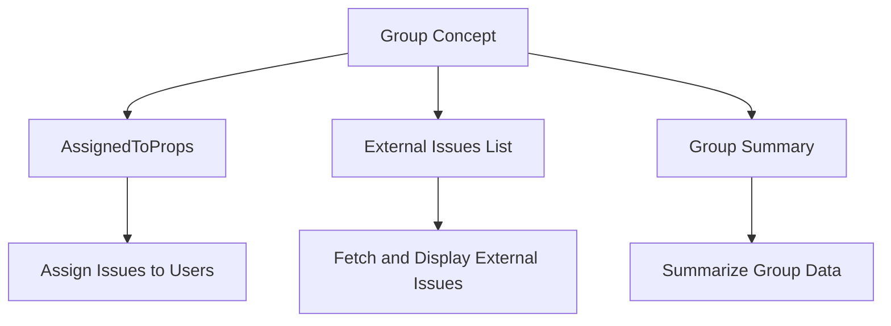

# Introduction to Group in Components

The concept of <SwmToken path="static/app/components/group/assignedTo.tsx" pos="61:1:1" line-data="  group: Group;">`group`</SwmToken> is fundamental in managing and displaying collections of related issues or events within the application. It is utilized across various components to organize and handle these issues effectively.

## Group in <SwmToken path="static/app/components/group/assignedTo.tsx" pos="60:2:2" line-data="interface AssignedToProps {">`AssignedToProps`</SwmToken>

In the <SwmPath>[static/app/components/group/assignedTo.tsx](static/app/components/group/assignedTo.tsx)</SwmPath> file, <SwmToken path="static/app/components/group/assignedTo.tsx" pos="61:1:1" line-data="  group: Group;">`group`</SwmToken> is a member of the <SwmToken path="static/app/components/group/assignedTo.tsx" pos="60:2:2" line-data="interface AssignedToProps {">`AssignedToProps`</SwmToken> interface. This interface is used to assign issues to users, making it easier to manage issue assignments within the application.

<SwmSnippet path="/static/app/components/group/assignedTo.tsx" line="60">

---

The <SwmToken path="static/app/components/group/assignedTo.tsx" pos="60:2:2" line-data="interface AssignedToProps {">`AssignedToProps`</SwmToken> interface includes <SwmToken path="static/app/components/group/assignedTo.tsx" pos="61:1:1" line-data="  group: Group;">`group`</SwmToken> as a key member, which is essential for assigning issues to users.

```tsx
interface AssignedToProps {
  group: Group;
  project: Project;
  disableDropdown?: boolean;
  event?: Event;
  onAssign?: OnAssignCallback;
}
```

---

</SwmSnippet>

## Group in External Issues List

In the <SwmPath>[static/app/components/group/externalIssuesList/index.tsx](static/app/components/group/externalIssuesList/index.tsx)</SwmPath> file, <SwmToken path="static/app/components/group/assignedTo.tsx" pos="61:1:1" line-data="  group: Group;">`group`</SwmToken> is part of the <SwmToken path="static/app/components/group/pluginActions.tsx" pos="98:4:4" line-data="      ...this.props.plugin,">`props`</SwmToken> type. It is used to fetch and display external issues linked to a group, facilitating the integration of external issue tracking systems.

## Group in Group Summary

The <SwmPath>[static/app/components/group/groupSummary.tsx](static/app/components/group/groupSummary.tsx)</SwmPath> file defines the <SwmToken path="static/app/components/group/groupSummary.tsx" pos="20:2:2" line-data="interface GroupSummaryProps {">`GroupSummaryProps`</SwmToken> interface, which includes <SwmToken path="static/app/components/group/groupSummary.tsx" pos="44:12:12" line-data="export function useGroupSummary(groupId: string, groupCategory: IssueCategory) {">`groupCategory`</SwmToken> and <SwmToken path="static/app/components/group/groupSummary.tsx" pos="44:6:6" line-data="export function useGroupSummary(groupId: string, groupCategory: IssueCategory) {">`groupId`</SwmToken>. This interface is used to summarize the group's data, providing a concise overview of the group's information.

<SwmSnippet path="/static/app/components/group/groupSummary.tsx" line="44">

---

The <SwmToken path="static/app/components/group/groupSummary.tsx" pos="20:2:2" line-data="interface GroupSummaryProps {">`GroupSummaryProps`</SwmToken> interface includes <SwmToken path="static/app/components/group/groupSummary.tsx" pos="44:12:12" line-data="export function useGroupSummary(groupId: string, groupCategory: IssueCategory) {">`groupCategory`</SwmToken> and <SwmToken path="static/app/components/group/groupSummary.tsx" pos="44:6:6" line-data="export function useGroupSummary(groupId: string, groupCategory: IssueCategory) {">`groupId`</SwmToken>, which are used to summarize the group's data.

```tsx
export function useGroupSummary(groupId: string, groupCategory: IssueCategory) {
  const organization = useOrganization();
  // We piggyback and use autofix's genai consent check for now.
  const {
    data: autofixSetupData,
    isPending: isAutofixSetupLoading,
    isError: isAutofixSetupError,
  } = useAutofixSetup({groupId});

  const hasGenAIConsent = autofixSetupData?.genAIConsent.ok ?? false;

  const queryData = useApiQuery<GroupSummaryData>(
    makeGroupSummaryQueryKey(organization.slug, groupId),
    {
      staleTime: Infinity, // Cache the result indefinitely as it's unlikely to change if it's already computed
      enabled: isSummaryEnabled(hasGenAIConsent, groupCategory),
    }
  );
  return {
    ...queryData,
    isPending: isAutofixSetupLoading || queryData.isPending,
```

---

</SwmSnippet>

## Group Endpoints

### Unlinking a Plugin Issue

The <SwmToken path="static/app/components/group/pluginActions.tsx" pos="96:1:1" line-data="  deleteIssue = () =&gt; {">`deleteIssue`</SwmToken> function defines an endpoint to unlink a plugin issue from a group. The endpoint is `/issues/${this.props.group.id}/plugins/${plugin.slug}/unlink/`, and it uses the <SwmToken path="static/app/components/group/pluginActions.tsx" pos="104:5:7" line-data="    this.props.api.request(endpoint, {">`api.request`</SwmToken> method to send a request to this endpoint. Upon success, it reloads the plugin and displays a success message; on error, it shows an error message.

<SwmSnippet path="/static/app/components/group/pluginActions.tsx" line="96">

---

The <SwmToken path="static/app/components/group/pluginActions.tsx" pos="96:1:1" line-data="  deleteIssue = () =&gt; {">`deleteIssue`</SwmToken> function defines an endpoint to unlink a plugin issue from a group, handling both success and error scenarios.

```tsx
  deleteIssue = () => {
    const plugin = {
      ...this.props.plugin,
      issue: null,
    };
    // override plugin.issue so that 'create/link' Modal
    // doesn't think the plugin still has an issue linked
    const endpoint = `/issues/${this.props.group.id}/plugins/${plugin.slug}/unlink/`;
    this.props.api.request(endpoint, {
      success: () => {
        this.loadPlugin(plugin);
        addSuccessMessage(t('Successfully unlinked issue.'));
      },
      error: () => {
        addErrorMessage(t('Unable to unlink issue'));
      },
    });
  };
```

---

</SwmSnippet>

### Assigning a Team to a Group

The test case <SwmToken path="static/app/components/group/assignedTo.spec.tsx" pos="115:1:19" line-data="  it(&#39;can assign team&#39;, async () =&gt; {">`it('can assign team', async () => {`</SwmToken> demonstrates the endpoint used to assign a team to a group. The endpoint is `/organizations/org-slug/issues/${GROUP_1.id}/`, and it uses the <SwmToken path="static/app/components/group/assignedTo.spec.tsx" pos="121:7:9" line-data="    const assignMock = MockApiClient.addMockResponse({">`MockApiClient.addMockResponse`</SwmToken> method to mock a PUT request to this endpoint. The test verifies that the team is successfully assigned to the group and that the UI updates accordingly.

<SwmSnippet path="/static/app/components/group/assignedTo.spec.tsx" line="115">

---

The test case demonstrates the endpoint used to assign a team to a group, verifying the successful assignment and UI update.

```tsx
  it('can assign team', async () => {
    const onAssign = jest.fn();
    const assignedGroup: Group = {
      ...GROUP_1,
      assignedTo: {...TEAM_1, type: 'team'},
    };
    const assignMock = MockApiClient.addMockResponse({
      method: 'PUT',
      url: `/organizations/org-slug/issues/${GROUP_1.id}/`,
      body: assignedGroup,
    });
    const {rerender} = render(
      <AssignedTo project={project} group={GROUP_1} event={event} onAssign={onAssign} />,
      {
        organization,
      }
    );
    await openMenu();
    expect(screen.queryByTestId('loading-indicator')).not.toBeInTheDocument();

    const team1slug = `#${TEAM_1.slug}`;
```

---

</SwmSnippet>

&nbsp;

*This is an auto-generated document by Swimm AI 🌊 and has not yet been verified by a human*

<SwmMeta version="3.0.0" repo-id="Z2l0aHViJTNBJTNBc2VudHJ5LWRlbW8tMSUzQSUzQVN3aW1tLURlbW8=" repo-name="sentry-demo-1" doc-type="overview"><sup>Powered by [Swimm](/)</sup></SwmMeta>
