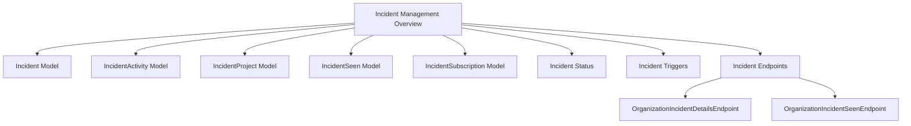

# Overview of Incident Management

Incident management involves tracking and managing specific occurrences or events within an application. This process ensures that issues arising during the application's operation are monitored and resolved efficiently.

# Incident Model

The <SwmToken path="src/sentry/incidents/models/incident.py" pos="376:8:8" line-data="    def get_for_incident(self, incident):">`incident`</SwmToken> model is a core component representing an individual incident. It includes various attributes and methods to handle the incident's lifecycle.

# <SwmToken path="src/sentry/incidents/models/incident.py" pos="310:2:2" line-data="class IncidentActivity(Model):">`IncidentActivity`</SwmToken> Model

The <SwmToken path="src/sentry/incidents/models/incident.py" pos="310:2:2" line-data="class IncidentActivity(Model):">`IncidentActivity`</SwmToken> model tracks activities related to an incident, such as status changes or comments. This helps maintain a detailed log of actions taken on an incident.

# <SwmToken path="src/sentry/incidents/models/incident.py" pos="35:2:2" line-data="class IncidentProject(Model):">`IncidentProject`</SwmToken> Model

The <SwmToken path="src/sentry/incidents/models/incident.py" pos="35:2:2" line-data="class IncidentProject(Model):">`IncidentProject`</SwmToken> model links incidents to specific projects, allowing for project-specific incident tracking and management.

# <SwmToken path="src/sentry/incidents/models/incident.py" pos="48:2:2" line-data="class IncidentSeen(Model):">`IncidentSeen`</SwmToken> Model

The <SwmToken path="src/sentry/incidents/models/incident.py" pos="48:2:2" line-data="class IncidentSeen(Model):">`IncidentSeen`</SwmToken> model records when an incident has been viewed by a user, ensuring that the team is aware of the incident's status.

# <SwmToken path="src/sentry/incidents/models/incident.py" pos="344:2:2" line-data="class IncidentSubscription(Model):">`IncidentSubscription`</SwmToken> Model

The <SwmToken path="src/sentry/incidents/models/incident.py" pos="344:2:2" line-data="class IncidentSubscription(Model):">`IncidentSubscription`</SwmToken> model manages subscriptions to incidents, enabling users to receive notifications about updates or changes to specific incidents.

# Incident Status

The <SwmToken path="src/sentry/incidents/models/incident.py" pos="167:0:0" line-data="INCIDENT_STATUS = {">`INCIDENT_STATUS`</SwmToken> constant defines the possible statuses an incident can have, such as Open, Resolved, Critical, and Warning.

# Incident Triggers

The <SwmToken path="src/sentry/incidents/models/incident.py" pos="376:3:3" line-data="    def get_for_incident(self, incident):">`get_for_incident`</SwmToken> function fetches the <SwmToken path="src/sentry/incidents/models/incident.py" pos="378:5:5" line-data="        Fetches the IncidentTriggers associated with an Incident. Attempts to fetch from">`IncidentTriggers`</SwmToken> associated with an incident, attempting to fetch from cache before hitting the database.

<SwmSnippet path="/src/sentry/incidents/models/incident.py" line="376">

---

The <SwmToken path="src/sentry/incidents/models/incident.py" pos="376:3:3" line-data="    def get_for_incident(self, incident):">`get_for_incident`</SwmToken> function fetches the <SwmToken path="src/sentry/incidents/models/incident.py" pos="378:5:5" line-data="        Fetches the IncidentTriggers associated with an Incident. Attempts to fetch from">`IncidentTriggers`</SwmToken> associated with an incident, attempting to fetch from cache before hitting the database.

```python
    def get_for_incident(self, incident):
        """
        Fetches the IncidentTriggers associated with an Incident. Attempts to fetch from
        cache then hits the database.
        """
        cache_key = self._build_cache_key(incident.id)
        triggers = cache.get(cache_key)
        if triggers is None:
            triggers = list(IncidentTrigger.objects.filter(incident=incident))
            cache.set(cache_key, triggers, 3600)

        return triggers
```

---

</SwmSnippet>

# Incident Endpoints

Incident endpoints provide various functionalities to interact with incidents, such as fetching details, updating statuses, and marking incidents as seen.

## <SwmToken path="src/sentry/incidents/endpoints/organization_incident_details.py" pos="32:2:2" line-data="class OrganizationIncidentDetailsEndpoint(IncidentEndpoint):">`OrganizationIncidentDetailsEndpoint`</SwmToken>

The <SwmToken path="src/sentry/incidents/endpoints/organization_incident_details.py" pos="32:2:2" line-data="class OrganizationIncidentDetailsEndpoint(IncidentEndpoint):">`OrganizationIncidentDetailsEndpoint`</SwmToken> provides details about a specific incident. It supports GET and PUT methods. The GET method fetches the incident details, while the PUT method updates the incident status.

<SwmSnippet path="/src/sentry/incidents/endpoints/organization_incident_details.py" line="31">

---

The <SwmToken path="src/sentry/incidents/endpoints/organization_incident_details.py" pos="32:2:2" line-data="class OrganizationIncidentDetailsEndpoint(IncidentEndpoint):">`OrganizationIncidentDetailsEndpoint`</SwmToken> provides details about a specific incident. It supports GET and PUT methods. The GET method fetches the incident details, while the PUT method updates the incident status.

```````````````````python
@region_silo_endpoint
class OrganizationIncidentDetailsEndpoint(IncidentEndpoint):
    owner = ApiOwner.ISSUES
    publish_status = {
        "GET": ApiPublishStatus.UNKNOWN,
        "PUT": ApiPublishStatus.UNKNOWN,
    }
    permission_classes = (IncidentPermission,)

    def get(self, request: Request, organization, incident) -> Response:
        """
        Fetch an Incident.
        ``````````````````
        :auth: required
        """
        data = serialize(incident, request.user, DetailedIncidentSerializer())

        return Response(data)

    def put(self, request: Request, organization, incident) -> Response:
        serializer = IncidentSerializer(data=request.data)
```````````````````

---

</SwmSnippet>

## <SwmToken path="src/sentry/incidents/endpoints/organization_incident_seen.py" pos="12:2:2" line-data="class OrganizationIncidentSeenEndpoint(IncidentEndpoint):">`OrganizationIncidentSeenEndpoint`</SwmToken>

The <SwmToken path="src/sentry/incidents/endpoints/organization_incident_seen.py" pos="12:2:2" line-data="class OrganizationIncidentSeenEndpoint(IncidentEndpoint):">`OrganizationIncidentSeenEndpoint`</SwmToken> marks an incident as seen by the user. It supports the POST method, which updates the incident's seen status for the authenticated user.

<SwmSnippet path="/src/sentry/incidents/endpoints/organization_incident_seen.py" line="11">

---

The <SwmToken path="src/sentry/incidents/endpoints/organization_incident_seen.py" pos="12:2:2" line-data="class OrganizationIncidentSeenEndpoint(IncidentEndpoint):">`OrganizationIncidentSeenEndpoint`</SwmToken> marks an incident as seen by the user. It supports the POST method, which updates the incident's seen status for the authenticated user.

`````````````````````````````````````python
@region_silo_endpoint
class OrganizationIncidentSeenEndpoint(IncidentEndpoint):
    owner = ApiOwner.ISSUES
    publish_status = {
        "POST": ApiPublishStatus.UNKNOWN,
    }
    permission_classes = (IncidentPermission,)

    def post(self, request: Request, organization, incident) -> Response:
        """
        Mark an incident as seen by the user
        ````````````````````````````````````

        :auth: required
        """

        set_incident_seen(incident=incident, user=request.user)
        return Response({}, status=201)
`````````````````````````````````````

---

</SwmSnippet>

&nbsp;

*This is an auto-generated document by Swimm AI 🌊 and has not yet been verified by a human*

<SwmMeta version="3.0.0" repo-id="Z2l0aHViJTNBJTNBc2VudHJ5LWRlbW8tMSUzQSUzQVN3aW1tLURlbW8=" repo-name="sentry-demo-1" doc-type="overview"><sup>Powered by [Swimm](/)</sup></SwmMeta>
