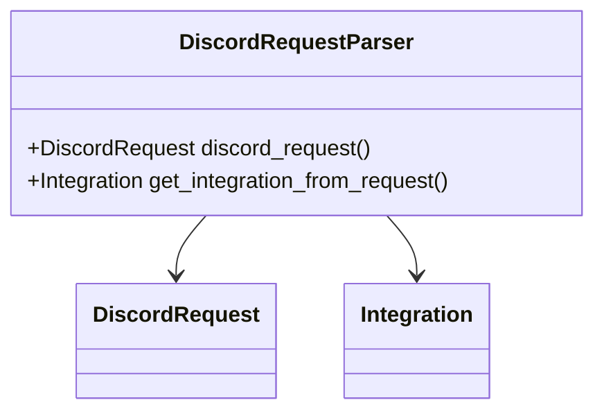

# Overview of Integration Parsers

Integration parsers are used to intercept incoming webhook requests from various integration providers. They determine if the request can be handled by the Control Silo or needs to be forwarded to one or more Region Silos. Parsers identify the <SwmToken path="src/sentry/middleware/integrations/parsers/vsts.py" pos="26:10:10" line-data="    def get_integration_from_request(self) -&gt; Integration | None:">`Integration`</SwmToken> object from the request to ensure the correct handling of the webhook data. Each integration has its own specific parser that follows a common set of steps to process the request.

# How Parsers Work

Although parsers vary per integration, they follow the same basic steps:

1. Read the data in the request.
2. Infer if it can be responded to from the Control Silo. If so, fall through the above middleware.
3. If the request should be handled at one or more Region Silos instead, identify the <SwmToken path="src/sentry/middleware/integrations/parsers/vsts.py" pos="26:10:10" line-data="    def get_integration_from_request(self) -&gt; Integration | None:">`Integration`</SwmToken> object from the request.

# Example of a Parser

The <SwmToken path="src/sentry/middleware/integrations/parsers/vsts.py" pos="19:2:2" line-data="class VstsRequestParser(BaseRequestParser):">`VstsRequestParser`</SwmToken> class is an example of a parser for the VSTS integration. It identifies the integration from the request and determines the appropriate response based on the request data.

<SwmSnippet path="/src/sentry/middleware/integrations/parsers/vsts.py" line="19">

---

The <SwmToken path="src/sentry/middleware/integrations/parsers/vsts.py" pos="19:2:2" line-data="class VstsRequestParser(BaseRequestParser):">`VstsRequestParser`</SwmToken> class identifies the integration from the request and determines the appropriate response based on the request data.

```python
class VstsRequestParser(BaseRequestParser):
    provider = "vsts"
    webhook_identifier = WebhookProviderIdentifier.VSTS

    region_view_classes = [WorkItemWebhook]

    @control_silo_function
    def get_integration_from_request(self) -> Integration | None:
        try:
            data = orjson.loads(self.request.body)
            external_id = get_vsts_external_id(data=data)
        except Exception as e:
            sentry_sdk.capture_exception(e)
            return None
        return Integration.objects.filter(external_id=external_id, provider=self.provider).first()

    def get_response(self) -> HttpResponseBase:
        if self.view_class not in self.region_view_classes:
            return self.get_response_from_control_silo()

        try:
```

---

</SwmSnippet>

# Main Functions

There are several main functions in the integration parsers. Two of the most important ones are <SwmToken path="src/sentry/middleware/integrations/parsers/vsts.py" pos="26:3:3" line-data="    def get_integration_from_request(self) -&gt; Integration | None:">`get_integration_from_request`</SwmToken> and <SwmToken path="src/sentry/middleware/integrations/parsers/vsts.py" pos="35:3:3" line-data="    def get_response(self) -&gt; HttpResponseBase:">`get_response`</SwmToken>.

## <SwmToken path="src/sentry/middleware/integrations/parsers/vsts.py" pos="26:3:3" line-data="    def get_integration_from_request(self) -&gt; Integration | None:">`get_integration_from_request`</SwmToken>

The <SwmToken path="src/sentry/middleware/integrations/parsers/vsts.py" pos="26:3:3" line-data="    def get_integration_from_request(self) -&gt; Integration | None:">`get_integration_from_request`</SwmToken> function is used to identify the <SwmToken path="src/sentry/middleware/integrations/parsers/vsts.py" pos="26:10:10" line-data="    def get_integration_from_request(self) -&gt; Integration | None:">`Integration`</SwmToken> object from the request. It checks if the request is a JSON request, parses the request body, and retrieves the external ID to find the corresponding integration.

<SwmSnippet path="/src/sentry/middleware/integrations/parsers/github.py" line="34">

---

The <SwmToken path="src/sentry/middleware/integrations/parsers/github.py" pos="35:3:3" line-data="    def get_integration_from_request(self) -&gt; Integration | None:">`get_integration_from_request`</SwmToken> function checks if the request is a JSON request, parses the request body, and retrieves the external ID to find the corresponding integration.

```python
    @control_silo_function
    def get_integration_from_request(self) -> Integration | None:
        if not self.is_json_request():
            return None
        try:
            event = orjson.loads(self.request.body)
        except orjson.JSONDecodeError:
            return None
        external_id = self._get_external_id(event=event)
        if not external_id:
            return None
        return Integration.objects.filter(external_id=external_id, provider=self.provider).first()
```

---

</SwmSnippet>

## <SwmToken path="src/sentry/middleware/integrations/parsers/vsts.py" pos="35:3:3" line-data="    def get_response(self) -&gt; HttpResponseBase:">`get_response`</SwmToken>

The <SwmToken path="src/sentry/middleware/integrations/parsers/vsts.py" pos="35:3:3" line-data="    def get_response(self) -&gt; HttpResponseBase:">`get_response`</SwmToken> function handles the response for the webhook request. It checks if the request should be handled by the control silo or forwarded to region silos. It processes the request, identifies the integration, and determines the regions to forward the request to.

<SwmSnippet path="/src/sentry/middleware/integrations/parsers/github.py" line="47">

---

The <SwmToken path="src/sentry/middleware/integrations/parsers/github.py" pos="47:3:3" line-data="    def get_response(self):">`get_response`</SwmToken> function processes the request, identifies the integration, and determines the regions to forward the request to.

```python
    def get_response(self):
        if self.view_class != self.webhook_endpoint:
            return self.get_response_from_control_silo()

        try:
            event = orjson.loads(self.request.body)
        except orjson.JSONDecodeError:
            return HttpResponse(status=400)

        if event.get("installation") and event.get("action") in {"created", "deleted"}:
            return self.get_response_from_control_silo()

        try:
            integration = self.get_integration_from_request()
            if not integration:
                return self.get_default_missing_integration_response()

            regions = self.get_regions_from_organizations()
        except (Integration.DoesNotExist, OrganizationIntegration.DoesNotExist):
            return self.get_default_missing_integration_response()
```

---

</SwmSnippet>

# Endpoints of Parsers

Endpoints are specific to each parser and handle the unique requirements of different integrations.

## <SwmToken path="src/sentry/middleware/integrations/parsers/discord.py" pos="54:3:3" line-data="    def discord_request(self) -&gt; DiscordRequest | None:">`discord_request`</SwmToken>

The <SwmToken path="src/sentry/middleware/integrations/parsers/discord.py" pos="54:3:3" line-data="    def discord_request(self) -&gt; DiscordRequest | None:">`discord_request`</SwmToken> property retrieves the <SwmToken path="src/sentry/middleware/integrations/parsers/discord.py" pos="54:10:10" line-data="    def discord_request(self) -&gt; DiscordRequest | None:">`DiscordRequest`</SwmToken> object if it has already been set. If not, it initializes a new <SwmToken path="src/sentry/middleware/integrations/parsers/discord.py" pos="54:10:10" line-data="    def discord_request(self) -&gt; DiscordRequest | None:">`DiscordRequest`</SwmToken> object using the <SwmToken path="src/sentry/middleware/integrations/parsers/discord.py" pos="57:9:9" line-data="        if self.view_class != DiscordInteractionsEndpoint:">`DiscordInteractionsEndpoint`</SwmToken> class and sets it. This property is crucial for handling Discord-specific webhook requests.

<SwmSnippet path="/src/sentry/middleware/integrations/parsers/discord.py" line="53">

---

The <SwmToken path="src/sentry/middleware/integrations/parsers/discord.py" pos="54:3:3" line-data="    def discord_request(self) -&gt; DiscordRequest | None:">`discord_request`</SwmToken> property initializes a new <SwmToken path="src/sentry/middleware/integrations/parsers/discord.py" pos="54:10:10" line-data="    def discord_request(self) -&gt; DiscordRequest | None:">`DiscordRequest`</SwmToken> object using the <SwmToken path="src/sentry/middleware/integrations/parsers/discord.py" pos="57:9:9" line-data="        if self.view_class != DiscordInteractionsEndpoint:">`DiscordInteractionsEndpoint`</SwmToken> class if it has not already been set.

```python
    @property
    def discord_request(self) -> DiscordRequest | None:
        if self._discord_request is not None:
            return self._discord_request
        if self.view_class != DiscordInteractionsEndpoint:
            return None
        drf_request: Request = DiscordInteractionsEndpoint().initialize_request(self.request)
        self._discord_request: DiscordRequest = self.view_class.discord_request_class(drf_request)
        return self._discord_request
```

---

</SwmSnippet>

## <SwmToken path="src/sentry/middleware/integrations/parsers/vsts.py" pos="26:3:3" line-data="    def get_integration_from_request(self) -&gt; Integration | None:">`get_integration_from_request`</SwmToken>

The <SwmToken path="src/sentry/middleware/integrations/parsers/vsts.py" pos="26:3:3" line-data="    def get_integration_from_request(self) -&gt; Integration | None:">`get_integration_from_request`</SwmToken> method identifies the <SwmToken path="src/sentry/middleware/integrations/parsers/vsts.py" pos="26:10:10" line-data="    def get_integration_from_request(self) -&gt; Integration | None:">`Integration`</SwmToken> object from the incoming request. It checks if the request is from a control class or a Discord interaction endpoint and retrieves the corresponding <SwmToken path="src/sentry/middleware/integrations/parsers/vsts.py" pos="26:10:10" line-data="    def get_integration_from_request(self) -&gt; Integration | None:">`Integration`</SwmToken> object based on the <SwmToken path="src/sentry/middleware/integrations/parsers/discord.py" pos="82:5:5" line-data="            if discord_request.guild_id is None:">`guild_id`</SwmToken> from the <SwmToken path="src/sentry/middleware/integrations/parsers/discord.py" pos="54:3:3" line-data="    def discord_request(self) -&gt; DiscordRequest | None:">`discord_request`</SwmToken>.

&nbsp;

*This is an auto-generated document by Swimm AI 🌊 and has not yet been verified by a human*

<SwmMeta version="3.0.0" repo-id="Z2l0aHViJTNBJTNBc2VudHJ5LWRlbW8tMSUzQSUzQVN3aW1tLURlbW8=" repo-name="sentry-demo-1" doc-type="overview"><sup>Powered by [Swimm](/)</sup></SwmMeta>
