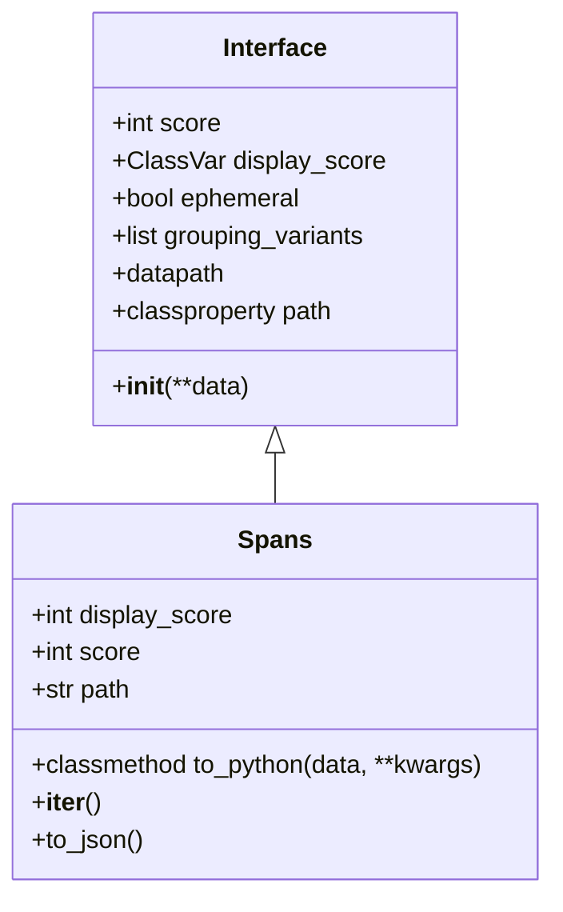

# Understanding Interfaces in Application Modules

Interfaces are structured representations of data that may render differently than the default extra metadata in an event. They are used to create a consistent way to handle different types of data across various modules. Interfaces provide methods to convert raw data into Python objects and vice versa, ensuring data normalization and validation. They also define how data should be serialized into JSON and how it should be displayed in different contexts. Interfaces can be extended to create specific representations for different types of data, such as user information, stack traces, or debug metadata.

<SwmSnippet path="/src/sentry/interfaces/base.py" line="61">

---

# Interface Class

The <SwmToken path="src/sentry/interfaces/base.py" pos="61:2:2" line-data="class Interface:">`Interface`</SwmToken> class provides a structured representation of data, methods for converting raw data to Python objects, and serialization to JSON.

```python
class Interface:
    """
    An interface is a structured representation of data, which may
    render differently than the default ``extra`` metadata in an event.
    """

    score = 0
    display_score: ClassVar[int | None] = None
    ephemeral = False
    grouping_variants = ["default"]
    datapath = None

    def __init__(self, **data):
        self._data = data or {}

    @classproperty
    def path(cls):
        """The 'path' of the interface which is the root key in the data."""
        return cls.__name__.lower()

    @classproperty
```

---

</SwmSnippet>

<SwmSnippet path="/src/sentry/interfaces/spans.py" line="50">

---

# Spans Class

The <SwmToken path="src/sentry/interfaces/spans.py" pos="50:2:2" line-data="class Spans(Interface):">`Spans`</SwmToken> class extends <SwmToken path="src/sentry/interfaces/spans.py" pos="50:4:4" line-data="class Spans(Interface):">`Interface`</SwmToken> to handle a list of Span interfaces, demonstrating how to create specific representations for different data types.

```python
class Spans(Interface):
    """
    Contains a list of Span interfaces
    """

    display_score = 1950
    score = 1950
    path = "spans"

    @classmethod
    def to_python(cls, data, **kwargs):
        spans = [Span.to_python_subpath(data, [i], **kwargs) for i, span in enumerate(data)]
        return super().to_python({"spans": spans}, **kwargs)

    def __iter__(self):
        return iter(self.spans)

    def to_json(self):
        return [span.to_json() for span in self]
```

---

</SwmSnippet>

<SwmSnippet path="/src/sentry/interfaces/base.py" line="36">

---

# <SwmToken path="src/sentry/interfaces/base.py" pos="36:2:2" line-data="def get_interfaces(event: Mapping[str, Any]) -&gt; dict[str, Interface]:">`get_interfaces`</SwmToken> Function

The <SwmToken path="src/sentry/interfaces/base.py" pos="36:2:2" line-data="def get_interfaces(event: Mapping[str, Any]) -&gt; dict[str, Interface]:">`get_interfaces`</SwmToken> function retrieves and processes interfaces from an event, ensuring data normalization and validation.

```python
def get_interfaces(event: Mapping[str, Any]) -> dict[str, Interface]:
    result = []
    for key, data in event.items():
        # Skip invalid interfaces that were nulled out during normalization
        if data is None:
            continue

        try:
            cls = get_interface(key)
        except ValueError:
            continue

        value = safe_execute(cls.to_python, data, datapath=[key])
        if not value:
            continue

        result.append((key, value))

    return {k: v for k, v in sorted(result, key=lambda x: x[1].get_score(), reverse=True)}
```

---

</SwmSnippet>

# Main Functions

There are several main functions in this folder. Some of them are <SwmToken path="src/sentry/interfaces/base.py" pos="22:2:2" line-data="def get_interface(name: str) -&gt; type[Interface]:">`get_interface`</SwmToken>, <SwmToken path="src/sentry/interfaces/base.py" pos="36:2:2" line-data="def get_interfaces(event: Mapping[str, Any]) -&gt; dict[str, Interface]:">`get_interfaces`</SwmToken>, <SwmToken path="src/sentry/interfaces/base.py" pos="48:9:9" line-data="        value = safe_execute(cls.to_python, data, datapath=[key])">`to_python`</SwmToken>, `normalize_context`, and `get_stacktrace`. We will dive a little into <SwmToken path="src/sentry/interfaces/base.py" pos="22:2:2" line-data="def get_interface(name: str) -&gt; type[Interface]:">`get_interface`</SwmToken> and <SwmToken path="src/sentry/interfaces/base.py" pos="36:2:2" line-data="def get_interfaces(event: Mapping[str, Any]) -&gt; dict[str, Interface]:">`get_interfaces`</SwmToken>.

<SwmSnippet path="/src/sentry/interfaces/base.py" line="22">

---

## <SwmToken path="src/sentry/interfaces/base.py" pos="22:2:2" line-data="def get_interface(name: str) -&gt; type[Interface]:">`get_interface`</SwmToken>

The <SwmToken path="src/sentry/interfaces/base.py" pos="22:2:2" line-data="def get_interface(name: str) -&gt; type[Interface]:">`get_interface`</SwmToken> function retrieves an interface class by its name. It first looks up the interface's import path in the settings and then imports the class using <SwmToken path="src/sentry/interfaces/base.py" pos="29:5:5" line-data="        interface = import_string(import_path)">`import_string`</SwmToken>. If the interface name is invalid or the import fails, it raises a <SwmToken path="src/sentry/interfaces/base.py" pos="26:3:3" line-data="        raise ValueError(f&quot;Invalid interface name: {name}&quot;)">`ValueError`</SwmToken>.

```python
def get_interface(name: str) -> type[Interface]:
    try:
        import_path = settings.SENTRY_INTERFACES[name]
    except KeyError:
        raise ValueError(f"Invalid interface name: {name}")

    try:
        interface = import_string(import_path)
    except Exception:
        raise ValueError(f"Unable to load interface: {name}")

    return interface
```

---

</SwmSnippet>

<SwmSnippet path="/src/sentry/interfaces/base.py" line="36">

---

## <SwmToken path="src/sentry/interfaces/base.py" pos="36:2:2" line-data="def get_interfaces(event: Mapping[str, Any]) -&gt; dict[str, Interface]:">`get_interfaces`</SwmToken>

The <SwmToken path="src/sentry/interfaces/base.py" pos="36:2:2" line-data="def get_interfaces(event: Mapping[str, Any]) -&gt; dict[str, Interface]:">`get_interfaces`</SwmToken> function processes an event's data to extract and instantiate interface objects. It iterates over the event's items, retrieves the corresponding interface class using <SwmToken path="src/sentry/interfaces/base.py" pos="44:5:5" line-data="            cls = get_interface(key)">`get_interface`</SwmToken>, and converts the raw data into Python objects using the interface's <SwmToken path="src/sentry/interfaces/base.py" pos="48:9:9" line-data="        value = safe_execute(cls.to_python, data, datapath=[key])">`to_python`</SwmToken> method. The resulting interfaces are sorted by their score and returned as a dictionary.

```python
def get_interfaces(event: Mapping[str, Any]) -> dict[str, Interface]:
    result = []
    for key, data in event.items():
        # Skip invalid interfaces that were nulled out during normalization
        if data is None:
            continue

        try:
            cls = get_interface(key)
        except ValueError:
            continue

        value = safe_execute(cls.to_python, data, datapath=[key])
        if not value:
            continue

        result.append((key, value))

    return {k: v for k, v in sorted(result, key=lambda x: x[1].get_score(), reverse=True)}
```

---

</SwmSnippet>

&nbsp;

*This is an auto-generated document by Swimm AI 🌊 and has not yet been verified by a human*

<SwmMeta version="3.0.0" repo-id="Z2l0aHViJTNBJTNBc2VudHJ5LWRlbW8tMSUzQSUzQVN3aW1tLURlbW8=" repo-name="sentry-demo-1" doc-type="overview"><sup>Powered by [Swimm](/)</sup></SwmMeta>
