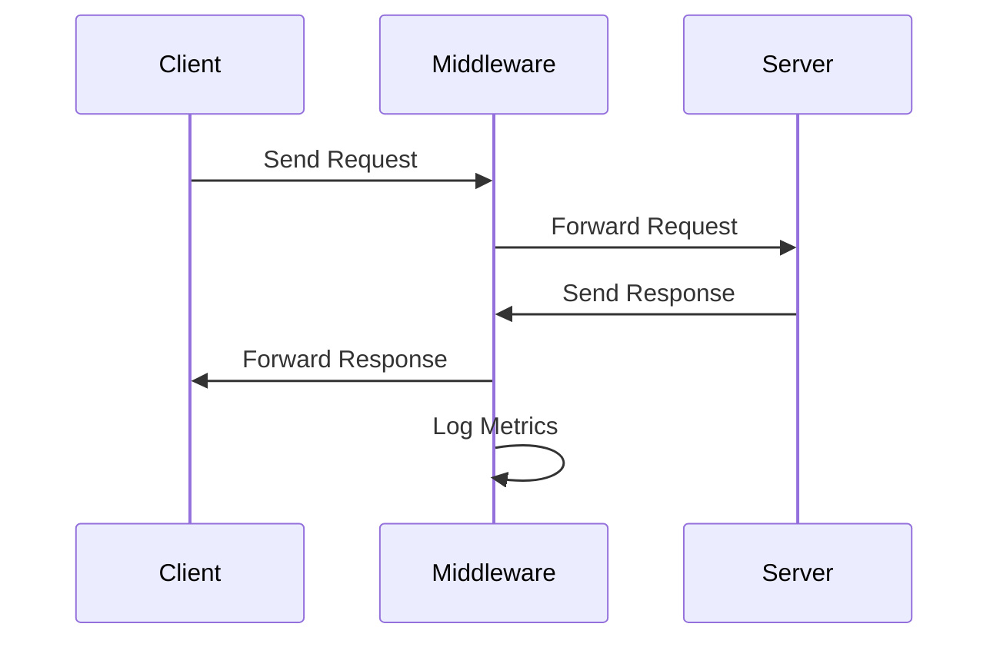

# Overview of Middleware in Application Modules

Middleware refers to software that acts as an intermediary between different components of an application, processing requests and responses. In the application modules, middleware is used to handle various tasks such as authentication, localization, and integration control.

<SwmSnippet path="/src/sentry/middleware/integrations/integration_control.py" line="1">

---

## Integration Control Middleware

<SwmToken path="src/sentry/middleware/integrations/integration_control.py" pos="23:2:2" line-data="class IntegrationControlMiddleware:">`IntegrationControlMiddleware`</SwmToken> inspects HTTP requests to determine if they should be processed by the control silo or forwarded to region silos.

```python
from __future__ import annotations

import logging
from collections.abc import Callable

from django.http import HttpRequest
from django.http.response import HttpResponseBase

from sentry.silo.base import SiloMode
```

---

</SwmSnippet>

<SwmSnippet path="/src/sentry/middleware/sudo.py" line="6">

---

## Sudo Middleware

<SwmToken path="src/sentry/middleware/sudo.py" pos="6:2:2" line-data="class SudoMiddleware(BaseSudoMiddleware):">`SudoMiddleware`</SwmToken> checks if a user has sudo privileges and handles password reauthentication.

```python
class SudoMiddleware(BaseSudoMiddleware):
    def has_sudo_privileges(self, request: HttpRequest) -> bool:
        # Right now, only password reauthentication (django-sudo) is supported,
        # so if a user doesn't have a password (for example, only has github auth)
        # then we shouldn't prompt them for the password they don't have.
        user = request.user
        if user.is_authenticated and not user.has_usable_password():
            return True

        return super().has_sudo_privileges(request)
```

---

</SwmSnippet>

<SwmSnippet path="/src/sentry/middleware/env.py" line="10">

---

## Sentry Environment Middleware

<SwmToken path="src/sentry/middleware/env.py" pos="10:2:2" line-data="class SentryEnvMiddleware(MiddlewareMixin):">`SentryEnvMiddleware`</SwmToken> binds the request to the environment, maintaining the request stack in test environments.

```python
class SentryEnvMiddleware(MiddlewareMixin):
    def process_request(self, request: Request):
        # bind request to env
        if env.request_stack is None:
            env.request_stack = []
        if env.request:
            env.request_stack.append(env.request)
        env.request = request
```

---

</SwmSnippet>

<SwmSnippet path="/src/sentry/middleware/locale.py" line="9">

---

## Sentry Locale Middleware

<SwmToken path="src/sentry/middleware/locale.py" pos="9:2:2" line-data="class SentryLocaleMiddleware(LocaleMiddleware):">`SentryLocaleMiddleware`</SwmToken> processes requests to handle localization, avoiding user session touches for static media.

```python
class SentryLocaleMiddleware(LocaleMiddleware):
    def process_request(self, request: HttpRequest) -> None:
        with sentry_sdk.start_span(op="middleware.locale", description="process_request"):
            # No locale for static media
            # This avoids touching user session, which means we avoid
            # setting `Vary: Cookie` as a response header which will
            # break HTTP caching entirely.
            self.__skip_caching = request.path_info.startswith(settings.ANONYMOUS_STATIC_PREFIXES)
            if self.__skip_caching:
                return

            lang_code = request.GET.get("lang")
            # user is explicitly forcing language
            if lang_code:
                try:
                    language = translation.get_supported_language_variant(lang_code)
                except LookupError:
                    super().process_request(request)
                else:
                    translation.activate(language)
                    request.LANGUAGE_CODE = translation.get_language()
```

---

</SwmSnippet>

<SwmSnippet path="/src/sentry/middleware/superuser.py" line="9">

---

## Superuser Middleware

<SwmToken path="src/sentry/middleware/superuser.py" pos="9:2:2" line-data="class SuperuserMiddleware(MiddlewareMixin):">`SuperuserMiddleware`</SwmToken> manages superuser access, logging superuser actions and ensuring proper session handling.

```python
class SuperuserMiddleware(MiddlewareMixin):
    def process_request(self, request: Request):
        # This avoids touching user session, which means we avoid
        # setting `Vary: Cookie` as a response header which will
        # break HTTP caching entirely.
        self.__skip_caching = request.path_info.startswith(settings.ANONYMOUS_STATIC_PREFIXES)

        if self.__skip_caching:
            # XXX(dcramer): support legacy is_superuser calls for unauthenticated requests
            request.is_superuser = lambda: False
            return

        su = Superuser(request)

        request.superuser = su
        # XXX(schew2381): is_superuser is a DEPRECATED property. Please use is_active_superuser(request) instead.
        request.is_superuser = lambda: request.superuser.is_active
```

---

</SwmSnippet>

<SwmSnippet path="/src/sentry/middleware/stats.py" line="32">

---

## Request Timing Middleware

<SwmToken path="src/sentry/middleware/stats.py" pos="32:2:2" line-data="class RequestTimingMiddleware(MiddlewareMixin):">`RequestTimingMiddleware`</SwmToken> records the duration of requests and logs metrics for allowed paths and methods.

```python
class RequestTimingMiddleware(MiddlewareMixin):
    allowed_methods = ("POST", "GET", "PUT", "DELETE")
    allowed_paths = getattr(
        settings, "SENTRY_REQUEST_METRIC_ALLOWED_PATHS", ("sentry.web.api", "sentry.api.endpoints")
    )  # Store endpoints

    def process_view(
        self,
        request: Request,
        view_func: ViewFunc,
        view_args: Any,
        view_kwargs: Any,
    ) -> Response | None:
        add_request_metric_tags(request)

        if request.method not in self.allowed_methods:
            return None

        path = get_path(view_func)
        if path and path.startswith(self.allowed_paths):
            setattr(request, "_view_path", path)
```

---

</SwmSnippet>

<SwmSnippet path="/src/sentry/middleware/security.py" line="6">

---

## Security Headers Middleware

<SwmToken path="src/sentry/middleware/security.py" pos="6:2:2" line-data="class SecurityHeadersMiddleware(MiddlewareMixin):">`SecurityHeadersMiddleware`</SwmToken> ensures that proper security headers are set for responses.

```python
class SecurityHeadersMiddleware(MiddlewareMixin):
    """
    Ensure that we have proper security headers set.
    """

    def process_response(self, request: Request, response: Response) -> Response:
        if not request.path.startswith("/extensions/jira/"):
            response.setdefault("X-Frame-Options", "deny")
        response.setdefault("X-Content-Type-Options", "nosniff")
        response.setdefault("X-XSS-Protection", "1; mode=block")
        return response
```

---

</SwmSnippet>

<SwmSnippet path="/src/sentry/middleware/stats.py" line="22">

---

## Response Code Middleware

<SwmToken path="src/sentry/middleware/stats.py" pos="22:2:2" line-data="class ResponseCodeMiddleware(MiddlewareMixin):">`ResponseCodeMiddleware`</SwmToken> logs response codes for requests, incrementing metrics for each response.

```python
class ResponseCodeMiddleware(MiddlewareMixin):
    def process_response(self, request: Request, response: Response) -> Response:
        metrics.incr("response", instance=str(response.status_code), skip_internal=False)
        return response

    def process_exception(self, request: Request, exception: Exception) -> None:
        if not isinstance(exception, Http404):
```

---

</SwmSnippet>

<SwmSnippet path="/src/sentry/middleware/auth.py" line="49">

---

## Authentication Middleware

<SwmToken path="src/sentry/middleware/auth.py" pos="49:2:2" line-data="class AuthenticationMiddleware(MiddlewareMixin):">`AuthenticationMiddleware`</SwmToken> processes requests to authenticate users, handling various authentication methods and setting the user for the request.

```python
class AuthenticationMiddleware(MiddlewareMixin):
    def process_request(self, request: HttpRequest) -> None:
        if request.path.startswith("/api/0/internal/rpc/"):
            # Avoid doing RPC authentication when we're already
            # in an RPC request.
            request.user = AnonymousUser()
            return

        auth = get_authorization_header(request).split()

        if auth:
            for authenticator_class in [
                UserAuthTokenAuthentication,
                OrgAuthTokenAuthentication,
                ApiKeyAuthentication,
            ]:
                authenticator = authenticator_class()
                if not authenticator.accepts_auth(auth):
                    continue
                try:
                    result = authenticator.authenticate(request)
```

---

</SwmSnippet>

<SwmSnippet path="/src/sentry/middleware/ratelimit.py" line="47">

---

### <SwmToken path="src/sentry/middleware/ratelimit.py" pos="47:3:3" line-data="    def process_view(">`process_view`</SwmToken>

The <SwmToken path="src/sentry/middleware/ratelimit.py" pos="47:3:3" line-data="    def process_view(">`process_view`</SwmToken> method in <SwmToken path="src/sentry/middleware/ratelimit.py" pos="32:2:2" line-data="class RatelimitMiddleware:">`RatelimitMiddleware`</SwmToken> checks if an endpoint call will violate rate limits. It determines the rate limit configuration, checks if the request exceeds the rate limit, and logs the rate limit status. If the rate limit is exceeded, it returns a 429 response.

```python
    def process_view(
        self, request: HttpRequest, view_func, view_args, view_kwargs
    ) -> HttpResponseBase | None:
        """Check if the endpoint call will violate."""

        with metrics.timer("middleware.ratelimit.process_view"):
            try:
                with sentry_sdk.start_span(op="ratelimit.early_return"):
                    # TODO: put these fields into their own object
                    request.will_be_rate_limited = False
                    if settings.SENTRY_SELF_HOSTED:
                        return None
                    request.rate_limit_category = None
                    request.rate_limit_uid = uuid.uuid4().hex
                    view_class = getattr(view_func, "view_class", None)
                    if not view_class:
                        return None

                    enforce_rate_limit = getattr(view_class, "enforce_rate_limit", False)
                    if enforce_rate_limit is False:
                        return None
```

---

</SwmSnippet>

<SwmSnippet path="/src/sentry/middleware/stats.py" line="56">

---

### <SwmToken path="src/sentry/middleware/stats.py" pos="56:3:3" line-data="    def process_response(self, request: Request, response: Response) -&gt; Response:">`process_response`</SwmToken>

The <SwmToken path="src/sentry/middleware/stats.py" pos="56:3:3" line-data="    def process_response(self, request: Request, response: Response) -&gt; Response:">`process_response`</SwmToken> method in <SwmToken path="src/sentry/middleware/stats.py" pos="32:2:2" line-data="class RequestTimingMiddleware(MiddlewareMixin):">`RequestTimingMiddleware`</SwmToken> records the time taken to process a request. It calculates the duration from the start time to the end time and logs this information using metrics.

```python
    def process_response(self, request: Request, response: Response) -> Response:
        self._record_time(request, response.status_code)
        return response

    def process_exception(self, request: Request, exception: Exception) -> None:
        self._record_time(request, 500)

    @staticmethod
    def _record_time(request: Request, status_code: int) -> None:
        view_path = getattr(request, "_view_path", None)
        if not view_path:
            return

        rate_limit_type = getattr(
            getattr(request, "rate_limit_metadata", None), "rate_limit_type", None
        )

        tags = getattr(request, "_metric_tags", {})
        tags.update(
            {
```

---

</SwmSnippet>

&nbsp;

*This is an auto-generated document by Swimm AI 🌊 and has not yet been verified by a human*

<SwmMeta version="3.0.0" repo-id="Z2l0aHViJTNBJTNBc2VudHJ5LWRlbW8tMSUzQSUzQVN3aW1tLURlbW8=" repo-name="sentry-demo-1" doc-type="overview"><sup>Powered by [Swimm](/)</sup></SwmMeta>
