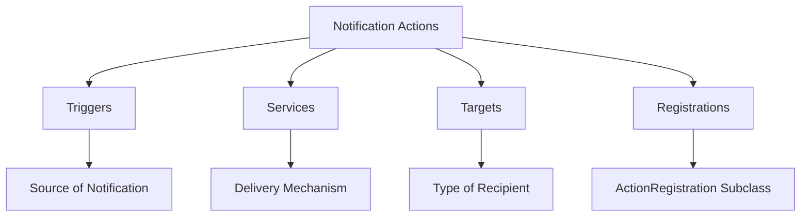

# What are Notification Actions

Notification Actions are a generic abstraction of the actions triggered when alert rules are activated. They are designed to send notifications to third-party integrations rather than individual channels like email or personal notification settings.

# Structure of NotificationAction

The structure of the `NotificationAction` model is abstracted from `AlertRuleTriggerAction` but is decoupled from issues, events, or incidents. This allows notifications to be configured across the entire organization or project rather than per recipient.

# Components of Notification Actions

Notification Actions rely on several components: Triggers (the source of the notification), Services (the delivery mechanism), Targets (the type of recipient), and Registrations (the `ActionRegistration` subclass that helps set up new actions).

# Examples of Notification Actions

Examples of Notification Actions include receiving audit log entries in a Slack channel, creating Jira tickets from user feedback, triggering GitHub notifications for new releases, and sending quota notifications or billing updates to specific non-user emails.

&nbsp;

*This is an auto-generated document by Swimm AI 🌊 and has not yet been verified by a human*

<SwmMeta version="3.0.0" repo-id="Z2l0aHViJTNBJTNBc2VudHJ5LWRlbW8tMSUzQSUzQVN3aW1tLURlbW8=" repo-name="sentry-demo-1" doc-type="overview">Powered by [Swimm](/)</SwmMeta>
