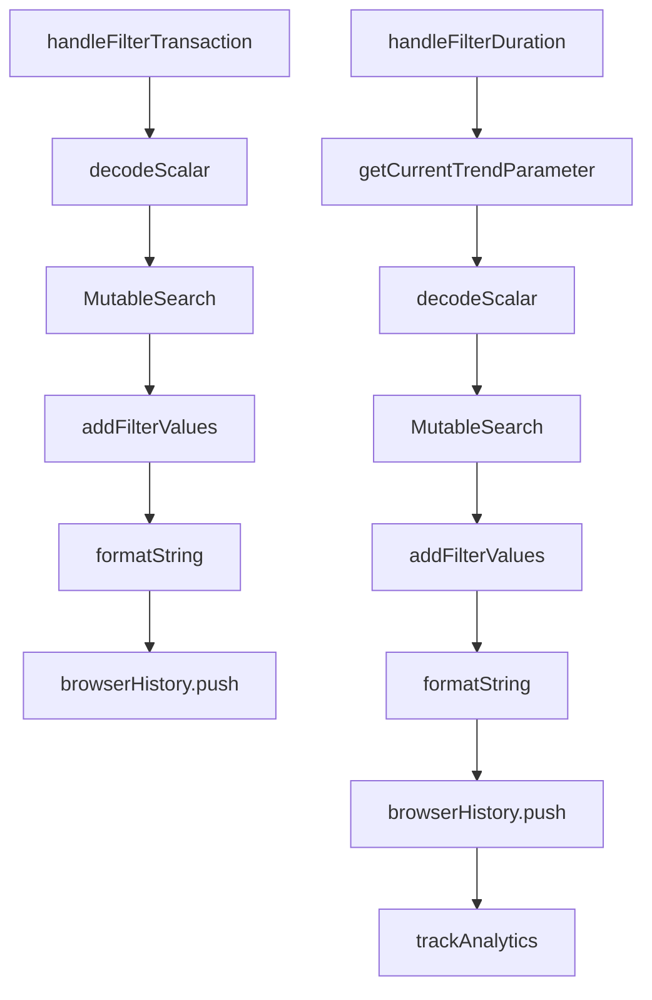

# Overview of Performance Trends

Performance trends refer to the analysis and visualization of performance data over time to identify patterns and changes in application behavior. This document provides an overview of the key components and types used in managing performance trends within the application.

<SwmSnippet path="/static/app/views/performance/trends/types.tsx" line="80">

---

## <SwmToken path="static/app/views/performance/trends/types.tsx" pos="80:4:4" line-data="export type TrendsStats = {">`TrendsStats`</SwmToken> Type

The <SwmToken path="static/app/views/performance/trends/types.tsx" pos="80:4:4" line-data="export type TrendsStats = {">`TrendsStats`</SwmToken> type is used to map transaction names to their respective trend statistics. This type is essential for storing and retrieving statistical data for different transactions.

```tsx
export type TrendsStats = {
  [transaction: string]: TrendStat;
};
```

---

</SwmSnippet>

<SwmSnippet path="/static/app/views/performance/trends/types.tsx" line="107">

---

## <SwmToken path="static/app/views/performance/trends/types.tsx" pos="107:4:4" line-data="export type TrendsData = {">`TrendsData`</SwmToken> Type

The <SwmToken path="static/app/views/performance/trends/types.tsx" pos="107:4:4" line-data="export type TrendsData = {">`TrendsData`</SwmToken> type encapsulates the events, projects, and statistics related to performance trends. It is crucial for organizing and accessing performance trend data.

```tsx
export type TrendsData = {
  events: TrendsDataEvents;
  projects: Project[];
```

---

</SwmSnippet>

<SwmSnippet path="/static/app/views/performance/trends/types.tsx" line="75">

---

## <SwmToken path="static/app/views/performance/trends/types.tsx" pos="75:4:4" line-data="export type TrendStat = {">`TrendStat`</SwmToken> Type

The <SwmToken path="static/app/views/performance/trends/types.tsx" pos="75:4:4" line-data="export type TrendStat = {">`TrendStat`</SwmToken> type defines the structure for storing event statistics data and their order. This type is used to maintain the integrity and organization of event statistics.

```tsx
export type TrendStat = {
  data: EventsStatsData;
  order: number;
```

---

</SwmSnippet>

<SwmSnippet path="/static/app/views/performance/trends/content.tsx" line="90">

---

## <SwmToken path="static/app/views/performance/trends/content.tsx" pos="90:1:1" line-data="  handleTrendFunctionChange = (field: string) =&gt; {">`handleTrendFunctionChange`</SwmToken> Method

The <SwmToken path="static/app/views/performance/trends/content.tsx" pos="90:1:1" line-data="  handleTrendFunctionChange = (field: string) =&gt; {">`handleTrendFunctionChange`</SwmToken> method in the <SwmToken path="static/app/views/performance/trends/content.tsx" pos="68:2:2" line-data="class TrendsContent extends Component&lt;Props, State&gt; {">`TrendsContent`</SwmToken> class handles changes to the trend function field. This method is essential for updating the trend function based on user interactions.

```tsx
  handleTrendFunctionChange = (field: string) => {
    const {organization, location} = this.props;
```

---

</SwmSnippet>

<SwmSnippet path="/static/app/views/performance/trends/utils/index.tsx" line="252">

---

## <SwmToken path="static/app/views/performance/trends/utils/index.tsx" pos="252:1:1" line-data="  canUseMetricsTrends: boolean = false">`canUseMetricsTrends`</SwmToken> Member

The <SwmToken path="static/app/views/performance/trends/utils/index.tsx" pos="252:1:1" line-data="  canUseMetricsTrends: boolean = false">`canUseMetricsTrends`</SwmToken> member indicates whether metric-based trends can be utilized based on the location and project data. This member helps determine the applicability of metric-based trends.

```tsx
  canUseMetricsTrends: boolean = false
) {
```

---

</SwmSnippet>

<SwmSnippet path="/static/app/views/performance/trends/content.tsx" line="191">

---

## <SwmToken path="static/app/views/performance/trends/content.tsx" pos="191:4:4" line-data="    const {previousTrendFunction} = this.state;">`previousTrendFunction`</SwmToken> Constant

The <SwmToken path="static/app/views/performance/trends/content.tsx" pos="191:4:4" line-data="    const {previousTrendFunction} = this.state;">`previousTrendFunction`</SwmToken> constant stores the previous trend function field to compare with the current trend function. This constant is used to track changes in trend functions.

```tsx
    const {previousTrendFunction} = this.state;
```

---

</SwmSnippet>

<SwmSnippet path="/static/app/views/performance/trends/types.tsx" line="92">

---

## <SwmToken path="static/app/views/performance/trends/types.tsx" pos="92:1:1" line-data="  trend_percentage: number;">`trend_percentage`</SwmToken> Member

The <SwmToken path="static/app/views/performance/trends/types.tsx" pos="92:1:1" line-data="  trend_percentage: number;">`trend_percentage`</SwmToken> member represents the percentage change in trend data for a specific transaction. This member is used to quantify changes in performance trends.

```tsx
  trend_percentage: number;
  breakpoint?: number;
```

---

</SwmSnippet>

<SwmSnippet path="/static/app/views/performance/trends/types.tsx" line="102">

---

## <SwmToken path="static/app/views/performance/trends/types.tsx" pos="102:4:4" line-data="export type TrendsDataEvents = {">`TrendsDataEvents`</SwmToken> Type

The <SwmToken path="static/app/views/performance/trends/types.tsx" pos="102:4:4" line-data="export type TrendsDataEvents = {">`TrendsDataEvents`</SwmToken> type defines the structure for storing trend transaction data and metadata. This type is essential for organizing and accessing trend transaction data.

```tsx
export type TrendsDataEvents = {
  data: TrendsTransaction[];
  meta: any;
};
```

---

</SwmSnippet>

<SwmSnippet path="/static/app/views/performance/trends/types.tsx" line="25">

---

## <SwmToken path="static/app/views/performance/trends/types.tsx" pos="25:4:4" line-data="export type TrendFunction = {">`TrendFunction`</SwmToken>

The <SwmToken path="static/app/views/performance/trends/types.tsx" pos="25:4:4" line-data="export type TrendFunction = {">`TrendFunction`</SwmToken> type defines the structure for trend functions, including alias, field, label, and <SwmToken path="static/app/views/performance/trends/types.tsx" pos="29:1:1" line-data="  legendLabel: string;">`legendLabel`</SwmToken>. It is used to represent different statistical measures like <SwmToken path="static/app/views/performance/trends/types.tsx" pos="44:1:1" line-data="  P50 = &#39;p50&#39;,">`P50`</SwmToken>, <SwmToken path="static/app/views/performance/trends/types.tsx" pos="45:1:1" line-data="  P75 = &#39;p75&#39;,">`P75`</SwmToken>, <SwmToken path="static/app/views/performance/trends/types.tsx" pos="46:1:1" line-data="  P95 = &#39;p95&#39;,">`P95`</SwmToken>, <SwmToken path="static/app/views/performance/trends/types.tsx" pos="47:1:1" line-data="  P99 = &#39;p99&#39;,">`P99`</SwmToken>, and average.

```tsx
export type TrendFunction = {
  alias: string;
  field: TrendFunctionField;
  label: string;
  legendLabel: string;
};
```

---

</SwmSnippet>

<SwmSnippet path="/static/app/views/performance/trends/changedTransactions.tsx" line="151">

---

## <SwmToken path="static/app/views/performance/trends/changedTransactions.tsx" pos="151:2:2" line-data="function handleFilterTransaction(location: Location, transaction: string) {">`handleFilterTransaction`</SwmToken> Function

The <SwmToken path="static/app/views/performance/trends/changedTransactions.tsx" pos="151:2:2" line-data="function handleFilterTransaction(location: Location, transaction: string) {">`handleFilterTransaction`</SwmToken> function is used to filter transactions based on a specific transaction name. It modifies the query string to exclude the specified transaction and updates the browser history with the new query.

```tsx
function handleFilterTransaction(location: Location, transaction: string) {
  const queryString = decodeScalar(location.query.query);
  const conditions = new MutableSearch(queryString ?? '');

  conditions.addFilterValues('!transaction', [transaction]);

  const query = conditions.formatString();

  browserHistory.push({
    pathname: location.pathname,
    query: {
      ...location.query,
      query: String(query).trim(),
    },
  });
}
```

---

</SwmSnippet>

<SwmSnippet path="/static/app/views/performance/trends/changedTransactions.tsx" line="168">

---

## <SwmToken path="static/app/views/performance/trends/changedTransactions.tsx" pos="168:2:2" line-data="function handleFilterDuration(">`handleFilterDuration`</SwmToken> Function

The <SwmToken path="static/app/views/performance/trends/changedTransactions.tsx" pos="168:2:2" line-data="function handleFilterDuration(">`handleFilterDuration`</SwmToken> function filters transactions based on their duration. It adds a filter condition to the query string for the specified duration and symbol (e.g., greater than or less than) and updates the browser history with the new query.

```tsx
function handleFilterDuration(
  location: Location,
  organization: Organization,
  value: number,
  symbol: FilterSymbols,
  trendChangeType: TrendChangeType,
  projects: Project[],
  projectIds: Readonly<number[]>
) {
  const durationTag = getCurrentTrendParameter(location, projects, projectIds).column;
  const queryString = decodeScalar(location.query.query);
  const conditions = new MutableSearch(queryString ?? '');

  const existingValues = conditions.getFilterValues(durationTag);
  const alternateSymbol = symbol === FilterSymbols.GREATER_THAN_EQUALS ? '>' : '<';

  if (existingValues) {
    existingValues.forEach(existingValue => {
      if (existingValue.startsWith(symbol) || existingValue.startsWith(alternateSymbol)) {
        conditions.removeFilterValue(durationTag, existingValue);
      }
```

---

</SwmSnippet>

&nbsp;

*This is an auto-generated document by Swimm AI 🌊 and has not yet been verified by a human*

<SwmMeta version="3.0.0" repo-id="Z2l0aHViJTNBJTNBc2VudHJ5LWRlbW8tMSUzQSUzQVN3aW1tLURlbW8=" repo-name="sentry-demo-1" doc-type="overview"><sup>Powered by [Swimm](/)</sup></SwmMeta>
