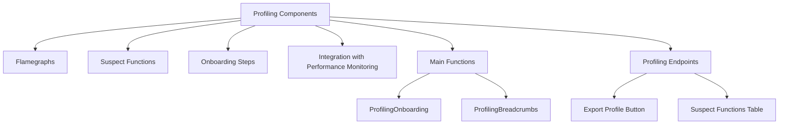

# Overview of Profiling Components

Profiling refers to the process of collecting performance data from applications to identify bottlenecks and optimize performance. Profiling is used to monitor and analyze the performance of different components within the application. The profiling components include various tools and interfaces such as flamegraphs, suspect functions, and onboarding steps to help developers understand and improve application performance.

# Flamegraphs

Flamegraphs are visual representations of profiling data that help identify performance issues by showing the hierarchical structure of function calls. They are essential for understanding which parts of the code consume the most resources.

<SwmSnippet path="/static/app/components/profiling/flamegraph/flamegraphDrawer/profileDetails.tsx" line="80">

---

The code snippet demonstrates how flamegraph preferences are used to determine the layout and resizability of the details bar in the flamegraph component.

```tsx
  const flamegraphPreferences = useFlamegraphPreferences();
  const isResizableDetailsBar =
    flamegraphPreferences.layout === 'table left' ||
    flamegraphPreferences.layout === 'table right';

  const detailsBarRef = useRef<HTMLDivElement>(null);
```

---

</SwmSnippet>

# Suspect Functions

Suspect functions are identified as potential performance bottlenecks and are displayed in tables for further analysis. These functions are crucial for pinpointing specific areas in the code that may need optimization.

<SwmSnippet path="/static/app/components/profiling/profilingOnboardingSidebar.tsx" line="266">

---

This snippet shows the initialization of various profiling options, including the selection of suspect functions for further analysis.

```tsx
    projectSlug: props.projectSlug,
    isFeedbackSelected: false,
    isPerformanceSelected: true,
    isProfilingSelected: true,
    isReplaySelected: false,
    sourcePackageRegistries: {
      isLoading: false,
      data: undefined,
    },
    platformOptions: PROFILING_ONBOARDING_STEPS,
    newOrg: false,
    feedbackOptions: {},
  };
```

---

</SwmSnippet>

# Onboarding Steps

The profiling onboarding sidebar guides users through the steps required to set up and use profiling tools effectively. This ensures that developers can quickly start using the profiling tools without extensive setup.

# Integration with Performance Monitoring

Profiling components are integrated with other performance monitoring tools to provide a comprehensive view of application performance. This integration allows for a more holistic approach to performance optimization.

<SwmSnippet path="/static/app/components/profiling/profilingOnboardingSidebar.tsx" line="199">

---

This snippet shows how profiling onboarding steps are integrated with the overall performance monitoring setup, ensuring a seamless user experience.

```tsx
            activeProductSelection={PROFILING_ONBOARDING_STEPS}
            organization={organization}
            platform={currentPlatform}
```

---

</SwmSnippet>

# Main Functions

There are several main functions in profiling. Some of them are <SwmToken path="static/app/components/profiling/profilingOnboardingSidebar.tsx" pos="54:2:2" line-data="function ProfilingOnboarding(props: CommonSidebarProps) {">`ProfilingOnboarding`</SwmToken>, <SwmToken path="static/app/components/profiling/profilingBreadcrumbs.tsx" pos="21:2:2" line-data="function ProfilingBreadcrumbs({organization, trails}: ProfilingBreadcrumbsProps) {">`ProfilingBreadcrumbs`</SwmToken>, and <SwmToken path="static/app/components/profiling/flamegraph/flamegraphDrawer/profileDetails.tsx" pos="162:2:2" line-data="        &lt;ProfileEventDetails">`ProfileEventDetails`</SwmToken>. We will dive a little into <SwmToken path="static/app/components/profiling/profilingOnboardingSidebar.tsx" pos="54:2:2" line-data="function ProfilingOnboarding(props: CommonSidebarProps) {">`ProfilingOnboarding`</SwmToken> and <SwmToken path="static/app/components/profiling/profilingBreadcrumbs.tsx" pos="21:2:2" line-data="function ProfilingBreadcrumbs({organization, trails}: ProfilingBreadcrumbsProps) {">`ProfilingBreadcrumbs`</SwmToken>.

## <SwmToken path="static/app/components/profiling/profilingOnboardingSidebar.tsx" pos="54:2:2" line-data="function ProfilingOnboarding(props: CommonSidebarProps) {">`ProfilingOnboarding`</SwmToken>

The <SwmToken path="static/app/components/profiling/profilingOnboardingSidebar.tsx" pos="54:2:2" line-data="function ProfilingOnboarding(props: CommonSidebarProps) {">`ProfilingOnboarding`</SwmToken> function initializes the onboarding process for profiling. It uses various hooks to fetch and manage project data, and it splits projects into supported and unsupported categories based on profiling support.

<SwmSnippet path="/static/app/components/profiling/profilingOnboardingSidebar.tsx" line="54">

---

This snippet shows the implementation of the <SwmToken path="static/app/components/profiling/profilingOnboardingSidebar.tsx" pos="54:2:2" line-data="function ProfilingOnboarding(props: CommonSidebarProps) {">`ProfilingOnboarding`</SwmToken> function, including how it handles supported and unsupported projects.

```tsx
function ProfilingOnboarding(props: CommonSidebarProps) {
  const pageFilters = usePageFilters();
  const organization = useOrganization();
  const {projects} = useProjects();

  const [currentProject, setCurrentProject] = useState<Project | undefined>();

  const {supported: supportedProjects, unsupported: unsupportedProjects} = useMemo(
    () => splitProjectsByProfilingSupport(projects),
    [projects]
  );

  useEffect(() => {
    if (currentProject) return;

    // we'll only ever select an unsupportedProject if they do not have a supported project in their organization
    if (supportedProjects.length === 0 && unsupportedProjects.length > 0) {
      if (pageFilters.selection.projects[0] === ALL_ACCESS_PROJECTS) {
        setCurrentProject(unsupportedProjects[0]);
        return;
      }
```

---

</SwmSnippet>

## <SwmToken path="static/app/components/profiling/profilingBreadcrumbs.tsx" pos="21:2:2" line-data="function ProfilingBreadcrumbs({organization, trails}: ProfilingBreadcrumbsProps) {">`ProfilingBreadcrumbs`</SwmToken>

The <SwmToken path="static/app/components/profiling/profilingBreadcrumbs.tsx" pos="21:2:2" line-data="function ProfilingBreadcrumbs({organization, trails}: ProfilingBreadcrumbsProps) {">`ProfilingBreadcrumbs`</SwmToken> function generates breadcrumb navigation for profiling views. It maps trails to breadcrumb items and renders them using the <SwmToken path="static/app/components/profiling/profilingBreadcrumbs.tsx" pos="26:4:4" line-data="  return &lt;_Breadcrumbs crumbs={crumbs} /&gt;;">`_Breadcrumbs`</SwmToken> component.

<SwmSnippet path="/static/app/components/profiling/profilingBreadcrumbs.tsx" line="21">

---

This snippet shows the implementation of the <SwmToken path="static/app/components/profiling/profilingBreadcrumbs.tsx" pos="21:2:2" line-data="function ProfilingBreadcrumbs({organization, trails}: ProfilingBreadcrumbsProps) {">`ProfilingBreadcrumbs`</SwmToken> function, including how it maps trails to breadcrumb items.

```tsx
function ProfilingBreadcrumbs({organization, trails}: ProfilingBreadcrumbsProps) {
  const crumbs = useMemo(
    () => trails.map(trail => trailToCrumb(trail, {organization})),
    [organization, trails]
  );
  return <_Breadcrumbs crumbs={crumbs} />;
}
```

---

</SwmSnippet>

# Profiling Endpoints

Profiling Endpoints provide various functionalities such as exporting profiling data and querying suspect functions. These endpoints are crucial for interacting with the profiling data programmatically.

## Export Profile Button

The <SwmToken path="static/app/components/profiling/exportProfileButton.tsx" pos="20:4:4" line-data="export function ExportProfileButton(props: ExportProfileButtonProps) {">`ExportProfileButton`</SwmToken> component constructs an endpoint URL to download raw profiling data for a specific event. The URL is formed using the organization ID, project ID, and event ID. This endpoint allows users to export profiling data in JSON format.

<SwmSnippet path="/static/app/components/profiling/exportProfileButton.tsx" line="20">

---

This snippet shows the implementation of the <SwmToken path="static/app/components/profiling/exportProfileButton.tsx" pos="20:4:4" line-data="export function ExportProfileButton(props: ExportProfileButtonProps) {">`ExportProfileButton`</SwmToken> component, including how it constructs the endpoint URL for exporting profiling data.

```tsx
export function ExportProfileButton(props: ExportProfileButtonProps) {
  const api = useApi();
  const organization = useOrganization();

  const project = useProjects().projects.find(p => {
    return p.slug === props.projectId;
  });

  const href = `${api.baseUrl}/projects/${props.orgId}/${props.projectId}/profiling/raw_profiles/${props.eventId}/`;
  const download = `${organization.slug}_${
    project?.slug ?? props.projectId ?? 'unknown_project'
  }_${props.eventId}.profile.json`;

  const title = t('Export Profile');

  return props.variant === 'xs' ? (
    <StyledButtonSmall size="xs" title={title} href={href} download={download} {...props}>
      {props.children}
      <IconDownload size="xs" />
    </StyledButtonSmall>
  ) : (
```

---

</SwmSnippet>

## Suspect Functions Table

The <SwmToken path="static/app/components/profiling/suspectFunctions/suspectFunctionsTable.tsx" pos="25:4:4" line-data="export function SuspectFunctionsTable({">`SuspectFunctionsTable`</SwmToken> component uses the <SwmToken path="static/app/components/profiling/suspectFunctions/suspectFunctionsTable.tsx" pos="69:7:7" line-data="  const functionsQuery = useProfileFunctions&lt;FunctionsField&gt;({">`useProfileFunctions`</SwmToken> hook to query an endpoint that retrieves profiling data related to suspect functions. The query includes parameters such as fields, sort order, and filters based on the transaction and function type. This endpoint helps in identifying potential performance bottlenecks.

<SwmSnippet path="/static/app/components/profiling/suspectFunctions/suspectFunctionsTable.tsx" line="69">

---

This snippet shows the implementation of the <SwmToken path="static/app/components/profiling/suspectFunctions/suspectFunctionsTable.tsx" pos="25:4:4" line-data="export function SuspectFunctionsTable({">`SuspectFunctionsTable`</SwmToken> component, including how it queries the endpoint for suspect functions data.

```tsx
  const functionsQuery = useProfileFunctions<FunctionsField>({
    fields: functionsFields,
    referrer: 'api.profiling.profile-summary-functions-table',
    sort: functionsSort,
    query,
    limit: 5,
    cursor: functionsCursor,
  });
```

---

</SwmSnippet>

&nbsp;

*This is an auto-generated document by Swimm AI 🌊 and has not yet been verified by a human*

<SwmMeta version="3.0.0" repo-id="Z2l0aHViJTNBJTNBc2VudHJ5LWRlbW8tMSUzQSUzQVN3aW1tLURlbW8=" repo-name="sentry-demo-1" doc-type="overview"><sup>Powered by [Swimm](/)</sup></SwmMeta>
