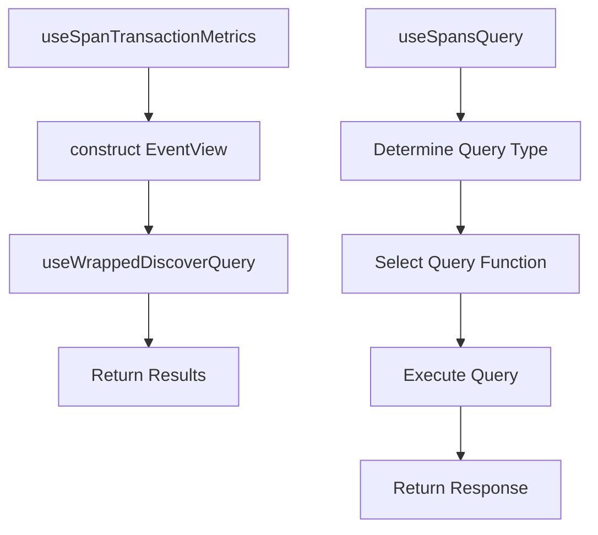

# Overview of Queries in Common

Queries are used to fetch data from various sources and endpoints. They are implemented using different hooks and functions to retrieve and manage data efficiently.

## <SwmToken path="static/app/views/insights/common/queries/useSpansQuery.tsx" pos="21:4:4" line-data="export function useSpansQuery&lt;T = any[]&gt;({">`useSpansQuery`</SwmToken>

The <SwmToken path="static/app/views/insights/common/queries/useSpansQuery.tsx" pos="21:4:4" line-data="export function useSpansQuery&lt;T = any[]&gt;({">`useSpansQuery`</SwmToken> function uses <SwmToken path="static/app/views/insights/common/queries/useSpansQuery.tsx" pos="9:3:3" line-data="import {useGenericDiscoverQuery} from &#39;sentry/utils/discover/genericDiscoverQuery&#39;;">`useGenericDiscoverQuery`</SwmToken> to fetch span data based on specific parameters like <SwmToken path="static/app/views/insights/common/queries/useReleases.tsx" pos="54:3:3" line-data="      const eventView = EventView.fromNewQueryWithPageFilters(newQuery, selection);">`eventView`</SwmToken>, <SwmToken path="static/app/views/insights/common/queries/useReleases.tsx" pos="59:6:6" line-data="            ...eventView.getEventsAPIPayload(location),">`location`</SwmToken>, and <SwmToken path="static/app/views/insights/common/queries/useSpansQuery.tsx" pos="91:1:1" line-data="    orgSlug: organization.slug,">`orgSlug`</SwmToken>. It waits for page filters to be ready before enabling the query to prevent clobbering requests.

## <SwmToken path="static/app/views/insights/common/queries/useDiscover.ts" pos="32:3:3" line-data="  return useDiscover&lt;Fields, SpanIndexedResponse&gt;(">`useDiscover`</SwmToken>

The <SwmToken path="static/app/views/insights/common/queries/useDiscover.ts" pos="32:3:3" line-data="  return useDiscover&lt;Fields, SpanIndexedResponse&gt;(">`useDiscover`</SwmToken> function is a generic function used by other hooks like <SwmToken path="static/app/views/insights/common/queries/useDiscover.ts" pos="28:4:4" line-data="export const useSpansIndexed = &lt;Fields extends SpanIndexedField[]&gt;(">`useSpansIndexed`</SwmToken>, <SwmToken path="static/app/views/insights/common/queries/useDiscover.ts" pos="39:4:4" line-data="export const useSpanMetrics = &lt;Fields extends SpanMetricsProperty[]&gt;(">`useSpanMetrics`</SwmToken>, and <SwmToken path="static/app/views/insights/common/queries/useDiscover.ts" pos="50:4:4" line-data="export const useMetrics = &lt;Fields extends MetricsProperty[]&gt;(">`useMetrics`</SwmToken> to fetch different types of data based on the provided options and dataset.

<SwmSnippet path="/static/app/views/insights/common/queries/useDiscover.ts" line="28">

---

The <SwmToken path="static/app/views/insights/common/queries/useDiscover.ts" pos="32:3:3" line-data="  return useDiscover&lt;Fields, SpanIndexedResponse&gt;(">`useDiscover`</SwmToken> function uses <SwmToken path="static/app/views/insights/common/queries/useSpanTransactionMetrics.tsx" pos="39:3:3" line-data="  return useWrappedDiscoverQuery&lt;SpanTransactionMetrics[]&gt;({">`useWrappedDiscoverQuery`</SwmToken> to fetch data based on the event view, initial data, limit, and other options.

```typescript
export const useSpansIndexed = <Fields extends SpanIndexedField[]>(
  options: UseMetricsOptions<Fields> = {},
  referrer: string
) => {
  return useDiscover<Fields, SpanIndexedResponse>(
    options,
    DiscoverDatasets.SPANS_INDEXED,
    referrer
  );
};

export const useSpanMetrics = <Fields extends SpanMetricsProperty[]>(
  options: UseMetricsOptions<Fields> = {},
  referrer: string
) => {
  return useDiscover<Fields, SpanMetricsResponse>(
    options,
    DiscoverDatasets.SPANS_METRICS,
    referrer
  );
};
```

---

</SwmSnippet>

<SwmSnippet path="/static/app/views/insights/common/queries/useSpanSamples.tsx" line="100">

---

The <SwmToken path="static/app/views/insights/common/queries/useSpanSamples.tsx" pos="45:4:4" line-data="export const useSpanSamples = (options: Options) =&gt; {">`useSpanSamples`</SwmToken> function constructs query strings to be sent to the API endpoints.

```tsx
    groupId && transactionName && !isLoadingSeries && pageFilter.isReady
  );

  const queryString = query.formatString();

  const result = useQuery<SpanSample[]>({
    queryKey: [
      'span-samples',
      groupId,
      transactionName,
      dateCondtions.statsPeriod,
      dateCondtions.start,
      dateCondtions.end,
      queryString,
      subregions?.join(','),
      additionalFields?.join(','),
    ],
    queryFn: async () => {
      const {data} = await api.requestPromise(
        `${url}?${qs.stringify({
          ...dateCondtions,
```

---

</SwmSnippet>

## Constructing Query Payloads

In <SwmToken path="static/app/views/insights/common/queries/useReleases.tsx" pos="17:4:4" line-data="export function useReleases(searchTerm?: string) {">`useReleases`</SwmToken>, query payloads are constructed to fetch release metrics data.

<SwmSnippet path="/static/app/views/insights/common/queries/useReleases.tsx" line="40">

---

The <SwmToken path="static/app/views/insights/common/queries/useReleases.tsx" pos="17:4:4" line-data="export function useReleases(searchTerm?: string) {">`useReleases`</SwmToken> function constructs query payloads to fetch release metrics data.

```tsx
  const chunks = releaseResults.data?.length ? chunk(releaseResults.data, 10) : [];

  const releaseMetrics = useQueries({
    queries: chunks.map(releases => {
      const newQuery: NewQuery = {
        name: '',
        fields: ['release', 'count()'],
        query: `transaction.op:ui.load ${escapeFilterValue(
          `release:[${releases.map(r => `"${r.version}"`).join()}]`
        )}`,
        dataset: DiscoverDatasets.METRICS,
        version: 2,
        projects: selection.projects,
      };
      const eventView = EventView.fromNewQueryWithPageFilters(newQuery, selection);
      const queryKey = [
        `/organizations/${organization.slug}/events/`,
        {
          query: {
            ...eventView.getEventsAPIPayload(location),
            referrer: 'api.starfish.mobile-release-selector',
```

---

</SwmSnippet>

## Endpoints of Queries

Endpoints of queries include functions like <SwmToken path="static/app/views/insights/common/queries/useSpanTransactionMetrics.tsx" pos="27:4:4" line-data="export const useSpanTransactionMetrics = (">`useSpanTransactionMetrics`</SwmToken> and <SwmToken path="static/app/views/insights/common/queries/useSpansQuery.tsx" pos="21:4:4" line-data="export function useSpansQuery&lt;T = any[]&gt;({">`useSpansQuery`</SwmToken>.

### <SwmToken path="static/app/views/insights/common/queries/useSpanTransactionMetrics.tsx" pos="27:4:4" line-data="export const useSpanTransactionMetrics = (">`useSpanTransactionMetrics`</SwmToken>

The <SwmToken path="static/app/views/insights/common/queries/useSpanTransactionMetrics.tsx" pos="27:4:4" line-data="export const useSpanTransactionMetrics = (">`useSpanTransactionMetrics`</SwmToken> function is an endpoint that fetches span transaction metrics. It constructs an <SwmToken path="static/app/views/insights/common/queries/useReleases.tsx" pos="54:3:3" line-data="      const eventView = EventView.fromNewQueryWithPageFilters(newQuery, selection);">`eventView`</SwmToken> based on the provided filters, sorts, and extra fields, and then uses <SwmToken path="static/app/views/insights/common/queries/useSpanTransactionMetrics.tsx" pos="39:3:3" line-data="  return useWrappedDiscoverQuery&lt;SpanTransactionMetrics[]&gt;({">`useWrappedDiscoverQuery`</SwmToken> to execute the query and return the results.

<SwmSnippet path="/static/app/views/insights/common/queries/useSpanTransactionMetrics.tsx" line="27">

---

The <SwmToken path="static/app/views/insights/common/queries/useSpanTransactionMetrics.tsx" pos="27:4:4" line-data="export const useSpanTransactionMetrics = (">`useSpanTransactionMetrics`</SwmToken> function constructs an <SwmToken path="static/app/views/insights/common/queries/useSpanTransactionMetrics.tsx" pos="37:3:3" line-data="  const eventView = getEventView(location, filters, sorts, extraFields);">`eventView`</SwmToken> and uses <SwmToken path="static/app/views/insights/common/queries/useSpanTransactionMetrics.tsx" pos="39:3:3" line-data="  return useWrappedDiscoverQuery&lt;SpanTransactionMetrics[]&gt;({">`useWrappedDiscoverQuery`</SwmToken> to fetch span transaction metrics.

```tsx
export const useSpanTransactionMetrics = (
  filters: MetricsFilters,
  sorts?: Sort[],
  cursor?: string,
  extraFields?: string[],
  enabled: boolean = true,
  referrer = 'api.starfish.span-transaction-metrics'
) => {
  const location = useLocation();

  const eventView = getEventView(location, filters, sorts, extraFields);

  return useWrappedDiscoverQuery<SpanTransactionMetrics[]>({
    eventView,
    initialData: [],
    enabled,
    limit: 25,
    referrer,
    cursor,
  });
};
```

---

</SwmSnippet>

### <SwmToken path="static/app/views/insights/common/queries/useSpansQuery.tsx" pos="21:4:4" line-data="export function useSpansQuery&lt;T = any[]&gt;({">`useSpansQuery`</SwmToken>

The <SwmToken path="static/app/views/insights/common/queries/useSpansQuery.tsx" pos="21:4:4" line-data="export function useSpansQuery&lt;T = any[]&gt;({">`useSpansQuery`</SwmToken> function is an endpoint that fetches span data. It determines whether the query is a timeseries query and selects the appropriate query function (<SwmToken path="static/app/views/insights/common/queries/useSpansQuery.tsx" pos="38:3:3" line-data="    ? useWrappedDiscoverTimeseriesQuery">`useWrappedDiscoverTimeseriesQuery`</SwmToken> or <SwmToken path="static/app/views/insights/common/queries/useSpanTransactionMetrics.tsx" pos="39:3:3" line-data="  return useWrappedDiscoverQuery&lt;SpanTransactionMetrics[]&gt;({">`useWrappedDiscoverQuery`</SwmToken>). It then executes the query and returns the response.

<SwmSnippet path="/static/app/views/insights/common/queries/useSpansQuery.tsx" line="21">

---

The <SwmToken path="static/app/views/insights/common/queries/useSpansQuery.tsx" pos="21:4:4" line-data="export function useSpansQuery&lt;T = any[]&gt;({">`useSpansQuery`</SwmToken> function determines the query type and selects the appropriate query function to fetch span data.

```tsx
export function useSpansQuery<T = any[]>({
  eventView,
  initialData,
  limit,
  enabled,
  referrer = 'use-spans-query',
  cursor,
}: {
  cursor?: string;
  enabled?: boolean;
  eventView?: EventView;
  initialData?: T;
  limit?: number;
  referrer?: string;
}) {
  const isTimeseriesQuery = (eventView?.yAxis?.length ?? 0) > 0;
  const queryFunction = isTimeseriesQuery
    ? useWrappedDiscoverTimeseriesQuery
    : useWrappedDiscoverQuery;

  const {isReady: pageFiltersReady} = usePageFilters();
```

---

</SwmSnippet>

&nbsp;

*This is an auto-generated document by Swimm AI 🌊 and has not yet been verified by a human*

<SwmMeta version="3.0.0" repo-id="Z2l0aHViJTNBJTNBc2VudHJ5LWRlbW8tMSUzQSUzQVN3aW1tLURlbW8=" repo-name="sentry-demo-1" doc-type="overview"><sup>Powered by [Swimm](/)</sup></SwmMeta>
