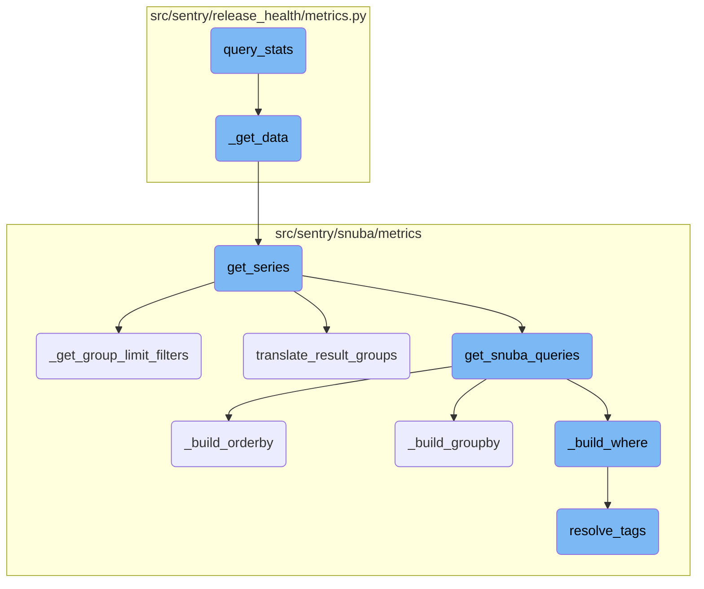
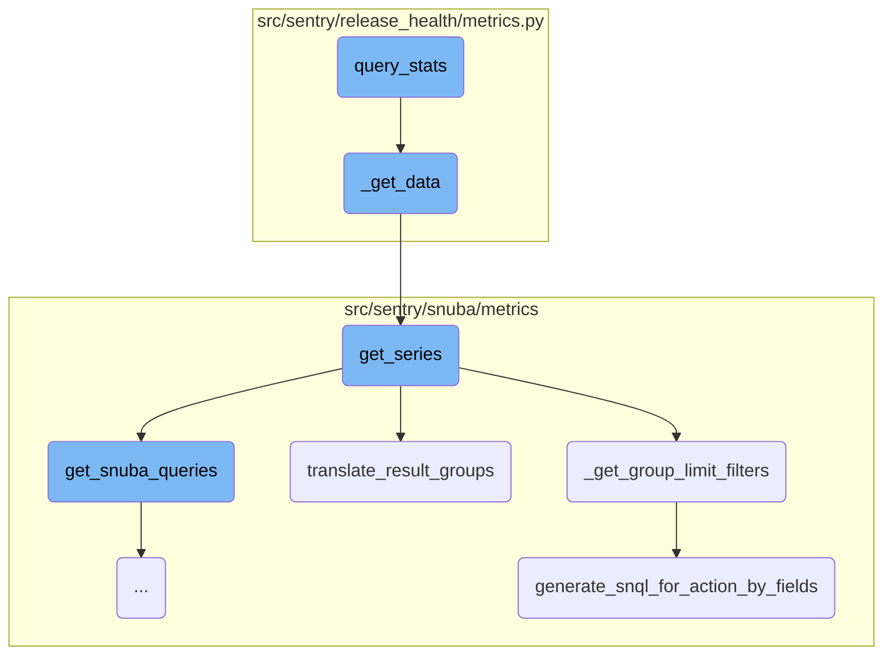
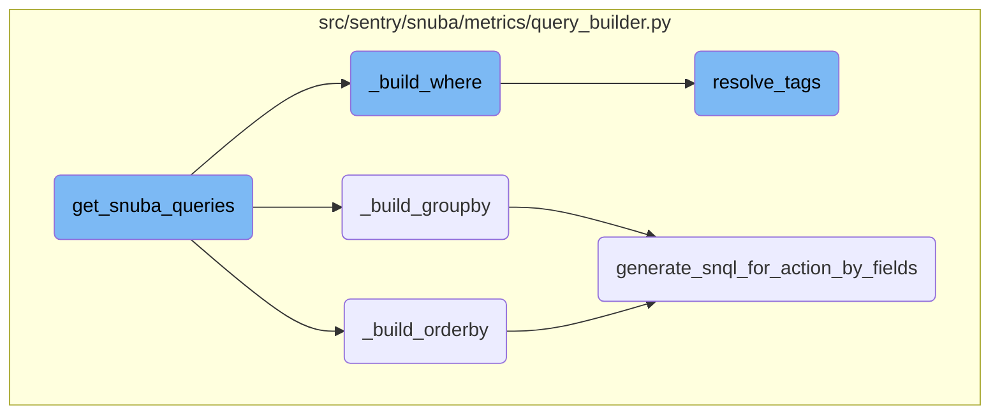

This document provides an overview of the <SwmToken path="src/sentry/release_health/metrics.py" pos="1117:3:3" line-data="        def query_stats(end: datetime) -&gt; CrashFreeBreakdown:">`query_stats`</SwmToken> function, which is responsible for gathering crash-free statistics for both sessions and users. It explains the flow of data through various functions and how these functions interact to produce the final statistics.

The <SwmToken path="src/sentry/release_health/metrics.py" pos="1117:3:3" line-data="        def query_stats(end: datetime) -&gt; CrashFreeBreakdown:">`query_stats`</SwmToken> function collects data on how many sessions and users are crash-free. It first calls another function to get the total and crash-free numbers for sessions and users. Then, it formats this data into a dictionary that includes the date, total users, crash-free users, total sessions, and crash-free sessions. This process involves several steps, including constructing a query, executing it, and processing the results to ensure the data is accurate and well-organized.

Here is a high level diagram of the flow, showing only the most important functions:



# Flow drill down

First, we'll zoom into this section of the flow:



<SwmSnippet path="/src/sentry/release_health/metrics.py" line="1117">

---

## <SwmToken path="src/sentry/release_health/metrics.py" pos="1117:3:3" line-data="        def query_stats(end: datetime) -&gt; CrashFreeBreakdown:">`query_stats`</SwmToken>

The <SwmToken path="src/sentry/release_health/metrics.py" pos="1117:3:3" line-data="        def query_stats(end: datetime) -&gt; CrashFreeBreakdown:">`query_stats`</SwmToken> function is responsible for gathering crash-free statistics for both sessions and users. It calls the <SwmToken path="src/sentry/release_health/metrics.py" pos="1118:3:3" line-data="            def _get_data(select: list[MetricField]) -&gt; tuple[int, int]:">`_get_data`</SwmToken> function twice with different metric fields to retrieve the total and crash-free rates for sessions and users. The results are then formatted into a dictionary containing the date, total users, crash-free users, total sessions, and crash-free sessions.

```python
        def query_stats(end: datetime) -> CrashFreeBreakdown:
            def _get_data(select: list[MetricField]) -> tuple[int, int]:
                query = DeprecatingMetricsQuery(
                    org_id=org_id,
                    project_ids=[project_id],
                    select=select,
                    start=start,
                    end=end,
                    where=where,
                    granularity=Granularity(LEGACY_SESSIONS_DEFAULT_ROLLUP),
                    include_series=False,
                    include_totals=True,
                )

                raw_result = get_series(
                    projects=projects,
                    metrics_query=query,
                    use_case_id=USE_CASE_ID,
                )

                groups = raw_result["groups"]
```

---

</SwmSnippet>

<SwmSnippet path="/src/sentry/release_health/metrics.py" line="1118">

---

## <SwmToken path="src/sentry/release_health/metrics.py" pos="1118:3:3" line-data="            def _get_data(select: list[MetricField]) -&gt; tuple[int, int]:">`_get_data`</SwmToken>

The <SwmToken path="src/sentry/release_health/metrics.py" pos="1118:3:3" line-data="            def _get_data(select: list[MetricField]) -&gt; tuple[int, int]:">`_get_data`</SwmToken> function constructs a <SwmToken path="src/sentry/release_health/metrics.py" pos="1119:5:5" line-data="                query = DeprecatingMetricsQuery(">`DeprecatingMetricsQuery`</SwmToken> to fetch metrics data. It uses the <SwmToken path="src/sentry/release_health/metrics.py" pos="1131:5:5" line-data="                raw_result = get_series(">`get_series`</SwmToken> function to execute the query and retrieve raw results. The function then extracts the total and crashed counts from the results and returns them.

```python
            def _get_data(select: list[MetricField]) -> tuple[int, int]:
                query = DeprecatingMetricsQuery(
                    org_id=org_id,
                    project_ids=[project_id],
                    select=select,
                    start=start,
                    end=end,
                    where=where,
                    granularity=Granularity(LEGACY_SESSIONS_DEFAULT_ROLLUP),
                    include_series=False,
                    include_totals=True,
                )

                raw_result = get_series(
                    projects=projects,
                    metrics_query=query,
                    use_case_id=USE_CASE_ID,
                )

                groups = raw_result["groups"]
                assert len(groups) == 1
```

---

</SwmSnippet>

<SwmSnippet path="/src/sentry/snuba/metrics/datasource.py" line="897">

---

## <SwmToken path="src/sentry/snuba/metrics/datasource.py" pos="897:2:2" line-data="def get_series(">`get_series`</SwmToken>

The <SwmToken path="src/sentry/snuba/metrics/datasource.py" pos="897:2:2" line-data="def get_series(">`get_series`</SwmToken> function executes a time series query based on the provided <SwmToken path="src/sentry/snuba/metrics/datasource.py" pos="899:4:4" line-data="    metrics_query: DeprecatingMetricsQuery,">`DeprecatingMetricsQuery`</SwmToken>. It handles the construction of the query, execution, and processing of the results. The function also manages the grouping and ordering of the results, ensuring that the data is correctly aggregated and sorted.

```python
def get_series(
    projects: Sequence[Project],
    metrics_query: DeprecatingMetricsQuery,
    use_case_id: UseCaseID,
    include_meta: bool = False,
    tenant_ids: dict[str, Any] | None = None,
) -> dict:
    """Get time series for the given query"""

    organization_id = projects[0].organization_id if projects else None
    tenant_ids = dict()
    if organization_id is not None:
        tenant_ids["organization_id"] = organization_id
    tenant_ids["use_case_id"] = use_case_id.value

    if metrics_query.interval is not None:
        interval = metrics_query.interval
    else:
        interval = metrics_query.granularity.granularity

    start, end, _num_intervals = to_intervals(metrics_query.start, metrics_query.end, interval)
```

---

</SwmSnippet>

<SwmSnippet path="/src/sentry/snuba/metrics/datasource.py" line="763">

---

## <SwmToken path="src/sentry/snuba/metrics/datasource.py" pos="763:2:2" line-data="def _get_group_limit_filters(">`_get_group_limit_filters`</SwmToken>

The <SwmToken path="src/sentry/snuba/metrics/datasource.py" pos="763:2:2" line-data="def _get_group_limit_filters(">`_get_group_limit_filters`</SwmToken> function generates filters for limiting the groups in the query results. It creates conditions based on the group-by fields and their values, ensuring that the query results are filtered down to the relevant groups.

```python
def _get_group_limit_filters(
    metrics_query: DeprecatingMetricsQuery,
    results: list[Mapping[str, int]],
    use_case_id: UseCaseID,
) -> GroupLimitFilters | None:
    if not metrics_query.groupby or not results:
        return None

    # Creates a mapping of groupBy fields to their equivalent SnQL
    key_to_condition_dict: dict[Groupable, Any] = {}
    for metric_groupby_obj in metrics_query.groupby:
        key_to_condition_dict[
            metric_groupby_obj.name
        ] = SnubaQueryBuilder.generate_snql_for_action_by_fields(
            metric_action_by_field=metric_groupby_obj,
            use_case_id=use_case_id,
            org_id=metrics_query.org_id,
            projects=Project.objects.get_many_from_cache(metrics_query.project_ids),
            is_column=True,
        )

```

---

</SwmSnippet>

<SwmSnippet path="/src/sentry/snuba/metrics/query_builder.py" line="1333">

---

## <SwmToken path="src/sentry/snuba/metrics/query_builder.py" pos="1333:3:3" line-data="    def translate_result_groups(self):">`translate_result_groups`</SwmToken>

The <SwmToken path="src/sentry/snuba/metrics/query_builder.py" pos="1333:3:3" line-data="    def translate_result_groups(self):">`translate_result_groups`</SwmToken> function processes the raw query results and translates them into a more readable format. It handles the extraction of data, reverse resolution of tag values, and application of post-query operations. The function ensures that the final results are correctly formatted and contain the necessary information.

```python
    def translate_result_groups(self):
        groups = {}
        for _, subresults in self._results.items():
            for k in "totals", "series":
                if k in subresults:
                    for data in subresults[k]["data"]:
                        self._extract_data(data, groups)

        # Creating this dictionary serves the purpose of having a mapping from the alias of a groupBy column to the
        # original groupBy column, and we need this to determine for which tag values we don't need to reverse resolve
        # in the indexer. As an example, we do not want to reverse resolve tag values for project_ids.
        # Another exception is `team_key_transaction` derived op since we don't want to reverse resolve its value as
        # it is just a boolean. Therefore we rely on creating a mapping from the alias to the operation in this case
        # to determine whether we need to reverse the tag value or not.
        groupby_alias_to_groupby_column = (
            {
                metric_groupby_obj.alias: (
                    metric_groupby_obj.field
                    if isinstance(metric_groupby_obj.field, str)
                    else metric_groupby_obj.field.op
                )
```

---

</SwmSnippet>

<SwmSnippet path="/src/sentry/snuba/metrics/query_builder.py" line="794">

---

## <SwmToken path="src/sentry/snuba/metrics/query_builder.py" pos="794:3:3" line-data="    def generate_snql_for_action_by_fields(">`generate_snql_for_action_by_fields`</SwmToken>

The <SwmToken path="src/sentry/snuba/metrics/query_builder.py" pos="794:3:3" line-data="    def generate_snql_for_action_by_fields(">`generate_snql_for_action_by_fields`</SwmToken> function generates the necessary <SwmToken path="src/sentry/snuba/metrics/query_builder.py" pos="802:7:7" line-data="        Generates the necessary snql for any action by field which in our case will be group by and order by. This">`snql`</SwmToken> (Snuba Query Language) for group-by and order-by fields. It handles the transformation of metric fields and string fields into the appropriate <SwmToken path="src/sentry/snuba/metrics/query_builder.py" pos="802:7:7" line-data="        Generates the necessary snql for any action by field which in our case will be group by and order by. This">`snql`</SwmToken> expressions, ensuring that the query is correctly constructed for execution.

```python
    def generate_snql_for_action_by_fields(
        metric_action_by_field: MetricActionByField,
        use_case_id: UseCaseID,
        org_id: int,
        projects: Sequence[Project],
        is_column: bool = False,
    ) -> list[OrderBy] | Column | AliasedExpression | Function:
        """
        Generates the necessary snql for any action by field which in our case will be group by and order by. This
        function has been designed to share as much logic as possible, however, it should be refactored in case
        the snql generation starts to diverge significantly.
        """

        is_group_by = isinstance(metric_action_by_field, MetricGroupByField)
        is_order_by = isinstance(metric_action_by_field, MetricOrderByField)
        if not is_group_by and not is_order_by:
            raise InvalidParams("The metric action must either be an order by or group by.")

        if isinstance(metric_action_by_field.field, str):
            # This transformation is currently supported only for group by because OrderBy doesn't support the Function type.
            if is_group_by and metric_action_by_field.field == "transaction":
```

---

</SwmSnippet>

Now, lets zoom into this section of the flow:



<SwmSnippet path="/src/sentry/snuba/metrics/query_builder.py" line="1116">

---

## <SwmToken path="src/sentry/snuba/metrics/query_builder.py" pos="1116:3:3" line-data="    def get_snuba_queries(self):">`get_snuba_queries`</SwmToken>

The function <SwmToken path="src/sentry/snuba/metrics/query_builder.py" pos="1116:3:3" line-data="    def get_snuba_queries(self):">`get_snuba_queries`</SwmToken> is responsible for constructing the Snuba queries based on the metrics provided. It iterates over the selected metrics, determines their entities, and builds the necessary query components such as <SwmToken path="src/sentry/snuba/metrics/query_builder.py" pos="1120:11:11" line-data="        for field in self._metrics_query.select:">`select`</SwmToken>, <SwmToken path="src/sentry/snuba/metrics/query_builder.py" pos="1126:21:21" line-data="                #  When we get to an instance of a MetricFieldBase where the entity is an">`where`</SwmToken>, <SwmToken path="src/sentry/snuba/metrics/datasource.py" pos="768:7:7" line-data="    if not metrics_query.groupby or not results:">`groupby`</SwmToken>, and <SwmToken path="src/sentry/snuba/metrics/query_builder.py" pos="800:7:7" line-data="    ) -&gt; list[OrderBy] | Column | AliasedExpression | Function:">`OrderBy`</SwmToken>. This function ensures that the queries are correctly formed and ready to be executed.

```python
    def get_snuba_queries(self):
        metric_mri_to_obj_dict = {}
        fields_in_entities = {}

        for field in self._metrics_query.select:
            metric_field_obj = metric_object_factory(field.op, field.metric_mri)
            # `get_entity` is called the first, to fetch the entities of constituent metrics,
            # and validate especially in the case of SingularEntityDerivedMetric that it is
            # actually composed of metrics that belong to the same entity
            try:
                #  When we get to an instance of a MetricFieldBase where the entity is an
                #  instance of dict, we know it is from a composite entity derived metric, and
                #  we need to traverse down the constituent metrics dependency tree until we get
                #  to instances of SingleEntityDerivedMetric, and add those to our queries so
                #  that we are able to generate the original CompositeEntityDerivedMetric later
                #  on as a result of a post query operation on the results of the constituent
                #  SingleEntityDerivedMetric instances
                component_entities = metric_field_obj.get_entity(
                    projects=self._projects, use_case_id=self._use_case_id
                )
                if isinstance(component_entities, dict):
```

---

</SwmSnippet>

<SwmSnippet path="/src/sentry/snuba/metrics/query_builder.py" line="974">

---

### <SwmToken path="src/sentry/snuba/metrics/query_builder.py" pos="974:3:3" line-data="    def _build_orderby(self) -&gt; list[OrderBy] | None:">`_build_orderby`</SwmToken>

The function <SwmToken path="src/sentry/snuba/metrics/query_builder.py" pos="974:3:3" line-data="    def _build_orderby(self) -&gt; list[OrderBy] | None:">`_build_orderby`</SwmToken> constructs the <SwmToken path="src/sentry/snuba/metrics/query_builder.py" pos="802:37:39" line-data="        Generates the necessary snql for any action by field which in our case will be group by and order by. This">`order by`</SwmToken> clause for the Snuba query. It processes the <SwmToken path="src/sentry/snuba/metrics/query_builder.py" pos="974:12:12" line-data="    def _build_orderby(self) -&gt; list[OrderBy] | None:">`OrderBy`</SwmToken> fields specified in the metrics query and generates the corresponding Snuba query components.

```python
    def _build_orderby(self) -> list[OrderBy] | None:
        if self._metrics_query.orderby is None:
            return None

        orderby_fields = []
        for metric_order_by_obj in self._metrics_query.orderby:
            orderby_fields.extend(
                self.generate_snql_for_action_by_fields(
                    metric_action_by_field=metric_order_by_obj,
                    use_case_id=self._use_case_id,
                    org_id=self._org_id,
                    projects=self._projects,
                    is_column=True,
                )
            )

        return orderby_fields
```

---

</SwmSnippet>

<SwmSnippet path="/src/sentry/snuba/metrics/query_builder.py" line="957">

---

### <SwmToken path="src/sentry/snuba/metrics/query_builder.py" pos="957:3:3" line-data="    def _build_groupby(self) -&gt; list[Column] | None:">`_build_groupby`</SwmToken>

The function <SwmToken path="src/sentry/snuba/metrics/query_builder.py" pos="957:3:3" line-data="    def _build_groupby(self) -&gt; list[Column] | None:">`_build_groupby`</SwmToken> constructs the <SwmToken path="src/sentry/snuba/metrics/query_builder.py" pos="802:31:33" line-data="        Generates the necessary snql for any action by field which in our case will be group by and order by. This">`group by`</SwmToken> clause for the Snuba query. It processes the <SwmToken path="src/sentry/snuba/metrics/query_builder.py" pos="958:7:7" line-data="        if self._metrics_query.groupby is None:">`groupby`</SwmToken> fields specified in the metrics query and generates the corresponding Snuba query components.

```python
    def _build_groupby(self) -> list[Column] | None:
        if self._metrics_query.groupby is None:
            return None

        groupby_cols = []

        for metric_groupby_obj in self._metrics_query.groupby or []:
            groupby_cols.append(
                self.generate_snql_for_action_by_fields(
                    metric_action_by_field=metric_groupby_obj,
                    use_case_id=self._use_case_id,
                    org_id=self._org_id,
                    projects=self._projects,
                )
            )
        return groupby_cols
```

---

</SwmSnippet>

<SwmSnippet path="/src/sentry/snuba/metrics/query_builder.py" line="890">

---

### <SwmToken path="src/sentry/snuba/metrics/query_builder.py" pos="890:3:3" line-data="    def _build_where(self) -&gt; list[BooleanCondition | Condition]:">`_build_where`</SwmToken>

The function <SwmToken path="src/sentry/snuba/metrics/query_builder.py" pos="890:3:3" line-data="    def _build_where(self) -&gt; list[BooleanCondition | Condition]:">`_build_where`</SwmToken> constructs the <SwmToken path="src/sentry/snuba/metrics/query_builder.py" pos="891:1:1" line-data="        where: list[BooleanCondition | Condition] = [">`where`</SwmToken> clause for the Snuba query. It includes conditions based on the organization ID, project <SwmToken path="src/sentry/release_health/metrics.py" pos="90:7:7" line-data="    Maps Environment Model ids to the environment name">`ids`</SwmToken>, and any additional filters specified in the metrics query. This function ensures that the query only retrieves relevant data.

```python
    def _build_where(self) -> list[BooleanCondition | Condition]:
        where: list[BooleanCondition | Condition] = [
            Condition(Column("org_id"), Op.EQ, self._org_id),
            Condition(Column("project_id"), Op.IN, self._metrics_query.project_ids),
        ]

        where += self._build_timeframe()

        if not self._metrics_query.where:
            return where

        snuba_conditions = []
        # Adds filters that do not need to be resolved because they are instances of `MetricConditionField`
        metric_condition_filters = []
        for condition in self._metrics_query.where:
            if isinstance(condition, MetricConditionField):
                metric_expression = metric_object_factory(
                    condition.lhs.op, condition.lhs.metric_mri
                )
                try:
                    metric_condition_filters.append(
```

---

</SwmSnippet>

<SwmSnippet path="/src/sentry/snuba/metrics/query_builder.py" line="179">

---

### <SwmToken path="src/sentry/snuba/metrics/query_builder.py" pos="179:2:2" line-data="def resolve_tags(">`resolve_tags`</SwmToken>

The function <SwmToken path="src/sentry/snuba/metrics/query_builder.py" pos="179:2:2" line-data="def resolve_tags(">`resolve_tags`</SwmToken> translates tags in the Snuba condition. It handles various types of input, including lists, functions, conditions, and columns, and resolves them to their corresponding Snuba representations. This function is crucial for ensuring that the query conditions are correctly interpreted and executed by Snuba.

```python
def resolve_tags(
    use_case_id: UseCaseID,
    org_id: int,
    input_: Any,
    projects: Sequence[Project],
    is_tag_value: bool = False,
    allowed_tag_keys: dict[str, str] | None = None,
) -> Any:
    """Translate tags in snuba condition

    Column("metric_id") is not supported.
    """
    if input_ is None:
        return None
    if isinstance(input_, (list, tuple)):
        elements = [
            resolve_tags(
                use_case_id,
                org_id,
                item,
                projects,
```

---

</SwmSnippet>

&nbsp;

*This is an auto-generated document by Swimm AI 🌊 and has not yet been verified by a human*

<SwmMeta version="3.0.0" repo-id="Z2l0aHViJTNBJTNBc2VudHJ5LWRlbW8tMSUzQSUzQVN3aW1tLURlbW8=" repo-name="sentry-demo-1" doc-type="flows"><sup>Powered by [Swimm](/)</sup></SwmMeta>
