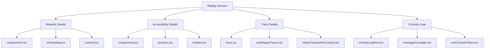

# Introduction to Replay Details

Replay Details provide specific information and data points related to a replay session. This includes various aspects such as network details, accessibility details, trace details, and console logs. The detail section offers a comprehensive view of the replay session, enabling developers to analyze and debug issues effectively.

## Network Details

The network details section includes components that render network-related information of the replay session. Key files involved are <SwmPath>[static/app/components/globalDrawer/components.tsx](static/app/components/globalDrawer/components.tsx)</SwmPath>, <SwmPath>[static/app/types/onboarding.tsx](static/app/types/onboarding.tsx)</SwmPath>, and <SwmPath>[static/app/components/events/interfaces/crashContent/exception/content.tsx](static/app/components/events/interfaces/crashContent/exception/content.tsx)</SwmPath>.

<SwmSnippet path="/static/app/views/replays/detail/network/details/index.tsx" line="26">

---

This code snippet shows how network details are rendered. It includes the <SwmToken path="static/app/views/replays/detail/network/details/index.tsx" pos="45:2:2" line-data="        &lt;NetworkDetailsTabs underlined={false} /&gt;">`NetworkDetailsTabs`</SwmToken> component which is responsible for displaying the network-related information.

```tsx
  projectId,
  startTimestampMs,
}: Props) {
  const {getParamValue: getDetailTab} = useUrlParams('n_detail_tab', 'details');

  if (!item || !projectId) {
    return null;
  }

  const visibleTab = getDetailTab() as TabKey;

  return (
    <Fragment>
      <DetailsSplitDivider
        isHeld={isHeld}
        onClose={onClose}
        onDoubleClick={onDoubleClick}
        onMouseDown={onMouseDown}
      >
        <NetworkDetailsTabs underlined={false} />
```

---

</SwmSnippet>

## Accessibility Details

The accessibility details section includes files such as <SwmPath>[static/app/components/globalDrawer/components.tsx](static/app/components/globalDrawer/components.tsx)</SwmPath>, <SwmPath>[static/app/views/replays/detail/accessibility/details/sections.tsx](static/app/views/replays/detail/accessibility/details/sections.tsx)</SwmPath>, and <SwmPath>[static/app/components/events/interfaces/crashContent/exception/content.tsx](static/app/components/events/interfaces/crashContent/exception/content.tsx)</SwmPath>, which handle the display and organization of accessibility-related data.

## Trace Details

Trace details are managed by files like <SwmPath>[static/app/views/performance/newTraceDetails/trace.tsx](static/app/views/performance/newTraceDetails/trace.tsx)</SwmPath>, <SwmPath>[static/app/views/replays/detail/trace/useReplayTraces.tsx](static/app/views/replays/detail/trace/useReplayTraces.tsx)</SwmPath>, and <SwmPath>[static/app/views/replays/detail/trace/replayTransactionContext.tsx](static/app/views/replays/detail/trace/replayTransactionContext.tsx)</SwmPath>, which are responsible for fetching and displaying trace information related to the replay session.

<SwmSnippet path="/static/app/views/replays/detail/trace/replayTransactionContext.tsx" line="197">

---

The <SwmToken path="static/app/views/replays/detail/trace/replayTransactionContext.tsx" pos="197:3:3" line-data="  const fetchTransactionData = useCallback(async () =&gt; {">`fetchTransactionData`</SwmToken> function is used to fetch transaction data for a replay record. It initializes the state, sets the fetching status, and processes the data in batches.

```tsx
  const fetchTransactionData = useCallback(async () => {
    if (!listEventView) {
      return;
    }
    const start = getUtcDateString(replayRecord?.started_at.getTime());
    const end = getUtcDateString(replayRecord?.finished_at.getTime());

    setState({
      detailsErrors: [],
      detailsRequests: 0,
      detailsResponses: 0,
      didInit: true,
      indexComplete: false,
      indexError: undefined,
      isFetching: true,
      traces: [],
    });

    let cursor = {
      cursor: '0:0:0',
      results: true,
```

---

</SwmSnippet>

<SwmSnippet path="/static/app/views/replays/detail/trace/useReplayTraces.tsx" line="27">

---

The <SwmToken path="static/app/views/replays/detail/trace/useReplayTraces.tsx" pos="27:4:4" line-data="export function useReplayTraces({">`useReplayTraces`</SwmToken> hook fetches trace IDs and their associated timestamps for a replay record. It sets the state and processes the data in a paginated manner.

```tsx
export function useReplayTraces({
  replayRecord,
}: {
  replayRecord: ReplayRecord | undefined;
}) {
  const api = useApi();
  const organization = useOrganization();

  const [state, setState] = useState<ReplayTraceDataResults>({
    indexComplete: false,
    indexError: undefined,
    replayTraces: undefined,
    eventView: undefined,
  });

  const orgSlug = organization.slug;

  const listEventView = useMemo(() => {
    if (!replayRecord) {
      return null;
    }
```

---

</SwmSnippet>

## Console Logs

Console logs are handled by files such as <SwmPath>[static/app/views/replays/detail/console/consoleLogRow.tsx](static/app/views/replays/detail/console/consoleLogRow.tsx)</SwmPath>, <SwmPath>[static/app/views/replays/detail/console/messageFormatter.tsx](static/app/views/replays/detail/console/messageFormatter.tsx)</SwmPath>, and <SwmPath>[static/app/views/replays/detail/console/useConsoleFilters.tsx](static/app/views/replays/detail/console/useConsoleFilters.tsx)</SwmPath>, which format and filter the console log data for better readability and analysis.

&nbsp;

*This is an auto-generated document by Swimm AI 🌊 and has not yet been verified by a human*

<SwmMeta version="3.0.0" repo-id="Z2l0aHViJTNBJTNBc2VudHJ5LWRlbW8tMSUzQSUzQVN3aW1tLURlbW8=" repo-name="sentry-demo-1" doc-type="overview"><sup>Powered by [Swimm](/)</sup></SwmMeta>
