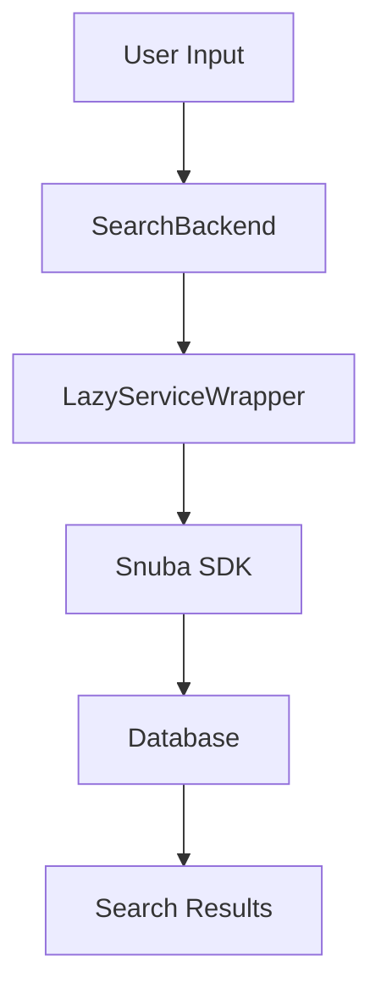

# What is Search Functionality

Search functionality allows users to query and retrieve specific data from the application. It is a core feature that enhances user experience by enabling efficient data retrieval.

<SwmSnippet path="/src/sentry/search/snuba/executors.py" line="772">

---

# <SwmToken path="src/sentry/search/base.py" pos="20:2:2" line-data="class SearchBackend(Service):">`SearchBackend`</SwmToken>

The <SwmToken path="src/sentry/search/base.py" pos="20:2:2" line-data="class SearchBackend(Service):">`SearchBackend`</SwmToken> is a key component that provides the underlying search capabilities. It processes search queries and interacts with the database to retrieve the relevant data. The <SwmToken path="src/sentry/search/snuba/executors.py" pos="772:3:3" line-data="    def query(">`query`</SwmToken> method in the <SwmToken path="src/sentry/search/base.py" pos="20:2:2" line-data="class SearchBackend(Service):">`SearchBackend`</SwmToken> class handles search queries, taking various parameters such as projects, environments, sort options, limits, cursors, and search filters.

```python
    def query(
        self,
        projects: Sequence[Project],
        retention_window_start: datetime | None,
        group_queryset: BaseQuerySet,
        environments: Sequence[Environment] | None,
        sort_by: str,
        limit: int,
        cursor: Cursor | None,
        count_hits: bool,
        paginator_options: Mapping[str, Any] | None,
        search_filters: Sequence[SearchFilter] | None,
        date_from: datetime | None,
        date_to: datetime | None,
        max_hits: int | None = None,
        referrer: str | None = None,
        actor: Any | None = None,
        aggregate_kwargs: TrendsSortWeights | None = None,
    ) -> CursorResult[Group]:
        now = timezone.now()
        end = None
```

---

</SwmSnippet>

<SwmSnippet path="/src/sentry/search/snuba/executors.py" line="1307">

---

# LazyServiceWrapper

The `LazyServiceWrapper` is used to initialize the <SwmToken path="src/sentry/search/base.py" pos="20:2:2" line-data="class SearchBackend(Service):">`SearchBackend`</SwmToken> with specific settings and options, ensuring that the search service is configured correctly before use. This initialization is crucial for the proper functioning of the search capabilities.

```python
    def get_suggested(self, search_filter: SearchFilter) -> Condition:
        """
        Returns the suggested lookup for a search filter.
        """
        attr_entity = self.entities["attrs"]
        users = filter(lambda x: isinstance(x, RpcUser), search_filter.value.raw_value)
        user_ids = [user.id for user in users]
        teams = filter(lambda x: isinstance(x, Team), search_filter.value.raw_value)
        team_ids = [team.id for team in teams]

        operator = Op.NOT_IN if search_filter.is_negation else Op.IN
        null_check_operator = Op.IS_NULL if search_filter.is_negation else Op.IS_NOT_NULL

        conditions = []
        if user_ids:
            suspect_commit_user = Condition(
                Column("owner_suspect_commit_user_id", attr_entity), operator, user_ids
            )
            ownership_rule_user = Condition(
                Column("owner_ownership_rule_user_id", attr_entity), operator, user_ids
            )
```

---

</SwmSnippet>

<SwmSnippet path="/src/sentry/search/snuba/executors.py" line="1184">

---

# Search Utilities and Strategies

Various modules and functions, such as `with_default`, <SwmToken path="src/sentry/search/snuba/executors.py" pos="50:1:1" line-data="    SearchQueryPartial,">`SearchQueryPartial`</SwmToken>, and <SwmToken path="src/sentry/search/snuba/executors.py" pos="52:1:1" line-data="    get_search_strategies,">`get_search_strategies`</SwmToken>, contribute to the search functionality by providing additional utilities and strategies. These utilities help in refining and optimizing search queries.

```python
    def get_basic_group_snuba_condition(
        self, search_filter: SearchFilter, joined_entity: Entity
    ) -> Condition:
        """
        Returns the basic lookup for a search filter.
        """
        return Condition(
            Column(f"group_{search_filter.key.name}", self.entities["attrs"]),
            Op(search_filter.operator),
            search_filter.value.raw_value,
        )

    def get_basic_event_snuba_condition(
        self,
        search_filter: SearchFilter,
        joined_entity: Entity,
        snuba_params: ParamsType,
    ) -> Condition:
        """
        Returns the basic lookup for a search filter.
        """
```

---

</SwmSnippet>

<SwmSnippet path="/src/sentry/search/snuba/executors.py" line="1196">

---

# Integration with Snuba SDK

The search functionality is integrated with the Snuba SDK, which includes components like <SwmToken path="src/sentry/search/snuba/executors.py" pos="32:1:1" line-data="    Request,">`Request`</SwmToken> and <SwmToken path="src/sentry/search/snuba/executors.py" pos="1192:1:1" line-data="            Op(search_filter.operator),">`Op`</SwmToken> to build and execute search queries. This integration allows for efficient and scalable search operations.

```python
    def get_basic_event_snuba_condition(
        self,
        search_filter: SearchFilter,
        joined_entity: Entity,
        snuba_params: ParamsType,
    ) -> Condition:
        """
        Returns the basic lookup for a search filter.
        """
        dataset = Dataset.Events if joined_entity.name == ENTITY_EVENTS else Dataset.IssuePlatform
        query_builder = UnresolvedQuery(
            dataset=dataset, entity=joined_entity, snuba_params=snuba_params, params={}
        )
        return query_builder.convert_search_filter_to_condition(search_filter)
```

---

</SwmSnippet>

<SwmSnippet path="/src/sentry/search/events/filter.py" line="850">

---

# Search Query Structure

Different types and constants, such as `WhereType` and <SwmToken path="src/sentry/search/events/filter.py" pos="856:8:8" line-data="    if name in (PROJECT_ALIAS, PROJECT_NAME_ALIAS):">`PROJECT_ALIAS`</SwmToken>, are used to define the structure and parameters of search queries. These elements help in constructing precise and effective search queries.

```python
def format_search_filter(term, params):
    projects_to_filter = []  # Used to avoid doing multiple conditions on project ID
    conditions = []
    group_ids = None
    name = term.key.name
    value = term.value.value
    if name in (PROJECT_ALIAS, PROJECT_NAME_ALIAS):
        if term.operator == "=" and value == "":
            raise InvalidSearchQuery("Invalid query for 'has' search: 'project' cannot be empty.")
        slugs = to_list(value)
        projects = {
            p.slug: p.id
            for p in Project.objects.filter(id__in=params.get("project_id", []), slug__in=slugs)
        }
        missing = [slug for slug in slugs if slug not in projects]
        if missing:
            if term.operator in EQUALITY_OPERATORS:
                raise InvalidSearchQuery(
                    f"Invalid query. Project(s) {oxfordize_list(missing)} do not exist or are not actively selected."
                )
```

---

</SwmSnippet>

<SwmSnippet path="/src/sentry/search/base.py" line="28">

---

# Search Endpoints

The <SwmToken path="src/sentry/search/base.py" pos="28:3:3" line-data="    def query(">`query`</SwmToken> method in the <SwmToken path="src/sentry/search/base.py" pos="20:2:2" line-data="class SearchBackend(Service):">`SearchBackend`</SwmToken> class is designed to handle search queries. It takes various parameters such as projects, environments, sort options, limits, cursors, and search filters. This method is intended to be overridden by subclasses to implement the actual search logic. The method returns a <SwmToken path="src/sentry/search/base.py" pos="44:5:5" line-data="    ) -&gt; CursorResult[Group]:">`CursorResult`</SwmToken> containing the search results.

```python
    def query(
        self,
        projects: Sequence[Project],
        environments: Sequence[Environment] | None = None,
        sort_by: str = "date",
        limit: int = 100,
        cursor: Cursor | None = None,
        count_hits: bool = False,
        paginator_options: Mapping[str, Any] | None = None,
        search_filters: Sequence[SearchFilter] | None = None,
        date_from: datetime | None = None,
        date_to: datetime | None = None,
        max_hits: int | None = None,
        referrer: str | None = None,
        actor: Any | None = None,
        aggregate_kwargs: TrendsSortWeights | None = None,
    ) -> CursorResult[Group]:
        raise NotImplementedError
```

---

</SwmSnippet>

&nbsp;

*This is an auto-generated document by Swimm AI 🌊 and has not yet been verified by a human*

<SwmMeta version="3.0.0" repo-id="Z2l0aHViJTNBJTNBc2VudHJ5LWRlbW8tMSUzQSUzQVN3aW1tLURlbW8=" repo-name="sentry-demo-1" doc-type="overview"><sup>Powered by [Swimm](/)</sup></SwmMeta>
