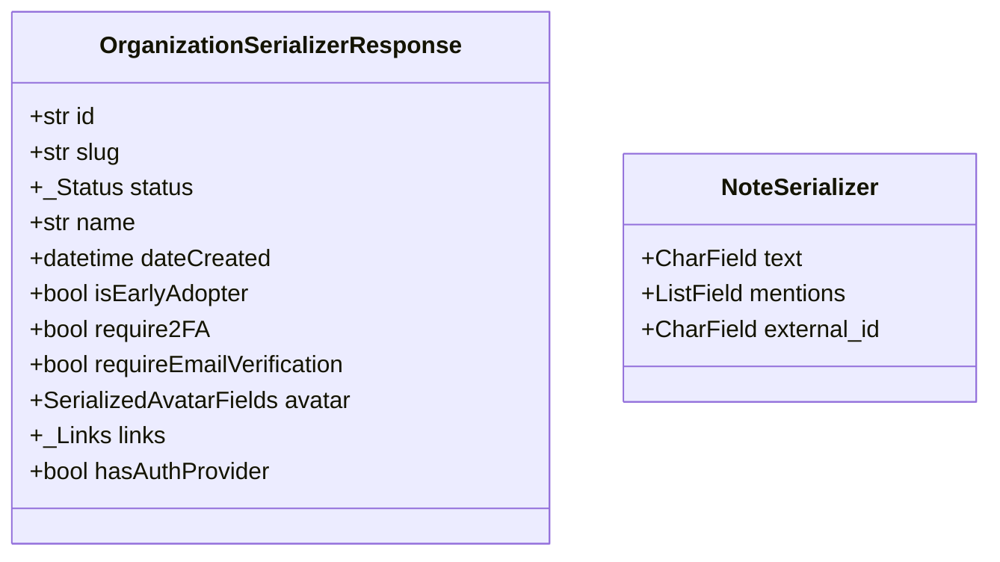

# Overview of Serializers in Api

Serializers are used to convert complex data types, such as querysets and model instances, into native Python datatypes that can then be easily rendered into JSON, XML, or other content types.

## ApiApplicationSerializer

The `ApiApplicationSerializer` class is a specific implementation of a serializer that handles the serialization of `ApiApplication` model instances. The <SwmToken path="src/sentry/api/serializers/models/user.py" pos="162:3:3" line-data="    def serialize(">`serialize`</SwmToken> method within `ApiApplicationSerializer` converts an `ApiApplication` object into a dictionary format, including fields like `clientID`, `clientSecret`, <SwmToken path="src/sentry/api/serializers/types.py" pos="36:1:1" line-data="    name: str">`name`</SwmToken>, `homepageUrl`, `privacyUrl`, `termsUrl`, `allowedOrigins`, and `redirectUris`. The visibility of the `clientSecret` field is controlled based on the `date_added` attribute of the `ApiApplication` object, ensuring that the secret is only visible for a limited time.

## <SwmToken path="src/sentry/api/serializers/rest_framework/release.py" pos="53:2:2" line-data="class ReleaseSerializer(serializers.Serializer):">`ReleaseSerializer`</SwmToken>

The <SwmToken path="src/sentry/api/serializers/rest_framework/release.py" pos="53:2:2" line-data="class ReleaseSerializer(serializers.Serializer):">`ReleaseSerializer`</SwmToken> class is used to serialize release-related data. It includes fields like <SwmToken path="src/sentry/api/serializers/rest_framework/release.py" pos="54:1:1" line-data="    ref = serializers.CharField(">`ref`</SwmToken>, <SwmToken path="src/sentry/api/serializers/rest_framework/release.py" pos="61:1:1" line-data="    url = serializers.URLField(">`url`</SwmToken>, <SwmToken path="src/sentry/api/serializers/rest_framework/release.py" pos="67:1:1" line-data="    dateReleased = serializers.DateTimeField(">`dateReleased`</SwmToken>, <SwmToken path="src/sentry/api/serializers/rest_framework/release.py" pos="72:1:1" line-data="    commits = serializers.ListField(">`commits`</SwmToken>, and <SwmToken path="src/sentry/api/serializers/types.py" pos="35:1:1" line-data="    status: _Status">`status`</SwmToken>. The <SwmToken path="src/sentry/api/serializers/rest_framework/release.py" pos="81:3:3" line-data="    def validate_status(self, value):">`validate_status`</SwmToken> method ensures that the status value is valid by converting it using the <SwmToken path="src/sentry/api/serializers/rest_framework/release.py" pos="83:3:5" line-data="            return ReleaseStatus.from_string(value)">`ReleaseStatus.from_string`</SwmToken> method and raising a <SwmToken path="src/sentry/api/serializers/rest_framework/rule.py" pos="99:5:5" line-data="                raise serializers.ValidationError(">`ValidationError`</SwmToken> if the conversion fails.

<SwmSnippet path="/src/sentry/api/serializers/rest_framework/release.py" line="53">

---

The <SwmToken path="src/sentry/api/serializers/rest_framework/release.py" pos="53:2:2" line-data="class ReleaseSerializer(serializers.Serializer):">`ReleaseSerializer`</SwmToken> class is defined here. It includes fields for release-related data and a <SwmToken path="src/sentry/api/serializers/rest_framework/release.py" pos="81:3:3" line-data="    def validate_status(self, value):">`validate_status`</SwmToken> method to ensure the status value is valid.

```python
class ReleaseSerializer(serializers.Serializer):
    ref = serializers.CharField(
        max_length=MAX_VERSION_LENGTH,
        required=False,
        allow_null=True,
        allow_blank=True,
        help_text="An optional commit reference. This is useful if a tagged version has been provided.",
    )
    url = serializers.URLField(
        required=False,
        allow_null=True,
        allow_blank=True,
        help_text="A URL that points to the release. For instance, this can be the path to an online interface to the source code, such as a GitHub URL.",
    )
    dateReleased = serializers.DateTimeField(
        required=False,
        allow_null=True,
        help_text="An optional date that indicates when the release went live.  If not provided the current time is used.",
    )
    commits = serializers.ListField(
        child=CommitSerializer(),
```

---

</SwmSnippet>

## <SwmToken path="src/sentry/api/serializers/rest_framework/rule.py" pos="82:2:2" line-data="class RuleSetSerializer(serializers.Serializer):">`RuleSetSerializer`</SwmToken>

The <SwmToken path="src/sentry/api/serializers/rest_framework/rule.py" pos="82:2:2" line-data="class RuleSetSerializer(serializers.Serializer):">`RuleSetSerializer`</SwmToken> class is used to serialize rule-related data. It includes fields like <SwmToken path="src/sentry/api/serializers/rest_framework/rule.py" pos="83:1:1" line-data="    conditions = serializers.ListField(child=RuleNodeField(type=&quot;condition/event&quot;), required=False)">`conditions`</SwmToken>, <SwmToken path="src/sentry/api/serializers/rest_framework/rule.py" pos="84:1:1" line-data="    filters = serializers.ListField(child=RuleNodeField(type=&quot;filter/event&quot;), required=False)">`filters`</SwmToken>, <SwmToken path="src/sentry/api/serializers/rest_framework/rule.py" pos="85:1:1" line-data="    actionMatch = serializers.ChoiceField(">`actionMatch`</SwmToken>, <SwmToken path="src/sentry/api/serializers/rest_framework/rule.py" pos="88:1:1" line-data="    filterMatch = serializers.ChoiceField(">`filterMatch`</SwmToken>, and <SwmToken path="src/sentry/api/serializers/rest_framework/rule.py" pos="91:1:1" line-data="    frequency = serializers.IntegerField(min_value=5, max_value=60 * 24 * 30)">`frequency`</SwmToken>. The <SwmToken path="src/sentry/api/serializers/rest_framework/rule.py" pos="93:3:3" line-data="    def validate(self, attrs):">`validate`</SwmToken> method ensures that the provided data is consistent and adheres to the required constraints, such as ensuring that a <SwmToken path="src/sentry/api/serializers/rest_framework/rule.py" pos="88:1:1" line-data="    filterMatch = serializers.ChoiceField(">`filterMatch`</SwmToken> is supplied if filters are provided and that outdated conditions are not used.

<SwmSnippet path="/src/sentry/api/serializers/rest_framework/rule.py" line="82">

---

The <SwmToken path="src/sentry/api/serializers/rest_framework/rule.py" pos="82:2:2" line-data="class RuleSetSerializer(serializers.Serializer):">`RuleSetSerializer`</SwmToken> class is defined here. It includes fields for rule-related data and a <SwmToken path="src/sentry/api/serializers/rest_framework/rule.py" pos="93:3:3" line-data="    def validate(self, attrs):">`validate`</SwmToken> method to ensure data consistency and adherence to constraints.

```python
class RuleSetSerializer(serializers.Serializer):
    conditions = serializers.ListField(child=RuleNodeField(type="condition/event"), required=False)
    filters = serializers.ListField(child=RuleNodeField(type="filter/event"), required=False)
    actionMatch = serializers.ChoiceField(
        choices=(("all", "all"), ("any", "any"), ("none", "none"))
    )
    filterMatch = serializers.ChoiceField(
        choices=(("all", "all"), ("any", "any"), ("none", "none")), required=False
    )
    frequency = serializers.IntegerField(min_value=5, max_value=60 * 24 * 30)

    def validate(self, attrs):
        # ensure that if filters are passed in that a filterMatch is also supplied
        filters = attrs.get("filters")
        if filters:
            filter_match = attrs.get("filterMatch")
            if not filter_match:
                raise serializers.ValidationError(
                    {
                        "filterMatch": "Must select a filter match (all, any, none) if filters are supplied."
                    }
```

---

</SwmSnippet>

## <SwmToken path="src/sentry/api/serializers/models/user.py" pos="118:2:2" line-data="class UserSerializer(Serializer):">`UserSerializer`</SwmToken>

The <SwmToken path="src/sentry/api/serializers/models/user.py" pos="118:2:2" line-data="class UserSerializer(Serializer):">`UserSerializer`</SwmToken> class is used to serialize user-related data. It includes methods like <SwmToken path="src/sentry/api/serializers/models/user.py" pos="119:3:3" line-data="    def _user_is_requester(self, obj: User, requester: User | AnonymousUser | RpcUser) -&gt; bool:">`_user_is_requester`</SwmToken>, <SwmToken path="src/sentry/api/serializers/models/user.py" pos="126:3:3" line-data="    def _get_identities(">`_get_identities`</SwmToken>, <SwmToken path="src/sentry/api/serializers/models/user.py" pos="144:3:3" line-data="    def get_attrs(self, item_list: Sequence[User], user: User) -&gt; MutableMapping[User, Any]:">`get_attrs`</SwmToken>, and <SwmToken path="src/sentry/api/serializers/models/user.py" pos="162:3:3" line-data="    def serialize(">`serialize`</SwmToken>. The <SwmToken path="src/sentry/api/serializers/models/user.py" pos="162:3:3" line-data="    def serialize(">`serialize`</SwmToken> method converts a <SwmToken path="src/sentry/api/serializers/models/user.py" pos="119:11:11" line-data="    def _user_is_requester(self, obj: User, requester: User | AnonymousUser | RpcUser) -&gt; bool:">`User`</SwmToken> object into a dictionary format, including fields like <SwmToken path="src/sentry/api/serializers/models/user.py" pos="123:7:7" line-data="            return bool(requester.id == obj.id)">`id`</SwmToken>, <SwmToken path="src/sentry/api/serializers/types.py" pos="36:1:1" line-data="    name: str">`name`</SwmToken>, <SwmToken path="src/sentry/api/serializers/models/user.py" pos="96:1:1" line-data="    username: str">`username`</SwmToken>, <SwmToken path="src/sentry/api/serializers/models/user.py" pos="49:1:1" line-data="    email: str">`email`</SwmToken>, <SwmToken path="src/sentry/api/serializers/models/user.py" pos="98:1:1" line-data="    avatarUrl: str">`avatarUrl`</SwmToken>, <SwmToken path="src/sentry/api/serializers/models/user.py" pos="99:1:1" line-data="    isActive: bool">`isActive`</SwmToken>, <SwmToken path="src/sentry/api/serializers/models/user.py" pos="100:1:1" line-data="    hasPasswordAuth: bool">`hasPasswordAuth`</SwmToken>, <SwmToken path="src/sentry/api/serializers/models/user.py" pos="101:1:1" line-data="    isManaged: bool">`isManaged`</SwmToken>, <SwmToken path="src/sentry/api/serializers/models/user.py" pos="102:1:1" line-data="    dateJoined: datetime">`dateJoined`</SwmToken>, <SwmToken path="src/sentry/api/serializers/models/user.py" pos="103:1:1" line-data="    lastLogin: datetime">`lastLogin`</SwmToken>, <SwmToken path="src/sentry/api/serializers/models/user.py" pos="104:1:1" line-data="    has2fa: bool">`has2fa`</SwmToken>, <SwmToken path="src/sentry/api/serializers/models/user.py" pos="105:1:1" line-data="    lastActive: datetime">`lastActive`</SwmToken>, <SwmToken path="src/sentry/api/serializers/models/user.py" pos="106:1:1" line-data="    isSuperuser: bool">`isSuperuser`</SwmToken>, <SwmToken path="src/sentry/api/serializers/models/user.py" pos="107:1:1" line-data="    isStaff: bool">`isStaff`</SwmToken>, <SwmToken path="src/sentry/api/serializers/models/user.py" pos="14:6:6" line-data="from sentry import experiments">`experiments`</SwmToken>, and <SwmToken path="src/sentry/api/serializers/models/user.py" pos="109:1:1" line-data="    emails: list[_UserEmails]">`emails`</SwmToken>. Additional fields like <SwmToken path="src/sentry/api/serializers/models/user.py" pos="73:19:19" line-data="    theme: str  # TODO: enum/literal for theme options">`options`</SwmToken>, <SwmToken path="src/sentry/api/serializers/models/user.py" pos="114:1:1" line-data="    flags: Any  # TODO">`flags`</SwmToken>, and <SwmToken path="src/sentry/api/serializers/types.py" pos="41:1:1" line-data="    avatar: SerializedAvatarFields">`avatar`</SwmToken> are included if the user is the requester.

<SwmSnippet path="/src/sentry/api/serializers/models/user.py" line="118">

---

The <SwmToken path="src/sentry/api/serializers/models/user.py" pos="118:2:2" line-data="class UserSerializer(Serializer):">`UserSerializer`</SwmToken> class is defined here. It includes methods to check if the user is the requester and to get user identities, as well as a <SwmToken path="src/sentry/api/serializers/models/user.py" pos="162:3:3" line-data="    def serialize(">`serialize`</SwmToken> method to convert a <SwmToken path="src/sentry/api/serializers/models/user.py" pos="119:11:11" line-data="    def _user_is_requester(self, obj: User, requester: User | AnonymousUser | RpcUser) -&gt; bool:">`User`</SwmToken> object into a dictionary format.

```python
class UserSerializer(Serializer):
    def _user_is_requester(self, obj: User, requester: User | AnonymousUser | RpcUser) -> bool:
        if isinstance(requester, User):
            return bool(requester == obj)
        if isinstance(requester, RpcUser):
            return bool(requester.id == obj.id)
        return False

    def _get_identities(
        self, item_list: Sequence[User], user: User
    ) -> dict[int, list[AuthIdentity]]:

        if not (env.request and has_elevated_mode(env.request)):
            item_list = [x for x in item_list if x.id == user.id]

        queryset = AuthIdentity.objects.filter(
            user_id__in=[i.id for i in item_list]
        ).select_related(
            "auth_provider",
        )
```

---

</SwmSnippet>

## <SwmToken path="src/sentry/api/serializers/types.py" pos="32:2:2" line-data="class OrganizationSerializerResponse(OrganizationSerializerResponseOptional):">`OrganizationSerializerResponse`</SwmToken>

The <SwmToken path="src/sentry/api/serializers/types.py" pos="32:2:2" line-data="class OrganizationSerializerResponse(OrganizationSerializerResponseOptional):">`OrganizationSerializerResponse`</SwmToken> class defines the structure of the response for organization-related endpoints. It includes fields like <SwmToken path="src/sentry/api/serializers/models/user.py" pos="123:7:7" line-data="            return bool(requester.id == obj.id)">`id`</SwmToken>, <SwmToken path="src/sentry/api/serializers/types.py" pos="34:1:1" line-data="    slug: str">`slug`</SwmToken>, <SwmToken path="src/sentry/api/serializers/types.py" pos="35:1:1" line-data="    status: _Status">`status`</SwmToken>, <SwmToken path="src/sentry/api/serializers/types.py" pos="36:1:1" line-data="    name: str">`name`</SwmToken>, <SwmToken path="src/sentry/api/serializers/types.py" pos="37:1:1" line-data="    dateCreated: datetime">`dateCreated`</SwmToken>, <SwmToken path="src/sentry/api/serializers/types.py" pos="38:1:1" line-data="    isEarlyAdopter: bool">`isEarlyAdopter`</SwmToken>, <SwmToken path="src/sentry/api/serializers/types.py" pos="39:1:1" line-data="    require2FA: bool">`require2FA`</SwmToken>, <SwmToken path="src/sentry/api/serializers/types.py" pos="31:7:7" line-data="@extend_schema_serializer(exclude_fields=[&quot;requireEmailVerification&quot;])">`requireEmailVerification`</SwmToken>, <SwmToken path="src/sentry/api/serializers/types.py" pos="41:1:1" line-data="    avatar: SerializedAvatarFields">`avatar`</SwmToken>, <SwmToken path="src/sentry/api/serializers/types.py" pos="42:1:1" line-data="    links: _Links">`links`</SwmToken>, and <SwmToken path="src/sentry/api/serializers/types.py" pos="43:1:1" line-data="    hasAuthProvider: bool">`hasAuthProvider`</SwmToken>. This serializer ensures that the organization data is returned in a consistent format.

<SwmSnippet path="/src/sentry/api/serializers/types.py" line="31">

---

The <SwmToken path="src/sentry/api/serializers/types.py" pos="32:2:2" line-data="class OrganizationSerializerResponse(OrganizationSerializerResponseOptional):">`OrganizationSerializerResponse`</SwmToken> class is defined here. It includes fields for organization-related data and ensures that the data is returned in a consistent format.

```python
@extend_schema_serializer(exclude_fields=["requireEmailVerification"])
class OrganizationSerializerResponse(OrganizationSerializerResponseOptional):
    id: str
    slug: str
    status: _Status
    name: str
    dateCreated: datetime
    isEarlyAdopter: bool
    require2FA: bool
    requireEmailVerification: bool
    avatar: SerializedAvatarFields
    links: _Links
    hasAuthProvider: bool
```

---

</SwmSnippet>

## <SwmToken path="src/sentry/api/serializers/rest_framework/group_notes.py" pos="8:2:2" line-data="class NoteSerializer(serializers.Serializer, MentionsMixin):">`NoteSerializer`</SwmToken>

The <SwmToken path="src/sentry/api/serializers/rest_framework/group_notes.py" pos="8:2:2" line-data="class NoteSerializer(serializers.Serializer, MentionsMixin):">`NoteSerializer`</SwmToken> class is used to serialize note data. It includes fields like <SwmToken path="src/sentry/api/serializers/rest_framework/group_notes.py" pos="9:1:1" line-data="    text = serializers.CharField()">`text`</SwmToken>, <SwmToken path="src/sentry/api/serializers/rest_framework/group_notes.py" pos="10:1:1" line-data="    mentions = ListField(child=ActorField(), required=False)">`mentions`</SwmToken>, and <SwmToken path="src/sentry/api/serializers/rest_framework/group_notes.py" pos="11:1:1" line-data="    external_id = serializers.CharField(allow_null=True, required=False)">`external_id`</SwmToken>. This serializer is used to validate and transform note data before it is processed by the API endpoints.

<SwmSnippet path="/src/sentry/api/serializers/rest_framework/group_notes.py" line="8">

---

The <SwmToken path="src/sentry/api/serializers/rest_framework/group_notes.py" pos="8:2:2" line-data="class NoteSerializer(serializers.Serializer, MentionsMixin):">`NoteSerializer`</SwmToken> class is defined here. It includes fields for note data and is used to validate and transform note data before processing.

```python
class NoteSerializer(serializers.Serializer, MentionsMixin):
    text = serializers.CharField()
    mentions = ListField(child=ActorField(), required=False)
    external_id = serializers.CharField(allow_null=True, required=False)
```

---

</SwmSnippet>

&nbsp;

*This is an auto-generated document by Swimm AI 🌊 and has not yet been verified by a human*

<SwmMeta version="3.0.0" repo-id="Z2l0aHViJTNBJTNBc2VudHJ5LWRlbW8tMSUzQSUzQVN3aW1tLURlbW8=" repo-name="sentry-demo-1" doc-type="overview"><sup>Powered by [Swimm](/)</sup></SwmMeta>
