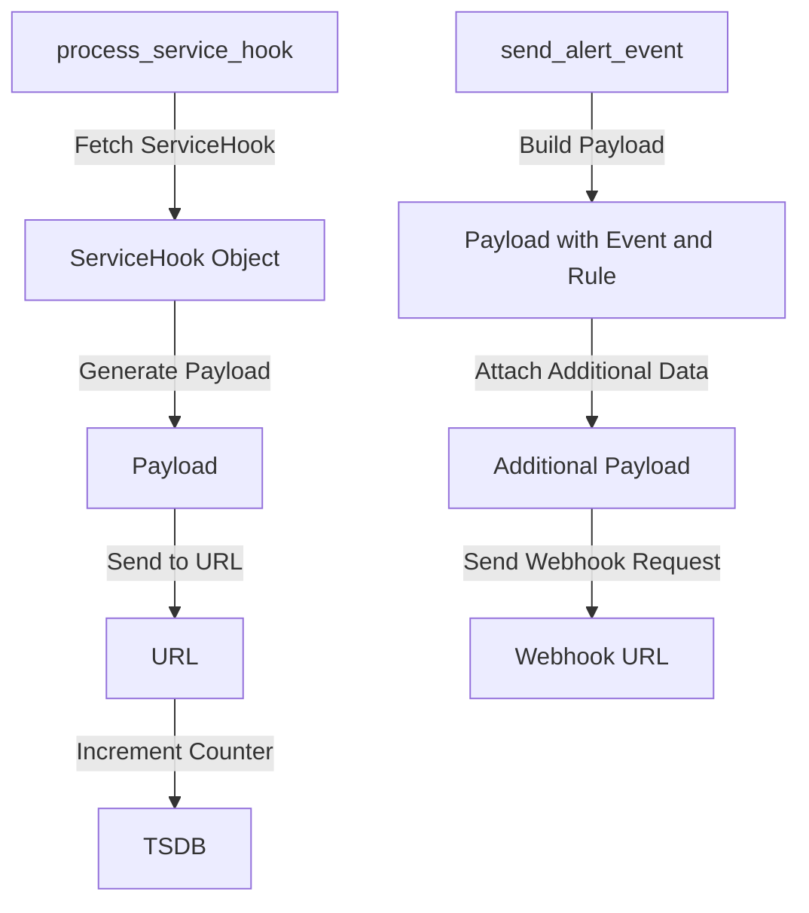

# Understanding Tasks in Application Modules

Tasks are units of work that are executed asynchronously within the application. They are used to perform background processing, such as sending emails, processing data, or interacting with external services.

## Instrumented Task

The <SwmToken path="src/sentry/tasks/activity.py" pos="4:10:10" line-data="from sentry.tasks.base import instrumented_task">`instrumented_task`</SwmToken> is a specific type of task that includes additional instrumentation for monitoring and tracking purposes. This allows for better observability and debugging of task execution.

<SwmSnippet path="/src/sentry/tasks/activity.py" line="3">

---

In <SwmPath>[src/sentry/tasks/activity.py](src/sentry/tasks/activity.py)</SwmPath>, <SwmToken path="src/sentry/tasks/activity.py" pos="4:10:10" line-data="from sentry.tasks.base import instrumented_task">`instrumented_task`</SwmToken> is imported and used to define tasks related to activity processing.

```python
from sentry.silo.base import SiloMode
from sentry.tasks.base import instrumented_task
from sentry.utils.sdk import bind_organization_context
```

---

</SwmSnippet>

Similarly, other modules like <SwmPath>[src/sentry/tasks/app_store_connect.py](src/sentry/tasks/app_store_connect.py)</SwmPath>, <SwmPath>[src/sentry/tasks/collect_project_platforms.py](src/sentry/tasks/collect_project_platforms.py)</SwmPath>, and <SwmPath>[src/sentry/tasks/process_buffer.py](src/sentry/tasks/process_buffer.py)</SwmPath> also import and use <SwmToken path="src/sentry/tasks/activity.py" pos="4:10:10" line-data="from sentry.tasks.base import instrumented_task">`instrumented_task`</SwmToken> to define their respective tasks.

## Task Class

The <SwmToken path="src/sentry/tasks/relocation.py" pos="968:3:3" line-data="    A task, along with a series of parameters to be passed to its `.apply_async` method, allowing">`task`</SwmToken> class from <SwmToken path="src/sentry/tasks/relocation.py" pos="15:2:6" line-data="from celery.app.task import Task">`celery.app.task`</SwmToken> provides the basic structure and functionality for defining tasks in Celery. This class is used to schedule tasks to be executed later.

<SwmSnippet path="/src/sentry/tasks/relocation.py" line="966">

---

The <SwmToken path="src/sentry/tasks/relocation.py" pos="968:3:3" line-data="    A task, along with a series of parameters to be passed to its `.apply_async` method, allowing">`task`</SwmToken> class is used in <SwmPath>[src/sentry/tasks/relocation.py](src/sentry/tasks/relocation.py)</SwmPath> to define tasks that can be scheduled for later execution.

```python
class NextTask:
    """
    A task, along with a series of parameters to be passed to its `.apply_async` method, allowing
    the task to be scheduled at some later point in the execution.
    """

    task: Task
    args: list[Any]
    countdown: int | None = None

    def schedule(self):
        """
        Run the `.apply_async()` call defined by this future.
        """
        self.task.apply_async(args=self.args, countdown=self.countdown)
```

---

</SwmSnippet>

## Example Usage

The function <SwmToken path="src/sentry/tasks/sentry_apps.py" pos="159:2:2" line-data="def _process_resource_change(action, sender, instance_id, retryer=None, *args, **kwargs):">`_process_resource_change`</SwmToken> demonstrates how tasks are used to handle resource changes. It processes the change and triggers a new task for each webhook.

<SwmSnippet path="/src/sentry/tasks/sentry_apps.py" line="159">

---

The function <SwmToken path="src/sentry/tasks/sentry_apps.py" pos="159:2:2" line-data="def _process_resource_change(action, sender, instance_id, retryer=None, *args, **kwargs):">`_process_resource_change`</SwmToken> in <SwmPath>[src/sentry/tasks/sentry_apps.py](src/sentry/tasks/sentry_apps.py)</SwmPath> shows how tasks are used to handle resource changes.

```python
def _process_resource_change(action, sender, instance_id, retryer=None, *args, **kwargs):
    # The class is serialized as a string when enqueueing the class.
    model = TYPES[sender]
    # The Event model has different hooks for the different event types. The sender
    # determines which type eg. Error and therefore the 'name' eg. error
    if issubclass(model, Event):
        if not kwargs.get("instance"):
            extra = {"sender": sender, "action": action, "event_id": instance_id}
            logger.info("process_resource_change.event_missing_event", extra=extra)
            return
        name = sender.lower()
    else:
        # Some resources are named differently than their model. eg. Group vs Issue.
        # Looks up the human name for the model. Defaults to the model name.
        name = RESOURCE_RENAMES.get(model.__name__, model.__name__.lower())

    # By default, use Celery's `current_task` but allow a value to be passed for the
    # bound Task.
    retryer = retryer or current_task

    # We may run into a race condition where this task executes before the
```

---

</SwmSnippet>

## Task Endpoints

Task endpoints are specific tasks that perform particular actions within the application.

### <SwmToken path="src/sentry/tasks/servicehooks.py" pos="30:8:8" line-data="    name=&quot;sentry.tasks.process_service_hook&quot;,">`process_service_hook`</SwmToken>

The <SwmToken path="src/sentry/tasks/servicehooks.py" pos="30:8:8" line-data="    name=&quot;sentry.tasks.process_service_hook&quot;,">`process_service_hook`</SwmToken> task processes a service hook by fetching the service hook object, generating a payload, and sending it to the specified URL. It increments a counter in the TSDB and handles retries in case of failures.

<SwmSnippet path="/src/sentry/tasks/servicehooks.py" line="29">

---

The <SwmToken path="src/sentry/tasks/servicehooks.py" pos="30:8:8" line-data="    name=&quot;sentry.tasks.process_service_hook&quot;,">`process_service_hook`</SwmToken> task in <SwmPath>[src/sentry/tasks/servicehooks.py](src/sentry/tasks/servicehooks.py)</SwmPath> demonstrates how a service hook is processed and sent to a URL.

```python
@instrumented_task(
    name="sentry.tasks.process_service_hook",
    default_retry_delay=60 * 5,
    max_retries=5,
    silo_mode=SiloMode.REGION,
)
@retry
def process_service_hook(servicehook_id, event, **kwargs):
    try:
        servicehook = ServiceHook.objects.get(id=servicehook_id)
    except ServiceHook.DoesNotExist:
        return

    if servicehook.version == 0:
        payload = get_payload_v0(event)
    else:
        raise NotImplementedError

    from sentry import tsdb

    tsdb.backend.incr(TSDBModel.servicehook_fired, servicehook.id)
```

---

</SwmSnippet>

### <SwmToken path="src/sentry/tasks/sentry_apps.py" pos="89:12:12" line-data="@instrumented_task(name=&quot;sentry.tasks.sentry_apps.send_alert_event&quot;, **TASK_OPTIONS)">`send_alert_event`</SwmToken>

The <SwmToken path="src/sentry/tasks/sentry_apps.py" pos="89:12:12" line-data="@instrumented_task(name=&quot;sentry.tasks.sentry_apps.send_alert_event&quot;, **TASK_OPTIONS)">`send_alert_event`</SwmToken> task sends incident data to a <SwmToken path="src/sentry/tasks/sentry_apps.py" pos="99:24:26" line-data="    When an incident alert is triggered, send incident data to the SentryApp&#39;s webhook.">`SentryApp's`</SwmToken> webhook when an alert is triggered. It builds a payload with event and rule information, attaches additional data if provided, and sends the webhook request.

<SwmSnippet path="/src/sentry/tasks/sentry_apps.py" line="89">

---

The <SwmToken path="src/sentry/tasks/sentry_apps.py" pos="89:12:12" line-data="@instrumented_task(name=&quot;sentry.tasks.sentry_apps.send_alert_event&quot;, **TASK_OPTIONS)">`send_alert_event`</SwmToken> task in <SwmPath>[src/sentry/tasks/sentry_apps.py](src/sentry/tasks/sentry_apps.py)</SwmPath> shows how incident data is sent to a <SwmToken path="src/sentry/tasks/sentry_apps.py" pos="99:24:26" line-data="    When an incident alert is triggered, send incident data to the SentryApp&#39;s webhook.">`SentryApp's`</SwmToken> webhook.

```python
@instrumented_task(name="sentry.tasks.sentry_apps.send_alert_event", **TASK_OPTIONS)
@retry_decorator
def send_alert_event(
    event: Event,
    rule: str,
    sentry_app_id: int,
    additional_payload_key: str | None = None,
    additional_payload: Mapping[str, Any] | None = None,
) -> None:
    """
    When an incident alert is triggered, send incident data to the SentryApp's webhook.
    :param event: The `Event` for which to build a payload.
    :param rule: The AlertRule that was triggered.
    :param sentry_app_id: The SentryApp to notify.
    :param additional_payload_key: The key used to attach additional data to the webhook payload
    :param additional_payload: The extra data attached to the payload body at the key specified by `additional_payload_key`.
    :return:
    """
    group = event.group
    project = Project.objects.get_from_cache(id=group.project_id)
    organization = Organization.objects.get_from_cache(id=project.organization_id)
```

---

</SwmSnippet>

&nbsp;

*This is an auto-generated document by Swimm AI 🌊 and has not yet been verified by a human*

<SwmMeta version="3.0.0" repo-id="Z2l0aHViJTNBJTNBc2VudHJ5LWRlbW8tMSUzQSUzQVN3aW1tLURlbW8=" repo-name="sentry-demo-1" doc-type="overview"><sup>Powered by [Swimm](/)</sup></SwmMeta>
