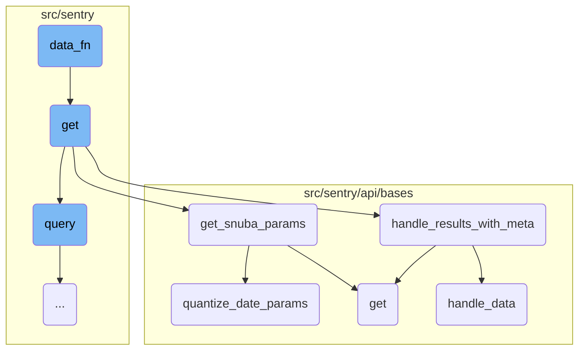

This document provides an overview of the <SwmToken path="src/sentry/replays/endpoints/organization_replay_events_meta.py" pos="52:3:3" line-data="        def data_fn(offset, limit):">`data_fn`</SwmToken> function, which is responsible for constructing the query details required for fetching data from the dataset. It includes parameters like selected columns, query, snuba parameters, equations, orderby, offset, limit, and other configurations.

The <SwmToken path="src/sentry/replays/endpoints/organization_replay_events_meta.py" pos="52:3:3" line-data="        def data_fn(offset, limit):">`data_fn`</SwmToken> function is like a recipe that tells the system exactly what data to fetch and how to fetch it. It gathers all the necessary ingredients (parameters) such as which columns to select, what filters to apply, how to sort the data, and how much data to fetch at a time. Once it has all these details, it sends a request to get the data. Think of it as placing an order at a restaurant where you specify exactly what you want, and the kitchen prepares it for you.

Here is a high level diagram of the flow, showing only the most important functions:

```mermaid
graph TD;
      subgraph src/sentry
ec50ec67502266ce5d9e671a002602fd9e1034a90a35903ba4d74d8921483a67(data_fn):::mainFlowStyle --> 14efdd72de028e2a90da905e5c88f4818b8bbdc9cd3e3e154423eef3896afbb0(get):::mainFlowStyle
end

subgraph src/sentry
14efdd72de028e2a90da905e5c88f4818b8bbdc9cd3e3e154423eef3896afbb0(get):::mainFlowStyle --> 76555db3c36df80d8ce698d10ee1f95e79e25496e48ce2c0e3a19dce410f1dcd(handle_results_with_meta)
end

subgraph src/sentry
14efdd72de028e2a90da905e5c88f4818b8bbdc9cd3e3e154423eef3896afbb0(get):::mainFlowStyle --> a4f25188cdb1c709695d3a93e7176ddb7bd151b9a322e0836404ad0986b5f514(get_snuba_params)
end

subgraph src/sentry
14efdd72de028e2a90da905e5c88f4818b8bbdc9cd3e3e154423eef3896afbb0(get):::mainFlowStyle --> 217c286b55931189987f173388d83db5200b62a8b3969018948674c19e4cb939(query):::mainFlowStyle
end

subgraph src/sentry
217c286b55931189987f173388d83db5200b62a8b3969018948674c19e4cb939(query):::mainFlowStyle --> 9e7271ad0c817bc7beb2e7483b4bfd667fbb5ef81afffec4ead5ea943e43fb58(raw_query):::mainFlowStyle
end

subgraph src/sentry
9e7271ad0c817bc7beb2e7483b4bfd667fbb5ef81afffec4ead5ea943e43fb58(raw_query):::mainFlowStyle --> 49e51d450ec84ff76919fd729ec4bc5fdd023594be9ea2b5131815c3be2c800e(bulk_raw_query):::mainFlowStyle
end

subgraph src/sentry
49e51d450ec84ff76919fd729ec4bc5fdd023594be9ea2b5131815c3be2c800e(bulk_raw_query):::mainFlowStyle --> beecaf8faaad1c65344d2110f3b0c9e38456bb670bdc218b51bb23b3e88615b5(_prepare_query_params)
end

subgraph src/sentry
49e51d450ec84ff76919fd729ec4bc5fdd023594be9ea2b5131815c3be2c800e(bulk_raw_query):::mainFlowStyle --> 7452ae8d5bb6a7cbd1beb6c2510ba33d7becd5a3351391bbea29966551c8dd5e(_apply_cache_and_build_results):::mainFlowStyle
end

subgraph src/sentry
7452ae8d5bb6a7cbd1beb6c2510ba33d7becd5a3351391bbea29966551c8dd5e(_apply_cache_and_build_results):::mainFlowStyle --> 3dd4b53f43f27323bc1d4979fe988f00146956aebdced26d7d7d519f8f073554(_bulk_snuba_query):::mainFlowStyle
end


      classDef mainFlowStyle color:#000000,fill:#7CB9F4
classDef rootsStyle color:#000000,fill:#00FFF4
classDef Style1 color:#000000,fill:#00FFAA
classDef Style2 color:#000000,fill:#FFFF00
classDef Style3 color:#000000,fill:#AA7CB9

%% Swimm:
%% graph TD;
%%       subgraph <SwmPath>[src/sentry/](src/sentry/)</SwmPath>
%% ec50ec67502266ce5d9e671a002602fd9e1034a90a35903ba4d74d8921483a67(data_fn):::mainFlowStyle --> 14efdd72de028e2a90da905e5c88f4818b8bbdc9cd3e3e154423eef3896afbb0(get):::mainFlowStyle
%% end
%% 
%% subgraph <SwmPath>[src/sentry/](src/sentry/)</SwmPath>
%% 14efdd72de028e2a90da905e5c88f4818b8bbdc9cd3e3e154423eef3896afbb0(get):::mainFlowStyle --> 76555db3c36df80d8ce698d10ee1f95e79e25496e48ce2c0e3a19dce410f1dcd(handle_results_with_meta)
%% end
%% 
%% subgraph <SwmPath>[src/sentry/](src/sentry/)</SwmPath>
%% 14efdd72de028e2a90da905e5c88f4818b8bbdc9cd3e3e154423eef3896afbb0(get):::mainFlowStyle --> a4f25188cdb1c709695d3a93e7176ddb7bd151b9a322e0836404ad0986b5f514(get_snuba_params)
%% end
%% 
%% subgraph <SwmPath>[src/sentry/](src/sentry/)</SwmPath>
%% 14efdd72de028e2a90da905e5c88f4818b8bbdc9cd3e3e154423eef3896afbb0(get):::mainFlowStyle --> 217c286b55931189987f173388d83db5200b62a8b3969018948674c19e4cb939(query):::mainFlowStyle
%% end
%% 
%% subgraph <SwmPath>[src/sentry/](src/sentry/)</SwmPath>
%% 217c286b55931189987f173388d83db5200b62a8b3969018948674c19e4cb939(query):::mainFlowStyle --> 9e7271ad0c817bc7beb2e7483b4bfd667fbb5ef81afffec4ead5ea943e43fb58(raw_query):::mainFlowStyle
%% end
%% 
%% subgraph <SwmPath>[src/sentry/](src/sentry/)</SwmPath>
%% 9e7271ad0c817bc7beb2e7483b4bfd667fbb5ef81afffec4ead5ea943e43fb58(raw_query):::mainFlowStyle --> 49e51d450ec84ff76919fd729ec4bc5fdd023594be9ea2b5131815c3be2c800e(bulk_raw_query):::mainFlowStyle
%% end
%% 
%% subgraph <SwmPath>[src/sentry/](src/sentry/)</SwmPath>
%% 49e51d450ec84ff76919fd729ec4bc5fdd023594be9ea2b5131815c3be2c800e(bulk_raw_query):::mainFlowStyle --> beecaf8faaad1c65344d2110f3b0c9e38456bb670bdc218b51bb23b3e88615b5(_prepare_query_params)
%% end
%% 
%% subgraph <SwmPath>[src/sentry/](src/sentry/)</SwmPath>
%% 49e51d450ec84ff76919fd729ec4bc5fdd023594be9ea2b5131815c3be2c800e(bulk_raw_query):::mainFlowStyle --> 7452ae8d5bb6a7cbd1beb6c2510ba33d7becd5a3351391bbea29966551c8dd5e(_apply_cache_and_build_results):::mainFlowStyle
%% end
%% 
%% subgraph <SwmPath>[src/sentry/](src/sentry/)</SwmPath>
%% 7452ae8d5bb6a7cbd1beb6c2510ba33d7becd5a3351391bbea29966551c8dd5e(_apply_cache_and_build_results):::mainFlowStyle --> 3dd4b53f43f27323bc1d4979fe988f00146956aebdced26d7d7d519f8f073554(_bulk_snuba_query):::mainFlowStyle
%% end
%% 
%% 
%%       classDef mainFlowStyle color:#000000,fill:#7CB9F4
%% classDef rootsStyle color:#000000,fill:#00FFF4
%% classDef Style1 color:#000000,fill:#00FFAA
%% classDef Style2 color:#000000,fill:#FFFF00
%% classDef Style3 color:#000000,fill:#AA7CB9
```



# Flow drill down

First, we'll zoom into this section of the flow:



<SwmSnippet path="/src/sentry/replays/endpoints/organization_replay_events_meta.py" line="52">

---

## <SwmToken path="src/sentry/replays/endpoints/organization_replay_events_meta.py" pos="52:3:3" line-data="        def data_fn(offset, limit):">`data_fn`</SwmToken>

The <SwmToken path="src/sentry/replays/endpoints/organization_replay_events_meta.py" pos="52:3:3" line-data="        def data_fn(offset, limit):">`data_fn`</SwmToken> function constructs the query details required for fetching data from the dataset. It includes parameters like selected columns, query, snuba parameters, equations, orderby, offset, limit, and other configurations. This function is crucial for defining the scope and specifics of the data retrieval process.

```python
        def data_fn(offset, limit):
            query_details = {
                "selected_columns": self.get_field_list(organization, request),
                "query": request.GET.get("query"),
                "snuba_params": snuba_params,
                "equations": self.get_equation_list(organization, request),
                "orderby": self.get_orderby(request),
                "offset": offset,
                "limit": limit,
                "referrer": "api.replay.details-page",
                "auto_fields": True,
                "auto_aggregations": True,
                "use_aggregate_conditions": True,
                "allow_metric_aggregates": False,
                "transform_alias_to_input_format": True,
            }

            return dataset.query(**query_details)
```

---

</SwmSnippet>

<SwmSnippet path="/src/sentry/replays/endpoints/organization_replay_events_meta.py" line="41">

---

## get

The <SwmToken path="src/sentry/replays/endpoints/organization_replay_events_meta.py" pos="41:3:3" line-data="    def get(self, request: Request, organization) -&gt; Response:">`get`</SwmToken> function handles the initial request and prepares the necessary parameters for querying the dataset. It checks for required features, retrieves snuba parameters, and defines the <SwmToken path="src/sentry/replays/endpoints/organization_replay_events_meta.py" pos="52:3:3" line-data="        def data_fn(offset, limit):">`data_fn`</SwmToken> function. Finally, it uses a paginator to handle the results and calls <SwmToken path="src/sentry/api/bases/organization_events.py" pos="290:3:3" line-data="    def handle_results_with_meta(">`handle_results_with_meta`</SwmToken> to process the results.

```python
    def get(self, request: Request, organization) -> Response:
        if not features.has("organizations:session-replay", organization, actor=request.user):
            return Response(status=404)

        try:
            snuba_params = self.get_snuba_params(request, organization, check_global_views=False)
        except NoProjects:
            return Response({"count": 0})

        dataset = self.get_dataset(request)

        def data_fn(offset, limit):
            query_details = {
                "selected_columns": self.get_field_list(organization, request),
                "query": request.GET.get("query"),
                "snuba_params": snuba_params,
                "equations": self.get_equation_list(organization, request),
                "orderby": self.get_orderby(request),
                "offset": offset,
                "limit": limit,
                "referrer": "api.replay.details-page",
```

---

</SwmSnippet>

<SwmSnippet path="/src/sentry/api/bases/organization_events.py" line="290">

---

## <SwmToken path="src/sentry/api/bases/organization_events.py" pos="290:3:3" line-data="    def handle_results_with_meta(">`handle_results_with_meta`</SwmToken>

The <SwmToken path="src/sentry/api/bases/organization_events.py" pos="290:3:3" line-data="    def handle_results_with_meta(">`handle_results_with_meta`</SwmToken> function processes the results obtained from the query. It handles the data and metadata, including fields, units, and other relevant information. This function ensures that the results are formatted and enriched with necessary metadata before being returned.

```python
    def handle_results_with_meta(
        self,
        request: Request,
        organization: Organization,
        project_ids: Sequence[int],
        results: dict[str, Any],
        standard_meta: bool | None = False,
        dataset: Any | None = None,
    ) -> dict[str, Any]:
        with sentry_sdk.start_span(op="discover.endpoint", description="base.handle_results"):
            data = self.handle_data(request, organization, project_ids, results.get("data"))
            meta = results.get("meta", {})
            fields_meta = meta.get("fields", {})

            if standard_meta:
                isMetricsData = meta.pop("isMetricsData", False)
                isMetricsExtractedData = meta.pop("isMetricsExtractedData", False)
                discoverSplitDecision = meta.pop("discoverSplitDecision", None)
                fields, units = self.handle_unit_meta(fields_meta)
                meta = {
                    "fields": fields,
```

---

</SwmSnippet>

<SwmSnippet path="/src/sentry/api/bases/organization_events.py" line="91">

---

## <SwmToken path="src/sentry/api/bases/organization_events.py" pos="91:3:3" line-data="    def get_snuba_params(">`get_snuba_params`</SwmToken>

The <SwmToken path="src/sentry/api/bases/organization_events.py" pos="91:3:3" line-data="    def get_snuba_params(">`get_snuba_params`</SwmToken> function generates the parameters required for making snuba queries. It includes filtering parameters, date quantization, and checks for global views. This function is essential for setting up the correct context and constraints for the data query.

```python
    def get_snuba_params(
        self,
        request: Request,
        organization: Organization,
        check_global_views: bool = True,
        quantize_date_params: bool = True,
    ) -> SnubaParams:
        """Returns params to make snuba queries with"""
        with sentry_sdk.start_span(op="discover.endpoint", description="filter_params(dataclass)"):
            if (
                len(self.get_field_list(organization, request))
                + len(self.get_equation_list(organization, request))
                > MAX_FIELDS
            ):
                raise ParseError(
                    detail=f"You can view up to {MAX_FIELDS} fields at a time. Please delete some and try again."
                )

            filter_params: dict[str, Any] = self.get_filter_params(request, organization)
            if quantize_date_params:
                filter_params = self.quantize_date_params(request, filter_params)
```

---

</SwmSnippet>

<SwmSnippet path="/src/sentry/api/bases/organization_events.py" line="143">

---

## <SwmToken path="src/sentry/api/bases/organization_events.py" pos="143:3:3" line-data="    def quantize_date_params(self, request: Request, params: dict[str, Any]) -&gt; dict[str, Any]:">`quantize_date_params`</SwmToken>

The <SwmToken path="src/sentry/api/bases/organization_events.py" pos="143:3:3" line-data="    def quantize_date_params(self, request: Request, params: dict[str, Any]) -&gt; dict[str, Any]:">`quantize_date_params`</SwmToken> function adjusts the date parameters to ensure they are rounded appropriately based on the duration. This is particularly useful for optimizing queries over longer periods by reducing the granularity of the date range.

```python
    def quantize_date_params(self, request: Request, params: dict[str, Any]) -> dict[str, Any]:
        # We only need to perform this rounding on relative date periods
        if "statsPeriod" not in request.GET:
            return params
        results = params.copy()
        duration = (params["end"] - params["start"]).total_seconds()
        # Only perform rounding on durations longer than an hour
        if duration > 3600:
            # Round to 15 minutes if over 30 days, otherwise round to the minute
            round_to = 15 * 60 if duration >= 30 * 24 * 3600 else 60
            key = params.get("organization_id", 0)

            results["start"] = snuba.quantize_time(
                params["start"], key, duration=round_to, rounding=snuba.ROUND_DOWN
            )
            results["end"] = snuba.quantize_time(
                params["end"], key, duration=round_to, rounding=snuba.ROUND_UP
            )
        return results
```

---

</SwmSnippet>

<SwmSnippet path="/src/sentry/api/bases/organization_events.py" line="332">

---

## <SwmToken path="src/sentry/api/bases/organization_events.py" pos="332:3:3" line-data="    def handle_data(">`handle_data`</SwmToken>

The <SwmToken path="src/sentry/api/bases/organization_events.py" pos="332:3:3" line-data="    def handle_data(">`handle_data`</SwmToken> function processes the raw results from the query. It formats the results, handles specific fields like transaction status and issues, and ensures that unnecessary fields are removed. This function is crucial for cleaning and preparing the data before it is returned to the client.

```python
    def handle_data(
        self,
        request: Request,
        organization: Organization,
        project_ids: Sequence[int],
        results: Sequence[Any] | None,
    ) -> Sequence[Any] | None:
        if not results:
            return results

        first_row = results[0]

        # TODO(mark) move all of this result formatting into discover.query()
        # once those APIs are used across the application.
        if "transaction.status" in first_row:
            for row in results:
                if "transaction.status" in row and type(row["transaction.status"]) is int:
                    row["transaction.status"] = SPAN_STATUS_CODE_TO_NAME.get(
                        row["transaction.status"]
                    )

```

---

</SwmSnippet>

Now, lets zoom into this section of the flow:

```mermaid
graph TD;
      subgraph src/sentry/utils/snuba.py
217c286b55931189987f173388d83db5200b62a8b3969018948674c19e4cb939(query):::mainFlowStyle --> 9e7271ad0c817bc7beb2e7483b4bfd667fbb5ef81afffec4ead5ea943e43fb58(raw_query):::mainFlowStyle
end

subgraph src/sentry/utils/snuba.py
9e7271ad0c817bc7beb2e7483b4bfd667fbb5ef81afffec4ead5ea943e43fb58(raw_query):::mainFlowStyle --> 49e51d450ec84ff76919fd729ec4bc5fdd023594be9ea2b5131815c3be2c800e(bulk_raw_query):::mainFlowStyle
end

subgraph src/sentry/utils/snuba.py
49e51d450ec84ff76919fd729ec4bc5fdd023594be9ea2b5131815c3be2c800e(bulk_raw_query):::mainFlowStyle --> beecaf8faaad1c65344d2110f3b0c9e38456bb670bdc218b51bb23b3e88615b5(_prepare_query_params)
end

subgraph src/sentry/utils/snuba.py
49e51d450ec84ff76919fd729ec4bc5fdd023594be9ea2b5131815c3be2c800e(bulk_raw_query):::mainFlowStyle --> 7452ae8d5bb6a7cbd1beb6c2510ba33d7becd5a3351391bbea29966551c8dd5e(_apply_cache_and_build_results):::mainFlowStyle
end

subgraph src/sentry/utils/snuba.py
7452ae8d5bb6a7cbd1beb6c2510ba33d7becd5a3351391bbea29966551c8dd5e(_apply_cache_and_build_results):::mainFlowStyle --> 3dd4b53f43f27323bc1d4979fe988f00146956aebdced26d7d7d519f8f073554(_bulk_snuba_query):::mainFlowStyle
end

subgraph src/sentry/utils/snuba.py
beecaf8faaad1c65344d2110f3b0c9e38456bb670bdc218b51bb23b3e88615b5(_prepare_query_params) --> 3dc1018f3289cd87d7d3bb918aeaa3643bbc04471f038427d679cb23670e496a(get_query_params_to_update_for_organizations)
end

subgraph src/sentry/utils/snuba.py
beecaf8faaad1c65344d2110f3b0c9e38456bb670bdc218b51bb23b3e88615b5(_prepare_query_params) --> 1f0d6ffbd9622fc775435501173cecf16a0c5a5f5152a3a99f22c08ac77eddf9(get_query_params_to_update_for_projects)
end


      classDef mainFlowStyle color:#000000,fill:#7CB9F4
classDef rootsStyle color:#000000,fill:#00FFF4
classDef Style1 color:#000000,fill:#00FFAA
classDef Style2 color:#000000,fill:#FFFF00
classDef Style3 color:#000000,fill:#AA7CB9

%% Swimm:
%% graph TD;
%%       subgraph <SwmPath>[src/sentry/utils/snuba.py](src/sentry/utils/snuba.py)</SwmPath>
%% 217c286b55931189987f173388d83db5200b62a8b3969018948674c19e4cb939(query):::mainFlowStyle --> 9e7271ad0c817bc7beb2e7483b4bfd667fbb5ef81afffec4ead5ea943e43fb58(raw_query):::mainFlowStyle
%% end
%% 
%% subgraph <SwmPath>[src/sentry/utils/snuba.py](src/sentry/utils/snuba.py)</SwmPath>
%% 9e7271ad0c817bc7beb2e7483b4bfd667fbb5ef81afffec4ead5ea943e43fb58(raw_query):::mainFlowStyle --> 49e51d450ec84ff76919fd729ec4bc5fdd023594be9ea2b5131815c3be2c800e(bulk_raw_query):::mainFlowStyle
%% end
%% 
%% subgraph <SwmPath>[src/sentry/utils/snuba.py](src/sentry/utils/snuba.py)</SwmPath>
%% 49e51d450ec84ff76919fd729ec4bc5fdd023594be9ea2b5131815c3be2c800e(bulk_raw_query):::mainFlowStyle --> beecaf8faaad1c65344d2110f3b0c9e38456bb670bdc218b51bb23b3e88615b5(_prepare_query_params)
%% end
%% 
%% subgraph <SwmPath>[src/sentry/utils/snuba.py](src/sentry/utils/snuba.py)</SwmPath>
%% 49e51d450ec84ff76919fd729ec4bc5fdd023594be9ea2b5131815c3be2c800e(bulk_raw_query):::mainFlowStyle --> 7452ae8d5bb6a7cbd1beb6c2510ba33d7becd5a3351391bbea29966551c8dd5e(_apply_cache_and_build_results):::mainFlowStyle
%% end
%% 
%% subgraph <SwmPath>[src/sentry/utils/snuba.py](src/sentry/utils/snuba.py)</SwmPath>
%% 7452ae8d5bb6a7cbd1beb6c2510ba33d7becd5a3351391bbea29966551c8dd5e(_apply_cache_and_build_results):::mainFlowStyle --> 3dd4b53f43f27323bc1d4979fe988f00146956aebdced26d7d7d519f8f073554(_bulk_snuba_query):::mainFlowStyle
%% end
%% 
%% subgraph <SwmPath>[src/sentry/utils/snuba.py](src/sentry/utils/snuba.py)</SwmPath>
%% beecaf8faaad1c65344d2110f3b0c9e38456bb670bdc218b51bb23b3e88615b5(_prepare_query_params) --> 3dc1018f3289cd87d7d3bb918aeaa3643bbc04471f038427d679cb23670e496a(get_query_params_to_update_for_organizations)
%% end
%% 
%% subgraph <SwmPath>[src/sentry/utils/snuba.py](src/sentry/utils/snuba.py)</SwmPath>
%% beecaf8faaad1c65344d2110f3b0c9e38456bb670bdc218b51bb23b3e88615b5(_prepare_query_params) --> 1f0d6ffbd9622fc775435501173cecf16a0c5a5f5152a3a99f22c08ac77eddf9(get_query_params_to_update_for_projects)
%% end
%% 
%% 
%%       classDef mainFlowStyle color:#000000,fill:#7CB9F4
%% classDef rootsStyle color:#000000,fill:#00FFF4
%% classDef Style1 color:#000000,fill:#00FFAA
%% classDef Style2 color:#000000,fill:#FFFF00
%% classDef Style3 color:#000000,fill:#AA7CB9
```



<SwmSnippet path="/src/sentry/utils/snuba.py" line="1318">

---

## Query Function

The <SwmToken path="src/sentry/utils/snuba.py" pos="1318:2:2" line-data="def query(">`query`</SwmToken> function is responsible for constructing and executing a query to Snuba. It sets default values for various parameters and calls the <SwmToken path="src/sentry/utils/snuba.py" pos="1337:5:5" line-data="        body = raw_query(">`raw_query`</SwmToken> function to send the query to Snuba. The function also handles exceptions and validates the response.

```python
def query(
    dataset=None,
    start=None,
    end=None,
    groupby=None,
    conditions=None,
    filter_keys=None,
    aggregations=None,
    selected_columns=None,
    totals=None,
    use_cache=False,
    **kwargs,
):
    aggregations = aggregations or [["count()", "", "aggregate"]]
    filter_keys = filter_keys or {}
    selected_columns = selected_columns or []
    groupby = groupby or []

    try:
        body = raw_query(
            dataset=dataset,
```

---

</SwmSnippet>

<SwmSnippet path="/src/sentry/utils/snuba.py" line="846">

---

### Raw Query Function

The <SwmToken path="src/sentry/utils/snuba.py" pos="846:2:2" line-data="def raw_query(">`raw_query`</SwmToken> function sends a query to Snuba by creating a <SwmToken path="src/sentry/utils/snuba.py" pos="861:15:15" line-data="    Sends a query to snuba.  See `SnubaQueryParams` docstring for param">`SnubaQueryParams`</SwmToken> object and passing it to the <SwmToken path="src/sentry/utils/snuba.py" pos="995:2:2" line-data="def bulk_raw_query(">`bulk_raw_query`</SwmToken> function. It also handles setting tenant <SwmToken path="src/sentry/utils/snuba.py" pos="623:19:19" line-data="        # If we are given a set of project ids, use those directly.">`ids`</SwmToken> if a referrer is provided.

```python
def raw_query(
    dataset=None,
    start=None,
    end=None,
    groupby=None,
    conditions=None,
    filter_keys=None,
    aggregations=None,
    rollup=None,
    referrer=None,
    is_grouprelease=False,
    use_cache=False,
    **kwargs,
) -> Mapping[str, Any]:
    """
    Sends a query to snuba.  See `SnubaQueryParams` docstring for param
    descriptions.
    """

    if referrer:
        kwargs["tenant_ids"] = kwargs.get("tenant_ids") or dict()
```

---

</SwmSnippet>

<SwmSnippet path="/src/sentry/utils/snuba.py" line="993">

---

### Bulk Raw Query Function

The <SwmToken path="src/sentry/utils/snuba.py" pos="995:2:2" line-data="def bulk_raw_query(">`bulk_raw_query`</SwmToken> function converts the old JSON format queries to <SwmToken path="src/sentry/utils/snuba.py" pos="993:22:22" line-data="# TODO: This is the endpoint that accepts legacy (non-SnQL/MQL queries)">`SnQL`</SwmToken> queries and sends them to Snuba. It prepares the query parameters and applies caching before building the results.

```python
# TODO: This is the endpoint that accepts legacy (non-SnQL/MQL queries)
# It should eventually be removed
def bulk_raw_query(
    snuba_param_list: Sequence[SnubaQueryParams],
    referrer: str | None = None,
    use_cache: bool | None = False,
) -> ResultSet:
    """
    Used to make queries using the (very) old JSON format for Snuba queries. Queries submitted here
    will be converted to SnQL queries before being sent to Snuba.
    """
    params = [_prepare_query_params(param, referrer) for param in snuba_param_list]
    snuba_requests = [
        SnubaRequest(
            request=json_to_snql(query, query["dataset"]),
            referrer=referrer,
            forward=forward,
            reverse=reverse,
        )
        for query, forward, reverse in params
    ]
```

---

</SwmSnippet>

<SwmSnippet path="/src/sentry/utils/snuba.py" line="719">

---

## Preparing Query Parameters

The <SwmToken path="src/sentry/utils/snuba.py" pos="719:2:2" line-data="def _prepare_query_params(query_params: SnubaQueryParams, referrer: str | None = None):">`_prepare_query_params`</SwmToken> function prepares the query parameters by updating them based on the dataset and other conditions. It also handles translating filter keys and setting the date range for the query.

```python
def _prepare_query_params(query_params: SnubaQueryParams, referrer: str | None = None):
    kwargs = deepcopy(query_params.kwargs)
    query_params_conditions = deepcopy(query_params.conditions)

    with timer("get_snuba_map"):
        forward, reverse = get_snuba_translators(
            query_params.filter_keys, is_grouprelease=query_params.is_grouprelease
        )

    if query_params.dataset in [
        Dataset.Events,
        Dataset.Discover,
        Dataset.Sessions,
        Dataset.Transactions,
        Dataset.Replays,
        Dataset.IssuePlatform,
    ]:
        (organization_id, params_to_update) = get_query_params_to_update_for_projects(
            query_params, with_org=query_params.dataset == Dataset.Sessions
        )
    elif query_params.dataset in [Dataset.Outcomes, Dataset.OutcomesRaw]:
```

---

</SwmSnippet>

<SwmSnippet path="/src/sentry/utils/snuba.py" line="1027">

---

## Applying Cache and Building Results

The <SwmToken path="src/sentry/utils/snuba.py" pos="1027:2:2" line-data="def _apply_cache_and_build_results(">`_apply_cache_and_build_results`</SwmToken> function applies caching to the Snuba requests and builds the results. It checks the cache for existing results and queries Snuba if the results are not cached.

```python
def _apply_cache_and_build_results(
    snuba_requests: Sequence[SnubaRequest],
    use_cache: bool | None = False,
) -> ResultSet:
    parent_api: str = "<missing>"
    scope = sentry_sdk.Scope.get_current_scope()
    if scope.transaction:
        parent_api = scope.transaction.name

    # Store the original position of the query so that we can maintain the order
    snuba_requests_list: list[tuple[int, SnubaRequest]] = []
    for i, snuba_request in enumerate(snuba_requests):
        snuba_request.request.parent_api = parent_api
        snuba_requests_list.append((i, snuba_request))

    results = []

    to_query: list[tuple[int, SnubaRequest, str | None]] = []

    if use_cache:
        cache_keys = [
```

---

</SwmSnippet>

<SwmSnippet path="/src/sentry/utils/snuba.py" line="1088">

---

## Bulk Snuba Query

The <SwmToken path="src/sentry/utils/snuba.py" pos="1088:2:2" line-data="def _bulk_snuba_query(snuba_requests: Sequence[SnubaRequest]) -&gt; ResultSet:">`_bulk_snuba_query`</SwmToken> function sends multiple Snuba requests in parallel using a thread pool. It handles parsing the response and logging any errors.

```python
def _bulk_snuba_query(snuba_requests: Sequence[SnubaRequest]) -> ResultSet:
    snuba_requests_list = list(snuba_requests)

    with sentry_sdk.start_span(op="snuba_query") as span:
        span.set_tag("snuba.num_queries", len(snuba_requests_list))

        if len(snuba_requests_list) > 1:
            query_results = list(
                _query_thread_pool.map(
                    _snuba_query,
                    [
                        (
                            sentry_sdk.Scope.get_isolation_scope(),
                            sentry_sdk.Scope.get_current_scope(),
                            snuba_request,
                        )
                        for snuba_request in snuba_requests_list
                    ],
                )
            )
        else:
```

---

</SwmSnippet>

<SwmSnippet path="/src/sentry/utils/snuba.py" line="651">

---

## Query Params for Organizations

The <SwmToken path="src/sentry/utils/snuba.py" pos="651:2:2" line-data="def get_query_params_to_update_for_organizations(query_params):">`get_query_params_to_update_for_organizations`</SwmToken> function retrieves the organization ID and updates the query parameters for organization-based datasets.

```python
def get_query_params_to_update_for_organizations(query_params):
    """
    Get the organization ID and query params that need to be updated for organization
    based datasets, before we send the query to Snuba.
    """
    if "org_id" in query_params.filter_keys:
        organization_ids = list(set(query_params.filter_keys["org_id"]))
        if len(organization_ids) != 1:
            raise UnqualifiedQueryError("Multiple organization_ids found. Only one allowed.")
        organization_id = organization_ids[0]
    elif "project_id" in query_params.filter_keys:
        organization_id, _ = get_query_params_to_update_for_projects(query_params)
    elif "key_id" in query_params.filter_keys:
        key_ids = list(set(query_params.filter_keys["key_id"]))
        project_key = ProjectKey.objects.get(pk=key_ids[0])
        organization_id = project_key.project.organization_id
    else:
        organization_id = None

    if not organization_id:
        raise UnqualifiedQueryError(
```

---

</SwmSnippet>

<SwmSnippet path="/src/sentry/utils/snuba.py" line="615">

---

## Query Params for Projects

The <SwmToken path="src/sentry/utils/snuba.py" pos="615:2:2" line-data="def get_query_params_to_update_for_projects(">`get_query_params_to_update_for_projects`</SwmToken> function retrieves the project ID and updates the query parameters for project-based datasets. It also handles inferring project <SwmToken path="src/sentry/utils/snuba.py" pos="623:19:19" line-data="        # If we are given a set of project ids, use those directly.">`ids`</SwmToken> from related models.

```python
def get_query_params_to_update_for_projects(
    query_params: SnubaQueryParams, with_org: bool = False
) -> tuple[int, dict[str, Any]]:
    """
    Get the project ID and query params that need to be updated for project
    based datasets, before we send the query to Snuba.
    """
    if "project_id" in query_params.filter_keys:
        # If we are given a set of project ids, use those directly.
        project_ids = list(set(query_params.filter_keys["project_id"]))
    elif query_params.filter_keys:
        # Otherwise infer the project_ids from any related models
        with timer("get_related_project_ids"):
            project_ids = infer_project_ids_from_related_models(query_params.filter_keys)
    elif query_params.conditions:
        project_ids = []
        for cond in query_params.conditions:
            if cond[0] == "project_id":
                project_ids = [cond[2]] if cond[1] == "=" else cond[2]
    else:
        project_ids = []
```

---

</SwmSnippet>

&nbsp;

*This is an auto-generated document by Swimm AI 🌊 and has not yet been verified by a human*

<SwmMeta version="3.0.0" repo-id="Z2l0aHViJTNBJTNBc2VudHJ5LWRlbW8tMSUzQSUzQVN3aW1tLURlbW8=" repo-name="sentry-demo-1" doc-type="flows"><sup>Powered by [Swimm](/)</sup></SwmMeta>
