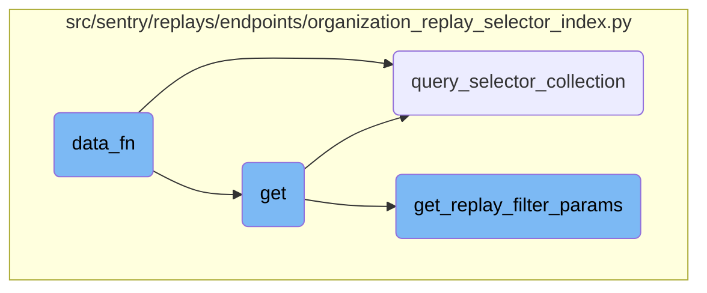
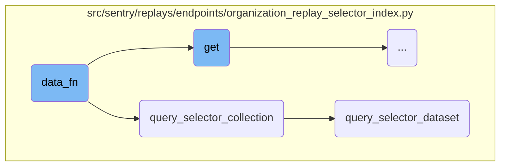
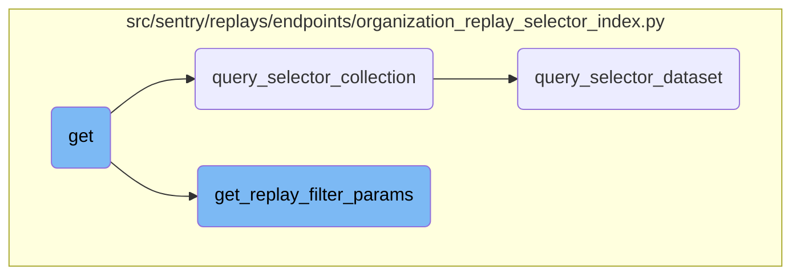

This document provides an overview of the <SwmToken path="src/sentry/replays/endpoints/organization_replay_selector_index.py" pos="129:3:3" line-data="        def data_fn(offset, limit):">`data_fn`</SwmToken> function, which is responsible for parsing search query parameters from a request and handling errors. It then calls another function to query a collection with the parsed parameters and other necessary arguments.

The <SwmToken path="src/sentry/replays/endpoints/organization_replay_selector_index.py" pos="129:3:3" line-data="        def data_fn(offset, limit):">`data_fn`</SwmToken> function starts by trying to parse the search query parameters from the request. If it encounters an error, it raises a <SwmToken path="src/sentry/replays/endpoints/organization_replay_selector_index.py" pos="90:3:3" line-data="            raise ParseError(detail=&quot;You cannot view events from multiple projects.&quot;)">`ParseError`</SwmToken>. Once the parameters are successfully parsed, it calls the <SwmToken path="src/sentry/replays/endpoints/organization_replay_selector_index.py" pos="135:3:3" line-data="            return query_selector_collection(">`query_selector_collection`</SwmToken> function with these parameters and other necessary arguments like project IDs, start and end times, sort order, limit, and offset. This function then handles the actual querying of the data.

Here is a high level diagram of the flow, showing only the most important functions:



# Flow drill down

First, we'll zoom into this section of the flow:



<SwmSnippet path="/src/sentry/replays/endpoints/organization_replay_selector_index.py" line="129">

---

## <SwmToken path="src/sentry/replays/endpoints/organization_replay_selector_index.py" pos="129:3:3" line-data="        def data_fn(offset, limit):">`data_fn`</SwmToken>

The <SwmToken path="src/sentry/replays/endpoints/organization_replay_selector_index.py" pos="129:3:3" line-data="        def data_fn(offset, limit):">`data_fn`</SwmToken> function is responsible for parsing the search query parameters from the request and handling any potential errors. It then calls the <SwmToken path="src/sentry/replays/endpoints/organization_replay_selector_index.py" pos="135:3:3" line-data="            return query_selector_collection(">`query_selector_collection`</SwmToken> function with the parsed parameters and other necessary arguments such as project IDs, start and end times, sort order, limit, and offset.

```python
        def data_fn(offset, limit):
            try:
                search_filters = parse_search_query(request.query_params.get("query", ""))
            except InvalidSearchQuery as e:
                raise ParseError(str(e))

            return query_selector_collection(
                project_ids=filter_params["project_id"],
                start=filter_params["start"],
                end=filter_params["end"],
                sort=filter_params.get("sort"),
                limit=limit,
                offset=offset,
                search_filters=search_filters,
                organization=organization,
            )
```

---

</SwmSnippet>

<SwmSnippet path="/src/sentry/replays/endpoints/organization_replay_selector_index.py" line="153">

---

## <SwmToken path="src/sentry/replays/endpoints/organization_replay_selector_index.py" pos="153:2:2" line-data="def query_selector_collection(">`query_selector_collection`</SwmToken>

The <SwmToken path="src/sentry/replays/endpoints/organization_replay_selector_index.py" pos="153:2:2" line-data="def query_selector_collection(">`query_selector_collection`</SwmToken> function queries an aggregated replay collection. It prepares pagination values and calls the <SwmToken path="src/sentry/replays/endpoints/organization_replay_selector_index.py" pos="171:5:5" line-data="    response = query_selector_dataset(">`query_selector_dataset`</SwmToken> function with the necessary parameters, including project IDs, start and end times, search filters, pagination values, sort order, and tenant IDs. The function returns the data from the response.

```python
def query_selector_collection(
    project_ids: list[int],
    start: datetime,
    end: datetime,
    sort: str | None,
    limit: str | None,
    offset: str | None,
    search_filters: list[Condition],
    organization: Organization,
) -> dict:
    """Query aggregated replay collection."""
    if organization:
        tenant_ids = {"organization_id": organization.id}
    else:
        tenant_ids = {}

    paginators = make_pagination_values(limit, offset)

    response = query_selector_dataset(
        project_ids=project_ids,
        start=start,
```

---

</SwmSnippet>

<SwmSnippet path="/src/sentry/replays/endpoints/organization_replay_selector_index.py" line="183">

---

## <SwmToken path="src/sentry/replays/endpoints/organization_replay_selector_index.py" pos="183:2:2" line-data="def query_selector_dataset(">`query_selector_dataset`</SwmToken>

The <SwmToken path="src/sentry/replays/endpoints/organization_replay_selector_index.py" pos="183:2:2" line-data="def query_selector_dataset(">`query_selector_dataset`</SwmToken> function constructs and executes a query to fetch replay data from the dataset. It handles pagination, search filters, and ordering. The function also pre-fetches the number of replays in the set and computes a sample rate to ensure efficient querying. Finally, it returns the query results.

```python
def query_selector_dataset(
    project_ids: list[int],
    start: datetime,
    end: datetime,
    search_filters: list[SearchFilter | ParenExpression | str],
    pagination: Paginators | None,
    sort: str | None,
    tenant_ids: dict[str, Any] | None = None,
):
    query_options = {}

    if pagination:
        query_options["limit"] = Limit(pagination.limit)
        query_options["offset"] = Offset(pagination.offset)

    conditions = handle_search_filters(query_config, search_filters)
    sorting = handle_ordering(sort_config, sort or "-count_dead_clicks")

    # Pre-fetch the number of replays in the set.
    #
    # NOTE: The date values have their seconds precision stripped. This is done so our queries
```

---

</SwmSnippet>

Now, lets zoom into this section of the flow:



<SwmSnippet path="/src/sentry/replays/endpoints/organization_replay_selector_index.py" line="83">

---

## Handling replay filter parameters

The function <SwmToken path="src/sentry/replays/endpoints/organization_replay_selector_index.py" pos="83:3:3" line-data="    def get_replay_filter_params(self, request, organization):">`get_replay_filter_params`</SwmToken> is responsible for retrieving and validating filter parameters for replay data. It first calls <SwmToken path="src/sentry/replays/endpoints/organization_replay_selector_index.py" pos="84:7:7" line-data="        filter_params = self.get_filter_params(request, organization)">`get_filter_params`</SwmToken> to get the initial filter parameters. Then, it checks if the user has global view permissions. If not, and if the filter parameters include multiple project IDs, it raises a <SwmToken path="src/sentry/replays/endpoints/organization_replay_selector_index.py" pos="90:3:3" line-data="            raise ParseError(detail=&quot;You cannot view events from multiple projects.&quot;)">`ParseError`</SwmToken>.

```python
    def get_replay_filter_params(self, request, organization):
        filter_params = self.get_filter_params(request, organization)

        has_global_views = features.has(
            "organizations:global-views", organization, actor=request.user
        )
        if not has_global_views and len(filter_params.get("project_id", [])) > 1:
            raise ParseError(detail="You cannot view events from multiple projects.")

        return filter_params
```

---

</SwmSnippet>

<SwmSnippet path="/src/sentry/replays/endpoints/organization_replay_selector_index.py" line="112">

---

## Pagination and data retrieval

The <SwmToken path="src/sentry/replays/endpoints/organization_replay_selector_index.py" pos="112:3:3" line-data="    def get(self, request: Request, organization: Organization) -&gt; Response:">`get`</SwmToken> function handles the main logic for retrieving replay selectors for a given organization. It first checks if the <SwmToken path="src/sentry/replays/endpoints/organization_replay_selector_index.py" pos="114:12:14" line-data="        if not features.has(&quot;organizations:session-replay&quot;, organization, actor=request.user):">`session-replay`</SwmToken> feature is enabled. Then, it retrieves filter parameters using <SwmToken path="src/sentry/replays/endpoints/organization_replay_selector_index.py" pos="117:7:7" line-data="            filter_params = self.get_replay_filter_params(request, organization)">`get_replay_filter_params`</SwmToken>. If no projects are found, it returns an empty response. The function then validates the request data and merges it with the filter parameters. The <SwmToken path="src/sentry/replays/endpoints/organization_replay_selector_index.py" pos="129:3:3" line-data="        def data_fn(offset, limit):">`data_fn`</SwmToken> function is defined to handle the actual data retrieval, including parsing search queries and calling <SwmToken path="src/sentry/replays/endpoints/organization_replay_selector_index.py" pos="135:3:3" line-data="            return query_selector_collection(">`query_selector_collection`</SwmToken> with the appropriate parameters. Finally, the <SwmToken path="src/sentry/replays/endpoints/organization_replay_selector_index.py" pos="146:5:5" line-data="        return self.paginate(">`paginate`</SwmToken> method is used to handle pagination and return the processed results.

```python
    def get(self, request: Request, organization: Organization) -> Response:
        """Return a list of selectors for a given organization."""
        if not features.has("organizations:session-replay", organization, actor=request.user):
            return Response(status=404)
        try:
            filter_params = self.get_replay_filter_params(request, organization)
        except NoProjects:
            return Response({"data": []}, status=200)

        result = ReplaySelectorValidator(data=request.GET)
        if not result.is_valid():
            raise ParseError(result.errors)

        for key, value in result.validated_data.items():
            if key not in filter_params:
                filter_params[key] = value

        def data_fn(offset, limit):
            try:
                search_filters = parse_search_query(request.query_params.get("query", ""))
            except InvalidSearchQuery as e:
```

---

</SwmSnippet>

&nbsp;

*This is an auto-generated document by Swimm AI 🌊 and has not yet been verified by a human*

<SwmMeta version="3.0.0" repo-id="Z2l0aHViJTNBJTNBc2VudHJ5LWRlbW8tMSUzQSUzQVN3aW1tLURlbW8=" repo-name="sentry-demo-1" doc-type="flows"><sup>Powered by [Swimm](/)</sup></SwmMeta>
