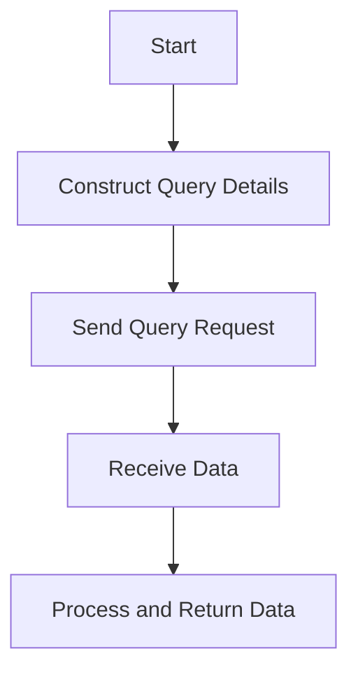

This document will cover the purpose and functionality of the `data_fn` function. We'll cover:

1. What the `data_fn` function does
2. How it constructs query details
3. The impact on the end user

Technical document: <SwmLink doc-title="Overview of the data_fn Function">[Overview of the data_fn Function](/.swm/overview-of-the-data_fn-function.2oyncsca.sw.md)</SwmLink>

# [What the ](https://app.swimm.io/repos/Z2l0aHViJTNBJTNBc2VudHJ5LWRlbW8tMSUzQSUzQVN3aW1tLURlbW8=/docs/2oyncsca#overview-of-the-data_fn-function)`data_fn` function does

The `data_fn` function is responsible for constructing the query details required for fetching data from the dataset. It acts as a blueprint that specifies what data to retrieve and how to retrieve it. This includes selecting specific columns, applying filters, sorting the data, and defining the amount of data to fetch at a time.

# [How it constructs query details](https://app.swimm.io/repos/Z2l0aHViJTNBJTNBc2VudHJ5LWRlbW8tMSUzQSUzQVN3aW1tLURlbW8=/docs/2oyncsca#data_fn)

The `data_fn` function gathers all necessary parameters to construct a detailed query. These parameters include:

- **Selected Columns**: Specifies which columns of data to retrieve.
- **Query**: Defines the filters to apply to the data.
- **Snuba Parameters**: Additional parameters required for querying the Snuba dataset.
- **Equations**: Mathematical expressions to apply to the data.
- **Orderby**: Specifies how to sort the data.
- **Offset and Limit**: Defines the pagination details, such as how much data to skip and the maximum number of records to fetch.
- **Other Configurations**: Additional settings like auto fields, auto aggregations, and metric aggregates.

# [The impact on the end user](https://app.swimm.io/repos/Z2l0aHViJTNBJTNBc2VudHJ5LWRlbW8tMSUzQSUzQVN3aW1tLURlbW8=/docs/2oyncsca#flow-drill-down)

For the end user, the `data_fn` function ensures that the data retrieval process is efficient and tailored to their specific needs. By constructing precise queries, it helps in fetching only the relevant data, which improves the performance and accuracy of the application. Users can expect faster load times and more relevant data being displayed, enhancing their overall experience.

&nbsp;

*This is an auto-generated document by Swimm AI 🌊 and has not yet been verified by a human*

<SwmMeta version="3.0.0" repo-id="Z2l0aHViJTNBJTNBc2VudHJ5LWRlbW8tMSUzQSUzQVN3aW1tLURlbW8=" repo-name="sentry-demo-1" doc-type="product-flows">Powered by [Swimm](/)</SwmMeta>
