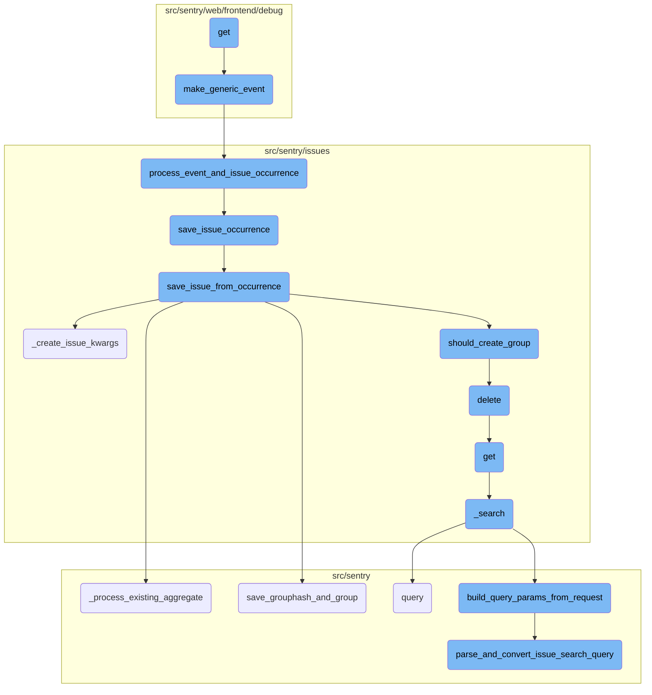
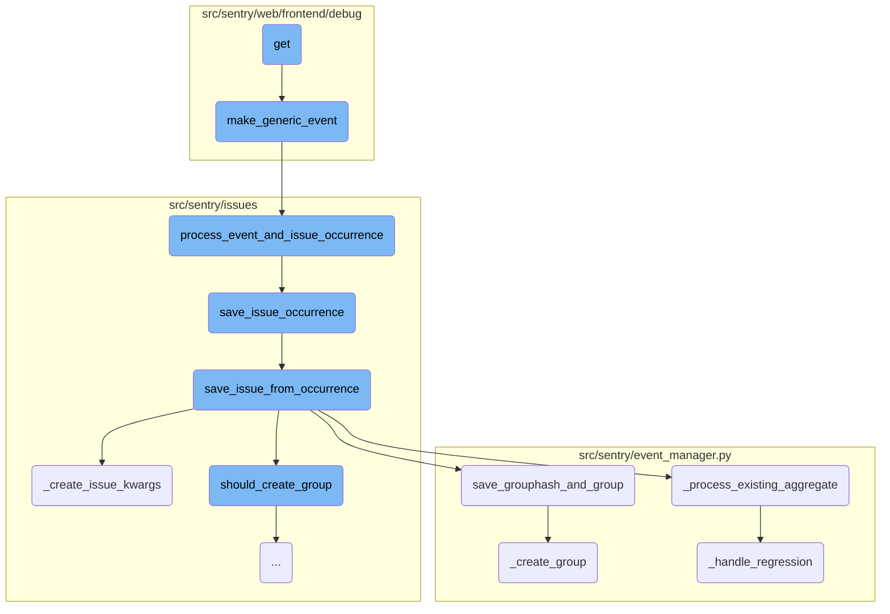
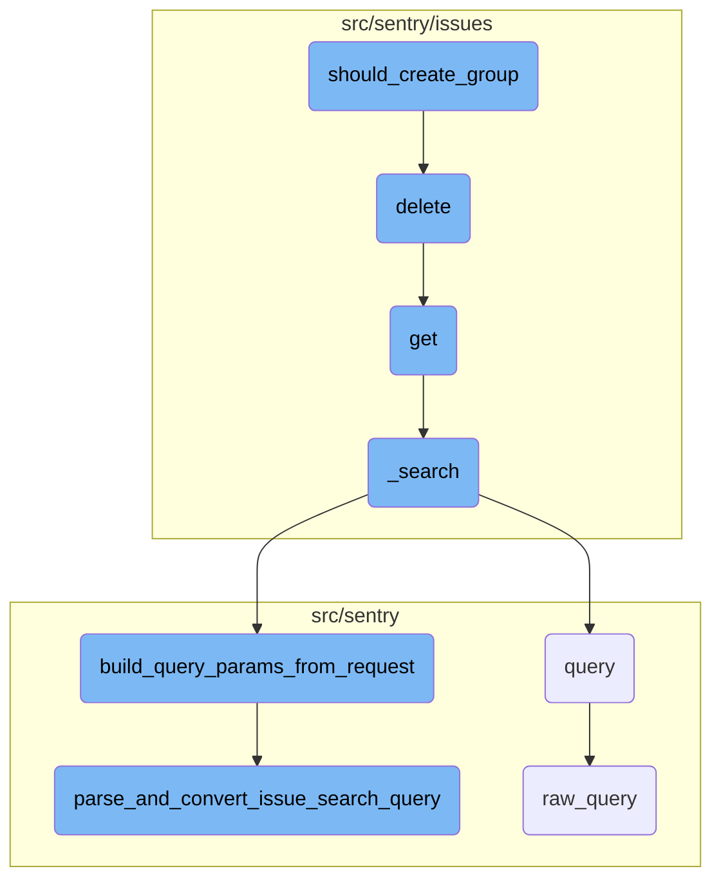

This document provides an overview of the flow involving the 'get' function. It explains how the function initializes necessary data structures, processes events and issues, and prepares the context for rendering an email preview.

The flow starts with the 'get' function, which sets up an organization and project. It then creates a generic event and prepares the context for rendering an email preview. The event is processed, and any associated issues are handled and stored. The flow ensures that events and issues are correctly categorized and processed, ultimately leading to the creation or updating of groups and their associated data.

Here is a high level diagram of the flow, showing only the most important functions:



# Flow drill down

First, we'll zoom into this section of the flow:



<SwmSnippet path="/src/sentry/web/frontend/debug/debug_generic_issue.py" line="16">

---

## Handling and processing events and issues

The <SwmToken path="src/sentry/web/frontend/debug/debug_generic_issue.py" pos="16:3:3" line-data="    def get(self, request):">`get`</SwmToken> function initializes an organization and project, creates a generic event, and prepares the context for rendering an email preview. This function is crucial as it sets up the necessary data structures and context for further processing.

```python
    def get(self, request):
        org = Organization(id=1, slug="example", name="Example")
        project = Project(id=1, slug="example", name="Example", organization=org)

        event = make_generic_event(project)
        group = event.group

        rule = Rule(id=1, label="An example rule")

        generic_issue_data_html = get_generic_data(event)
        section_header = "Issue Data" if generic_issue_data_html else ""

        return MailPreview(
            html_template="sentry/emails/generic.html",
            text_template="sentry/emails/generic.txt",
            context={
                "rule": rule,
                "rules": get_rules([rule], org, project),
                "group": group,
                "event": event,
                "timezone": zoneinfo.ZoneInfo("Europe/Vienna"),
```

---

</SwmSnippet>

<SwmSnippet path="/src/sentry/web/frontend/debug/mail.py" line="236">

---

## Creating a generic event

The <SwmToken path="src/sentry/web/frontend/debug/mail.py" pos="236:2:2" line-data="def make_generic_event(project: Project):">`make_generic_event`</SwmToken> function generates a generic event by creating a unique event ID, processing the event and issue occurrence, and returning the latest event. This function is essential for simulating events for debugging purposes.

```python
def make_generic_event(project: Project):
    event_id = uuid.uuid4().hex
    occurrence_data = TEST_ISSUE_OCCURRENCE.to_dict()
    occurrence_data["event_id"] = event_id
    occurrence_data["fingerprint"] = [
        md5(part.encode("utf-8")).hexdigest() for part in occurrence_data["fingerprint"]
    ]
    occurrence, group_info = process_event_and_issue_occurrence(
        occurrence_data,
        {
            "event_id": event_id,
            "project_id": project.id,
            "timestamp": before_now(minutes=1).isoformat(),
        },
    )
    assert group_info is not None
    generic_group = group_info.group
    return generic_group.get_latest_event()
```

---

</SwmSnippet>

<SwmSnippet path="/src/sentry/issues/occurrence_consumer.py" line="116">

---

## Processing event and issue occurrence

The <SwmToken path="src/sentry/issues/occurrence_consumer.py" pos="116:2:2" line-data="def process_event_and_issue_occurrence(">`process_event_and_issue_occurrence`</SwmToken> function validates the event ID, saves the event, and then calls <SwmToken path="src/sentry/issues/occurrence_consumer.py" pos="126:6:6" line-data="        &quot;occurrence_consumer._process_message.save_issue_occurrence&quot;,">`save_issue_occurrence`</SwmToken> to handle the issue occurrence. This function ensures that events and their associated issues are correctly processed and stored.

```python
def process_event_and_issue_occurrence(
    occurrence_data: IssueOccurrenceData, event_data: dict[str, Any]
) -> tuple[IssueOccurrence, GroupInfo | None]:
    if occurrence_data["event_id"] != event_data["event_id"]:
        raise ValueError(
            f"event_id in occurrence({occurrence_data['event_id']}) is different from event_id in event_data({event_data['event_id']})"
        )

    event = save_event_from_occurrence(event_data)
    with metrics.timer(
        "occurrence_consumer._process_message.save_issue_occurrence",
        tags={"method": "process_event_and_issue_occurrence"},
    ):
        return save_issue_occurrence(occurrence_data, event)
```

---

</SwmSnippet>

<SwmSnippet path="/src/sentry/issues/ingest.py" line="43">

---

## Saving issue occurrence

The <SwmToken path="src/sentry/issues/ingest.py" pos="43:2:2" line-data="def save_issue_occurrence(">`save_issue_occurrence`</SwmToken> function converts occurrence data to an <SwmToken path="src/sentry/issues/ingest.py" pos="45:6:6" line-data=") -&gt; tuple[IssueOccurrence, GroupInfo | None]:">`IssueOccurrence`</SwmToken> object, saves it, and then calls <SwmToken path="src/sentry/issues/ingest.py" pos="60:5:5" line-data="    group_info = save_issue_from_occurrence(occurrence, event, release)">`save_issue_from_occurrence`</SwmToken> to handle further processing. This function is responsible for persisting issue occurrences and initiating further processing steps.

```python
def save_issue_occurrence(
    occurrence_data: IssueOccurrenceData, event: Event
) -> tuple[IssueOccurrence, GroupInfo | None]:
    # Convert occurrence data to `IssueOccurrence`
    occurrence = IssueOccurrence.from_dict(occurrence_data)
    if occurrence.event_id != event.event_id:
        raise ValueError("IssueOccurrence must have the same event_id as the passed Event")
    # Note: For now we trust the project id passed along with the event. Later on we should make
    # sure that this is somehow validated.
    occurrence.save()

    try:
        release = Release.get(event.project, event.release)
    except Release.DoesNotExist:
        # The release should always exist here since event has been ingested at this point, but just
        # in case it has been deleted
        release = None
    group_info = save_issue_from_occurrence(occurrence, event, release)
    if group_info:
        environment = event.get_environment()
        _get_or_create_group_environment(environment, release, [group_info])
```

---

</SwmSnippet>

<SwmSnippet path="/src/sentry/issues/ingest.py" line="166">

---

## Saving issue from occurrence

The <SwmToken path="src/sentry/issues/ingest.py" pos="166:2:2" line-data="def save_issue_from_occurrence(">`save_issue_from_occurrence`</SwmToken> function creates or retrieves a group hash, checks rate limits, and either creates a new group or processes an existing one. This function is crucial for managing issue grouping and ensuring that issues are correctly categorized and processed.

```python
def save_issue_from_occurrence(
    occurrence: IssueOccurrence, event: Event, release: Release | None
) -> GroupInfo | None:
    project = event.project
    issue_kwargs = _create_issue_kwargs(occurrence, event, release)
    # We need to augment the message with occurrence data here since we can't build a `GroupEvent`
    # until after we have created a `Group`.
    issue_kwargs["message"] = augment_message_with_occurrence(issue_kwargs["message"], occurrence)

    # TODO: For now we will assume a single fingerprint. We can expand later if necessary.
    # Note that additional fingerprints won't be used to generated additional issues, they'll be
    # used to map the occurrence to a specific issue.
    new_grouphash = occurrence.fingerprint[0]
    existing_grouphash = (
        GroupHash.objects.filter(project=project, hash=new_grouphash)
        .select_related("group")
        .first()
    )

    if not existing_grouphash:
        cluster_key = settings.SENTRY_ISSUE_PLATFORM_RATE_LIMITER_OPTIONS.get("cluster", "default")
```

---

</SwmSnippet>

<SwmSnippet path="/src/sentry/event_manager.py" line="2279">

---

## Processing existing aggregate

The <SwmToken path="src/sentry/event_manager.py" pos="2279:2:2" line-data="def _process_existing_aggregate(">`_process_existing_aggregate`</SwmToken> function updates group values, handles regressions, and merges old and new data. This function ensures that existing groups are correctly updated with new event information.

```python
def _process_existing_aggregate(
    group: Group,
    event: BaseEvent,
    incoming_group_values: Mapping[str, Any],
    release: Release | None,
) -> bool:
    last_seen = max(event.datetime, group.last_seen)
    updated_group_values: dict[str, Any] = {"last_seen": last_seen}
    # Unclear why this is necessary, given that it's also in `updated_group_values`, but removing
    # it causes unrelated tests to fail. Hard to say if that's the tests or the removal, though.
    group.last_seen = updated_group_values["last_seen"]

    if (
        event.search_message
        and event.search_message != group.message
        and not _is_placeholder_title(event.search_message)
        and event.get_event_type() != TransactionEvent.key
    ):
        updated_group_values["message"] = event.search_message
    if group.level != incoming_group_values["level"]:
        updated_group_values["level"] = incoming_group_values["level"]
```

---

</SwmSnippet>

<SwmSnippet path="/src/sentry/event_manager.py" line="2989">

---

## Saving group hash and group

The <SwmToken path="src/sentry/event_manager.py" pos="2989:2:2" line-data="def save_grouphash_and_group(">`save_grouphash_and_group`</SwmToken> function creates or retrieves a group hash and associates it with a group. This function is essential for managing the relationship between group hashes and groups.

```python
def save_grouphash_and_group(
    project: Project,
    event: Event,
    new_grouphash: str,
    **group_kwargs: Any,
) -> tuple[Group, bool]:
    group = None
    with transaction.atomic(router.db_for_write(GroupHash)):
        group_hash, created = GroupHash.objects.get_or_create(project=project, hash=new_grouphash)
        if created:
            group = _create_group(project, event, **group_kwargs)
            group_hash.update(group=group)

    if group is None:
        # If we failed to create the group it means another worker beat us to
        # it. Since a GroupHash can only be created in a transaction with the
        # Group, we can guarantee that the Group will exist at this point and
        # fetch it via GroupHash
        group = Group.objects.get(grouphash__project=project, grouphash__hash=new_grouphash)
    return group, created
```

---

</SwmSnippet>

<SwmSnippet path="/src/sentry/issues/ingest.py" line="95">

---

## Creating issue kwargs

The <SwmToken path="src/sentry/issues/ingest.py" pos="95:2:2" line-data="def _create_issue_kwargs(">`_create_issue_kwargs`</SwmToken> function generates the keyword arguments needed to create an issue, including platform, message, level, and other metadata. This function prepares the necessary data for issue creation.

```python
def _create_issue_kwargs(
    occurrence: IssueOccurrence, event: Event, release: Release | None
) -> IssueArgs:
    kwargs: IssueArgs = {
        "platform": event.platform,
        # TODO: Figure out what message should be. Or maybe we just implement a platform event and
        # define it in `search_message` there.
        "message": event.search_message,
        "level": LOG_LEVELS_MAP.get(occurrence.level),
        "culprit": occurrence.culprit,
        "last_seen": event.datetime,
        "first_seen": event.datetime,
        "active_at": event.datetime,
        "type": occurrence.type.type_id,
        "first_release": release,
        "data": materialize_metadata(occurrence, event),
        "priority": (
            occurrence.initial_issue_priority
            if occurrence.initial_issue_priority is not None
            else occurrence.type.default_priority
        ),
```

---

</SwmSnippet>

<SwmSnippet path="/src/sentry/event_manager.py" line="1921">

---

## Creating a group

The <SwmToken path="src/sentry/event_manager.py" pos="1921:2:2" line-data="def _create_group(">`_create_group`</SwmToken> function creates a new group, assigns a short ID, and handles potential race conditions. This function is responsible for the actual creation of groups in the database.

```python
def _create_group(
    project: Project,
    event: Event,
    *,
    first_release: Release | None = None,
    **group_creation_kwargs: Any,
) -> Group:
    # Temporary log to debug events seeming to disappear after being sent to Seer
    if event.data.get("seer_similarity"):
        logger.info(
            "seer.similarity.pre_create_group",
            extra={
                "event_id": event.event_id,
                "hash": event.get_primary_hash(),
                "project": project.id,
            },
        )

    short_id = _get_next_short_id(project)

    # it's possible the release was deleted between
```

---

</SwmSnippet>

<SwmSnippet path="/src/sentry/event_manager.py" line="2095">

---

## Handling regression

The <SwmToken path="src/sentry/event_manager.py" pos="2095:2:2" line-data="def _handle_regression(group: Group, event: BaseEvent, release: Release | None) -&gt; bool | None:">`_handle_regression`</SwmToken> function checks if a group is resolved, handles regression logic, and updates the group's status. This function ensures that regressions are correctly identified and processed.

```python
def _handle_regression(group: Group, event: BaseEvent, release: Release | None) -> bool | None:
    if not group.is_resolved():
        return None

    # we only mark it as a regression if the event's release is newer than
    # the release which we originally marked this as resolved
    elif GroupResolution.has_resolution(group, release):
        return None

    elif has_pending_commit_resolution(group):
        return None

    if not plugin_is_regression(group, event):
        return None

    # we now think its a regression, rely on the database to validate that
    # no one beat us to this
    date = max(event.datetime, group.last_seen)
    is_regression = bool(
        Group.objects.filter(
            id=group.id,
```

---

</SwmSnippet>

Now, lets zoom into this section of the flow:



<SwmSnippet path="/src/sentry/issues/grouptype.py" line="597">

---

## Determining Group Creation

The function <SwmToken path="src/sentry/issues/grouptype.py" pos="597:2:2" line-data="def should_create_group(">`should_create_group`</SwmToken> determines whether a new group should be created based on the noise configuration and the number of times a group hash has been seen. It increments a counter for the group hash and checks if it exceeds a predefined threshold. If it does, the group hash is deleted, and the function returns `True`, indicating that a new group should be created. Otherwise, it sets an expiration for the group hash and returns `False`.

```python
def should_create_group(
    grouptype: type[GroupType],
    client: RedisCluster | StrictRedis,
    grouphash: str,
    project: Project,
) -> bool:
    key = f"grouphash:{grouphash}:{project.id}"
    times_seen = client.incr(key)
    noise_config = grouptype.noise_config

    if not noise_config:
        return True

    over_threshold = times_seen >= noise_config.ignore_limit

    metrics.incr(
        "noise_reduction.should_create_group.threshold",
        tags={
            "over_threshold": over_threshold,
            "group_type": grouptype.slug,
        },
```

---

</SwmSnippet>

<SwmSnippet path="/src/sentry/issues/endpoints/organization_group_index.py" line="495">

---

## Deleting Issues

The <SwmToken path="src/sentry/issues/endpoints/organization_group_index.py" pos="495:3:3" line-data="    def delete(self, request: Request, organization) -&gt; Response:">`delete`</SwmToken> function handles the bulk removal of issues. It retrieves the projects associated with the request and checks if the user has the necessary permissions. If the conditions are met, it calls the <SwmToken path="src/sentry/issues/endpoints/organization_group_index.py" pos="23:1:1" line-data="    delete_groups,">`delete_groups`</SwmToken> function to perform the deletion based on the provided issue <SwmToken path="src/sentry/issues/endpoints/organization_group_index.py" pos="506:5:5" line-data="        If any IDs are out of scope this operation will succeed without">`IDs`</SwmToken>.

`````````````````````````````python
    def delete(self, request: Request, organization) -> Response:
        """
        Bulk Remove a List of Issues
        ````````````````````````````

        Permanently remove the given issues. The list of issues to
        modify is given through the `id` query parameter.  It is repeated
        for each issue that should be removed.

        Only queries by 'id' are accepted.

        If any IDs are out of scope this operation will succeed without
        any data mutation.

        :qparam int id: a list of IDs of the issues to be removed.  This
                        parameter shall be repeated for each issue, e.g.
                        `?id=1&id=2&id=3`. If this parameter is not provided,
                        it will attempt to remove the first 1000 issues.
        :pparam string organization_id_or_slug: the id or slug of the organization the
                                          issues belong to.
        :auth: required
`````````````````````````````

---

</SwmSnippet>

<SwmSnippet path="/src/sentry/issues/endpoints/organization_group_index.py" line="203">

---

## Listing Issues

The <SwmToken path="src/sentry/issues/endpoints/organization_group_index.py" pos="203:3:3" line-data="    def get(self, request: Request, organization) -&gt; Response:">`get`</SwmToken> function lists issues for an organization. It processes various query parameters to filter and sort the issues. It also handles special cases like direct hit lookups for event <SwmToken path="src/sentry/issues/endpoints/organization_group_index.py" pos="506:5:5" line-data="        If any IDs are out of scope this operation will succeed without">`IDs`</SwmToken> and short <SwmToken path="src/sentry/issues/endpoints/organization_group_index.py" pos="506:5:5" line-data="        If any IDs are out of scope this operation will succeed without">`IDs`</SwmToken>. The function ultimately returns a serialized response containing the list of issues.

``````````````````````````````python
    def get(self, request: Request, organization) -> Response:
        """
        List an Organization's Issues
        `````````````````````````````

        Return a list of issues (groups) bound to an organization.  All parameters are
        supplied as query string parameters.

        A default query of ``is:unresolved issue.priority:[high,medium]`` is applied.
        To return results with other statuses send a new query value
        (i.e. ``?query=`` for all results).

        The ``groupStatsPeriod`` parameter can be used to select the timeline
        stats which should be present. Possible values are: '' (disable),
        '24h', '14d'

        The ``statsPeriod`` parameter can be used to select a date window starting
        from now. Ex. ``14d``.

        The ``start`` and ``end`` parameters can be used to select an absolute
        date period to fetch issues from.
``````````````````````````````

---

</SwmSnippet>

<SwmSnippet path="/src/sentry/issues/endpoints/organization_group_index.py" line="153">

---

## Searching Issues

The <SwmToken path="src/sentry/issues/endpoints/organization_group_index.py" pos="153:3:3" line-data="    def _search(">`_search`</SwmToken> function builds query parameters from the request and performs a search for issues. It supports different sorting options and can use either the inbox search or the standard search backend. The function returns the search results along with the query parameters used.

```python
    def _search(
        self, request: Request, organization, projects, environments, extra_query_kwargs=None
    ):
        with start_span(op="_search"):
            query_kwargs = build_query_params_from_request(
                request, organization, projects, environments
            )
            if extra_query_kwargs is not None:
                assert "environment" not in extra_query_kwargs
                query_kwargs.update(extra_query_kwargs)

            query_kwargs["environments"] = environments if environments else None

            query_kwargs["actor"] = request.user
            if query_kwargs["sort_by"] == "inbox":
                query_kwargs.pop("sort_by")
                result = inbox_search(**query_kwargs)
            else:

                def use_group_snuba_dataset() -> bool:
                    # if useGroupSnubaDataset is present, override the flag so we can test the new dataset
```

---

</SwmSnippet>

<SwmSnippet path="/src/sentry/utils/snuba.py" line="1318">

---

## Querying Snuba

The <SwmToken path="src/sentry/utils/snuba.py" pos="1318:2:2" line-data="def query(">`query`</SwmToken> function sends a query to Snuba, a data analytics service. It constructs the query parameters and calls the <SwmToken path="src/sentry/utils/snuba.py" pos="1337:5:5" line-data="        body = raw_query(">`raw_query`</SwmToken> function to execute the query. The function then processes the response and returns the results.

```python
def query(
    dataset=None,
    start=None,
    end=None,
    groupby=None,
    conditions=None,
    filter_keys=None,
    aggregations=None,
    selected_columns=None,
    totals=None,
    use_cache=False,
    **kwargs,
):
    aggregations = aggregations or [["count()", "", "aggregate"]]
    filter_keys = filter_keys or {}
    selected_columns = selected_columns or []
    groupby = groupby or []

    try:
        body = raw_query(
            dataset=dataset,
```

---

</SwmSnippet>

<SwmSnippet path="/src/sentry/api/helpers/group_index/index.py" line="65">

---

## Building Query Parameters

The <SwmToken path="src/sentry/api/helpers/group_index/index.py" pos="65:2:2" line-data="def build_query_params_from_request(">`build_query_params_from_request`</SwmToken> function constructs query parameters from the request for searching issues. It handles various query options like sorting, pagination, and saved searches. The function also sets search filters based on the parsed query.

```python
def build_query_params_from_request(
    request: Request,
    organization: "Organization",
    projects: Sequence["Project"],
    environments: Sequence["Environment"] | None,
) -> MutableMapping[str, Any]:
    query_kwargs = {"projects": projects, "sort_by": request.GET.get("sort", DEFAULT_SORT_OPTION)}

    limit = request.GET.get("limit")
    if limit:
        try:
            query_kwargs["limit"] = int(limit)
        except ValueError:
            raise ValidationError("invalid limit")

    # TODO: proper pagination support
    if request.GET.get("cursor"):
        try:
            query_kwargs["cursor"] = Cursor.from_string(request.GET.get("cursor"))
        except ValueError:
            raise ParseError(detail="Invalid cursor parameter.")
```

---

</SwmSnippet>

<SwmSnippet path="/src/sentry/api/helpers/group_index/index.py" line="47">

---

## Parsing and Converting Search Query

The <SwmToken path="src/sentry/api/helpers/group_index/index.py" pos="47:2:2" line-data="def parse_and_convert_issue_search_query(">`parse_and_convert_issue_search_query`</SwmToken> function parses a search query and converts it into search filters. It validates the search filters and ensures the user has the necessary permissions to perform the search.

```python
def parse_and_convert_issue_search_query(
    query: str,
    organization: Organization,
    projects: Sequence[Project],
    environments: Sequence[Environment],
    user: User | AnonymousUser,
) -> Sequence[SearchFilter]:
    try:
        search_filters = convert_query_values(
            parse_search_query(query), projects, user, environments
        )
    except InvalidSearchQuery as e:
        raise ValidationError(f"Error parsing search query: {e}")

    validate_search_filter_permissions(organization, search_filters, user)
    return search_filters
```

---

</SwmSnippet>

<SwmSnippet path="/src/sentry/utils/snuba.py" line="846">

---

## Executing Raw Query

The <SwmToken path="src/sentry/utils/snuba.py" pos="846:2:2" line-data="def raw_query(">`raw_query`</SwmToken> function sends a raw query to Snuba. It constructs the query parameters and calls the <SwmToken path="src/sentry/utils/snuba.py" pos="882:3:3" line-data="    return bulk_raw_query([snuba_params], referrer=referrer, use_cache=use_cache)[0]">`bulk_raw_query`</SwmToken> function to execute the query. The function returns the query results.

```python
def raw_query(
    dataset=None,
    start=None,
    end=None,
    groupby=None,
    conditions=None,
    filter_keys=None,
    aggregations=None,
    rollup=None,
    referrer=None,
    is_grouprelease=False,
    use_cache=False,
    **kwargs,
) -> Mapping[str, Any]:
    """
    Sends a query to snuba.  See `SnubaQueryParams` docstring for param
    descriptions.
    """

    if referrer:
        kwargs["tenant_ids"] = kwargs.get("tenant_ids") or dict()
```

---

</SwmSnippet>

&nbsp;

*This is an auto-generated document by Swimm AI 🌊 and has not yet been verified by a human*

<SwmMeta version="3.0.0" repo-id="Z2l0aHViJTNBJTNBc2VudHJ5LWRlbW8tMSUzQSUzQVN3aW1tLURlbW8=" repo-name="sentry-demo-1" doc-type="flows"><sup>Powered by [Swimm](/)</sup></SwmMeta>
