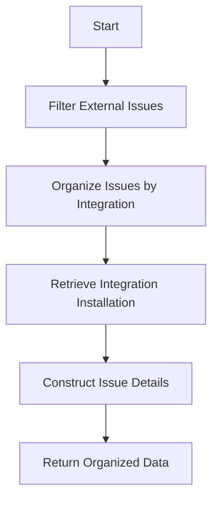

This document will cover the purpose and functionality of the get_attrs function. We'll cover:

1. Filtering and organizing external issues
2. Retrieving integration details
3. Constructing and returning organized data.

Technical document: <SwmLink doc-title="Overview of get_attrs Function">[Overview of get_attrs Function](/.swm/overview-of-get_attrs-function.zum1d1z0.sw.md)</SwmLink>

# [Filtering and organizing external issues](https://app.swimm.io/repos/Z2l0aHViJTNBJTNBc2VudHJ5LWRlbW8tMSUzQSUzQVN3aW1tLURlbW8=/docs/zum1d1z0#filtering-and-organizing-external-issues)

The get_attrs function begins by filtering external issues based on the group and integration IDs. This step ensures that only relevant issues linked to the specific group and integrations are considered. By filtering these issues, we can focus on the ones that are pertinent to the user's current context, improving the efficiency and relevance of the data retrieval process.

# [Retrieving integration details](https://app.swimm.io/repos/Z2l0aHViJTNBJTNBc2VudHJ5LWRlbW8tMSUzQSUzQVN3aW1tLURlbW8=/docs/zum1d1z0#retrieving-integration-details)

After filtering, the function organizes these issues by their respective integrations. It then retrieves the integration installation for each issue. This step is crucial because it allows the system to gather necessary details about each integration, such as the installation specifics, which are required to construct a comprehensive view of the issues. This ensures that the data returned to the user is complete and includes all relevant integration details.

# [Constructing and returning organized data](https://app.swimm.io/repos/Z2l0aHViJTNBJTNBc2VudHJ5LWRlbW8tMSUzQSUzQVN3aW1tLURlbW8=/docs/zum1d1z0#constructing-and-returning-organized-data)

The function then constructs a dictionary containing detailed information about each issue, including the issue ID, key, URL, title, description, and display name. This organized data is then returned as a mapping of integrations to their respective issues. This final step ensures that the user receives a well-structured and detailed overview of all external issues linked to the group, categorized by integration. This organized data helps users quickly understand and navigate the issues, facilitating better issue management and resolution.

&nbsp;

*This is an auto-generated document by Swimm AI 🌊 and has not yet been verified by a human*

<SwmMeta version="3.0.0" repo-id="Z2l0aHViJTNBJTNBc2VudHJ5LWRlbW8tMSUzQSUzQVN3aW1tLURlbW8=" repo-name="sentry-demo-1" doc-type="product-flows">Powered by [Swimm](/)</SwmMeta>
