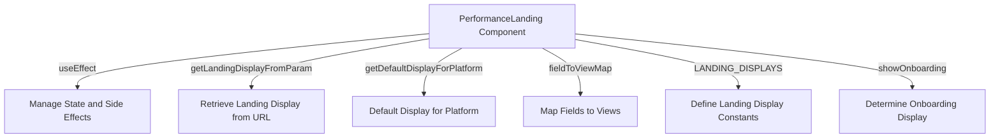

# Overview

The Landing Page in the Performance section serves as the main entry point for performance-related views and data in the application. It determines which specific view to display based on the <SwmToken path="static/app/views/performance/landing/utils.tsx" pos="80:13:13" line-data="  const landingField = decodeScalar(location?.query?.landingDisplay);">`landingDisplay`</SwmToken> constant, which is derived from URL parameters or default settings.

<SwmSnippet path="/static/app/views/performance/landing/utils.tsx" line="41">

---

# Landing Display Constants

The <SwmToken path="static/app/views/performance/landing/utils.tsx" pos="41:4:4" line-data="export const LANDING_DISPLAYS = [">`LANDING_DISPLAYS`</SwmToken> constant defines the different views available for the landing page, such as 'All Transactions', 'Frontend', 'Backend', and 'Mobile'.

```tsx
export const LANDING_DISPLAYS = [
  {
    label: t('All Transactions'),
    field: LandingDisplayField.ALL,
  },
  {
    label: t('Frontend'),
    field: LandingDisplayField.FRONTEND_OTHER,
  },
  {
    label: t('Backend'),
    field: LandingDisplayField.BACKEND,
  },
  {
    label: t('Mobile'),
```

---

</SwmSnippet>

<SwmSnippet path="/static/app/views/performance/landing/index.tsx" line="72">

---

# Mapping Fields to Views

The <SwmToken path="static/app/views/performance/landing/index.tsx" pos="72:2:2" line-data="const fieldToViewMap: Record&lt;LandingDisplayField, FC&lt;Props&gt;&gt; = {">`fieldToViewMap`</SwmToken> constant maps each <SwmToken path="static/app/views/performance/landing/index.tsx" pos="72:7:7" line-data="const fieldToViewMap: Record&lt;LandingDisplayField, FC&lt;Props&gt;&gt; = {">`LandingDisplayField`</SwmToken> to its corresponding view component, such as <SwmToken path="static/app/views/performance/landing/index.tsx" pos="73:8:8" line-data="  [LandingDisplayField.ALL]: AllTransactionsView,">`AllTransactionsView`</SwmToken> and <SwmToken path="static/app/views/performance/landing/index.tsx" pos="74:8:8" line-data="  [LandingDisplayField.BACKEND]: BackendView,">`BackendView`</SwmToken>.

```tsx
const fieldToViewMap: Record<LandingDisplayField, FC<Props>> = {
  [LandingDisplayField.ALL]: AllTransactionsView,
  [LandingDisplayField.BACKEND]: BackendView,
  [LandingDisplayField.FRONTEND_OTHER]: FrontendOtherView,
  [LandingDisplayField.FRONTEND_PAGELOAD]: FrontendPageloadView,
  [LandingDisplayField.MOBILE]: MobileView,
};
```

---

</SwmSnippet>

<SwmSnippet path="/static/app/views/performance/landing/utils.tsx" line="79">

---

# Getting Landing Display from URL Parameters

The function <SwmToken path="static/app/views/performance/landing/utils.tsx" pos="79:4:4" line-data="export function getLandingDisplayFromParam(location: Location) {">`getLandingDisplayFromParam`</SwmToken> retrieves the landing display setting from the URL parameters.

```tsx
export function getLandingDisplayFromParam(location: Location) {
  const landingField = decodeScalar(location?.query?.landingDisplay);

  const display = LANDING_DISPLAYS.find(({field}) => field === landingField);
  return display;
}
```

---

</SwmSnippet>

<SwmSnippet path="/static/app/views/performance/landing/utils.tsx" line="86">

---

# Default Display for Platform

The function <SwmToken path="static/app/views/performance/landing/utils.tsx" pos="86:4:4" line-data="export function getDefaultDisplayForPlatform(projects: Project[], eventView?: EventView) {">`getDefaultDisplayForPlatform`</SwmToken> returns the default landing display based on the platform and projects.

```tsx
export function getDefaultDisplayForPlatform(projects: Project[], eventView?: EventView) {
  const defaultDisplayField = getDefaultDisplayFieldForPlatform(projects, eventView);

  const defaultDisplay = LANDING_DISPLAYS.find(
    ({field}) => field === defaultDisplayField
  );
  return defaultDisplay || LANDING_DISPLAYS[0];
}
```

---

</SwmSnippet>

<SwmSnippet path="/static/app/views/performance/landing/index.tsx" line="91">

---

# Managing State and Side Effects

The <SwmToken path="static/app/views/performance/landing/index.tsx" pos="80:4:4" line-data="export function PerformanceLanding(props: Props) {">`PerformanceLanding`</SwmToken> component uses hooks like <SwmToken path="static/app/views/performance/landing/index.tsx" pos="102:1:1" line-data="  useEffect(() =&gt; {">`useEffect`</SwmToken> to manage state and side effects, such as updating the URL and tracking analytics.

```tsx
  const {teams, initiallyLoaded} = useTeams({provideUserTeams: true});

  const hasMounted = useRef(false);
  const paramLandingDisplay = getLandingDisplayFromParam(location);
  const defaultLandingDisplayForProjects = getDefaultDisplayForPlatform(
    projects,
    eventView
  );
  const landingDisplay = paramLandingDisplay ?? defaultLandingDisplayForProjects;
  const showOnboarding = onboardingProject !== undefined;

  useEffect(() => {
    if (hasMounted.current) {
      browserHistory.replace({
        pathname: location.pathname,
        query: {
          ...location.query,
          landingDisplay: undefined,
        },
      });
    }
```

---

</SwmSnippet>

# Landing Page Endpoints

The Landing Page includes several endpoints for fetching data related to mobile release comparisons.

<SwmSnippet path="/static/app/views/performance/landing/widgets/widgets/mobileReleaseComparisonListWidget.tsx" line="108">

---

## <SwmToken path="static/app/views/performance/landing/widgets/widgets/mobileReleaseComparisonListWidget.tsx" pos="108:3:3" line-data="  const listQuery = useMemo&lt;QueryDefinition&lt;DataType, WidgetDataResult&gt;&gt;(">`listQuery`</SwmToken>

The <SwmToken path="static/app/views/performance/landing/widgets/widgets/mobileReleaseComparisonListWidget.tsx" pos="108:3:3" line-data="  const listQuery = useMemo&lt;QueryDefinition&lt;DataType, WidgetDataResult&gt;&gt;(">`listQuery`</SwmToken> endpoint is defined using the <SwmToken path="static/app/views/performance/landing/widgets/widgets/mobileReleaseComparisonListWidget.tsx" pos="108:7:7" line-data="  const listQuery = useMemo&lt;QueryDefinition&lt;DataType, WidgetDataResult&gt;&gt;(">`useMemo`</SwmToken> hook. It constructs a query definition for fetching list data related to mobile release comparisons.

```tsx
  const listQuery = useMemo<QueryDefinition<DataType, WidgetDataResult>>(
    () => ({
      fields: field,
      component: provided => {
        if (isLoadingReleases || (!primaryRelease && !secondaryRelease)) {
          return null;
        }

        const eventView = provided.eventView.clone();
        let extraQueryParams = getMEPParamsIfApplicable(mepSetting, props.chartSetting);

        // Set fields
        const sortField = {
          [PerformanceWidgetSetting.SLOW_SCREENS_BY_TTID]: 'count()',
          [PerformanceWidgetSetting.SLOW_SCREENS_BY_COLD_START]:
            'count_starts(measurements.app_start_cold)',
          [PerformanceWidgetSetting.SLOW_SCREENS_BY_WARM_START]:
            'count_starts(measurements.app_start_warm)',
        }[props.chartSetting];
        eventView.fields = [{field: 'transaction'}, {field}, {field: sortField}];
        eventView.sorts = [
```

---

</SwmSnippet>

<SwmSnippet path="/static/app/views/performance/landing/widgets/widgets/mobileReleaseComparisonListWidget.tsx" line="170">

---

## <SwmToken path="static/app/views/performance/landing/widgets/widgets/mobileReleaseComparisonListWidget.tsx" pos="170:3:3" line-data="  const chartQuery = useMemo&lt;QueryDefinition&lt;DataType, WidgetDataResult&gt;&gt;(">`chartQuery`</SwmToken>

The <SwmToken path="static/app/views/performance/landing/widgets/widgets/mobileReleaseComparisonListWidget.tsx" pos="170:3:3" line-data="  const chartQuery = useMemo&lt;QueryDefinition&lt;DataType, WidgetDataResult&gt;&gt;(">`chartQuery`</SwmToken> endpoint is another query definition created using the <SwmToken path="static/app/views/performance/landing/widgets/widgets/mobileReleaseComparisonListWidget.tsx" pos="170:7:7" line-data="  const chartQuery = useMemo&lt;QueryDefinition&lt;DataType, WidgetDataResult&gt;&gt;(">`useMemo`</SwmToken> hook. It is responsible for fetching chart data related to mobile release comparisons.

```tsx
  const chartQuery = useMemo<QueryDefinition<DataType, WidgetDataResult>>(
    () => {
      return {
        enabled: widgetData => {
          return !!widgetData?.list?.data?.length;
        },
        fields: field,
        component: provided => {
          if (selectedListIndex < 0) {
            return null;
          }

          const eventView = props.eventView.clone();
          let extraQueryParams = getMEPParamsIfApplicable(mepSetting, props.chartSetting);
          const pageFilterDatetime = {
            start: provided.start,
            end: provided.end,
            period: provided.period,
          };

          // Chart options
```

---

</SwmSnippet>

&nbsp;

*This is an auto-generated document by Swimm AI 🌊 and has not yet been verified by a human*

<SwmMeta version="3.0.0" repo-id="Z2l0aHViJTNBJTNBc2VudHJ5LWRlbW8tMSUzQSUzQVN3aW1tLURlbW8=" repo-name="sentry-demo-1" doc-type="overview"><sup>Powered by [Swimm](/)</sup></SwmMeta>
