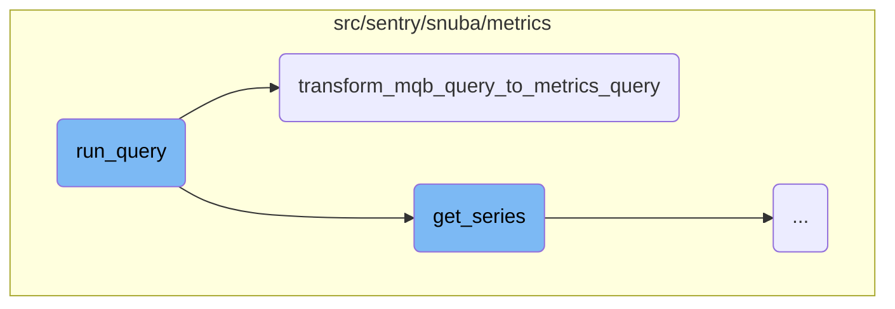

```mermaid
graph TD;
      subgraph src/sentry/snuba/metrics
8b7dfb2384b18eb86c6bd433cfe8281dcfd665cd038938bba5731a71caad3d38(get_series):::mainFlowStyle --> fe7d7ced62c4c8a87bc9f53d59224a519081a1308af798355f032c6a05b467a1(_get_group_limit_filters)
end

subgraph src/sentry/snuba/metrics
8b7dfb2384b18eb86c6bd433cfe8281dcfd665cd038938bba5731a71caad3d38(get_series):::mainFlowStyle --> 799ee51890738248ce6eb5af6e1691afe1de6ee2c8306fb2ea2a9bdf408bcf5e(translate_result_groups)
end

subgraph src/sentry/snuba/metrics
8b7dfb2384b18eb86c6bd433cfe8281dcfd665cd038938bba5731a71caad3d38(get_series):::mainFlowStyle --> 35d12040966934efdd76bd3363426bc13b8433a48d9753f7f3250c37f1369ff1(get_snuba_queries):::mainFlowStyle
end

subgraph src/sentry/snuba/metrics
35d12040966934efdd76bd3363426bc13b8433a48d9753f7f3250c37f1369ff1(get_snuba_queries):::mainFlowStyle --> ayan7(...)
end

subgraph src/sentry/snuba/metrics
fe7d7ced62c4c8a87bc9f53d59224a519081a1308af798355f032c6a05b467a1(_get_group_limit_filters) --> 0393eb7d2af0dfb37758db1603039181af0acca01c00e1c1e2aea7e4dd0ebcf3(generate_snql_for_action_by_fields)
end

subgraph src/sentry/db/models/manager/base.py
fe7d7ced62c4c8a87bc9f53d59224a519081a1308af798355f032c6a05b467a1(_get_group_limit_filters) --> 25b25385471ff8f715f8366cc7eb7ca5f0ac18ed29a50f526826627701aae715(get_many_from_cache)
end


      classDef mainFlowStyle color:#000000,fill:#7CB9F4
classDef rootsStyle color:#000000,fill:#00FFF4
classDef Style1 color:#000000,fill:#00FFAA
classDef Style2 color:#000000,fill:#FFFF00
classDef Style3 color:#000000,fill:#AA7CB9

%% Swimm:
%% graph TD;
%%       subgraph <SwmPath>[src/sentry/snuba/metrics/](src/sentry/snuba/metrics/)</SwmPath>
%% 8b7dfb2384b18eb86c6bd433cfe8281dcfd665cd038938bba5731a71caad3d38(get_series):::mainFlowStyle --> fe7d7ced62c4c8a87bc9f53d59224a519081a1308af798355f032c6a05b467a1(_get_group_limit_filters)
%% end
%% 
%% subgraph <SwmPath>[src/sentry/snuba/metrics/](src/sentry/snuba/metrics/)</SwmPath>
%% 8b7dfb2384b18eb86c6bd433cfe8281dcfd665cd038938bba5731a71caad3d38(get_series):::mainFlowStyle --> 799ee51890738248ce6eb5af6e1691afe1de6ee2c8306fb2ea2a9bdf408bcf5e(translate_result_groups)
%% end
%% 
%% subgraph <SwmPath>[src/sentry/snuba/metrics/](src/sentry/snuba/metrics/)</SwmPath>
%% 8b7dfb2384b18eb86c6bd433cfe8281dcfd665cd038938bba5731a71caad3d38(get_series):::mainFlowStyle --> 35d12040966934efdd76bd3363426bc13b8433a48d9753f7f3250c37f1369ff1(get_snuba_queries):::mainFlowStyle
%% end
%% 
%% subgraph <SwmPath>[src/sentry/snuba/metrics/](src/sentry/snuba/metrics/)</SwmPath>
%% 35d12040966934efdd76bd3363426bc13b8433a48d9753f7f3250c37f1369ff1(get_snuba_queries):::mainFlowStyle --> ayan7(...)
%% end
%% 
%% subgraph <SwmPath>[src/sentry/snuba/metrics/](src/sentry/snuba/metrics/)</SwmPath>
%% fe7d7ced62c4c8a87bc9f53d59224a519081a1308af798355f032c6a05b467a1(_get_group_limit_filters) --> 0393eb7d2af0dfb37758db1603039181af0acca01c00e1c1e2aea7e4dd0ebcf3(generate_snql_for_action_by_fields)
%% end
%% 
%% subgraph <SwmPath>[src/sentry/db/models/manager/base.py](src/sentry/db/models/manager/base.py)</SwmPath>
%% fe7d7ced62c4c8a87bc9f53d59224a519081a1308af798355f032c6a05b467a1(_get_group_limit_filters) --> 25b25385471ff8f715f8366cc7eb7ca5f0ac18ed29a50f526826627701aae715(get_many_from_cache)
%% end
%% 
%% 
%%       classDef mainFlowStyle color:#000000,fill:#7CB9F4
%% classDef rootsStyle color:#000000,fill:#00FFF4
%% classDef Style1 color:#000000,fill:#00FFAA
%% classDef Style2 color:#000000,fill:#FFFF00
%% classDef Style3 color:#000000,fill:#AA7CB9
```

```mermaid
graph TD;
      subgraph src/sentry/snuba/metrics/query_builder.py
35d12040966934efdd76bd3363426bc13b8433a48d9753f7f3250c37f1369ff1(get_snuba_queries):::mainFlowStyle --> bd14e9b00f8f139f07c1c43f8c6fe88cd160a270d315f5103fa529250e882fe4(_build_orderby)
end

subgraph src/sentry/snuba/metrics/query_builder.py
35d12040966934efdd76bd3363426bc13b8433a48d9753f7f3250c37f1369ff1(get_snuba_queries):::mainFlowStyle --> 2d06a4ed38a8089539d966a62f8735213bf1fd3b40b2766b774546f8a2779e61(_build_groupby)
end

subgraph src/sentry/snuba/metrics/query_builder.py
35d12040966934efdd76bd3363426bc13b8433a48d9753f7f3250c37f1369ff1(get_snuba_queries):::mainFlowStyle --> dd50acca96d1e3a1ae2d2011b036d89846801b7b4ae558f3ed316ea8663f70e7(_build_where):::mainFlowStyle
end

subgraph src/sentry/snuba/metrics/query_builder.py
dd50acca96d1e3a1ae2d2011b036d89846801b7b4ae558f3ed316ea8663f70e7(_build_where):::mainFlowStyle --> f451826f5d7a344a3fe736ada0e8b6b981b247d2b89941999c81508d7358f2b0(resolve_tags):::mainFlowStyle
end

subgraph src/sentry/snuba/metrics/query_builder.py
2d06a4ed38a8089539d966a62f8735213bf1fd3b40b2766b774546f8a2779e61(_build_groupby) --> 0393eb7d2af0dfb37758db1603039181af0acca01c00e1c1e2aea7e4dd0ebcf3(generate_snql_for_action_by_fields)
end

subgraph src/sentry/snuba/metrics/query_builder.py
bd14e9b00f8f139f07c1c43f8c6fe88cd160a270d315f5103fa529250e882fe4(_build_orderby) --> 0393eb7d2af0dfb37758db1603039181af0acca01c00e1c1e2aea7e4dd0ebcf3(generate_snql_for_action_by_fields)
end

subgraph src/sentry/snuba/metrics/query_builder.py
f451826f5d7a344a3fe736ada0e8b6b981b247d2b89941999c81508d7358f2b0(resolve_tags):::mainFlowStyle --> da7cba782bbe317a13ec92c87f7d3cc85adcc8f0f11dbf92143dee410e04a4f1(transform_null_transaction_to_unparameterized):::mainFlowStyle
end


      classDef mainFlowStyle color:#000000,fill:#7CB9F4
classDef rootsStyle color:#000000,fill:#00FFF4
classDef Style1 color:#000000,fill:#00FFAA
classDef Style2 color:#000000,fill:#FFFF00
classDef Style3 color:#000000,fill:#AA7CB9

%% Swimm:
%% graph TD;
%%       subgraph <SwmPath>[src/sentry/snuba/metrics/query_builder.py](src/sentry/snuba/metrics/query_builder.py)</SwmPath>
%% 35d12040966934efdd76bd3363426bc13b8433a48d9753f7f3250c37f1369ff1(get_snuba_queries):::mainFlowStyle --> bd14e9b00f8f139f07c1c43f8c6fe88cd160a270d315f5103fa529250e882fe4(_build_orderby)
%% end
%% 
%% subgraph <SwmPath>[src/sentry/snuba/metrics/query_builder.py](src/sentry/snuba/metrics/query_builder.py)</SwmPath>
%% 35d12040966934efdd76bd3363426bc13b8433a48d9753f7f3250c37f1369ff1(get_snuba_queries):::mainFlowStyle --> 2d06a4ed38a8089539d966a62f8735213bf1fd3b40b2766b774546f8a2779e61(_build_groupby)
%% end
%% 
%% subgraph <SwmPath>[src/sentry/snuba/metrics/query_builder.py](src/sentry/snuba/metrics/query_builder.py)</SwmPath>
%% 35d12040966934efdd76bd3363426bc13b8433a48d9753f7f3250c37f1369ff1(get_snuba_queries):::mainFlowStyle --> dd50acca96d1e3a1ae2d2011b036d89846801b7b4ae558f3ed316ea8663f70e7(_build_where):::mainFlowStyle
%% end
%% 
%% subgraph <SwmPath>[src/sentry/snuba/metrics/query_builder.py](src/sentry/snuba/metrics/query_builder.py)</SwmPath>
%% dd50acca96d1e3a1ae2d2011b036d89846801b7b4ae558f3ed316ea8663f70e7(_build_where):::mainFlowStyle --> f451826f5d7a344a3fe736ada0e8b6b981b247d2b89941999c81508d7358f2b0(resolve_tags):::mainFlowStyle
%% end
%% 
%% subgraph <SwmPath>[src/sentry/snuba/metrics/query_builder.py](src/sentry/snuba/metrics/query_builder.py)</SwmPath>
%% 2d06a4ed38a8089539d966a62f8735213bf1fd3b40b2766b774546f8a2779e61(_build_groupby) --> 0393eb7d2af0dfb37758db1603039181af0acca01c00e1c1e2aea7e4dd0ebcf3(generate_snql_for_action_by_fields)
%% end
%% 
%% subgraph <SwmPath>[src/sentry/snuba/metrics/query_builder.py](src/sentry/snuba/metrics/query_builder.py)</SwmPath>
%% bd14e9b00f8f139f07c1c43f8c6fe88cd160a270d315f5103fa529250e882fe4(_build_orderby) --> 0393eb7d2af0dfb37758db1603039181af0acca01c00e1c1e2aea7e4dd0ebcf3(generate_snql_for_action_by_fields)
%% end
%% 
%% subgraph <SwmPath>[src/sentry/snuba/metrics/query_builder.py](src/sentry/snuba/metrics/query_builder.py)</SwmPath>
%% f451826f5d7a344a3fe736ada0e8b6b981b247d2b89941999c81508d7358f2b0(resolve_tags):::mainFlowStyle --> da7cba782bbe317a13ec92c87f7d3cc85adcc8f0f11dbf92143dee410e04a4f1(transform_null_transaction_to_unparameterized):::mainFlowStyle
%% end
%% 
%% 
%%       classDef mainFlowStyle color:#000000,fill:#7CB9F4
%% classDef rootsStyle color:#000000,fill:#00FFF4
%% classDef Style1 color:#000000,fill:#00FFAA
%% classDef Style2 color:#000000,fill:#FFFF00
%% classDef Style3 color:#000000,fill:#AA7CB9
```

This document provides an overview of the <SwmToken path="src/sentry/search/events/builder/metrics.py" pos="1178:3:3" line-data="    def run_query(">`run_query`</SwmToken> function, which is responsible for executing a query to retrieve metrics data. It covers the setup of groupings, conditions, and the actual execution of the query, as well as the transformation of the query into a format suitable for the metrics layer.

The flow starts with the <SwmToken path="src/sentry/search/events/builder/metrics.py" pos="1178:3:3" line-data="    def run_query(">`run_query`</SwmToken> function, which sets up the necessary groupings and conditions for the query. It then calls the <SwmToken path="src/sentry/search/events/builder/metrics.py" pos="1279:1:1" line-data="                                transform_mqb_query_to_metrics_query(">`transform_mqb_query_to_metrics_query`</SwmToken> function to convert the query into a format that the metrics layer can understand. After transforming the query, the <SwmToken path="src/sentry/snuba/metrics/datasource.py" pos="897:2:2" line-data="def get_series(">`get_series`</SwmToken> function extracts the organization ID and sets up tenant <SwmToken path="src/sentry/snuba/metrics/datasource.py" pos="146:11:11" line-data="    # This assumes that metric ids are divided into non-overlapping ranges by the">`ids`</SwmToken>. It constructs the time intervals and handles the order by fields. The initial query is executed to fetch the totals, and if results are returned, subsequent queries are executed for each entity. Finally, the results are translated into a format suitable for the response.

Here is a high level diagram of the flow, showing only the most important functions:

```mermaid
graph TD;
      subgraph src/sentry/snuba/metrics
8de590faa1027a5c5de1d52bd7576acc1778ee0b6dad4df296649035be396194(run_query):::mainFlowStyle --> 1cfdb29377bd3053dc442446655b060a39ae8417799ecbef3670d0eea3b0b038(transform_mqb_query_to_metrics_query)
end

subgraph src/sentry/snuba/metrics
8de590faa1027a5c5de1d52bd7576acc1778ee0b6dad4df296649035be396194(run_query):::mainFlowStyle --> 8b7dfb2384b18eb86c6bd433cfe8281dcfd665cd038938bba5731a71caad3d38(get_series):::mainFlowStyle
end

subgraph src/sentry/snuba/metrics
8b7dfb2384b18eb86c6bd433cfe8281dcfd665cd038938bba5731a71caad3d38(get_series):::mainFlowStyle --> fe7d7ced62c4c8a87bc9f53d59224a519081a1308af798355f032c6a05b467a1(_get_group_limit_filters)
end

subgraph src/sentry/snuba/metrics
8b7dfb2384b18eb86c6bd433cfe8281dcfd665cd038938bba5731a71caad3d38(get_series):::mainFlowStyle --> 799ee51890738248ce6eb5af6e1691afe1de6ee2c8306fb2ea2a9bdf408bcf5e(translate_result_groups)
end

subgraph src/sentry/snuba/metrics
8b7dfb2384b18eb86c6bd433cfe8281dcfd665cd038938bba5731a71caad3d38(get_series):::mainFlowStyle --> 35d12040966934efdd76bd3363426bc13b8433a48d9753f7f3250c37f1369ff1(get_snuba_queries):::mainFlowStyle
end

subgraph src/sentry/snuba/metrics
35d12040966934efdd76bd3363426bc13b8433a48d9753f7f3250c37f1369ff1(get_snuba_queries):::mainFlowStyle --> bd14e9b00f8f139f07c1c43f8c6fe88cd160a270d315f5103fa529250e882fe4(_build_orderby)
end

subgraph src/sentry/snuba/metrics
35d12040966934efdd76bd3363426bc13b8433a48d9753f7f3250c37f1369ff1(get_snuba_queries):::mainFlowStyle --> 2d06a4ed38a8089539d966a62f8735213bf1fd3b40b2766b774546f8a2779e61(_build_groupby)
end

subgraph src/sentry/snuba/metrics
35d12040966934efdd76bd3363426bc13b8433a48d9753f7f3250c37f1369ff1(get_snuba_queries):::mainFlowStyle --> dd50acca96d1e3a1ae2d2011b036d89846801b7b4ae558f3ed316ea8663f70e7(_build_where):::mainFlowStyle
end

subgraph src/sentry/snuba/metrics
dd50acca96d1e3a1ae2d2011b036d89846801b7b4ae558f3ed316ea8663f70e7(_build_where):::mainFlowStyle --> f451826f5d7a344a3fe736ada0e8b6b981b247d2b89941999c81508d7358f2b0(resolve_tags):::mainFlowStyle
end

subgraph src/sentry/snuba/metrics
f451826f5d7a344a3fe736ada0e8b6b981b247d2b89941999c81508d7358f2b0(resolve_tags):::mainFlowStyle --> da7cba782bbe317a13ec92c87f7d3cc85adcc8f0f11dbf92143dee410e04a4f1(transform_null_transaction_to_unparameterized):::mainFlowStyle
end


      classDef mainFlowStyle color:#000000,fill:#7CB9F4
classDef rootsStyle color:#000000,fill:#00FFF4
classDef Style1 color:#000000,fill:#00FFAA
classDef Style2 color:#000000,fill:#FFFF00
classDef Style3 color:#000000,fill:#AA7CB9

%% Swimm:
%% graph TD;
%%       subgraph <SwmPath>[src/sentry/snuba/metrics/](src/sentry/snuba/metrics/)</SwmPath>
%% 8de590faa1027a5c5de1d52bd7576acc1778ee0b6dad4df296649035be396194(run_query):::mainFlowStyle --> 1cfdb29377bd3053dc442446655b060a39ae8417799ecbef3670d0eea3b0b038(transform_mqb_query_to_metrics_query)
%% end
%% 
%% subgraph <SwmPath>[src/sentry/snuba/metrics/](src/sentry/snuba/metrics/)</SwmPath>
%% 8de590faa1027a5c5de1d52bd7576acc1778ee0b6dad4df296649035be396194(run_query):::mainFlowStyle --> 8b7dfb2384b18eb86c6bd433cfe8281dcfd665cd038938bba5731a71caad3d38(get_series):::mainFlowStyle
%% end
%% 
%% subgraph <SwmPath>[src/sentry/snuba/metrics/](src/sentry/snuba/metrics/)</SwmPath>
%% 8b7dfb2384b18eb86c6bd433cfe8281dcfd665cd038938bba5731a71caad3d38(get_series):::mainFlowStyle --> fe7d7ced62c4c8a87bc9f53d59224a519081a1308af798355f032c6a05b467a1(_get_group_limit_filters)
%% end
%% 
%% subgraph <SwmPath>[src/sentry/snuba/metrics/](src/sentry/snuba/metrics/)</SwmPath>
%% 8b7dfb2384b18eb86c6bd433cfe8281dcfd665cd038938bba5731a71caad3d38(get_series):::mainFlowStyle --> 799ee51890738248ce6eb5af6e1691afe1de6ee2c8306fb2ea2a9bdf408bcf5e(translate_result_groups)
%% end
%% 
%% subgraph <SwmPath>[src/sentry/snuba/metrics/](src/sentry/snuba/metrics/)</SwmPath>
%% 8b7dfb2384b18eb86c6bd433cfe8281dcfd665cd038938bba5731a71caad3d38(get_series):::mainFlowStyle --> 35d12040966934efdd76bd3363426bc13b8433a48d9753f7f3250c37f1369ff1(get_snuba_queries):::mainFlowStyle
%% end
%% 
%% subgraph <SwmPath>[src/sentry/snuba/metrics/](src/sentry/snuba/metrics/)</SwmPath>
%% 35d12040966934efdd76bd3363426bc13b8433a48d9753f7f3250c37f1369ff1(get_snuba_queries):::mainFlowStyle --> bd14e9b00f8f139f07c1c43f8c6fe88cd160a270d315f5103fa529250e882fe4(_build_orderby)
%% end
%% 
%% subgraph <SwmPath>[src/sentry/snuba/metrics/](src/sentry/snuba/metrics/)</SwmPath>
%% 35d12040966934efdd76bd3363426bc13b8433a48d9753f7f3250c37f1369ff1(get_snuba_queries):::mainFlowStyle --> 2d06a4ed38a8089539d966a62f8735213bf1fd3b40b2766b774546f8a2779e61(_build_groupby)
%% end
%% 
%% subgraph <SwmPath>[src/sentry/snuba/metrics/](src/sentry/snuba/metrics/)</SwmPath>
%% 35d12040966934efdd76bd3363426bc13b8433a48d9753f7f3250c37f1369ff1(get_snuba_queries):::mainFlowStyle --> dd50acca96d1e3a1ae2d2011b036d89846801b7b4ae558f3ed316ea8663f70e7(_build_where):::mainFlowStyle
%% end
%% 
%% subgraph <SwmPath>[src/sentry/snuba/metrics/](src/sentry/snuba/metrics/)</SwmPath>
%% dd50acca96d1e3a1ae2d2011b036d89846801b7b4ae558f3ed316ea8663f70e7(_build_where):::mainFlowStyle --> f451826f5d7a344a3fe736ada0e8b6b981b247d2b89941999c81508d7358f2b0(resolve_tags):::mainFlowStyle
%% end
%% 
%% subgraph <SwmPath>[src/sentry/snuba/metrics/](src/sentry/snuba/metrics/)</SwmPath>
%% f451826f5d7a344a3fe736ada0e8b6b981b247d2b89941999c81508d7358f2b0(resolve_tags):::mainFlowStyle --> da7cba782bbe317a13ec92c87f7d3cc85adcc8f0f11dbf92143dee410e04a4f1(transform_null_transaction_to_unparameterized):::mainFlowStyle
%% end
%% 
%% 
%%       classDef mainFlowStyle color:#000000,fill:#7CB9F4
%% classDef rootsStyle color:#000000,fill:#00FFF4
%% classDef Style1 color:#000000,fill:#00FFAA
%% classDef Style2 color:#000000,fill:#FFFF00
%% classDef Style3 color:#000000,fill:#AA7CB9
```



# Flow drill down

First, we'll zoom into this section of the flow:



<SwmSnippet path="/src/sentry/search/events/builder/metrics.py" line="1178">

---

## Running the Query

The <SwmToken path="src/sentry/search/events/builder/metrics.py" pos="1178:3:3" line-data="    def run_query(">`run_query`</SwmToken> function is responsible for executing a query to retrieve metrics data. It handles the setup of groupings, conditions, and the actual execution of the query.

```python
    def run_query(
        self, referrer: str, use_cache: bool = False, query_source: QuerySource | None = None
    ) -> Any:
```

---

</SwmSnippet>

<SwmSnippet path="/src/sentry/search/events/builder/metrics.py" line="1278">

---

### Transforming the Query

The function <SwmToken path="src/sentry/search/events/builder/metrics.py" pos="1279:1:1" line-data="                                transform_mqb_query_to_metrics_query(">`transform_mqb_query_to_metrics_query`</SwmToken> is called within <SwmToken path="src/sentry/search/events/builder/metrics.py" pos="1178:3:3" line-data="    def run_query(">`run_query`</SwmToken> to transform the query into a format suitable for the metrics layer. This transformation is crucial for ensuring the query can be executed correctly.

```python
                            metrics_queries.append(
                                transform_mqb_query_to_metrics_query(
                                    self.get_metrics_layer_snql_query(
                                        query_details, extra_conditions
                                    ),
                                    isinstance(self, AlertMetricsQueryBuilder),
                                )
                            )
```

---

</SwmSnippet>

<SwmSnippet path="/src/sentry/snuba/metrics/mqb_query_transformer.py" line="427">

---

## Transforming MQB Query to Metrics Query

The <SwmToken path="src/sentry/snuba/metrics/mqb_query_transformer.py" pos="427:2:2" line-data="def transform_mqb_query_to_metrics_query(">`transform_mqb_query_to_metrics_query`</SwmToken> function converts a given query into a <SwmToken path="src/sentry/snuba/metrics/mqb_query_transformer.py" pos="430:4:4" line-data=") -&gt; DeprecatingMetricsQuery:">`DeprecatingMetricsQuery`</SwmToken> format. This involves transforming various components of the query such as <SwmToken path="src/sentry/snuba/metrics/mqb_query_transformer.py" pos="436:2:2" line-data="        &quot;select&quot;: _transform_select(query.select),">`select`</SwmToken>, <SwmToken path="src/sentry/snuba/metrics/mqb_query_transformer.py" pos="431:1:1" line-data="    groupby, include_series, interval = _transform_groupby(query.groupby)">`groupby`</SwmToken>, <SwmToken path="src/sentry/snuba/metrics/mqb_query_transformer.py" pos="438:2:2" line-data="        &quot;limit&quot;: query.limit,">`limit`</SwmToken>, and <SwmToken path="src/sentry/snuba/metrics/mqb_query_transformer.py" pos="443:2:2" line-data="        &quot;orderby&quot;: _transform_orderby(query.orderby),">`orderby`</SwmToken> to ensure compatibility with the metrics layer.

```python
def transform_mqb_query_to_metrics_query(
    query: Query,
    is_alerts_query: bool = False,
) -> DeprecatingMetricsQuery:
    groupby, include_series, interval = _transform_groupby(query.groupby)

    where_mq_dict, where_conditions = _get_mq_dict_params_and_conditions_from(query.where)

    mq_dict = {
        "select": _transform_select(query.select),
        "groupby": groupby,
        "limit": query.limit,
        "offset": query.offset,
        "include_totals": True,
        "include_series": include_series,
        "granularity": query.granularity if query.granularity is not None else Granularity(3600),
        "orderby": _transform_orderby(query.orderby),
        "interval": interval,
        "is_alerts_query": is_alerts_query,
        "having": query.having,
        "where": where_conditions,
```

---

</SwmSnippet>

Now, lets zoom into this section of the flow:



<SwmSnippet path="/src/sentry/snuba/metrics/datasource.py" line="897">

---

## Constructing the Query

The function <SwmToken path="src/sentry/snuba/metrics/datasource.py" pos="897:2:2" line-data="def get_series(">`get_series`</SwmToken> starts by extracting the organization ID from the projects and setting up tenant <SwmToken path="src/sentry/snuba/metrics/datasource.py" pos="146:11:11" line-data="    # This assumes that metric ids are divided into non-overlapping ranges by the">`ids`</SwmToken>. It then determines the interval for the query and constructs the time intervals. If no <SwmToken path="src/sentry/snuba/metrics/mqb_query_transformer.py" pos="431:1:1" line-data="    groupby, include_series, interval = _transform_groupby(query.groupby)">`groupby`</SwmToken> columns are specified, it modifies the query to eliminate the <SwmToken path="src/sentry/snuba/metrics/mqb_query_transformer.py" pos="443:2:2" line-data="        &quot;orderby&quot;: _transform_orderby(query.orderby),">`orderby`</SwmToken> clause.

```python
def get_series(
    projects: Sequence[Project],
    metrics_query: DeprecatingMetricsQuery,
    use_case_id: UseCaseID,
    include_meta: bool = False,
    tenant_ids: dict[str, Any] | None = None,
) -> dict:
    """Get time series for the given query"""

    organization_id = projects[0].organization_id if projects else None
    tenant_ids = dict()
    if organization_id is not None:
        tenant_ids["organization_id"] = organization_id
    tenant_ids["use_case_id"] = use_case_id.value

    if metrics_query.interval is not None:
        interval = metrics_query.interval
    else:
        interval = metrics_query.granularity.granularity

    start, end, _num_intervals = to_intervals(metrics_query.start, metrics_query.end, interval)
```

---

</SwmSnippet>

<SwmSnippet path="/src/sentry/snuba/metrics/datasource.py" line="939">

---

## Handling Order By Fields

The function checks if the <SwmToken path="src/sentry/snuba/metrics/datasource.py" pos="957:5:5" line-data="    if metrics_query.orderby is not None:">`orderby`</SwmToken> clause contains only string fields. If it does, it modifies the query to handle these fields appropriately. If the <SwmToken path="src/sentry/snuba/metrics/datasource.py" pos="957:5:5" line-data="    if metrics_query.orderby is not None:">`orderby`</SwmToken> clause contains metric fields, it prepares the query for execution by creating a <SwmToken path="src/sentry/snuba/metrics/datasource.py" pos="1032:5:5" line-data="            query_builder = SnubaQueryBuilder(projects, metrics_query, use_case_id)">`SnubaQueryBuilder`</SwmToken> instance and fetching the Snuba queries.

```python
    # It is important to understand that str fields in the order by always refer to a simple column, which at the
    # time of writing this comment is only the project_id column. Because you can't select with a str directly,
    # we need to run some logic to account for that. The idea is that snuba will automatically "select" any field in
    # the group by therefore if we want to order by str field "x" we must always group by "x" in order to have it
    # injected in the select by Snuba. We decided for this approach because it allows us to avoid writing derived ops
    # for fetching simple columns.
    #
    # Our goal is to treat order by str fields transparently, that means, we treat them as they are not in the order by.
    # This means:
    # - If we only have str fields in the order by -> we just run the logic as if the order by was empty.
    # - If we have a mix of str and MetricField fields in the order by -> we run the order by logic by selecting in the
    # first query only the MetricField-based fields, but we keep the group by and order by intact. Because we know
    # that the group by must contain all the str fields specified in the order by we know that they will be returned
    # by the first query, thus we will have the full result set with the proper ordering.
    #
    # If we wouldn't run this logic, we will enter all cases in the order by branch which will fail because no
    # str-based fields can be injected into the select.
    orderby_contains_only_str_fields = True
    if metrics_query.orderby is not None:
        for orderby in metrics_query.orderby:
            if isinstance(orderby.field, MetricField):
```

---

</SwmSnippet>

<SwmSnippet path="/src/sentry/snuba/metrics/datasource.py" line="1000">

---

## Executing Initial Query

The function executes the initial query to fetch the totals. If no results are returned, it skips the subsequent queries. Otherwise, it prepares for the second query by resetting the query fields to the original fields and removing the <SwmToken path="src/sentry/snuba/metrics/mqb_query_transformer.py" pos="443:2:2" line-data="        &quot;orderby&quot;: _transform_orderby(query.orderby),">`orderby`</SwmToken> clause.

```python

        try:
            # This query contains an order by clause, and so we are only interested in the
            # "totals" query
            initial_snuba_query = next(iter(snuba_queries.values()))["totals"]

            request = Request(
                dataset=Dataset.Metrics.value,
                app_id="default",
                query=initial_snuba_query,
                tenant_ids=tenant_ids,
            )
            initial_query_results = raw_snql_query(
                request, use_cache=False, referrer="api.metrics.totals.initial_query"
            )
            initial_query_results_data = initial_query_results["data"]
            meta.extend(initial_query_results["meta"])

        except StopIteration:
            # This can occur when requesting a list of derived metrics that are not have no data
            # for the passed projects
```

---

</SwmSnippet>

<SwmSnippet path="/src/sentry/snuba/metrics/datasource.py" line="1023">

---

## Executing Subsequent Queries

The function executes the subsequent queries for each entity and applies group limit filters if necessary. It processes the results and stores them in the results dictionary.

```python
        # If we do not get any results from the first query, then there is no point in making
        # the second query
        if initial_query_results_data:
            # We no longer want the order by in the 2nd query because we already have the order of
            # the group by tags from the first query so we basically remove the order by columns,
            # and reset the query fields to the original fields because in the second query,
            # we want to query for all the metrics in the request api call
            metrics_query = replace(metrics_query, select=original_select, orderby=None)

            query_builder = SnubaQueryBuilder(projects, metrics_query, use_case_id)
            snuba_queries, fields_in_entities = query_builder.get_snuba_queries()

            group_limit_filters = _get_group_limit_filters(
                metrics_query, initial_query_results_data, use_case_id
            )

            # This loop has constant time complexity as it will always have a maximum of
            # three queries corresponding to the three available entities:
            # ["metrics_sets", "metrics_distributions", "metrics_counters"]
            for entity, queries in snuba_queries.items():
                results.setdefault(entity, {})
```

---

</SwmSnippet>

<SwmSnippet path="/src/sentry/snuba/metrics/datasource.py" line="1114">

---

## Translating Results

The function uses the <SwmToken path="src/sentry/snuba/metrics/datasource.py" pos="1115:5:5" line-data="    converter = SnubaResultConverter(">`SnubaResultConverter`</SwmToken> to translate the results into a format suitable for the response. It also handles the translation of meta results if the <SwmToken path="src/sentry/snuba/metrics/datasource.py" pos="901:1:1" line-data="    include_meta: bool = False,">`include_meta`</SwmToken> flag is set.

```python
    assert projects
    converter = SnubaResultConverter(
        org_id,
        metrics_query,
        fields_in_entities,
        intervals,
        results,
        use_case_id,
    )

    # Translate applies only on ["data"]
    result_groups = converter.translate_result_groups()
    # It can occur, when we make queries that are not ordered, that we end up with a number of
    # groups that doesn't meet the limit of the query for each of the entities, and hence they
    # don't go through the pruning logic resulting in a total number of groups that is greater
    # than the limit, and hence we need to prune those excess groups
    if len(result_groups) > metrics_query.limit.limit:
        result_groups = result_groups[0 : metrics_query.limit.limit]

    groupby_aliases = (
        {
```

---

</SwmSnippet>

Now, lets zoom into this section of the flow:



<SwmSnippet path="/src/sentry/snuba/metrics/query_builder.py" line="1116">

---

## Building and Resolving Query Components

The function <SwmToken path="src/sentry/snuba/metrics/query_builder.py" pos="1116:3:3" line-data="    def get_snuba_queries(self):">`get_snuba_queries`</SwmToken> is responsible for constructing the Snuba queries based on the metrics provided. It iterates over the selected metrics, validates them, and builds the necessary query components such as <SwmToken path="src/sentry/snuba/metrics/query_builder.py" pos="1126:21:21" line-data="                #  When we get to an instance of a MetricFieldBase where the entity is an">`where`</SwmToken>, <SwmToken path="src/sentry/snuba/metrics/mqb_query_transformer.py" pos="431:1:1" line-data="    groupby, include_series, interval = _transform_groupby(query.groupby)">`groupby`</SwmToken>, and <SwmToken path="src/sentry/snuba/metrics/mqb_query_transformer.py" pos="443:2:2" line-data="        &quot;orderby&quot;: _transform_orderby(query.orderby),">`orderby`</SwmToken>. This function ensures that the queries are correctly structured and ready to be executed.

```python
    def get_snuba_queries(self):
        metric_mri_to_obj_dict = {}
        fields_in_entities = {}

        for field in self._metrics_query.select:
            metric_field_obj = metric_object_factory(field.op, field.metric_mri)
            # `get_entity` is called the first, to fetch the entities of constituent metrics,
            # and validate especially in the case of SingularEntityDerivedMetric that it is
            # actually composed of metrics that belong to the same entity
            try:
                #  When we get to an instance of a MetricFieldBase where the entity is an
                #  instance of dict, we know it is from a composite entity derived metric, and
                #  we need to traverse down the constituent metrics dependency tree until we get
                #  to instances of SingleEntityDerivedMetric, and add those to our queries so
                #  that we are able to generate the original CompositeEntityDerivedMetric later
                #  on as a result of a post query operation on the results of the constituent
                #  SingleEntityDerivedMetric instances
                component_entities = metric_field_obj.get_entity(
                    projects=self._projects, use_case_id=self._use_case_id
                )
                if isinstance(component_entities, dict):
```

---

</SwmSnippet>

<SwmSnippet path="/src/sentry/snuba/metrics/query_builder.py" line="974">

---

### Building Order By Clause

The function <SwmToken path="src/sentry/snuba/metrics/query_builder.py" pos="974:3:3" line-data="    def _build_orderby(self) -&gt; list[OrderBy] | None:">`_build_orderby`</SwmToken> constructs the <SwmToken path="src/sentry/snuba/metrics/datasource.py" pos="939:23:25" line-data="    # It is important to understand that str fields in the order by always refer to a simple column, which at the">`order by`</SwmToken> clause for the Snuba query. It iterates over the <SwmToken path="src/sentry/snuba/metrics/query_builder.py" pos="974:12:12" line-data="    def _build_orderby(self) -&gt; list[OrderBy] | None:">`OrderBy`</SwmToken> fields specified in the metrics query and generates the corresponding Snuba query components.

```python
    def _build_orderby(self) -> list[OrderBy] | None:
        if self._metrics_query.orderby is None:
            return None

        orderby_fields = []
        for metric_order_by_obj in self._metrics_query.orderby:
            orderby_fields.extend(
                self.generate_snql_for_action_by_fields(
                    metric_action_by_field=metric_order_by_obj,
                    use_case_id=self._use_case_id,
                    org_id=self._org_id,
                    projects=self._projects,
                    is_column=True,
                )
            )

        return orderby_fields
```

---

</SwmSnippet>

<SwmSnippet path="/src/sentry/snuba/metrics/query_builder.py" line="957">

---

### Building Group By Clause

The function <SwmToken path="src/sentry/snuba/metrics/query_builder.py" pos="957:3:3" line-data="    def _build_groupby(self) -&gt; list[Column] | None:">`_build_groupby`</SwmToken> constructs the <SwmToken path="src/sentry/snuba/metrics/datasource.py" pos="942:5:7" line-data="    # the group by therefore if we want to order by str field &quot;x&quot; we must always group by &quot;x&quot; in order to have it">`group by`</SwmToken> clause for the Snuba query. It processes the <SwmToken path="src/sentry/snuba/metrics/query_builder.py" pos="958:7:7" line-data="        if self._metrics_query.groupby is None:">`groupby`</SwmToken> fields specified in the metrics query and generates the corresponding Snuba query components.

```python
    def _build_groupby(self) -> list[Column] | None:
        if self._metrics_query.groupby is None:
            return None

        groupby_cols = []

        for metric_groupby_obj in self._metrics_query.groupby or []:
            groupby_cols.append(
                self.generate_snql_for_action_by_fields(
                    metric_action_by_field=metric_groupby_obj,
                    use_case_id=self._use_case_id,
                    org_id=self._org_id,
                    projects=self._projects,
                )
            )
        return groupby_cols
```

---

</SwmSnippet>

<SwmSnippet path="/src/sentry/snuba/metrics/query_builder.py" line="890">

---

### Building Where Clause

The function <SwmToken path="src/sentry/snuba/metrics/query_builder.py" pos="890:3:3" line-data="    def _build_where(self) -&gt; list[BooleanCondition | Condition]:">`_build_where`</SwmToken> constructs the <SwmToken path="src/sentry/snuba/metrics/query_builder.py" pos="891:1:1" line-data="        where: list[BooleanCondition | Condition] = [">`where`</SwmToken> clause for the Snuba query. It includes conditions based on the organization ID, project <SwmToken path="src/sentry/snuba/metrics/datasource.py" pos="146:11:11" line-data="    # This assumes that metric ids are divided into non-overlapping ranges by the">`ids`</SwmToken>, and any additional filters specified in the metrics query. This function ensures that the query only retrieves relevant data.

```python
    def _build_where(self) -> list[BooleanCondition | Condition]:
        where: list[BooleanCondition | Condition] = [
            Condition(Column("org_id"), Op.EQ, self._org_id),
            Condition(Column("project_id"), Op.IN, self._metrics_query.project_ids),
        ]

        where += self._build_timeframe()

        if not self._metrics_query.where:
            return where

        snuba_conditions = []
        # Adds filters that do not need to be resolved because they are instances of `MetricConditionField`
        metric_condition_filters = []
        for condition in self._metrics_query.where:
            if isinstance(condition, MetricConditionField):
                metric_expression = metric_object_factory(
                    condition.lhs.op, condition.lhs.metric_mri
                )
                try:
                    metric_condition_filters.append(
```

---

</SwmSnippet>

<SwmSnippet path="/src/sentry/snuba/metrics/query_builder.py" line="179">

---

### Resolving Tags

The function <SwmToken path="src/sentry/snuba/metrics/query_builder.py" pos="179:2:2" line-data="def resolve_tags(">`resolve_tags`</SwmToken> translates tags in the Snuba conditions. It handles various cases such as lists, functions, and conditions, ensuring that the tags are correctly resolved and included in the query.

```python
def resolve_tags(
    use_case_id: UseCaseID,
    org_id: int,
    input_: Any,
    projects: Sequence[Project],
    is_tag_value: bool = False,
    allowed_tag_keys: dict[str, str] | None = None,
) -> Any:
    """Translate tags in snuba condition

    Column("metric_id") is not supported.
    """
    if input_ is None:
        return None
    if isinstance(input_, (list, tuple)):
        elements = [
            resolve_tags(
                use_case_id,
                org_id,
                item,
                projects,
```

---

</SwmSnippet>

<SwmSnippet path="/src/sentry/snuba/metrics/query_builder.py" line="137">

---

### Transforming Null Transactions

The function <SwmToken path="src/sentry/snuba/metrics/query_builder.py" pos="137:2:2" line-data="def transform_null_transaction_to_unparameterized(use_case_id, org_id, alias=None):">`transform_null_transaction_to_unparameterized`</SwmToken> transforms any null <SwmToken path="src/sentry/snuba/metrics/query_builder.py" pos="139:11:13" line-data="    This function transforms any null tag.transaction to &#39;&lt;&lt; unparameterized &gt;&gt;&#39; so that it can be handled">`tag.transaction`</SwmToken> to <SwmToken path="src/sentry/snuba/metrics/query_builder.py" pos="139:18:22" line-data="    This function transforms any null tag.transaction to &#39;&lt;&lt; unparameterized &gt;&gt;&#39; so that it can be handled">`<< unparameterized >>`</SwmToken>. This transformation ensures that queries handle null transactions correctly by converting them to a recognizable value.

```python
def transform_null_transaction_to_unparameterized(use_case_id, org_id, alias=None):
    """
    This function transforms any null tag.transaction to '<< unparameterized >>' so that it can be handled
    as such in any query using that tag value.

    The logic behind this query is that ClickHouse will return '' in case tag.transaction is not set and we want to
    transform that '' as '<< unparameterized >>'.

    It is important to note that this transformation has to be applied ONLY on tag.transaction.
    """
    return Function(
        function="transform",
        parameters=[
            Column(resolve_tag_key(use_case_id, org_id, "transaction")),
            [""],
            [resolve_tag_value(use_case_id, org_id, "<< unparameterized >>")],
        ],
        alias=alias,
    )
```

---

</SwmSnippet>

&nbsp;

*This is an auto-generated document by Swimm AI 🌊 and has not yet been verified by a human*

<SwmMeta version="3.0.0" repo-id="Z2l0aHViJTNBJTNBc2VudHJ5LWRlbW8tMSUzQSUzQVN3aW1tLURlbW8=" repo-name="sentry-demo-1" doc-type="flows"><sup>Powered by [Swimm](/)</sup></SwmMeta>
