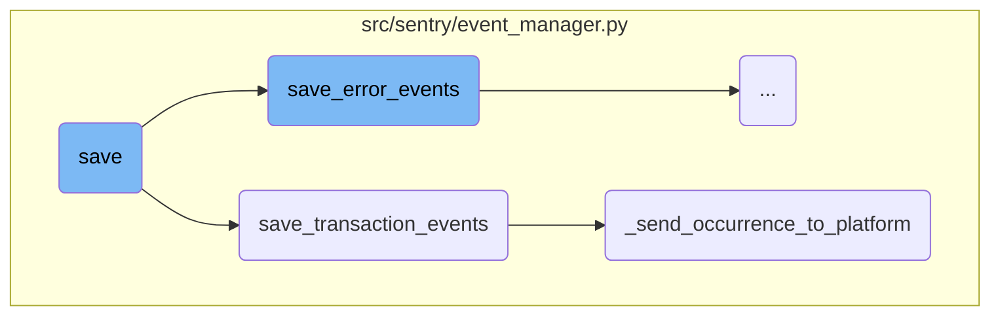

This document provides an overview of the save process, detailing how events are normalized, processed, and saved. It covers the handling of different event types, the creation of necessary models, and the insertion of events into the event stream.

The save process starts by normalizing and processing an event. It then creates or retrieves necessary models like releases and environments. For transaction events, it processes a list of jobs, sets cached field values, and saves the events to the nodestore. For error events, it assigns them to groups and handles attachments. Finally, the events are inserted into the event stream, where they are picked up for further processing and monitoring.

Here is a high level diagram of the flow, showing only the most important functions:

```mermaid
graph TD;
      subgraph src/sentry
5086692df24257d76a0adf892eba843feac14033d92b4a32022b125d5a725f9b(save):::mainFlowStyle --> b8052a0e9cf4dd2783dd9f9b401321908e36ff05fa95ad9dd7944757173348b4(save_transaction_events)
end

subgraph src/sentry
5086692df24257d76a0adf892eba843feac14033d92b4a32022b125d5a725f9b(save):::mainFlowStyle --> d2ea0f9364d7d3b57a77a28cae0991f39e1335bc6e56b20dd218038d1ee84ec4(save_error_events):::mainFlowStyle
end

subgraph src/sentry
d2ea0f9364d7d3b57a77a28cae0991f39e1335bc6e56b20dd218038d1ee84ec4(save_error_events):::mainFlowStyle --> 712797e50f6442731440d693fdda5e1f9ad41d1d2b84d1a5af2ccd88af6b958a(assign_event_to_group):::mainFlowStyle
end

subgraph src/sentry
712797e50f6442731440d693fdda5e1f9ad41d1d2b84d1a5af2ccd88af6b958a(assign_event_to_group):::mainFlowStyle --> c7b9472552037fec94636cefba50657569152b344899c21ff47621d89a43f7a9(_save_aggregate_new)
end

subgraph src/sentry
712797e50f6442731440d693fdda5e1f9ad41d1d2b84d1a5af2ccd88af6b958a(assign_event_to_group):::mainFlowStyle --> 91adda0f444050c9b2c0efe1380bc4c4076846d90b71de5e78135a4b0c7683ea(_save_aggregate):::mainFlowStyle
end

subgraph src/sentry
91adda0f444050c9b2c0efe1380bc4c4076846d90b71de5e78135a4b0c7683ea(_save_aggregate):::mainFlowStyle --> 4a6ecb975aa215037fff48f1bbcf63e782dfde27510595c7d40706ce7a66336b(get_hash_values):::mainFlowStyle
end


      classDef mainFlowStyle color:#000000,fill:#7CB9F4
classDef rootsStyle color:#000000,fill:#00FFF4
classDef Style1 color:#000000,fill:#00FFAA
classDef Style2 color:#000000,fill:#FFFF00
classDef Style3 color:#000000,fill:#AA7CB9

%% Swimm:
%% graph TD;
%%       subgraph <SwmPath>[src/sentry/](src/sentry/)</SwmPath>
%% 5086692df24257d76a0adf892eba843feac14033d92b4a32022b125d5a725f9b(save):::mainFlowStyle --> b8052a0e9cf4dd2783dd9f9b401321908e36ff05fa95ad9dd7944757173348b4(save_transaction_events)
%% end
%% 
%% subgraph <SwmPath>[src/sentry/](src/sentry/)</SwmPath>
%% 5086692df24257d76a0adf892eba843feac14033d92b4a32022b125d5a725f9b(save):::mainFlowStyle --> d2ea0f9364d7d3b57a77a28cae0991f39e1335bc6e56b20dd218038d1ee84ec4(save_error_events):::mainFlowStyle
%% end
%% 
%% subgraph <SwmPath>[src/sentry/](src/sentry/)</SwmPath>
%% d2ea0f9364d7d3b57a77a28cae0991f39e1335bc6e56b20dd218038d1ee84ec4(save_error_events):::mainFlowStyle --> 712797e50f6442731440d693fdda5e1f9ad41d1d2b84d1a5af2ccd88af6b958a(assign_event_to_group):::mainFlowStyle
%% end
%% 
%% subgraph <SwmPath>[src/sentry/](src/sentry/)</SwmPath>
%% 712797e50f6442731440d693fdda5e1f9ad41d1d2b84d1a5af2ccd88af6b958a(assign_event_to_group):::mainFlowStyle --> c7b9472552037fec94636cefba50657569152b344899c21ff47621d89a43f7a9(_save_aggregate_new)
%% end
%% 
%% subgraph <SwmPath>[src/sentry/](src/sentry/)</SwmPath>
%% 712797e50f6442731440d693fdda5e1f9ad41d1d2b84d1a5af2ccd88af6b958a(assign_event_to_group):::mainFlowStyle --> 91adda0f444050c9b2c0efe1380bc4c4076846d90b71de5e78135a4b0c7683ea(_save_aggregate):::mainFlowStyle
%% end
%% 
%% subgraph <SwmPath>[src/sentry/](src/sentry/)</SwmPath>
%% 91adda0f444050c9b2c0efe1380bc4c4076846d90b71de5e78135a4b0c7683ea(_save_aggregate):::mainFlowStyle --> 4a6ecb975aa215037fff48f1bbcf63e782dfde27510595c7d40706ce7a66336b(get_hash_values):::mainFlowStyle
%% end
%% 
%% 
%%       classDef mainFlowStyle color:#000000,fill:#7CB9F4
%% classDef rootsStyle color:#000000,fill:#00FFF4
%% classDef Style1 color:#000000,fill:#00FFAA
%% classDef Style2 color:#000000,fill:#FFFF00
%% classDef Style3 color:#000000,fill:#AA7CB9
```



# Flow drill down

First, we'll zoom into this section of the flow:



<SwmSnippet path="/src/sentry/event_manager.py" line="448">

---

## Save Function

The <SwmToken path="src/sentry/event_manager.py" pos="448:3:3" line-data="    def save(">`save`</SwmToken> function is responsible for normalizing and processing an event, saving adjacent models such as releases and environments to Postgres, and writing the event into the event stream. It handles different types of events, including transactions and generic events, and ensures they are processed and saved correctly.

```python
    def save(
        self,
        project_id: int | None,
        raw: bool = False,
        assume_normalized: bool = False,
        start_time: float | None = None,
        cache_key: str | None = None,
        skip_send_first_transaction: bool = False,
        has_attachments: bool = False,
    ) -> Event:
        """
        After normalizing and processing an event, save adjacent models such as
        releases and environments to postgres and write the event into
        eventstream. From there it will be picked up by Snuba and
        post-processing.

        We re-insert events with duplicate IDs into Snuba, which is responsible
        for deduplicating events. Since deduplication in Snuba is on the primary
        key (based on event ID, project ID and day), events with same IDs are only
        deduplicated if their timestamps fall on the same day. The latest event
        always wins and overwrites the value of events received earlier in that day.
```

---

</SwmSnippet>

<SwmSnippet path="/src/sentry/event_manager.py" line="3040">

---

## Save Transaction Events

The <SwmToken path="src/sentry/event_manager.py" pos="3040:2:2" line-data="def save_transaction_events(jobs: Sequence[Job], projects: ProjectsMapping) -&gt; Sequence[Job]:">`save_transaction_events`</SwmToken> function processes a list of transaction jobs, performing various tasks such as setting cached field values, creating releases, deriving tags, calculating span grouping, and saving the events to the nodestore. It also inserts the events into the event stream and tracks outcomes.

```python
def save_transaction_events(jobs: Sequence[Job], projects: ProjectsMapping) -> Sequence[Job]:
    organization_ids = {project.organization_id for project in projects.values()}
    organizations = {o.id: o for o in Organization.objects.get_many_from_cache(organization_ids)}

    for project in projects.values():
        try:
            project.set_cached_field_value("organization", organizations[project.organization_id])
        except KeyError:
            continue

    set_measurement(measurement_name="jobs", value=len(jobs))
    set_measurement(measurement_name="projects", value=len(projects))

    _get_or_create_release_many(jobs, projects)
    _get_event_user_many(jobs, projects)
    _derive_plugin_tags_many(jobs, projects)
    _derive_interface_tags_many(jobs)
    _calculate_span_grouping(jobs, projects)
    _materialize_metadata_many(jobs)
    _get_or_create_environment_many(jobs, projects)
    _get_or_create_release_associated_models(jobs, projects)
```

---

</SwmSnippet>

<SwmSnippet path="/src/sentry/event_manager.py" line="3012">

---

### Sending Occurrence to Platform

The <SwmToken path="src/sentry/event_manager.py" pos="3012:2:2" line-data="def _send_occurrence_to_platform(jobs: Sequence[Job], projects: ProjectsMapping) -&gt; None:">`_send_occurrence_to_platform`</SwmToken> function sends performance problems detected in the events to the platform by creating <SwmToken path="src/sentry/event_manager.py" pos="3020:5:5" line-data="            occurrence = IssueOccurrence(">`IssueOccurrence`</SwmToken> objects and producing them to Kafka. This ensures that performance issues are tracked and monitored effectively.

```python
def _send_occurrence_to_platform(jobs: Sequence[Job], projects: ProjectsMapping) -> None:
    for job in jobs:
        event = job["event"]
        project = event.project
        event_id = event.event_id

        performance_problems = job["performance_problems"]
        for problem in performance_problems:
            occurrence = IssueOccurrence(
                id=uuid.uuid4().hex,
                resource_id=None,
                project_id=project.id,
                event_id=event_id,
                fingerprint=[problem.fingerprint],
                type=problem.type,
                issue_title=problem.title,
                subtitle=problem.desc,
                culprit=event.transaction,
                evidence_data=problem.evidence_data,
                evidence_display=problem.evidence_display,
                detection_time=event.datetime,
```

---

</SwmSnippet>

Now, lets zoom into this section of the flow:

```mermaid
graph TD;
      subgraph src/sentry
d2ea0f9364d7d3b57a77a28cae0991f39e1335bc6e56b20dd218038d1ee84ec4(save_error_events):::mainFlowStyle --> 712797e50f6442731440d693fdda5e1f9ad41d1d2b84d1a5af2ccd88af6b958a(assign_event_to_group):::mainFlowStyle
end

subgraph src/sentry
712797e50f6442731440d693fdda5e1f9ad41d1d2b84d1a5af2ccd88af6b958a(assign_event_to_group):::mainFlowStyle --> c7b9472552037fec94636cefba50657569152b344899c21ff47621d89a43f7a9(_save_aggregate_new)
end

subgraph src/sentry
712797e50f6442731440d693fdda5e1f9ad41d1d2b84d1a5af2ccd88af6b958a(assign_event_to_group):::mainFlowStyle --> 91adda0f444050c9b2c0efe1380bc4c4076846d90b71de5e78135a4b0c7683ea(_save_aggregate):::mainFlowStyle
end

subgraph src/sentry
91adda0f444050c9b2c0efe1380bc4c4076846d90b71de5e78135a4b0c7683ea(_save_aggregate):::mainFlowStyle --> 4a6ecb975aa215037fff48f1bbcf63e782dfde27510595c7d40706ce7a66336b(get_hash_values):::mainFlowStyle
end

subgraph src/sentry
c7b9472552037fec94636cefba50657569152b344899c21ff47621d89a43f7a9(_save_aggregate_new) --> 88415971220d3fc36a1ba1c83dfd66e4922a28e00f0a03744adc222407192337(create_group_with_grouphashes)
end


      classDef mainFlowStyle color:#000000,fill:#7CB9F4
classDef rootsStyle color:#000000,fill:#00FFF4
classDef Style1 color:#000000,fill:#00FFAA
classDef Style2 color:#000000,fill:#FFFF00
classDef Style3 color:#000000,fill:#AA7CB9

%% Swimm:
%% graph TD;
%%       subgraph <SwmPath>[src/sentry/](src/sentry/)</SwmPath>
%% d2ea0f9364d7d3b57a77a28cae0991f39e1335bc6e56b20dd218038d1ee84ec4(save_error_events):::mainFlowStyle --> 712797e50f6442731440d693fdda5e1f9ad41d1d2b84d1a5af2ccd88af6b958a(assign_event_to_group):::mainFlowStyle
%% end
%% 
%% subgraph <SwmPath>[src/sentry/](src/sentry/)</SwmPath>
%% 712797e50f6442731440d693fdda5e1f9ad41d1d2b84d1a5af2ccd88af6b958a(assign_event_to_group):::mainFlowStyle --> c7b9472552037fec94636cefba50657569152b344899c21ff47621d89a43f7a9(_save_aggregate_new)
%% end
%% 
%% subgraph <SwmPath>[src/sentry/](src/sentry/)</SwmPath>
%% 712797e50f6442731440d693fdda5e1f9ad41d1d2b84d1a5af2ccd88af6b958a(assign_event_to_group):::mainFlowStyle --> 91adda0f444050c9b2c0efe1380bc4c4076846d90b71de5e78135a4b0c7683ea(_save_aggregate):::mainFlowStyle
%% end
%% 
%% subgraph <SwmPath>[src/sentry/](src/sentry/)</SwmPath>
%% 91adda0f444050c9b2c0efe1380bc4c4076846d90b71de5e78135a4b0c7683ea(_save_aggregate):::mainFlowStyle --> 4a6ecb975aa215037fff48f1bbcf63e782dfde27510595c7d40706ce7a66336b(get_hash_values):::mainFlowStyle
%% end
%% 
%% subgraph <SwmPath>[src/sentry/](src/sentry/)</SwmPath>
%% c7b9472552037fec94636cefba50657569152b344899c21ff47621d89a43f7a9(_save_aggregate_new) --> 88415971220d3fc36a1ba1c83dfd66e4922a28e00f0a03744adc222407192337(create_group_with_grouphashes)
%% end
%% 
%% 
%%       classDef mainFlowStyle color:#000000,fill:#7CB9F4
%% classDef rootsStyle color:#000000,fill:#00FFF4
%% classDef Style1 color:#000000,fill:#00FFAA
%% classDef Style2 color:#000000,fill:#FFFF00
%% classDef Style3 color:#000000,fill:#AA7CB9
```



<SwmSnippet path="/src/sentry/event_manager.py" line="544">

---

## <SwmToken path="src/sentry/event_manager.py" pos="544:3:3" line-data="    def save_error_events(">`save_error_events`</SwmToken>

The function <SwmToken path="src/sentry/event_manager.py" pos="544:3:3" line-data="    def save_error_events(">`save_error_events`</SwmToken> processes error events by assigning them to groups and handling attachments. It first checks if the event is a sample event and logs the information. It then processes the event by creating or retrieving necessary models like releases, users, and environments. If the event has attachments, they are loaded and filtered. The function then assigns the event to a group using <SwmToken path="src/sentry/event_manager.py" pos="1361:2:2" line-data="def assign_event_to_group(event: Event, job: Job, metric_tags: MutableTags) -&gt; GroupInfo | None:">`assign_event_to_group`</SwmToken> and performs various <SwmToken path="src/sentry/event_manager.py" pos="462:1:3" line-data="        post-processing.">`post-processing`</SwmToken> steps like saving metrics and handling reprocessed events.

```python
    def save_error_events(
        self,
        project: Project,
        job: Job,
        projects: ProjectsMapping,
        metric_tags: MutableTags,
        raw: bool = False,
        cache_key: str | None = None,
        has_attachments: bool = False,
    ) -> Event:
        jobs = [job]

        if is_sample_event(job):
            logger.info(
                "save_error_events: processing sample event",
                extra={
                    "event.id": job["event"].event_id,
                    "project_id": project.id,
                    "sample_event": True,
                },
            )
```

---

</SwmSnippet>

<SwmSnippet path="/src/sentry/event_manager.py" line="1361">

---

## <SwmToken path="src/sentry/event_manager.py" pos="1361:2:2" line-data="def assign_event_to_group(event: Event, job: Job, metric_tags: MutableTags) -&gt; GroupInfo | None:">`assign_event_to_group`</SwmToken>

The function <SwmToken path="src/sentry/event_manager.py" pos="1361:2:2" line-data="def assign_event_to_group(event: Event, job: Job, metric_tags: MutableTags) -&gt; GroupInfo | None:">`assign_event_to_group`</SwmToken> assigns an event to a group by either using the optimized grouping method <SwmToken path="src/sentry/event_manager.py" pos="1363:5:5" line-data="        group_info = _save_aggregate_new(">`_save_aggregate_new`</SwmToken> or the standard method <SwmToken path="src/sentry/event_manager.py" pos="1369:5:5" line-data="        group_info = _save_aggregate(">`_save_aggregate`</SwmToken>. It updates the event and job with the group information and returns the group info.

```python
def assign_event_to_group(event: Event, job: Job, metric_tags: MutableTags) -> GroupInfo | None:
    if job["optimized_grouping"]:
        group_info = _save_aggregate_new(
            event=event,
            job=job,
            metric_tags=metric_tags,
        )
    else:
        group_info = _save_aggregate(
            event=event,
            job=job,
            release=job["release"],
            received_timestamp=job["received_timestamp"],
            metric_tags=metric_tags,
        )

    if group_info:
        event.group = group_info.group
    job["groups"] = [group_info]

    return group_info
```

---

</SwmSnippet>

<SwmSnippet path="/src/sentry/event_manager.py" line="1692">

---

### <SwmToken path="src/sentry/event_manager.py" pos="1692:2:2" line-data="def _save_aggregate_new(">`_save_aggregate_new`</SwmToken>

The function <SwmToken path="src/sentry/event_manager.py" pos="1692:2:2" line-data="def _save_aggregate_new(">`_save_aggregate_new`</SwmToken> attempts to find an existing group for the event using primary and secondary grouping configurations. If no group is found, it may consult Seer for a match or create a new group. It also handles background grouping and updates the grouping configuration if needed.

```python
def _save_aggregate_new(
    event: Event,
    job: Job,
    metric_tags: MutableTags,
) -> GroupInfo | None:
    project = event.project
    secondary = NULL_GROUPHASH_INFO

    group_processing_kwargs = _get_group_processing_kwargs(job)

    # Try looking for an existing group using the current grouping config
    primary = get_hashes_and_grouphashes(job, run_primary_grouping, metric_tags)

    # If we've found one, great. No need to do any more calculations
    if primary.existing_grouphash:
        group_info = handle_existing_grouphash(
            job, primary.existing_grouphash, primary.grouphashes, group_processing_kwargs
        )
        result = "found_primary"
    # If we haven't, try again using the secondary config
    else:
```

---

</SwmSnippet>

<SwmSnippet path="/src/sentry/event_manager.py" line="1384">

---

### <SwmToken path="src/sentry/event_manager.py" pos="1384:2:2" line-data="def _save_aggregate(">`_save_aggregate`</SwmToken>

The function <SwmToken path="src/sentry/event_manager.py" pos="1384:2:2" line-data="def _save_aggregate(">`_save_aggregate`</SwmToken> calculates hash values for the event and attempts to find an existing group. If no group is found, it may consult Seer or create a new group. It handles hierarchical and non-hierarchical hashes and updates the group metadata.

```python
def _save_aggregate(
    event: Event,
    job: Job,
    release: Release | None,
    received_timestamp: int | float,
    metric_tags: MutableTags,
) -> GroupInfo | None:
    project = event.project

    primary_hashes, secondary_hashes, hashes = get_hash_values(project, job, metric_tags)
    has_secondary_hashes = len(extract_hashes(secondary_hashes)) > 0

    # Now that we've used the current and possibly secondary grouping config(s) to calculate the
    # hashes, we're free to perform a config update if permitted. Future events will use the new
    # config, but will also be grandfathered into the current config for a month, so as not to
    # erroneously create new groups.
    update_grouping_config_if_needed(project, "ingest")

    _materialize_metadata_many([job])
    metadata = dict(job["event_metadata"])

```

---

</SwmSnippet>

<SwmSnippet path="/src/sentry/grouping/ingest/hashing.py" line="302">

---

### <SwmToken path="src/sentry/grouping/ingest/hashing.py" pos="302:2:2" line-data="def get_hash_values(">`get_hash_values`</SwmToken>

The function <SwmToken path="src/sentry/grouping/ingest/hashing.py" pos="302:2:2" line-data="def get_hash_values(">`get_hash_values`</SwmToken> calculates primary and secondary hash values for the event using the project's grouping configuration. It records hash calculation metrics and returns the calculated hashes.

```python
def get_hash_values(
    project: Project,
    job: Job,
    metric_tags: MutableTags,
) -> tuple[CalculatedHashes, CalculatedHashes | None, CalculatedHashes]:
    # Background grouping is a way for us to get performance metrics for a new
    # config without having it actually affect on how events are grouped. It runs
    # either before or after the main grouping logic, depending on the option value.
    maybe_run_background_grouping(project, job)

    secondary_grouping_config, secondary_hashes = maybe_run_secondary_grouping(
        project, job, metric_tags
    )

    primary_grouping_config, primary_hashes = run_primary_grouping(project, job, metric_tags)

    record_hash_calculation_metrics(
        primary_grouping_config,
        primary_hashes,
        secondary_grouping_config,
        secondary_hashes,
```

---

</SwmSnippet>

<SwmSnippet path="/src/sentry/event_manager.py" line="1849">

---

### <SwmToken path="src/sentry/event_manager.py" pos="1849:2:2" line-data="def create_group_with_grouphashes(">`create_group_with_grouphashes`</SwmToken>

The function <SwmToken path="src/sentry/event_manager.py" pos="1849:2:2" line-data="def create_group_with_grouphashes(">`create_group_with_grouphashes`</SwmToken> creates a new group for the event and links it to the given group hashes. It handles race conditions by using <SwmToken path="src/sentry/event_manager.py" pos="1497:16:18" line-data="            # To prevent this, we&#39;re using double-checked locking">`double-checked`</SwmToken> locking to ensure that only one process creates the group.

```python
def create_group_with_grouphashes(
    job: Job, grouphashes: list[GroupHash], group_processing_kwargs: dict[str, Any]
) -> GroupInfo | None:
    """
    Create a group from the data in `job` and `group_processing_kwargs` and link it to the given
    grouphashes.

    In very rare circumstances, we can end up in a race condition with another process trying to
    create the same group. If the current process loses the race, this function will update the
    group the other process just created, rather than creating a group itself.
    """
    event = job["event"]
    project = event.project

    # If the load-shed killswitch is enabled, this will raise a `HashDiscarded` error to pop us out
    # of this function all the way back to `save_error_events`, preventing group creation
    check_for_group_creation_load_shed(project, event)

    with (
        sentry_sdk.start_span(op="event_manager.create_group_transaction") as span,
        metrics.timer("event_manager.create_group_transaction") as metrics_timer_tags,
```

---

</SwmSnippet>

# Where is this flow used?

This flow is used multiple times in the codebase as represented in the following diagram:

(Note - these are only some of the entry points of this flow)

```mermaid
graph TD;
      subgraph src/sentry
dd8e2dddf4ff69bc3ec8808c9dd82ae3948605d0e895bafe5cd544c09ae16747(finish_pipeline):::rootsStyle --> d0a57a6634b23b7a4dccbdf092a9e6ac4d530811a4335744e0c058732ff0701c(_finish_login_pipeline)
end

subgraph src/sentry
d0a57a6634b23b7a4dccbdf092a9e6ac4d530811a4335744e0c058732ff0701c(_finish_login_pipeline) --> b57da65401fb94068176c37267fdcba04187a4c4a9bd7c24bb4ff18cb1d65b1e(handle_unknown_identity)
end

subgraph src/sentry
b57da65401fb94068176c37267fdcba04187a4c4a9bd7c24bb4ff18cb1d65b1e(handle_unknown_identity) --> 6f93f374d8f1404e8a25f2413cc002a83b1ddbc8a4542da08d32dccffdf77588(handle_attach_identity)
end

subgraph src/sentry
6f93f374d8f1404e8a25f2413cc002a83b1ddbc8a4542da08d32dccffdf77588(handle_attach_identity) --> b43d9b265ab94543ec37fc859f44a77c8cc4cb0afaea9a0a34e5b1293356bd40(_get_organization_member)
end

subgraph src/sentry
b43d9b265ab94543ec37fc859f44a77c8cc4cb0afaea9a0a34e5b1293356bd40(_get_organization_member) --> 491201fb48ed6b9782cd7aebe831047d5a66f69111ffeae67921c2a0c2c68d69(_handle_new_membership)
end

subgraph src/sentry
491201fb48ed6b9782cd7aebe831047d5a66f69111ffeae67921c2a0c2c68d69(_handle_new_membership) --> 3941abdaeccb6c44e4a387e32c946377b4258e406f0c7c26590b0890ae3ed62d(_handle_membership)
end

subgraph src/sentry/api/invite_helper.py
3941abdaeccb6c44e4a387e32c946377b4258e406f0c7c26590b0890ae3ed62d(_handle_membership) --> bad70fd4c50a8bc45d1a75219b5ec4a4d71d23a6a7b2f868cbac851cb371bf1b(accept_invite)
end

subgraph src/sentry
bad70fd4c50a8bc45d1a75219b5ec4a4d71d23a6a7b2f868cbac851cb371bf1b(accept_invite) --> 88afa16f8fa3988124ee58fa20e0964b75044e9b24527e6e7d4bb4a48df7de8d(schedule_signal)
end

subgraph src/sentry
88afa16f8fa3988124ee58fa20e0964b75044e9b24527e6e7d4bb4a48df7de8d(schedule_signal) --> 5086692df24257d76a0adf892eba843feac14033d92b4a32022b125d5a725f9b(save):::mainFlowStyle
end

subgraph src/sentry/api/serializers
c4576582ccd04726a4fb07fb3f6c0a8a751f8c7a9191c6c9ac96d2a08b9b1966(get_attrs):::rootsStyle --> c67478ca18aa36e053a1eae78eeb37cb6b67bccbaa2ec26e56074835bd106617(_get_last_commit_metadata)
end

subgraph src/sentry/api/serializers
c67478ca18aa36e053a1eae78eeb37cb6b67bccbaa2ec26e56074835bd106617(_get_last_commit_metadata) --> 56d5d358acf064b5ff96d94bdd762617a41283081e5053ccad1efcc4aea30b4a(serialize)
end

subgraph src/sentry/api/serializers
56d5d358acf064b5ff96d94bdd762617a41283081e5053ccad1efcc4aea30b4a(serialize) --> 41905746e4ff5df55085c014961c5253ab18ab335e5f8a72546a4982a87f93fc(expose_version_info)
end

subgraph src/sentry/api/serializers
41905746e4ff5df55085c014961c5253ab18ab335e5f8a72546a4982a87f93fc(expose_version_info) --> 22905eef3a92457f137106c85db1f668e2bc47558a4448ea0358af9f5d99ed98(update)
end

subgraph src/sentry/api/serializers
22905eef3a92457f137106c85db1f668e2bc47558a4448ea0358af9f5d99ed98(update) --> 26182bf2067521355a22b294c4bfbc6ce61733b69de325a6ff0cbcfff1e25ad7(update_widgets)
end

subgraph src/sentry/api/serializers
26182bf2067521355a22b294c4bfbc6ce61733b69de325a6ff0cbcfff1e25ad7(update_widgets) --> 7ba18986748f61b064ace4c6b31de7ff23bb069216a91da13ab6ce5f64279f67(update_widget)
end

subgraph src/sentry/api/serializers
7ba18986748f61b064ace4c6b31de7ff23bb069216a91da13ab6ce5f64279f67(update_widget) --> b63f820c96c22b450c3bf9d9324e5bea901d8079c04dc8fc4b04d206f3229994(update_widget_queries)
end

subgraph src/sentry/api/serializers
b63f820c96c22b450c3bf9d9324e5bea901d8079c04dc8fc4b04d206f3229994(update_widget_queries) --> d2d51e7814d9cff7bfc052199b3cf4290c035e22341baba3300ef9436d8c67bc(_check_query_cardinality)
end

subgraph src/sentry/tasks
d2d51e7814d9cff7bfc052199b3cf4290c035e22341baba3300ef9436d8c67bc(_check_query_cardinality) --> 8accbf5c2c57c93d4051ca41041ab085d40caf2f3aea8fbb3b0ca331da01682f(set_or_create_on_demand_state)
end

subgraph src/sentry
8accbf5c2c57c93d4051ca41041ab085d40caf2f3aea8fbb3b0ca331da01682f(set_or_create_on_demand_state) --> 5086692df24257d76a0adf892eba843feac14033d92b4a32022b125d5a725f9b(save):::mainFlowStyle
end

subgraph src/sentry/incidents
c9d1dea802e3f82c6d936ce5a724b36abf3277c63763527f0378f9ca337dfaee(handle_snuba_query_update):::rootsStyle --> cbd86f4033e27fec43fa7d8fd0ccb20fd0aab7d9a94337f8f7b2fcc9435b7b46(process_update)
end

subgraph src/sentry/incidents
cbd86f4033e27fec43fa7d8fd0ccb20fd0aab7d9a94337f8f7b2fcc9435b7b46(process_update) --> 6bd26975d248e96b52df4ed3319306e7c9ef381049a7769c0692b44d2f8589d5(trigger_alert_threshold)
end

subgraph src/sentry/incidents
6bd26975d248e96b52df4ed3319306e7c9ef381049a7769c0692b44d2f8589d5(trigger_alert_threshold) --> 803b71ae718bd2f5f17fb0becab9e16a40aa9915c4016a7272925a8e77de9436(create_incident)
end

subgraph src/sentry/incidents
803b71ae718bd2f5f17fb0becab9e16a40aa9915c4016a7272925a8e77de9436(create_incident) --> 3d3372c9ba8b72c81622e85e94c61a6b1c8c8166dee7c2ba3bde07dba9f8aee7(create_incident_activity)
end

subgraph src/sentry/incidents
3d3372c9ba8b72c81622e85e94c61a6b1c8c8166dee7c2ba3bde07dba9f8aee7(create_incident_activity) --> 1e1cb398de04140375fe38cf061bc16fcaf4bb0a8b605e4cd48e1e622e417456(create)
end

subgraph src/sentry/incidents
1e1cb398de04140375fe38cf061bc16fcaf4bb0a8b605e4cd48e1e622e417456(create) --> 829a66f459daa8959c1c006a6104ea00d1ef274c974343bbd0685f4603638730(_handle_actions)
end

subgraph src/sentry
829a66f459daa8959c1c006a6104ea00d1ef274c974343bbd0685f4603638730(_handle_actions) --> 5086692df24257d76a0adf892eba843feac14033d92b4a32022b125d5a725f9b(save):::mainFlowStyle
end

subgraph src/sentry/backup
41d771ff4ec15d687bbff828964ef8124d7934f43d0fa6c3cb0ef4f3c1c10f7b(import_export_then_validate):::rootsStyle --> c6eeb0b4305c767497cbf5bad6465c4c3b4ca5b6c9688d8b028c5b52a6264365(import_in_global_scope)
end

subgraph src/sentry/backup
c6eeb0b4305c767497cbf5bad6465c4c3b4ca5b6c9688d8b028c5b52a6264365(import_in_global_scope) --> e51390835e25abe9700c58ce684275b91c592cbc3798916fccfb8d5e98213501(_import)
end

subgraph src/sentry/backup
e51390835e25abe9700c58ce684275b91c592cbc3798916fccfb8d5e98213501(_import) --> 26207a08d7fb570302a7c1ba260755115f33628088a15b2009f16110f8f0dae8(do_writes)
end

subgraph src/sentry/backup
26207a08d7fb570302a7c1ba260755115f33628088a15b2009f16110f8f0dae8(do_writes) --> cde919c15e80ace92af51dc030bc8465a3bd524762d62150998a625fa77a9114(do_write)
end

subgraph src/sentry/backup
cde919c15e80ace92af51dc030bc8465a3bd524762d62150998a625fa77a9114(do_write) --> a0e62ec196908d683b8ebc17be856ae3cafeefd98039a784db91cb9dc063f659(import_by_model)
end

subgraph src/sentry/backup
a0e62ec196908d683b8ebc17be856ae3cafeefd98039a784db91cb9dc063f659(import_by_model) --> c0e42437bc98d7620c25dcca143e39c451eceb05862233e04a63533ab722411f(write_relocation_import)
end

subgraph src/sentry
c0e42437bc98d7620c25dcca143e39c451eceb05862233e04a63533ab722411f(write_relocation_import) --> 5086692df24257d76a0adf892eba843feac14033d92b4a32022b125d5a725f9b(save):::mainFlowStyle
end

subgraph src/sentry/backup
5d67ca0f092c3a3b835aecc44e9ccc2f006da371d1a42c5a6157155d81982b43(importing):::rootsStyle --> 20e0eac63d1cddcd23f6c106821a93f45c0d11e1567aa82f3d931f691489b917(import_in_organization_scope)
end

subgraph src/sentry/backup
20e0eac63d1cddcd23f6c106821a93f45c0d11e1567aa82f3d931f691489b917(import_in_organization_scope) --> e51390835e25abe9700c58ce684275b91c592cbc3798916fccfb8d5e98213501(_import)
end


      classDef mainFlowStyle color:#000000,fill:#7CB9F4
classDef rootsStyle color:#000000,fill:#00FFF4
classDef Style1 color:#000000,fill:#00FFAA
classDef Style2 color:#000000,fill:#FFFF00
classDef Style3 color:#000000,fill:#AA7CB9

%% Swimm:
%% graph TD;
%%       subgraph <SwmPath>[src/sentry/](src/sentry/)</SwmPath>
%% dd8e2dddf4ff69bc3ec8808c9dd82ae3948605d0e895bafe5cd544c09ae16747(finish_pipeline):::rootsStyle --> d0a57a6634b23b7a4dccbdf092a9e6ac4d530811a4335744e0c058732ff0701c(_finish_login_pipeline)
%% end
%% 
%% subgraph <SwmPath>[src/sentry/](src/sentry/)</SwmPath>
%% d0a57a6634b23b7a4dccbdf092a9e6ac4d530811a4335744e0c058732ff0701c(_finish_login_pipeline) --> b57da65401fb94068176c37267fdcba04187a4c4a9bd7c24bb4ff18cb1d65b1e(handle_unknown_identity)
%% end
%% 
%% subgraph <SwmPath>[src/sentry/](src/sentry/)</SwmPath>
%% b57da65401fb94068176c37267fdcba04187a4c4a9bd7c24bb4ff18cb1d65b1e(handle_unknown_identity) --> 6f93f374d8f1404e8a25f2413cc002a83b1ddbc8a4542da08d32dccffdf77588(handle_attach_identity)
%% end
%% 
%% subgraph <SwmPath>[src/sentry/](src/sentry/)</SwmPath>
%% 6f93f374d8f1404e8a25f2413cc002a83b1ddbc8a4542da08d32dccffdf77588(handle_attach_identity) --> b43d9b265ab94543ec37fc859f44a77c8cc4cb0afaea9a0a34e5b1293356bd40(_get_organization_member)
%% end
%% 
%% subgraph <SwmPath>[src/sentry/](src/sentry/)</SwmPath>
%% b43d9b265ab94543ec37fc859f44a77c8cc4cb0afaea9a0a34e5b1293356bd40(_get_organization_member) --> 491201fb48ed6b9782cd7aebe831047d5a66f69111ffeae67921c2a0c2c68d69(_handle_new_membership)
%% end
%% 
%% subgraph <SwmPath>[src/sentry/](src/sentry/)</SwmPath>
%% 491201fb48ed6b9782cd7aebe831047d5a66f69111ffeae67921c2a0c2c68d69(_handle_new_membership) --> 3941abdaeccb6c44e4a387e32c946377b4258e406f0c7c26590b0890ae3ed62d(_handle_membership)
%% end
%% 
%% subgraph <SwmPath>[src/sentry/api/invite_helper.py](src/sentry/api/invite_helper.py)</SwmPath>
%% 3941abdaeccb6c44e4a387e32c946377b4258e406f0c7c26590b0890ae3ed62d(_handle_membership) --> bad70fd4c50a8bc45d1a75219b5ec4a4d71d23a6a7b2f868cbac851cb371bf1b(accept_invite)
%% end
%% 
%% subgraph <SwmPath>[src/sentry/](src/sentry/)</SwmPath>
%% bad70fd4c50a8bc45d1a75219b5ec4a4d71d23a6a7b2f868cbac851cb371bf1b(accept_invite) --> 88afa16f8fa3988124ee58fa20e0964b75044e9b24527e6e7d4bb4a48df7de8d(schedule_signal)
%% end
%% 
%% subgraph <SwmPath>[src/sentry/](src/sentry/)</SwmPath>
%% 88afa16f8fa3988124ee58fa20e0964b75044e9b24527e6e7d4bb4a48df7de8d(schedule_signal) --> 5086692df24257d76a0adf892eba843feac14033d92b4a32022b125d5a725f9b(save):::mainFlowStyle
%% end
%% 
%% subgraph <SwmPath>[src/sentry/api/serializers/](src/sentry/api/serializers/)</SwmPath>
%% c4576582ccd04726a4fb07fb3f6c0a8a751f8c7a9191c6c9ac96d2a08b9b1966(get_attrs):::rootsStyle --> c67478ca18aa36e053a1eae78eeb37cb6b67bccbaa2ec26e56074835bd106617(_get_last_commit_metadata)
%% end
%% 
%% subgraph <SwmPath>[src/sentry/api/serializers/](src/sentry/api/serializers/)</SwmPath>
%% c67478ca18aa36e053a1eae78eeb37cb6b67bccbaa2ec26e56074835bd106617(_get_last_commit_metadata) --> 56d5d358acf064b5ff96d94bdd762617a41283081e5053ccad1efcc4aea30b4a(serialize)
%% end
%% 
%% subgraph <SwmPath>[src/sentry/api/serializers/](src/sentry/api/serializers/)</SwmPath>
%% 56d5d358acf064b5ff96d94bdd762617a41283081e5053ccad1efcc4aea30b4a(serialize) --> 41905746e4ff5df55085c014961c5253ab18ab335e5f8a72546a4982a87f93fc(expose_version_info)
%% end
%% 
%% subgraph <SwmPath>[src/sentry/api/serializers/](src/sentry/api/serializers/)</SwmPath>
%% 41905746e4ff5df55085c014961c5253ab18ab335e5f8a72546a4982a87f93fc(expose_version_info) --> 22905eef3a92457f137106c85db1f668e2bc47558a4448ea0358af9f5d99ed98(update)
%% end
%% 
%% subgraph <SwmPath>[src/sentry/api/serializers/](src/sentry/api/serializers/)</SwmPath>
%% 22905eef3a92457f137106c85db1f668e2bc47558a4448ea0358af9f5d99ed98(update) --> 26182bf2067521355a22b294c4bfbc6ce61733b69de325a6ff0cbcfff1e25ad7(update_widgets)
%% end
%% 
%% subgraph <SwmPath>[src/sentry/api/serializers/](src/sentry/api/serializers/)</SwmPath>
%% 26182bf2067521355a22b294c4bfbc6ce61733b69de325a6ff0cbcfff1e25ad7(update_widgets) --> 7ba18986748f61b064ace4c6b31de7ff23bb069216a91da13ab6ce5f64279f67(update_widget)
%% end
%% 
%% subgraph <SwmPath>[src/sentry/api/serializers/](src/sentry/api/serializers/)</SwmPath>
%% 7ba18986748f61b064ace4c6b31de7ff23bb069216a91da13ab6ce5f64279f67(update_widget) --> b63f820c96c22b450c3bf9d9324e5bea901d8079c04dc8fc4b04d206f3229994(update_widget_queries)
%% end
%% 
%% subgraph <SwmPath>[src/sentry/api/serializers/](src/sentry/api/serializers/)</SwmPath>
%% b63f820c96c22b450c3bf9d9324e5bea901d8079c04dc8fc4b04d206f3229994(update_widget_queries) --> d2d51e7814d9cff7bfc052199b3cf4290c035e22341baba3300ef9436d8c67bc(_check_query_cardinality)
%% end
%% 
%% subgraph <SwmPath>[src/sentry/tasks/](src/sentry/tasks/)</SwmPath>
%% d2d51e7814d9cff7bfc052199b3cf4290c035e22341baba3300ef9436d8c67bc(_check_query_cardinality) --> 8accbf5c2c57c93d4051ca41041ab085d40caf2f3aea8fbb3b0ca331da01682f(set_or_create_on_demand_state)
%% end
%% 
%% subgraph <SwmPath>[src/sentry/](src/sentry/)</SwmPath>
%% 8accbf5c2c57c93d4051ca41041ab085d40caf2f3aea8fbb3b0ca331da01682f(set_or_create_on_demand_state) --> 5086692df24257d76a0adf892eba843feac14033d92b4a32022b125d5a725f9b(save):::mainFlowStyle
%% end
%% 
%% subgraph <SwmPath>[src/sentry/incidents/](src/sentry/incidents/)</SwmPath>
%% c9d1dea802e3f82c6d936ce5a724b36abf3277c63763527f0378f9ca337dfaee(handle_snuba_query_update):::rootsStyle --> cbd86f4033e27fec43fa7d8fd0ccb20fd0aab7d9a94337f8f7b2fcc9435b7b46(process_update)
%% end
%% 
%% subgraph <SwmPath>[src/sentry/incidents/](src/sentry/incidents/)</SwmPath>
%% cbd86f4033e27fec43fa7d8fd0ccb20fd0aab7d9a94337f8f7b2fcc9435b7b46(process_update) --> 6bd26975d248e96b52df4ed3319306e7c9ef381049a7769c0692b44d2f8589d5(trigger_alert_threshold)
%% end
%% 
%% subgraph <SwmPath>[src/sentry/incidents/](src/sentry/incidents/)</SwmPath>
%% 6bd26975d248e96b52df4ed3319306e7c9ef381049a7769c0692b44d2f8589d5(trigger_alert_threshold) --> 803b71ae718bd2f5f17fb0becab9e16a40aa9915c4016a7272925a8e77de9436(create_incident)
%% end
%% 
%% subgraph <SwmPath>[src/sentry/incidents/](src/sentry/incidents/)</SwmPath>
%% 803b71ae718bd2f5f17fb0becab9e16a40aa9915c4016a7272925a8e77de9436(create_incident) --> 3d3372c9ba8b72c81622e85e94c61a6b1c8c8166dee7c2ba3bde07dba9f8aee7(create_incident_activity)
%% end
%% 
%% subgraph <SwmPath>[src/sentry/incidents/](src/sentry/incidents/)</SwmPath>
%% 3d3372c9ba8b72c81622e85e94c61a6b1c8c8166dee7c2ba3bde07dba9f8aee7(create_incident_activity) --> 1e1cb398de04140375fe38cf061bc16fcaf4bb0a8b605e4cd48e1e622e417456(create)
%% end
%% 
%% subgraph <SwmPath>[src/sentry/incidents/](src/sentry/incidents/)</SwmPath>
%% 1e1cb398de04140375fe38cf061bc16fcaf4bb0a8b605e4cd48e1e622e417456(create) --> 829a66f459daa8959c1c006a6104ea00d1ef274c974343bbd0685f4603638730(_handle_actions)
%% end
%% 
%% subgraph <SwmPath>[src/sentry/](src/sentry/)</SwmPath>
%% 829a66f459daa8959c1c006a6104ea00d1ef274c974343bbd0685f4603638730(_handle_actions) --> 5086692df24257d76a0adf892eba843feac14033d92b4a32022b125d5a725f9b(save):::mainFlowStyle
%% end
%% 
%% subgraph <SwmPath>[src/sentry/backup/](src/sentry/backup/)</SwmPath>
%% 41d771ff4ec15d687bbff828964ef8124d7934f43d0fa6c3cb0ef4f3c1c10f7b(import_export_then_validate):::rootsStyle --> c6eeb0b4305c767497cbf5bad6465c4c3b4ca5b6c9688d8b028c5b52a6264365(import_in_global_scope)
%% end
%% 
%% subgraph <SwmPath>[src/sentry/backup/](src/sentry/backup/)</SwmPath>
%% c6eeb0b4305c767497cbf5bad6465c4c3b4ca5b6c9688d8b028c5b52a6264365(import_in_global_scope) --> e51390835e25abe9700c58ce684275b91c592cbc3798916fccfb8d5e98213501(_import)
%% end
%% 
%% subgraph <SwmPath>[src/sentry/backup/](src/sentry/backup/)</SwmPath>
%% e51390835e25abe9700c58ce684275b91c592cbc3798916fccfb8d5e98213501(_import) --> 26207a08d7fb570302a7c1ba260755115f33628088a15b2009f16110f8f0dae8(do_writes)
%% end
%% 
%% subgraph <SwmPath>[src/sentry/backup/](src/sentry/backup/)</SwmPath>
%% 26207a08d7fb570302a7c1ba260755115f33628088a15b2009f16110f8f0dae8(do_writes) --> cde919c15e80ace92af51dc030bc8465a3bd524762d62150998a625fa77a9114(do_write)
%% end
%% 
%% subgraph <SwmPath>[src/sentry/backup/](src/sentry/backup/)</SwmPath>
%% cde919c15e80ace92af51dc030bc8465a3bd524762d62150998a625fa77a9114(do_write) --> a0e62ec196908d683b8ebc17be856ae3cafeefd98039a784db91cb9dc063f659(import_by_model)
%% end
%% 
%% subgraph <SwmPath>[src/sentry/backup/](src/sentry/backup/)</SwmPath>
%% a0e62ec196908d683b8ebc17be856ae3cafeefd98039a784db91cb9dc063f659(import_by_model) --> c0e42437bc98d7620c25dcca143e39c451eceb05862233e04a63533ab722411f(write_relocation_import)
%% end
%% 
%% subgraph <SwmPath>[src/sentry/](src/sentry/)</SwmPath>
%% c0e42437bc98d7620c25dcca143e39c451eceb05862233e04a63533ab722411f(write_relocation_import) --> 5086692df24257d76a0adf892eba843feac14033d92b4a32022b125d5a725f9b(save):::mainFlowStyle
%% end
%% 
%% subgraph <SwmPath>[src/sentry/backup/](src/sentry/backup/)</SwmPath>
%% 5d67ca0f092c3a3b835aecc44e9ccc2f006da371d1a42c5a6157155d81982b43(importing):::rootsStyle --> 20e0eac63d1cddcd23f6c106821a93f45c0d11e1567aa82f3d931f691489b917(import_in_organization_scope)
%% end
%% 
%% subgraph <SwmPath>[src/sentry/backup/](src/sentry/backup/)</SwmPath>
%% 20e0eac63d1cddcd23f6c106821a93f45c0d11e1567aa82f3d931f691489b917(import_in_organization_scope) --> e51390835e25abe9700c58ce684275b91c592cbc3798916fccfb8d5e98213501(_import)
%% end
%% 
%% 
%%       classDef mainFlowStyle color:#000000,fill:#7CB9F4
%% classDef rootsStyle color:#000000,fill:#00FFF4
%% classDef Style1 color:#000000,fill:#00FFAA
%% classDef Style2 color:#000000,fill:#FFFF00
%% classDef Style3 color:#000000,fill:#AA7CB9
```

&nbsp;

*This is an auto-generated document by Swimm AI 🌊 and has not yet been verified by a human*

<SwmMeta version="3.0.0" repo-id="Z2l0aHViJTNBJTNBc2VudHJ5LWRlbW8tMSUzQSUzQVN3aW1tLURlbW8=" repo-name="sentry-demo-1" doc-type="flows"><sup>Powered by [Swimm](/)</sup></SwmMeta>
