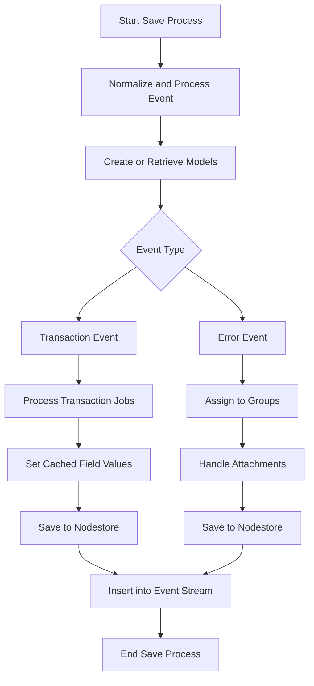

This document will cover the Save Process feature, which includes:

1. Normalizing and processing events
2. Creating or retrieving necessary models
3. Handling transaction events
4. Handling error events
5. Inserting events into the event stream.

Technical document: <SwmLink doc-title="Overview of the Save Process">[Overview of the Save Process](/.swm/overview-of-the-save-process.30mk50cj.sw.md)</SwmLink>

# [Normalizing and Processing Events](https://app.swimm.io/repos/Z2l0aHViJTNBJTNBc2VudHJ5LWRlbW8tMSUzQSUzQVN3aW1tLURlbW8=/docs/30mk50cj#save-function)

The save process begins by normalizing and processing an event. This step ensures that the event data is in a consistent format and ready for further processing. Normalization involves standardizing the event's structure and content, making it easier to handle in subsequent steps.

# [Creating or Retrieving Necessary Models](https://app.swimm.io/repos/Z2l0aHViJTNBJTNBc2VudHJ5LWRlbW8tMSUzQSUzQVN3aW1tLURlbW8=/docs/30mk50cj#save-function)

After normalization, the process involves creating or retrieving necessary models such as releases and environments. These models provide context and additional information about the event, which is crucial for accurate processing and analysis.

# [Handling Transaction Events](https://app.swimm.io/repos/Z2l0aHViJTNBJTNBc2VudHJ5LWRlbW8tMSUzQSUzQVN3aW1tLURlbW8=/docs/30mk50cj#save-transaction-events)

For transaction events, the process includes handling a list of jobs associated with the transaction. This involves setting cached field values, creating releases, deriving tags, calculating span grouping, and saving the events to the nodestore. These steps ensure that transaction events are accurately recorded and can be analyzed for performance monitoring.

# [Handling Error Events](https://app.swimm.io/repos/Z2l0aHViJTNBJTNBc2VudHJ5LWRlbW8tMSUzQSUzQVN3aW1tLURlbW8=/docs/30mk50cj#save_error_events)

For error events, the process involves assigning the event to a group and handling any attachments. This step ensures that similar error events are grouped together for easier tracking and resolution. Attachments, such as logs or screenshots, are also processed and linked to the event for additional context.

# [Inserting Events into the Event Stream](https://app.swimm.io/repos/Z2l0aHViJTNBJTNBc2VudHJ5LWRlbW8tMSUzQSUzQVN3aW1tLURlbW8=/docs/30mk50cj#save-function)

Finally, the processed events are inserted into the event stream. This stream is monitored for further processing and analysis, allowing for real-time tracking of events. The event stream ensures that all events are captured and can be acted upon promptly.

&nbsp;

*This is an auto-generated document by Swimm AI 🌊 and has not yet been verified by a human*

<SwmMeta version="3.0.0" repo-id="Z2l0aHViJTNBJTNBc2VudHJ5LWRlbW8tMSUzQSUzQVN3aW1tLURlbW8=" repo-name="sentry-demo-1" doc-type="product-flows">Powered by [Swimm](/)</SwmMeta>
