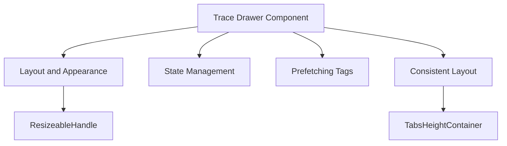

# Understanding Trace Drawer

The Trace Drawer is a component that provides a detailed view of trace data in the application. It includes various styled components such as <SwmToken path="static/app/views/performance/newTraceDetails/traceDrawer/traceDrawer.tsx" pos="629:2:2" line-data="const ResizeableHandle = styled(&#39;div&#39;)&lt;{">`ResizeableHandle`</SwmToken>, <SwmToken path="static/app/views/performance/newTraceDetails/traceDrawer/traceDrawer.tsx" pos="364:2:2" line-data="    &lt;PanelWrapper ref={setDrawerRef} layout={traceState.preferences.layout}&gt;">`PanelWrapper`</SwmToken>, and <SwmToken path="static/app/views/performance/newTraceDetails/traceDrawer/traceDrawer.tsx" pos="673:2:2" line-data="const TabsHeightContainer = styled(&#39;div&#39;)&lt;{">`TabsHeightContainer`</SwmToken> to manage the layout and appearance of the drawer. The drawer can be positioned at the bottom, left, or right of the screen, and its layout is controlled by the <SwmToken path="static/app/views/performance/newTraceDetails/traceDrawer/traceDrawer.tsx" pos="630:1:1" line-data="  layout: &#39;drawer bottom&#39; | &#39;drawer left&#39; | &#39;drawer right&#39;;">`layout`</SwmToken> property.

# Layout and Appearance

The <SwmToken path="static/app/views/performance/newTraceDetails/traceDrawer/traceDrawer.tsx" pos="629:2:2" line-data="const ResizeableHandle = styled(&#39;div&#39;)&lt;{">`ResizeableHandle`</SwmToken> component is used to manage the layout and appearance of the drawer, allowing it to be resized and positioned at the bottom, left, or right of the screen.

<SwmSnippet path="/static/app/views/performance/newTraceDetails/traceDrawer/traceDrawer.tsx" line="629">

---

The <SwmToken path="static/app/views/performance/newTraceDetails/traceDrawer/traceDrawer.tsx" pos="629:2:2" line-data="const ResizeableHandle = styled(&#39;div&#39;)&lt;{">`ResizeableHandle`</SwmToken> component's layout properties are defined here, allowing it to adjust its width, height, cursor, and position based on the drawer's layout.

```tsx
const ResizeableHandle = styled('div')<{
  layout: 'drawer bottom' | 'drawer left' | 'drawer right';
}>`
  width: ${p => (p.layout === 'drawer bottom' ? '100%' : '12px')};
  height: ${p => (p.layout === 'drawer bottom' ? '12px' : '100%')};
  cursor: ${p => (p.layout === 'drawer bottom' ? 'ns-resize' : 'ew-resize')};
  position: absolute;
  top: ${p => (p.layout === 'drawer bottom' ? '-6px' : 0)};
  left: ${p =>
    p.layout === 'drawer bottom' ? 0 : p.layout === 'drawer right' ? '-6px' : 'initial'};
  right: ${p => (p.layout === 'drawer left' ? '-6px' : 0)};

  z-index: 1;
`;
```

---

</SwmSnippet>

# State Management

The <SwmToken path="static/app/views/performance/newTraceDetails/traceDrawer/traceDrawer.tsx" pos="76:4:4" line-data="export function TraceDrawer(props: TraceDrawerProps) {">`TraceDrawer`</SwmToken> component uses the <SwmToken path="static/app/views/performance/newTraceDetails/traceDrawer/traceDrawer.tsx" pos="77:7:7" line-data="  const theme = useTheme();">`useTheme`</SwmToken>, <SwmToken path="static/app/views/performance/newTraceDetails/traceDrawer/traceDrawer.tsx" pos="78:7:7" line-data="  const location = useLocation();">`useLocation`</SwmToken>, and <SwmToken path="static/app/views/performance/newTraceDetails/traceDrawer/traceDrawer.tsx" pos="79:7:7" line-data="  const organization = useOrganization();">`useOrganization`</SwmToken> hooks to access theme settings, location data, and organization information, respectively. It also utilizes the <SwmToken path="static/app/views/performance/newTraceDetails/traceDrawer/traceDrawer.tsx" pos="80:7:7" line-data="  const traceState = useTraceState();">`useTraceState`</SwmToken> and <SwmToken path="static/app/views/performance/newTraceDetails/traceDrawer/traceDrawer.tsx" pos="81:7:7" line-data="  const traceDispatch = useTraceStateDispatch();">`useTraceStateDispatch`</SwmToken> hooks to manage the state of the trace data.

<SwmSnippet path="/static/app/views/performance/newTraceDetails/traceDrawer/traceDrawer.tsx" line="76">

---

The <SwmToken path="static/app/views/performance/newTraceDetails/traceDrawer/traceDrawer.tsx" pos="76:4:4" line-data="export function TraceDrawer(props: TraceDrawerProps) {">`TraceDrawer`</SwmToken> component initializes various hooks to manage theme, location, organization, and trace state.

```tsx
export function TraceDrawer(props: TraceDrawerProps) {
  const theme = useTheme();
  const location = useLocation();
  const organization = useOrganization();
  const traceState = useTraceState();
  const traceDispatch = useTraceStateDispatch();
  const contentContainerRef = useRef<HTMLDivElement>(null);
```

---

</SwmSnippet>

# Prefetching Tags

The drawer prefetches tags for the trace tab to improve performance and prevent refetching when the user clicks on the trace tab.

<SwmSnippet path="/static/app/views/performance/newTraceDetails/traceDrawer/traceDrawer.tsx" line="84">

---

The code snippet demonstrates how the drawer prefetches tags for the trace tab using the <SwmToken path="static/app/views/performance/newTraceDetails/traceDrawer/traceDrawer.tsx" pos="84:5:9" line-data="  // The /events-facets/ endpoint used to fetch tags for the trace tab is slow. Therefore,">`/events-facets/`</SwmToken> endpoint.

```tsx
  // The /events-facets/ endpoint used to fetch tags for the trace tab is slow. Therefore,
  // we try to prefetch the tags as soon as the drawer loads, hoping that the tags will be loaded
  // by the time the user clicks on the trace tab. Also prevents the tags from being refetched.
  const urlParams = useMemo(() => {
    const {timestamp} = getTraceQueryParams(location.query, undefined);
    const params = pick(location.query, [
      ...Object.values(PERFORMANCE_URL_PARAM),
      'cursor',
    ]);

    if (timestamp) {
      params.traceTimestamp = timestamp;
    }
    return params;
    // eslint-disable-next-line react-hooks/exhaustive-deps
  }, []);

  const tagsInfiniteQueryResults = useInfiniteApiQuery<Tag[]>({
```

---

</SwmSnippet>

# Consistent Layout

The <SwmToken path="static/app/views/performance/newTraceDetails/traceDrawer/traceDrawer.tsx" pos="673:2:2" line-data="const TabsHeightContainer = styled(&#39;div&#39;)&lt;{">`TabsHeightContainer`</SwmToken> component adjusts its height based on whether trace indicators are present, ensuring a consistent layout.

<SwmSnippet path="/static/app/views/performance/newTraceDetails/traceDrawer/traceDrawer.tsx" line="673">

---

The <SwmToken path="static/app/views/performance/newTraceDetails/traceDrawer/traceDrawer.tsx" pos="673:2:2" line-data="const TabsHeightContainer = styled(&#39;div&#39;)&lt;{">`TabsHeightContainer`</SwmToken> component's properties are defined here, allowing it to adjust its height and position based on the presence of trace indicators.

```tsx
const TabsHeightContainer = styled('div')<{
  hasIndicators: boolean;
  layout: 'drawer bottom' | 'drawer left' | 'drawer right';
  absolute?: boolean;
}>`
  background: ${p => p.theme.backgroundSecondary};
  left: ${p => (p.layout === 'drawer left' ? '0' : 'initial')};
  right: ${p => (p.layout === 'drawer right' ? '0' : 'initial')};
  position: ${p => (p.absolute ? 'absolute' : 'relative')};
  height: ${p => (p.hasIndicators ? '44px' : '26px')};
  border-bottom: 1px solid ${p => p.theme.border};
  display: flex;
  flex-direction: column;
  justify-content: end;
`;
```

---

</SwmSnippet>

&nbsp;

*This is an auto-generated document by Swimm AI 🌊 and has not yet been verified by a human*

<SwmMeta version="3.0.0" repo-id="Z2l0aHViJTNBJTNBc2VudHJ5LWRlbW8tMSUzQSUzQVN3aW1tLURlbW8=" repo-name="sentry-demo-1" doc-type="overview"><sup>Powered by [Swimm](/)</sup></SwmMeta>
