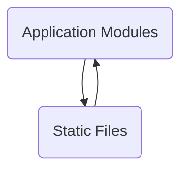

The repository 'sentry-demo-1' demonstrates how to use Sentry, a developer-first error tracking and performance monitoring platform, to identify and solve issues in applications.

## Main Components

### Application Modules

Application modules are distinct components within an application that encapsulate specific functionality or features. They help in organizing the codebase into manageable sections, making it easier to maintain and scale. Each module typically contains related code, such as models, views, and controllers, and can be independently developed and tested.

- <SwmLink doc-title="Identity in application modules">[Identity in application modules](.swm/identity-in-application-modules.7tklrhd4.sw.md)</SwmLink>
- <SwmLink doc-title="Overview of notification actions">[Overview of notification actions](.swm/overview-of-notification-actions.lkua1aec.sw.md)</SwmLink>
- <SwmLink doc-title="Understanding issues in application modules">[Understanding issues in application modules](.swm/understanding-issues-in-application-modules.xen0cjj1.sw.md)</SwmLink>
- <SwmLink doc-title="Introduction to backup in application modules">[Introduction to backup in application modules](.swm/introduction-to-backup-in-application-modules.637vh4ti.sw.md)</SwmLink>
- <SwmLink doc-title="Introduction to discover functionality">[Introduction to discover functionality](.swm/introduction-to-discover-functionality.aoxbrf3n.sw.md)</SwmLink>
- <SwmLink doc-title="Overview of middleware in application modules">[Overview of middleware in application modules](.swm/overview-of-middleware-in-application-modules.hq8hvpal.sw.md)</SwmLink>
- <SwmLink doc-title="Receivers in application modules">[Receivers in application modules](.swm/receivers-in-application-modules.49jrwffh.sw.md)</SwmLink>
- <SwmLink doc-title="Getting started with ingestion process">[Getting started with ingestion process](.swm/getting-started-with-ingestion-process.aurt39h4.sw.md)</SwmLink>
- <SwmLink doc-title="Overview of runner module">[Overview of runner module](.swm/overview-of-runner-module.ew7ep9pw.sw.md)</SwmLink>
- <SwmLink doc-title="Overview of search functionality">[Overview of search functionality](.swm/overview-of-search-functionality.aj4wb3e3.sw.md)</SwmLink>
- <SwmLink doc-title="Introduction to mediators in application modules">[Introduction to mediators in application modules](.swm/introduction-to-mediators-in-application-modules.n8g5x0vj.sw.md)</SwmLink>
- <SwmLink doc-title="Overview of database operations">[Overview of database operations](.swm/overview-of-database-operations.1jjcrmay.sw.md)</SwmLink>
- **Dynamic sampling**
  - <SwmLink doc-title="Overview of dynamic sampling rules">[Overview of dynamic sampling rules](.swm/overview-of-dynamic-sampling-rules.5ly7xppw.sw.md)</SwmLink>
  - <SwmLink doc-title="Understanding dynamic sampling tasks">[Understanding dynamic sampling tasks](.swm/understanding-dynamic-sampling-tasks.u6fifefx.sw.md)</SwmLink>
  - <SwmLink doc-title="The model class">[The model class](.swm/the-model-class.xeqen.sw.md)</SwmLink>
- **Interfaces**
  - <SwmLink doc-title="Overview of interfaces in application modules">[Overview of interfaces in application modules](.swm/overview-of-interfaces-in-application-modules.eka7e3e0.sw.md)</SwmLink>
  - <SwmLink doc-title="The exception class">[The exception class](.swm/the-exception-class.tjyif.sw.md)</SwmLink>
- **Auth**
  - <SwmLink doc-title="Overview of authentication providers">[Overview of authentication providers](.swm/overview-of-authentication-providers.egih5baj.sw.md)</SwmLink>
  - <SwmLink doc-title="Authentication pipeline completion">[Authentication pipeline completion](.swm/authentication-pipeline-completion.ozfsihpj.sw.md)</SwmLink>
  - **Services**
    - <SwmLink doc-title="Overview of auth services">[Overview of auth services](.swm/overview-of-auth-services.vz7jgv34.sw.md)</SwmLink>
    - <SwmLink doc-title="The orgauthtokenservice class">[The orgauthtokenservice class](.swm/the-orgauthtokenservice-class.ykdjf.sw.md)</SwmLink>
- **Incidents**
  - <SwmLink doc-title="Overview of incident management">[Overview of incident management](.swm/overview-of-incident-management.64k8758m.sw.md)</SwmLink>
  - <SwmLink doc-title="Understanding incident endpoints">[Understanding incident endpoints](.swm/understanding-incident-endpoints.4kvvfgsv.sw.md)</SwmLink>
  - **Flows**
    - <SwmLink doc-title="Main function overview">[Main function overview](.swm/main-function-overview.uvb6s0cp.sw.md)</SwmLink>
    - <SwmLink doc-title="Handling subscription updates">[Handling subscription updates](.swm/handling-subscription-updates.ja6uvibm.sw.md)</SwmLink>
    - <SwmLink doc-title="Update process overview">[Update process overview](.swm/update-process-overview.aug9eeda.sw.md)</SwmLink>
    - <SwmLink doc-title="Creating alert rules">[Creating alert rules](.swm/creating-alert-rules.zn6siko8.sw.md)</SwmLink>
- **Notifications**
  - <SwmLink doc-title="Introduction to notification actions">[Introduction to notification actions](.swm/introduction-to-notification-actions.54iwypk8.sw.md)</SwmLink>
  - <SwmLink doc-title="Getting started with activity notifications">[Getting started with activity notifications](.swm/getting-started-with-activity-notifications.8poeoho7.sw.md)</SwmLink>
- **Flows**
  - <SwmLink doc-title="Data import and validation flow">[Data import and validation flow](.swm/data-import-and-validation-flow.ftlxhv9s.sw.md)</SwmLink>
  - <SwmLink doc-title="Importing data flow">[Importing data flow](.swm/importing-data-flow.opos8asp.sw.md)</SwmLink>
  - <SwmLink doc-title="Global data import process">[Global data import process](.swm/global-data-import-process.xakzhqsc.sw.md)</SwmLink>
  - <SwmLink doc-title="User import process">[User import process](.swm/user-import-process.65slrc64.sw.md)</SwmLink>
  - <SwmLink doc-title="Importing organizations flow">[Importing organizations flow](.swm/importing-organizations-flow.bmt4i4sh.sw.md)</SwmLink>
  - <SwmLink doc-title="Importing configuration and administrator accounts">[Importing configuration and administrator accounts](.swm/importing-configuration-and-administrator-accounts.98an8cp0.sw.md)</SwmLink>
  - <SwmLink doc-title="Exporting data to an encrypted tarball">[Exporting data to an encrypted tarball](.swm/exporting-data-to-an-encrypted-tarball.3pxpc311.sw.md)</SwmLink>
- **Tasks**
  - <SwmLink doc-title="Overview of tasks in application modules">[Overview of tasks in application modules](.swm/overview-of-tasks-in-application-modules.3hxcdf5b.sw.md)</SwmLink>
  - <SwmLink doc-title="Backfilling seer grouping records">[Backfilling seer grouping records](.swm/backfilling-seer-grouping-records.jheyhchq.sw.md)</SwmLink>
- **Monitors**
  - <SwmLink doc-title="Exploring monitors in application modules">[Exploring monitors in application modules](.swm/exploring-monitors-in-application-modules.zv817r6a.sw.md)</SwmLink>
  - <SwmLink doc-title="Exploring monitor endpoints">[Exploring monitor endpoints](.swm/exploring-monitor-endpoints.w0x7ik7z.sw.md)</SwmLink>
- **Integrations**
  - <SwmLink doc-title="Overview of integration middleware">[Overview of integration middleware](.swm/overview-of-integration-middleware.47nydgon.sw.md)</SwmLink>
  - <SwmLink doc-title="Overview of integration parsers">[Overview of integration parsers](.swm/overview-of-integration-parsers.msqq98x3.sw.md)</SwmLink>
- **Api**
  - <SwmLink doc-title="Exploring api in application modules">[Exploring api in application modules](.swm/exploring-api-in-application-modules.h4xllm60.sw.md)</SwmLink>
  - <SwmLink doc-title="Exploring api helpers">[Exploring api helpers](.swm/exploring-api-helpers.vipb9n10.sw.md)</SwmLink>
  - <SwmLink doc-title="Relocations in endpoints">[Relocations in endpoints](.swm/relocations-in-endpoints.7vn6j7ns.sw.md)</SwmLink>
  - **Serializers**
    - <SwmLink doc-title="Overview of serializers in api">[Overview of serializers in api](.swm/overview-of-serializers-in-api.329x9ky1.sw.md)</SwmLink>
    - <SwmLink doc-title="Getting started with rest framework serializers">[Getting started with rest framework serializers](.swm/getting-started-with-rest-framework-serializers.dw6yj5ya.sw.md)</SwmLink>
    - <SwmLink doc-title="Introduction to models in serializers">[Introduction to models in serializers](.swm/introduction-to-models-in-serializers.4103izlw.sw.md)</SwmLink>
    - <SwmLink doc-title="The serializer class">[The serializer class](.swm/the-serializer-class.gz0jb.sw.md)</SwmLink>
  - **Bases**
    - <SwmLink doc-title="Api bases overview">[Api bases overview](.swm/api-bases-overview.j15ia64a.sw.md)</SwmLink>
    - <SwmLink doc-title="Processing event statistics">[Processing event statistics](.swm/processing-event-statistics.zr8nfqj9.sw.md)</SwmLink>
    - **Classes**
      - <SwmLink doc-title="The projectendpoint class">[The projectendpoint class](.swm/the-projectendpoint-class.wo6um.sw.md)</SwmLink>
      - <SwmLink doc-title="The organizationpermission class">[The organizationpermission class](.swm/the-organizationpermission-class.yrh4u.sw.md)</SwmLink>
  - **Flows**
    - <SwmLink doc-title="Filtering spans by operation names">[Filtering spans by operation names](.swm/filtering-spans-by-operation-names.o85n45iz.sw.md)</SwmLink>
    - <SwmLink doc-title="Filtering spans with wrapped function">[Filtering spans with wrapped function](.swm/filtering-spans-with-wrapped-function.137i3vhx.sw.md)</SwmLink>
    - <SwmLink doc-title="Rate limiting process">[Rate limiting process](.swm/rate-limiting-process.3cle1wpo.sw.md)</SwmLink>
    - <SwmLink doc-title="Fetching event statistics flow">[Fetching event statistics flow](.swm/fetching-event-statistics-flow.cqif79ai.sw.md)</SwmLink>
    - <SwmLink doc-title="Fetching and processing paginated results">[Fetching and processing paginated results](.swm/fetching-and-processing-paginated-results.pb2xhn7q.sw.md)</SwmLink>
    - <SwmLink doc-title="Fetching deploy data flow">[Fetching deploy data flow](.swm/fetching-deploy-data-flow.s7k3kuai.sw.md)</SwmLink>
    - <SwmLink doc-title="Initialization process overview">[Initialization process overview](.swm/initialization-process-overview.b2np65p9.sw.md)</SwmLink>
    - <SwmLink doc-title="Serialization process overview">[Serialization process overview](.swm/serialization-process-overview.owsjb5k4.sw.md)</SwmLink>
    - <SwmLink doc-title="Role of the decision maker function">[Role of the decision maker function](.swm/role-of-the-decision-maker-function.v1gach8w.sw.md)</SwmLink>
    - <SwmLink doc-title="Updating member roles">[Updating member roles](.swm/updating-member-roles.pzkopumj.sw.md)</SwmLink>
    - <SwmLink doc-title="Updating project settings">[Updating project settings](.swm/updating-project-settings.xf24fdw7.sw.md)</SwmLink>
    - <SwmLink doc-title="Retrieving and processing user span data">[Retrieving and processing user span data](.swm/retrieving-and-processing-user-span-data.rl7u8kqm.sw.md)</SwmLink>
    - <SwmLink doc-title="Counting performance issues">[Counting performance issues](.swm/counting-performance-issues.g8qh6m6h.sw.md)</SwmLink>
  - **Flows**
    - <SwmLink doc-title="Handling slack events">[Handling slack events](.swm/handling-slack-events.j4okfnjr.sw.md)</SwmLink>
    - <SwmLink doc-title="Tracking http response metrics">[Tracking http response metrics](.swm/tracking-http-response-metrics.cme1hm5e.sw.md)</SwmLink>
    - <SwmLink doc-title="Wrapper function overview">[Wrapper function overview](.swm/wrapper-function-overview.i52vkzfv.sw.md)</SwmLink>
    - <SwmLink doc-title="Handling snuba exceptions">[Handling snuba exceptions](.swm/handling-snuba-exceptions.700bfeau.sw.md)</SwmLink>
    - <SwmLink doc-title="Handling exceptions with decorators">[Handling exceptions with decorators](.swm/handling-exceptions-with-decorators.hfkr760s.sw.md)</SwmLink>
    - <SwmLink doc-title="Constructing trend columns and handling query results">[Constructing trend columns and handling query results](.swm/constructing-trend-columns-and-handling-query-results.0z0xb6dc.sw.md)</SwmLink>
    - <SwmLink doc-title="Generating trending event statistics">[Generating trending event statistics](.swm/generating-trending-event-statistics.r4r3rkqi.sw.md)</SwmLink>
    - <SwmLink doc-title="Processing trending event statistics">[Processing trending event statistics](.swm/processing-trending-event-statistics.wz032i1j.sw.md)</SwmLink>
    - <SwmLink doc-title="Fetching event statistics metrics">[Fetching event statistics metrics](.swm/fetching-event-statistics-metrics.vt457eaq.sw.md)</SwmLink>
- **Models**
  - <SwmLink doc-title="Models in application modules">[Models in application modules](.swm/models-in-application-modules.ttm6xw2v.sw.md)</SwmLink>
  - <SwmLink doc-title="Understanding files in models">[Understanding files in models](.swm/understanding-files-in-models.tdev18i4.sw.md)</SwmLink>
- **Users**
  - <SwmLink doc-title="Getting started with user services">[Getting started with user services](.swm/getting-started-with-user-services.po4pt9le.sw.md)</SwmLink>
  - <SwmLink doc-title="Introduction to user models">[Introduction to user models](.swm/introduction-to-user-models.ntw15qvo.sw.md)</SwmLink>
- **Events**
  - <SwmLink doc-title="Basic concepts of events in search">[Basic concepts of events in search](.swm/basic-concepts-of-events-in-search.0n78qysp.sw.md)</SwmLink>
  - <SwmLink doc-title="Getting started with datasets in events">[Getting started with datasets in events](.swm/getting-started-with-datasets-in-events.1lmt4eib.sw.md)</SwmLink>
- **Plugins**
  - <SwmLink doc-title="Introduction to plugins in application modules">[Introduction to plugins in application modules](.swm/introduction-to-plugins-in-application-modules.7em3hpxi.sw.md)</SwmLink>
  - <SwmLink doc-title="Basic concepts of base plugins">[Basic concepts of base plugins](.swm/basic-concepts-of-base-plugins.f6ib11s7.sw.md)</SwmLink>
- **Sentry metrics**
  - <SwmLink doc-title="Exploring metric indexer">[Exploring metric indexer](.swm/exploring-metric-indexer.jrwoples.sw.md)</SwmLink>
  - <SwmLink doc-title="Consumers in sentry metrics">[Consumers in sentry metrics](.swm/consumers-in-sentry-metrics.wfos9hs4.sw.md)</SwmLink>
  - **Querying**
    - <SwmLink doc-title="Understanding querying in sentry metrics">[Understanding querying in sentry metrics](.swm/understanding-querying-in-sentry-metrics.1401nxur.sw.md)</SwmLink>
    - <SwmLink doc-title="Basic concepts of data in querying">[Basic concepts of data in querying](.swm/basic-concepts-of-data-in-querying.ivfyt413.sw.md)</SwmLink>
- **Models**
  - <SwmLink doc-title="Basic concepts of models in django">[Basic concepts of models in django](.swm/basic-concepts-of-models-in-django.m3mq6449.sw.md)</SwmLink>
  - <SwmLink doc-title="Fields in models">[Fields in models](.swm/fields-in-models.a69wsg56.sw.md)</SwmLink>
- **Rules**
  - <SwmLink doc-title="Basic concepts of actions in rules">[Basic concepts of actions in rules](.swm/basic-concepts-of-actions-in-rules.4rw3sgf6.sw.md)</SwmLink>
  - <SwmLink doc-title="Introduction to conditions in rules">[Introduction to conditions in rules](.swm/introduction-to-conditions-in-rules.sbtdrben.sw.md)</SwmLink>
- **Flows**
  - <SwmLink doc-title="Producing occurrences to kafka">[Producing occurrences to kafka](.swm/producing-occurrences-to-kafka.7zdkpkk9.sw.md)</SwmLink>
  - <SwmLink doc-title="Overview of the save process">[Overview of the save process](.swm/overview-of-the-save-process.30mk50cj.sw.md)</SwmLink>
  - <SwmLink doc-title="Understanding should_use_on_demand_metrics">[Understanding should_use_on_demand_metrics](.swm/understanding-should_use_on_demand_metrics.3s0uegjl.sw.md)</SwmLink>
  - <SwmLink doc-title="Handling missing values with resolve_weak">[Handling missing values with resolve_weak](.swm/handling-missing-values-with-resolve_weak.jayh5bmv.sw.md)</SwmLink>
  - <SwmLink doc-title="Querying replays with pagination">[Querying replays with pagination](.swm/querying-replays-with-pagination.grxhqpyn.sw.md)</SwmLink>
  - <SwmLink doc-title="Updating and creating widgets">[Updating and creating widgets](.swm/updating-and-creating-widgets.4u5nsbi2.sw.md)</SwmLink>
  - <SwmLink doc-title="Creating an alert rule trigger">[Creating an alert rule trigger](.swm/creating-an-alert-rule-trigger.mvbodav2.sw.md)</SwmLink>
  - <SwmLink doc-title="Comparing commits flow">[Comparing commits flow](.swm/comparing-commits-flow.m1m6cyd4.sw.md)</SwmLink>
  - <SwmLink doc-title="Creating issue configurations without a group">[Creating issue configurations without a group](.swm/creating-issue-configurations-without-a-group.qep6p6vj.sw.md)</SwmLink>
  - <SwmLink doc-title="Processing occurrence groups">[Processing occurrence groups](.swm/processing-occurrence-groups.dn4fenui.sw.md)</SwmLink>
  - <SwmLink doc-title="Updating an issue">[Updating an issue](.swm/updating-an-issue.b7upif8h.sw.md)</SwmLink>
  - <SwmLink doc-title="Bulk mutating issue attributes">[Bulk mutating issue attributes](.swm/bulk-mutating-issue-attributes.3na6spk0.sw.md)</SwmLink>
  - <SwmLink doc-title="Digest function overview">[Digest function overview](.swm/digest-function-overview.u7kxxjwl.sw.md)</SwmLink>
  - <SwmLink doc-title="Gathering health data for project releases">[Gathering health data for project releases](.swm/gathering-health-data-for-project-releases.9eee553r.sw.md)</SwmLink>
  - <SwmLink doc-title="Processing a single message flow">[Processing a single message flow](.swm/processing-a-single-message-flow.ihybh8cb.sw.md)</SwmLink>
  - <SwmLink doc-title="Handling check ins flow">[Handling check ins flow](.swm/handling-check-ins-flow.goyp6ca9.sw.md)</SwmLink>
  - <SwmLink doc-title="Retrieving and updating repository data">[Retrieving and updating repository data](.swm/retrieving-and-updating-repository-data.6s0bp1wo.sw.md)</SwmLink>
  - <SwmLink doc-title="Managing vsts subscriptions">[Managing vsts subscriptions](.swm/managing-vsts-subscriptions.l9rsz8ut.sw.md)</SwmLink>
  - <SwmLink doc-title="Synchronizing assignees">[Synchronizing assignees](.swm/synchronizing-assignees.8gdxh8z4.sw.md)</SwmLink>
  - <SwmLink doc-title="Retrieving and formatting issue details">[Retrieving and formatting issue details](.swm/retrieving-and-formatting-issue-details.7pxhq4xd.sw.md)</SwmLink>
  - <SwmLink doc-title="Handling clock tasks">[Handling clock tasks](.swm/handling-clock-tasks.9bc7g9ee.sw.md)</SwmLink>
  - <SwmLink doc-title="Handling post requests for alert triggers">[Handling post requests for alert triggers](.swm/handling-post-requests-for-alert-triggers.8xwvvl8e.sw.md)</SwmLink>
  - <SwmLink doc-title="Organization configuration flow">[Organization configuration flow](.swm/organization-configuration-flow.hyjz2zkr.sw.md)</SwmLink>
  - <SwmLink doc-title="Synchronizing external issue status">[Synchronizing external issue status](.swm/synchronizing-external-issue-status.slvvyvh5.sw.md)</SwmLink>
  - <SwmLink doc-title="Post installation tasks">[Post installation tasks](.swm/post-installation-tasks.pcdtohea.sw.md)</SwmLink>
  - <SwmLink doc-title="Creating an issue">[Creating an issue](.swm/creating-an-issue.t5juouxz.sw.md)</SwmLink>
  - <SwmLink doc-title="Handling discord interactions">[Handling discord interactions](.swm/handling-discord-interactions.ini5zklv.sw.md)</SwmLink>
  - <SwmLink doc-title="Filtering unmigratable repositories">[Filtering unmigratable repositories](.swm/filtering-unmigratable-repositories.bkp48cpp.sw.md)</SwmLink>
  - <SwmLink doc-title="Determining issue resolution state">[Determining issue resolution state](.swm/determining-issue-resolution-state.38lzwca9.sw.md)</SwmLink>
  - <SwmLink doc-title="Checking repository access">[Checking repository access](.swm/checking-repository-access.r4z2dcwu.sw.md)</SwmLink>
  - <SwmLink doc-title="Dispatch process overview">[Dispatch process overview](.swm/dispatch-process-overview.72prpqpg.sw.md)</SwmLink>
  - <SwmLink doc-title="Build integration process">[Build integration process](.swm/build-integration-process.jowgncub.sw.md)</SwmLink>
  - <SwmLink doc-title="Gathering release attributes">[Gathering release attributes](.swm/gathering-release-attributes.6banb79i.sw.md)</SwmLink>
  - <SwmLink doc-title="Creating and processing feedback issues">[Creating and processing feedback issues](.swm/creating-and-processing-feedback-issues.b5jbdvxz.sw.md)</SwmLink>
  - <SwmLink doc-title="Overview of the get function flow">[Overview of the get function flow](.swm/overview-of-the-get-function-flow.10pdhtie.sw.md)</SwmLink>
  - <SwmLink doc-title="User registration and invitation acceptance flow">[User registration and invitation acceptance flow](.swm/user-registration-and-invitation-acceptance-flow.6yoft3zb.sw.md)</SwmLink>
  - <SwmLink doc-title="Synchronizing issue status with jira">[Synchronizing issue status with jira](.swm/synchronizing-issue-status-with-jira.7eq84djp.sw.md)</SwmLink>
  - <SwmLink doc-title="Synchronizing sentry and jira issue status">[Synchronizing sentry and jira issue status](.swm/synchronizing-sentry-and-jira-issue-status.s8porjvu.sw.md)</SwmLink>
  - <SwmLink doc-title="Gathering group attributes">[Gathering group attributes](.swm/gathering-group-attributes.96qfp85z.sw.md)</SwmLink>
  - <SwmLink doc-title="Creating a comment in jira">[Creating a comment in jira](.swm/creating-a-comment-in-jira.w2n5rcak.sw.md)</SwmLink>
  - <SwmLink doc-title="Creating an issue in jira">[Creating an issue in jira](.swm/creating-an-issue-in-jira.p2vkfepz.sw.md)</SwmLink>
  - <SwmLink doc-title="Handling authentication">[Handling authentication](.swm/handling-authentication.72u6auwl.sw.md)</SwmLink>
  - <SwmLink doc-title="Jira server integration flow">[Jira server integration flow](.swm/jira-server-integration-flow.qn58m030.sw.md)</SwmLink>
  - <SwmLink doc-title="Access token and webhook processing flow">[Access token and webhook processing flow](.swm/access-token-and-webhook-processing-flow.vmo6ffib.sw.md)</SwmLink>
  - <SwmLink doc-title="Creating a comment flow">[Creating a comment flow](.swm/creating-a-comment-flow.x5lbigv6.sw.md)</SwmLink>
  - <SwmLink doc-title="Creating an issue flow">[Creating an issue flow](.swm/creating-an-issue-flow.w0ayawja.sw.md)</SwmLink>
  - <SwmLink doc-title="Handling oauth and webhook requests">[Handling oauth and webhook requests](.swm/handling-oauth-and-webhook-requests.naptzvbp.sw.md)</SwmLink>
  - <SwmLink doc-title="Profiling process overview">[Profiling process overview](.swm/profiling-process-overview.fqvnqqgf.sw.md)</SwmLink>
  - <SwmLink doc-title="Overview of get_attrs function">[Overview of get_attrs function](.swm/overview-of-get_attrs-function.zum1d1z0.sw.md)</SwmLink>
  - <SwmLink doc-title="Handling metric operations">[Handling metric operations](.swm/handling-metric-operations.w1o0vl60.sw.md)</SwmLink>
  - <SwmLink doc-title="Creating a comment flow">[Creating a comment flow](.swm/creating-a-comment-flow.dhft996i.sw.md)</SwmLink>
  - <SwmLink doc-title="Authorizing a request">[Authorizing a request](.swm/authorizing-a-request.6z884pwm.sw.md)</SwmLink>
  - <SwmLink doc-title="Retrieving issue attributes">[Retrieving issue attributes](.swm/retrieving-issue-attributes.5y24yb61.sw.md)</SwmLink>
  - <SwmLink doc-title="Initiating vsts subscription check">[Initiating vsts subscription check](.swm/initiating-vsts-subscription-check.v5q2m4cv.sw.md)</SwmLink>
  - <SwmLink doc-title="Validating a repository">[Validating a repository](.swm/validating-a-repository.hter470m.sw.md)</SwmLink>
  - <SwmLink doc-title="Identity retrieval and usage">[Identity retrieval and usage](.swm/identity-retrieval-and-usage.fuqcelre.sw.md)</SwmLink>
  - <SwmLink doc-title="Creating a subscription and handling webhooks">[Creating a subscription and handling webhooks](.swm/creating-a-subscription-and-handling-webhooks.03pw19q1.sw.md)</SwmLink>
  - <SwmLink doc-title="Updating release metadata">[Updating release metadata](.swm/updating-release-metadata.8oswlhzd.sw.md)</SwmLink>
  - <SwmLink doc-title="Creating a new release">[Creating a new release](.swm/creating-a-new-release.3hb83lv7.sw.md)</SwmLink>
  - <SwmLink doc-title="Overview of get_result function">[Overview of get_result function](.swm/overview-of-get_result-function.lo66rpm5.sw.md)</SwmLink>
  - <SwmLink doc-title="Calculating crash free rates">[Calculating crash free rates](.swm/calculating-crash-free-rates.deixzuwf.sw.md)</SwmLink>
  - <SwmLink doc-title="Bulk mutation of issues">[Bulk mutation of issues](.swm/bulk-mutation-of-issues.f6jjyg87.sw.md)</SwmLink>
  - <SwmLink doc-title="Bulk update and delete views flow">[Bulk update and delete views flow](.swm/bulk-update-and-delete-views-flow.k15du8ob.sw.md)</SwmLink>
  - <SwmLink doc-title="Issue resolution cleanup">[Issue resolution cleanup](.swm/issue-resolution-cleanup.5j5ti396.sw.md)</SwmLink>
  - <SwmLink doc-title="Event attribute collection and serialization">[Event attribute collection and serialization](.swm/event-attribute-collection-and-serialization.ny09n17k.sw.md)</SwmLink>
  - <SwmLink doc-title="Handling post requests">[Handling post requests](.swm/handling-post-requests.btoaek2g.sw.md)</SwmLink>
  - <SwmLink doc-title="Overview of the data_fn function">[Overview of the data_fn function](.swm/overview-of-the-data_fn-function.2oyncsca.sw.md)</SwmLink>
  - <SwmLink doc-title="Overview of the data_fn function">[Overview of the data_fn function](.swm/overview-of-the-data_fn-function.8h71kha8.sw.md)</SwmLink>
  - <SwmLink doc-title="Creating a new release">[Creating a new release](.swm/creating-a-new-release.ynfvhysw.sw.md)</SwmLink>
  - <SwmLink doc-title="Flow of data_fn function">[Flow of data_fn function](.swm/flow-of-data_fn-function.8w9nbfgp.sw.md)</SwmLink>
  - <SwmLink doc-title="Overview of query stats function">[Overview of query stats function](.swm/overview-of-query-stats-function.etyw02nv.sw.md)</SwmLink>
  - <SwmLink doc-title="Notification sending process">[Notification sending process](.swm/notification-sending-process.wzkkf4dg.sw.md)</SwmLink>
  - <SwmLink doc-title="Role of data_fn">[Role of data_fn](.swm/role-of-data_fn.10oj30x0.sw.md)</SwmLink>
  - <SwmLink doc-title="Retrieving release information">[Retrieving release information](.swm/retrieving-release-information.yq9rw89n.sw.md)</SwmLink>
  - <SwmLink doc-title="Retrieving and processing user reports">[Retrieving and processing user reports](.swm/retrieving-and-processing-user-reports.ax9hin48.sw.md)</SwmLink>
  - <SwmLink doc-title="Purpose of the validate function">[Purpose of the validate function](.swm/purpose-of-the-validate-function.jqsszrtb.sw.md)</SwmLink>
  - <SwmLink doc-title="Handling discord commands">[Handling discord commands](.swm/handling-discord-commands.srdioo7b.sw.md)</SwmLink>
  - <SwmLink doc-title="Processing attachments and events">[Processing attachments and events](.swm/processing-attachments-and-events.7ddcc2b6.sw.md)</SwmLink>
  - <SwmLink doc-title="Handling slack command requests">[Handling slack command requests](.swm/handling-slack-command-requests.01x8hlcm.sw.md)</SwmLink>
  - <SwmLink doc-title="Handling message events">[Handling message events](.swm/handling-message-events.jemqdizi.sw.md)</SwmLink>
  - <SwmLink doc-title="Managing development services">[Managing development services](.swm/managing-development-services.lm1rl02c.sw.md)</SwmLink>
  - <SwmLink doc-title="Openai integration">[Openai integration](.swm/openai-integration.7qyrvjk8.sw.md)</SwmLink>
  - <SwmLink doc-title="Handling commits flow">[Handling commits flow](.swm/handling-commits-flow.tvp209vd.sw.md)</SwmLink>
  - <SwmLink doc-title="Data fetching and analysis flow">[Data fetching and analysis flow](.swm/data-fetching-and-analysis-flow.oknwwqnq.sw.md)</SwmLink>
  - <SwmLink doc-title="Overview of the query execution flow">[Overview of the query execution flow](.swm/overview-of-the-query-execution-flow.ihzh2dfz.sw.md)</SwmLink>
- **Classes**
  - <SwmLink doc-title="The pipelineview class">[The pipelineview class](.swm/the-pipelineview-class.sarn9.sw.md)</SwmLink>
  - <SwmLink doc-title="The rpcmodel class">[The rpcmodel class](.swm/the-rpcmodel-class.sp6e2.sw.md)</SwmLink>
  - <SwmLink doc-title="The basetsdb class">[The basetsdb class](.swm/the-basetsdb-class.k43bm.sw.md)</SwmLink>

### Static Files

Static files are assets that do not change during the execution of the application. They include resources like fonts, stylesheets, images, and scripts, which are served directly to the client without any server-side processing.

- <SwmLink doc-title="Managing plugins in static files">[Managing plugins in static files](.swm/managing-plugins-in-static-files.4634narp.sw.md)</SwmLink>
- <SwmLink doc-title="Introduction to stores">[Introduction to stores](.swm/introduction-to-stores.5dzgb4c7.sw.md)</SwmLink>
- **Views**
  - <SwmLink doc-title="Profiling in views">[Profiling in views](.swm/profiling-in-views.2f53l3op.sw.md)</SwmLink>
  - <SwmLink doc-title="Exploring issue list view">[Exploring issue list view](.swm/exploring-issue-list-view.nt80j6y4.sw.md)</SwmLink>
  - <SwmLink doc-title="Exploring replays in views">[Exploring replays in views](.swm/exploring-replays-in-views.7v1u993j.sw.md)</SwmLink>
  - <SwmLink doc-title="Getting started with metrics in views">[Getting started with metrics in views](.swm/getting-started-with-metrics-in-views.7ot9ezpw.sw.md)</SwmLink>
  - <SwmLink doc-title="Exploring issues in alerts">[Exploring issues in alerts](.swm/exploring-issues-in-alerts.4kf863e0.sw.md)</SwmLink>
  - <SwmLink doc-title="Basic concepts of project detail view">[Basic concepts of project detail view](.swm/basic-concepts-of-project-detail-view.3503r3iq.sw.md)</SwmLink>
  - <SwmLink doc-title="Overview of admin in views">[Overview of admin in views](.swm/overview-of-admin-in-views.o8b7hr4y.sw.md)</SwmLink>
  - <SwmLink doc-title="Introduction to discover feature">[Introduction to discover feature](.swm/introduction-to-discover-feature.3qdlyd4u.sw.md)</SwmLink>
  - <SwmLink doc-title="Getting started with detailed issue information">[Getting started with detailed issue information](.swm/getting-started-with-detailed-issue-information.q4gqtduq.sw.md)</SwmLink>
  - <SwmLink doc-title="Releases list overview">[Releases list overview](.swm/releases-list-overview.vrl1pgku.sw.md)</SwmLink>
  - <SwmLink doc-title="Basic concepts of monitors in views">[Basic concepts of monitors in views](.swm/basic-concepts-of-monitors-in-views.ih8cebbb.sw.md)</SwmLink>
  - **Performance**
    - <SwmLink doc-title="Overview of performance trends">[Overview of performance trends](.swm/overview-of-performance-trends.n5ugqm8j.sw.md)</SwmLink>
    - <SwmLink doc-title="Getting started with trace details">[Getting started with trace details](.swm/getting-started-with-trace-details.5la0287z.sw.md)</SwmLink>
    - **Transaction summary**
      - <SwmLink doc-title="Understanding transaction spans">[Understanding transaction spans](.swm/understanding-transaction-spans.gm0ic6j6.sw.md)</SwmLink>
      - <SwmLink doc-title="Transaction overview components and endpoints">[Transaction overview components and endpoints](.swm/transaction-overview-components-and-endpoints.ktap2osz.sw.md)</SwmLink>
    - **Trace drawer**
      - <SwmLink doc-title="Overview of trace drawer component">[Overview of trace drawer component](.swm/overview-of-trace-drawer-component.vf3vxjwm.sw.md)</SwmLink>
      - <SwmLink doc-title="Exploring trace details">[Exploring trace details](.swm/exploring-trace-details.1o523h71.sw.md)</SwmLink>
    - **Flows**
      - <SwmLink doc-title="Navigating the trace tree">[Navigating the trace tree](.swm/navigating-the-trace-tree.vbe0s498.sw.md)</SwmLink>
      - <SwmLink doc-title="Trace view waterfall component">[Trace view waterfall component](.swm/trace-view-waterfall-component.b3fyyq7y.sw.md)</SwmLink>
      - <SwmLink doc-title="Trace flow overview">[Trace flow overview](.swm/trace-flow-overview.ury2uwre.sw.md)</SwmLink>
    - **Landing**
      - <SwmLink doc-title="Overview of the performance landing page">[Overview of the performance landing page](.swm/overview-of-the-performance-landing-page.qeotmzq2.sw.md)</SwmLink>
      - <SwmLink doc-title="Understanding performance widgets">[Understanding performance widgets](.swm/understanding-performance-widgets.wdhd8x19.sw.md)</SwmLink>
  - **Organization stats**
    - <SwmLink doc-title="Getting started with organization usage stats">[Getting started with organization usage stats](.swm/getting-started-with-organization-usage-stats.9x53zfpg.sw.md)</SwmLink>
    - <SwmLink doc-title="Getting started with team insights">[Getting started with team insights](.swm/getting-started-with-team-insights.mfv5rbrm.sw.md)</SwmLink>
  - **Dashboards**
    - <SwmLink doc-title="Dashboard rendering and management">[Dashboard rendering and management](.swm/dashboard-rendering-and-management.hlt5vit1.sw.md)</SwmLink>
    - <SwmLink doc-title="Basic concepts of widget card in dashboards">[Basic concepts of widget card in dashboards](.swm/basic-concepts-of-widget-card-in-dashboards.jk3gfgh7.sw.md)</SwmLink>
  - **Detail**
    - <SwmLink doc-title="Overview of replay details">[Overview of replay details](.swm/overview-of-replay-details.mx9i2b9j.sw.md)</SwmLink>
    - <SwmLink doc-title="Understanding network details">[Understanding network details](.swm/understanding-network-details.teq0oj1x.sw.md)</SwmLink>
  - **Metric**
    - <SwmLink doc-title="Understanding metrics in alerts">[Understanding metrics in alerts](.swm/understanding-metrics-in-alerts.l5px4k5w.sw.md)</SwmLink>
    - <SwmLink doc-title="Details in metric overview">[Details in metric overview](.swm/details-in-metric-overview.mz5bqbty.sw.md)</SwmLink>
  - **Settings**
    - <SwmLink doc-title="Getting started with organization teams settings">[Getting started with organization teams settings](.swm/getting-started-with-organization-teams-settings.vfcy3sx2.sw.md)</SwmLink>
    - <SwmLink doc-title="Overview of account settings">[Overview of account settings](.swm/overview-of-account-settings.o414jrft.sw.md)</SwmLink>
    - <SwmLink doc-title="Understanding organization integrations in settings">[Understanding organization integrations in settings](.swm/understanding-organization-integrations-in-settings.rwwpuyol.sw.md)</SwmLink>
    - <SwmLink doc-title="Getting started with settings components">[Getting started with settings components](.swm/getting-started-with-settings-components.cqvlqe2u.sw.md)</SwmLink>
    - **Data scrubbing**
      - <SwmLink doc-title="Understanding data scrubbing in components">[Understanding data scrubbing in components](.swm/understanding-data-scrubbing-in-components.otjyeaue.sw.md)</SwmLink>
      - <SwmLink doc-title="Basic concepts of modals in data scrubbing">[Basic concepts of modals in data scrubbing](.swm/basic-concepts-of-modals-in-data-scrubbing.lyms3x9l.sw.md)</SwmLink>
    - **Project**
      - <SwmLink doc-title="Understanding project settings">[Understanding project settings](.swm/understanding-project-settings.jysunon4.sw.md)</SwmLink>
      - <SwmLink doc-title="Introduction to project ownership">[Introduction to project ownership](.swm/introduction-to-project-ownership.xtvj9qfx.sw.md)</SwmLink>
  - **Detail**
    - <SwmLink doc-title="Getting started with release details">[Getting started with release details](.swm/getting-started-with-release-details.m6kc6zex.sw.md)</SwmLink>
    - <SwmLink doc-title="Introduction to overview of release details">[Introduction to overview of release details](.swm/introduction-to-overview-of-release-details.xeutf34w.sw.md)</SwmLink>
- **Components**
  - <SwmLink doc-title="Understanding metrics in components">[Understanding metrics in components](.swm/understanding-metrics-in-components.4cvas3wj.sw.md)</SwmLink>
  - <SwmLink doc-title="Overview of forms in components">[Overview of forms in components](.swm/overview-of-forms-in-components.xeu4g2ln.sw.md)</SwmLink>
  - <SwmLink doc-title="Understanding sidebar in components">[Understanding sidebar in components](.swm/understanding-sidebar-in-components.u1yh60du.sw.md)</SwmLink>
  - <SwmLink doc-title="Getting started with organizations in sentry components">[Getting started with organizations in sentry components](.swm/getting-started-with-organizations-in-sentry-components.o8zg7epn.sw.md)</SwmLink>
  - <SwmLink doc-title="Introduction to onboarding in components">[Introduction to onboarding in components](.swm/introduction-to-onboarding-in-components.9mj3s01y.sw.md)</SwmLink>
  - <SwmLink doc-title="Overview of modals in components">[Overview of modals in components](.swm/overview-of-modals-in-components.jsdua4hk.sw.md)</SwmLink>
  - <SwmLink doc-title="Exploring the dev toolbar">[Exploring the dev toolbar](.swm/exploring-the-dev-toolbar.qajpclws.sw.md)</SwmLink>
  - <SwmLink doc-title="Overview of chart component in application">[Overview of chart component in application](.swm/overview-of-chart-component-in-application.1v1c09tr.sw.md)</SwmLink>
  - <SwmLink doc-title="Search component overview">[Search component overview](.swm/search-component-overview.9rz0860v.sw.md)</SwmLink>
  - <SwmLink doc-title="Introduction to feedback components">[Introduction to feedback components](.swm/introduction-to-feedback-components.9oy5lxcu.sw.md)</SwmLink>
  - <SwmLink doc-title="Introduction to replays in components">[Introduction to replays in components](.swm/introduction-to-replays-in-components.s9uufxdn.sw.md)</SwmLink>
  - <SwmLink doc-title="Overview of profiling components">[Overview of profiling components](.swm/overview-of-profiling-components.nmmloybr.sw.md)</SwmLink>
  - **Group**
    - <SwmLink doc-title="Overview of group in components">[Overview of group in components](.swm/overview-of-group-in-components.md80dwxs.sw.md)</SwmLink>
    - <SwmLink doc-title="Getting started with external issues list">[Getting started with external issues list](.swm/getting-started-with-external-issues-list.wcjaynk2.sw.md)</SwmLink>
  - **Events**
    - <SwmLink doc-title="Introduction to autofix in events">[Introduction to autofix in events](.swm/introduction-to-autofix-in-events.5mt1rxv9.sw.md)</SwmLink>
    - <SwmLink doc-title="Understanding event contexts">[Understanding event contexts](.swm/understanding-event-contexts.qnyp8d8x.sw.md)</SwmLink>
    - <SwmLink doc-title="Understanding event statistical detector">[Understanding event statistical detector](.swm/understanding-event-statistical-detector.jkgtmtcz.sw.md)</SwmLink>
    - **Interfaces**
      - <SwmLink doc-title="Introduction to frame component">[Introduction to frame component](.swm/introduction-to-frame-component.ukqm79pi.sw.md)</SwmLink>
      - <SwmLink doc-title="Exploring spans in interfaces">[Exploring spans in interfaces](.swm/exploring-spans-in-interfaces.8j4hwf3z.sw.md)</SwmLink>
      - <SwmLink doc-title="The generic class">[The generic class](.swm/the-generic-class.9vqff.sw.md)</SwmLink>
      - **Crash content**
        - <SwmLink doc-title="Introduction to crash details">[Introduction to crash details](.swm/introduction-to-crash-details.z3a27qhm.sw.md)</SwmLink>
        - <SwmLink doc-title="Overview of exception handling in crash content">[Overview of exception handling in crash content](.swm/overview-of-exception-handling-in-crash-content.bybbpkq0.sw.md)</SwmLink>
      - **Debug meta**
        - <SwmLink doc-title="Basic concepts of debug metadata">[Basic concepts of debug metadata](.swm/basic-concepts-of-debug-metadata.4o4sgij6.sw.md)</SwmLink>
        - <SwmLink doc-title="Exploring debug image information">[Exploring debug image information](.swm/exploring-debug-image-information.mk0zb5jr.sw.md)</SwmLink>
- **Flows**
  - <SwmLink doc-title="Overview of formfield component">[Overview of formfield component](.swm/overview-of-formfield-component.g648wjaw.sw.md)</SwmLink>
  - <SwmLink doc-title="Field change notification and undo flow">[Field change notification and undo flow](.swm/field-change-notification-and-undo-flow.jutfzmpw.sw.md)</SwmLink>
  - <SwmLink doc-title="Dashboard list overview">[Dashboard list overview](.swm/dashboard-list-overview.9qliw58c.sw.md)</SwmLink>
  - <SwmLink doc-title="Fetching organization details">[Fetching organization details](.swm/fetching-organization-details.n4ddpsz4.sw.md)</SwmLink>
  - <SwmLink doc-title="Overview of configureintegration function">[Overview of configureintegration function](.swm/overview-of-configureintegration-function.v9gmkwh0.sw.md)</SwmLink>
  - <SwmLink doc-title="Overview of codeownerfiletable">[Overview of codeownerfiletable](.swm/overview-of-codeownerfiletable.m2ixa9cm.sw.md)</SwmLink>
  - <SwmLink doc-title="Overview of usegenericdiscoverquery">[Overview of usegenericdiscoverquery](.swm/overview-of-usegenericdiscoverquery.8i2fpsuo.sw.md)</SwmLink>
  - <SwmLink doc-title="Making event requests">[Making event requests](.swm/making-event-requests.e9ns5q40.sw.md)</SwmLink>
  - <SwmLink doc-title="Query function flow">[Query function flow](.swm/query-function-flow.9nu2nxpw.sw.md)</SwmLink>
  - <SwmLink doc-title="Sudomodal component overview">[Sudomodal component overview](.swm/sudomodal-component-overview.5p4rwl88.sw.md)</SwmLink>
  - <SwmLink doc-title="Alert rule details flow">[Alert rule details flow](.swm/alert-rule-details-flow.hheakc1d.sw.md)</SwmLink>
  - <SwmLink doc-title="Querybatchnode overview">[Querybatchnode overview](.swm/querybatchnode-overview.93fmzvgi.sw.md)</SwmLink>
  - <SwmLink doc-title="Query context menu overview">[Query context menu overview](.swm/query-context-menu-overview.p58q0whr.sw.md)</SwmLink>
  - <SwmLink doc-title="Query handling overview">[Query handling overview](.swm/query-handling-overview.hleqpcn6.sw.md)</SwmLink>
  - <SwmLink doc-title="Handling user actions">[Handling user actions](.swm/handling-user-actions.kmrw6qxf.sw.md)</SwmLink>
  - <SwmLink doc-title="Query batching process">[Query batching process](.swm/query-batching-process.xw1vqty8.sw.md)</SwmLink>

### Flows

- <SwmLink doc-title="Continuousprofileprovider overview">[Continuousprofileprovider overview](.swm/continuousprofileprovider-overview.ygr8cpkj.sw.md)</SwmLink>

## Build Tools

- <SwmLink doc-title="Makefile">[Makefile](.swm/makefile.dzp4yvct.sw.md)</SwmLink>

&nbsp;

*This is an auto-generated document by Swimm AI 🌊 and has not yet been verified by a human*

<SwmMeta version="3.0.0" repo-id="Z2l0aHViJTNBJTNBc2VudHJ5LWRlbW8tMSUzQSUzQVN3aW1tLURlbW8=" repo-name="sentry-demo-1" doc-type="other">Powered by [Swimm](/)</SwmMeta>
