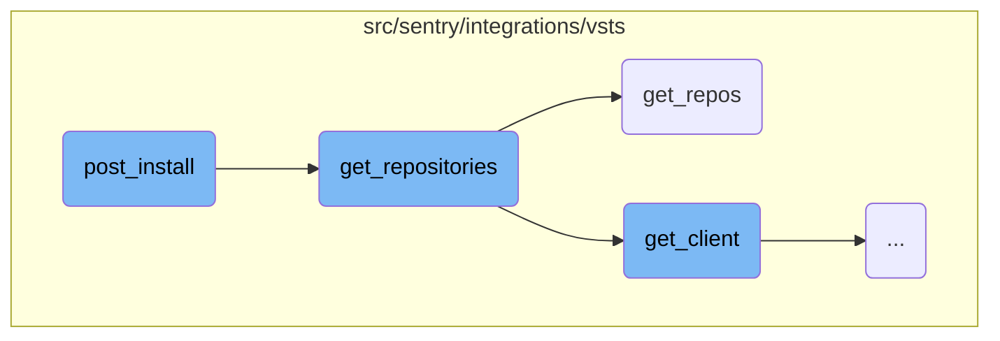
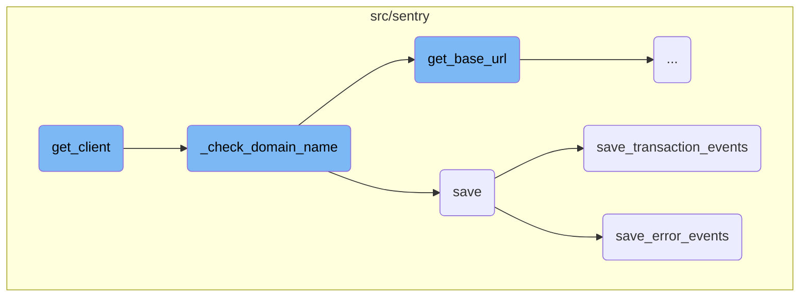
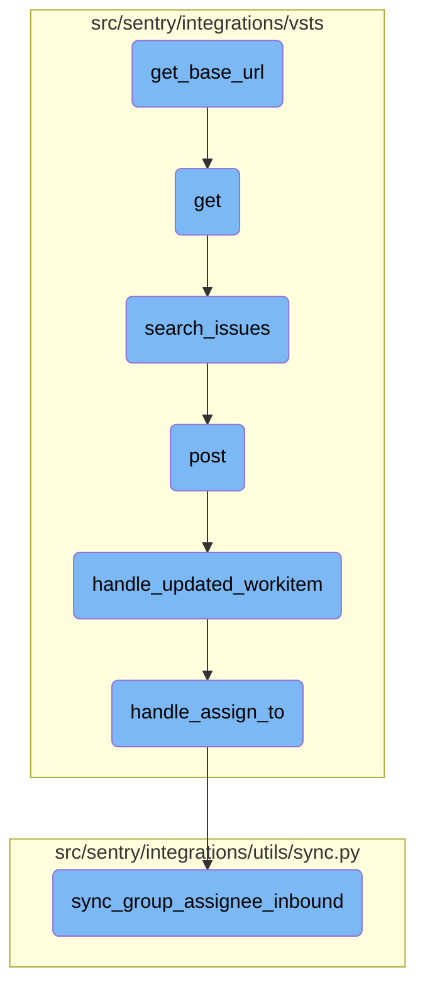

This document explains the <SwmToken path="src/sentry/integrations/vsts/integration.py" pos="403:3:3" line-data="    def post_install(">`post_install`</SwmToken> function, which is responsible for handling tasks after the installation of an integration. It retrieves repositories associated with an organization and applies a migration task to each repository to ensure proper integration and data migration.

The <SwmToken path="src/sentry/integrations/vsts/integration.py" pos="403:3:3" line-data="    def post_install(">`post_install`</SwmToken> function is like a helper that comes in after you set up an integration. It first gathers all the repositories linked to your organization. Then, it makes sure each repository is properly set up by running a migration task on them. This helps in making sure everything is in place and any necessary data is moved correctly.

Here is a high level diagram of the flow, showing only the most important functions:

```mermaid
graph TD;
      subgraph src/sentry/integrations/vsts
27470928abd1587c191db6fd36c977dc15a62375d971f26babbcace133d5cc2a(post_install):::mainFlowStyle --> cad6928b5d882a7edd3adbc25c5a0ba5b67661b9c076b930750c017e95770bc9(get_repositories):::mainFlowStyle
end

subgraph src/sentry/integrations/vsts
cad6928b5d882a7edd3adbc25c5a0ba5b67661b9c076b930750c017e95770bc9(get_repositories):::mainFlowStyle --> 0d5df30a77f81c7761642742c03d76fe21f73422aa773492ed9505dfcf14dfd2(get_repos)
end

subgraph src/sentry/integrations/vsts
cad6928b5d882a7edd3adbc25c5a0ba5b67661b9c076b930750c017e95770bc9(get_repositories):::mainFlowStyle --> 0929df67669e089b92a784392a4caa0c21baeadfd85263fa34c49a09c193b3d1(get_client):::mainFlowStyle
end

subgraph src/sentry/integrations/vsts
0929df67669e089b92a784392a4caa0c21baeadfd85263fa34c49a09c193b3d1(get_client):::mainFlowStyle --> 7f10adeb955518d0b9ce9a18ae73cf60c8e87d6b2b7bc87f5b2addc217981d21(_check_domain_name):::mainFlowStyle
end

subgraph src/sentry/event_manager.py
7f10adeb955518d0b9ce9a18ae73cf60c8e87d6b2b7bc87f5b2addc217981d21(_check_domain_name):::mainFlowStyle --> 5086692df24257d76a0adf892eba843feac14033d92b4a32022b125d5a725f9b(save)
end

subgraph src/sentry/integrations/vsts
7f10adeb955518d0b9ce9a18ae73cf60c8e87d6b2b7bc87f5b2addc217981d21(_check_domain_name):::mainFlowStyle --> 3a40802301e1642b0a2d0ce06ddee674da6a7fd8353ad71b1c436be19e6563d6(get_base_url):::mainFlowStyle
end

subgraph src/sentry/integrations/vsts
3a40802301e1642b0a2d0ce06ddee674da6a7fd8353ad71b1c436be19e6563d6(get_base_url):::mainFlowStyle --> c9f1b6abd5b86b248deafac3aa63eb8d055350bf49cbe100c54a0d94ee13361a(get):::mainFlowStyle
end

subgraph src/sentry/integrations/vsts
c9f1b6abd5b86b248deafac3aa63eb8d055350bf49cbe100c54a0d94ee13361a(get):::mainFlowStyle --> fc4a2a7e5f1b5a9d6230778920f9b62f4b7f3caa80ebd97c89444e007895b382(search_issues):::mainFlowStyle
end

subgraph src/sentry/integrations/vsts
fc4a2a7e5f1b5a9d6230778920f9b62f4b7f3caa80ebd97c89444e007895b382(search_issues):::mainFlowStyle --> a0445eff32744589c21cfe40b46d7b4346893653994134be4a340aaaf32b3f6d(post):::mainFlowStyle
end

subgraph src/sentry/integrations/vsts
a0445eff32744589c21cfe40b46d7b4346893653994134be4a340aaaf32b3f6d(post):::mainFlowStyle --> 66e049c83c1ca3a7a23933e320651f77196243d817b62c1a401dfd7205f9a929(handle_updated_workitem):::mainFlowStyle
end

subgraph src/sentry/integrations/vsts
66e049c83c1ca3a7a23933e320651f77196243d817b62c1a401dfd7205f9a929(handle_updated_workitem):::mainFlowStyle --> 66c307c65db74ab637ed0ed1623cc34d22110f0911938f86a52ccb8f5e8009dd(handle_assign_to):::mainFlowStyle
end

subgraph src/sentry/integrations/utils/sync.py
66c307c65db74ab637ed0ed1623cc34d22110f0911938f86a52ccb8f5e8009dd(handle_assign_to):::mainFlowStyle --> dd6f2c6555a3ad00a0aed3ab34055c7026063e3a2a74b2537fcf2a1223ffa577(sync_group_assignee_inbound):::mainFlowStyle
end


      classDef mainFlowStyle color:#000000,fill:#7CB9F4
classDef rootsStyle color:#000000,fill:#00FFF4
classDef Style1 color:#000000,fill:#00FFAA
classDef Style2 color:#000000,fill:#FFFF00
classDef Style3 color:#000000,fill:#AA7CB9

%% Swimm:
%% graph TD;
%%       subgraph <SwmPath>[src/sentry/integrations/vsts/](src/sentry/integrations/vsts/)</SwmPath>
%% 27470928abd1587c191db6fd36c977dc15a62375d971f26babbcace133d5cc2a(post_install):::mainFlowStyle --> cad6928b5d882a7edd3adbc25c5a0ba5b67661b9c076b930750c017e95770bc9(get_repositories):::mainFlowStyle
%% end
%% 
%% subgraph <SwmPath>[src/sentry/integrations/vsts/](src/sentry/integrations/vsts/)</SwmPath>
%% cad6928b5d882a7edd3adbc25c5a0ba5b67661b9c076b930750c017e95770bc9(get_repositories):::mainFlowStyle --> 0d5df30a77f81c7761642742c03d76fe21f73422aa773492ed9505dfcf14dfd2(get_repos)
%% end
%% 
%% subgraph <SwmPath>[src/sentry/integrations/vsts/](src/sentry/integrations/vsts/)</SwmPath>
%% cad6928b5d882a7edd3adbc25c5a0ba5b67661b9c076b930750c017e95770bc9(get_repositories):::mainFlowStyle --> 0929df67669e089b92a784392a4caa0c21baeadfd85263fa34c49a09c193b3d1(get_client):::mainFlowStyle
%% end
%% 
%% subgraph <SwmPath>[src/sentry/integrations/vsts/](src/sentry/integrations/vsts/)</SwmPath>
%% 0929df67669e089b92a784392a4caa0c21baeadfd85263fa34c49a09c193b3d1(get_client):::mainFlowStyle --> 7f10adeb955518d0b9ce9a18ae73cf60c8e87d6b2b7bc87f5b2addc217981d21(_check_domain_name):::mainFlowStyle
%% end
%% 
%% subgraph <SwmPath>[src/sentry/event_manager.py](src/sentry/event_manager.py)</SwmPath>
%% 7f10adeb955518d0b9ce9a18ae73cf60c8e87d6b2b7bc87f5b2addc217981d21(_check_domain_name):::mainFlowStyle --> 5086692df24257d76a0adf892eba843feac14033d92b4a32022b125d5a725f9b(save)
%% end
%% 
%% subgraph <SwmPath>[src/sentry/integrations/vsts/](src/sentry/integrations/vsts/)</SwmPath>
%% 7f10adeb955518d0b9ce9a18ae73cf60c8e87d6b2b7bc87f5b2addc217981d21(_check_domain_name):::mainFlowStyle --> 3a40802301e1642b0a2d0ce06ddee674da6a7fd8353ad71b1c436be19e6563d6(get_base_url):::mainFlowStyle
%% end
%% 
%% subgraph <SwmPath>[src/sentry/integrations/vsts/](src/sentry/integrations/vsts/)</SwmPath>
%% 3a40802301e1642b0a2d0ce06ddee674da6a7fd8353ad71b1c436be19e6563d6(get_base_url):::mainFlowStyle --> c9f1b6abd5b86b248deafac3aa63eb8d055350bf49cbe100c54a0d94ee13361a(get):::mainFlowStyle
%% end
%% 
%% subgraph <SwmPath>[src/sentry/integrations/vsts/](src/sentry/integrations/vsts/)</SwmPath>
%% c9f1b6abd5b86b248deafac3aa63eb8d055350bf49cbe100c54a0d94ee13361a(get):::mainFlowStyle --> fc4a2a7e5f1b5a9d6230778920f9b62f4b7f3caa80ebd97c89444e007895b382(search_issues):::mainFlowStyle
%% end
%% 
%% subgraph <SwmPath>[src/sentry/integrations/vsts/](src/sentry/integrations/vsts/)</SwmPath>
%% fc4a2a7e5f1b5a9d6230778920f9b62f4b7f3caa80ebd97c89444e007895b382(search_issues):::mainFlowStyle --> a0445eff32744589c21cfe40b46d7b4346893653994134be4a340aaaf32b3f6d(post):::mainFlowStyle
%% end
%% 
%% subgraph <SwmPath>[src/sentry/integrations/vsts/](src/sentry/integrations/vsts/)</SwmPath>
%% a0445eff32744589c21cfe40b46d7b4346893653994134be4a340aaaf32b3f6d(post):::mainFlowStyle --> 66e049c83c1ca3a7a23933e320651f77196243d817b62c1a401dfd7205f9a929(handle_updated_workitem):::mainFlowStyle
%% end
%% 
%% subgraph <SwmPath>[src/sentry/integrations/vsts/](src/sentry/integrations/vsts/)</SwmPath>
%% 66e049c83c1ca3a7a23933e320651f77196243d817b62c1a401dfd7205f9a929(handle_updated_workitem):::mainFlowStyle --> 66c307c65db74ab637ed0ed1623cc34d22110f0911938f86a52ccb8f5e8009dd(handle_assign_to):::mainFlowStyle
%% end
%% 
%% subgraph <SwmPath>[src/sentry/integrations/utils/sync.py](src/sentry/integrations/utils/sync.py)</SwmPath>
%% 66c307c65db74ab637ed0ed1623cc34d22110f0911938f86a52ccb8f5e8009dd(handle_assign_to):::mainFlowStyle --> dd6f2c6555a3ad00a0aed3ab34055c7026063e3a2a74b2537fcf2a1223ffa577(sync_group_assignee_inbound):::mainFlowStyle
%% end
%% 
%% 
%%       classDef mainFlowStyle color:#000000,fill:#7CB9F4
%% classDef rootsStyle color:#000000,fill:#00FFF4
%% classDef Style1 color:#000000,fill:#00FFAA
%% classDef Style2 color:#000000,fill:#FFFF00
%% classDef Style3 color:#000000,fill:#AA7CB9
```



# Flow drill down

First, we'll zoom into this section of the flow:



<SwmSnippet path="/src/sentry/integrations/vsts/integration.py" line="403">

---

## <SwmToken path="src/sentry/integrations/vsts/integration.py" pos="403:3:3" line-data="    def post_install(">`post_install`</SwmToken>

The <SwmToken path="src/sentry/integrations/vsts/integration.py" pos="403:3:3" line-data="    def post_install(">`post_install`</SwmToken> function is responsible for handling post-installation tasks for the integration. It retrieves repositories associated with the organization and applies a migration task to each repository. This ensures that the repositories are correctly integrated and any necessary data migration is performed.

```python
    def post_install(
        self,
        integration: IntegrationModel,
        organization: RpcOrganizationSummary,
        extra: Mapping[str, Any] | None = None,
    ) -> None:
        repos = repository_service.get_repositories(
            organization_id=organization.id,
            providers=["visualstudio", "integrations:vsts"],
            has_integration=False,
        )

        for repo in repos:
            migrate_repo.apply_async(
                kwargs={
                    "repo_id": repo.id,
                    "integration_id": integration.id,
                    "organization_id": organization.id,
                }
            )
```

---

</SwmSnippet>

<SwmSnippet path="/src/sentry/integrations/vsts/integration.py" line="293">

---

## <SwmToken path="src/sentry/integrations/vsts/integration.py" pos="295:3:3" line-data="    def get_repositories(self, query: str | None = None) -&gt; Sequence[Mapping[str, str]]:">`get_repositories`</SwmToken>

The <SwmToken path="src/sentry/integrations/vsts/integration.py" pos="295:3:3" line-data="    def get_repositories(self, query: str | None = None) -&gt; Sequence[Mapping[str, str]]:">`get_repositories`</SwmToken> function fetches the list of repositories from the VSTS client. It handles potential errors and formats the repository data into a list of dictionaries containing the repository name and identifier. This function is crucial for retrieving the necessary repository information needed for further processing.

```python
    # RepositoryIntegration methods

    def get_repositories(self, query: str | None = None) -> Sequence[Mapping[str, str]]:
        try:
            repos = self.get_client().get_repos()
        except (ApiError, IdentityNotValid) as e:
            raise IntegrationError(self.message_from_error(e))
        data = []
        for repo in repos["value"]:
            data.append(
                {
                    "name": "{}/{}".format(repo["project"]["name"], repo["name"]),
                    "identifier": repo["id"],
                }
            )
        return data
```

---

</SwmSnippet>

<SwmSnippet path="/src/sentry/integrations/vsts/client.py" line="330">

---

### <SwmToken path="src/sentry/integrations/vsts/client.py" pos="330:3:3" line-data="    def get_repos(self, project: str | None = None) -&gt; Response:">`get_repos`</SwmToken>

The <SwmToken path="src/sentry/integrations/vsts/client.py" pos="330:3:3" line-data="    def get_repos(self, project: str | None = None) -&gt; Response:">`get_repos`</SwmToken> function in the VSTS client makes an API call to fetch the repositories. It constructs the API endpoint using the base URL and project information, and sets a timeout for the request. This function is used by <SwmToken path="src/sentry/integrations/vsts/integration.py" pos="295:3:3" line-data="    def get_repositories(self, query: str | None = None) -&gt; Sequence[Mapping[str, str]]:">`get_repositories`</SwmToken> to obtain the raw repository data from the VSTS service.

```python
    def get_repos(self, project: str | None = None) -> Response:
        return self.get(
            VstsApiPath.repositories.format(
                instance=self.base_url, project=f"{project}/" if project else ""
            ),
            timeout=5,
        )
```

---

</SwmSnippet>

Now, lets zoom into this section of the flow:



<SwmSnippet path="/src/sentry/integrations/vsts/integration.py" line="135">

---

## Initializing VSTS API Client

The <SwmToken path="src/sentry/integrations/vsts/integration.py" pos="297:7:7" line-data="            repos = self.get_client().get_repos()">`get_client`</SwmToken> function initializes the VSTS API client. It first sets the <SwmToken path="src/sentry/integrations/vsts/integration.py" pos="135:1:1" line-data="        base_url = self.instance">`base_url`</SwmToken> and checks the current <SwmToken path="src/sentry/integrations/vsts/integration.py" pos="136:3:3" line-data="        if SiloMode.get_current_mode() != SiloMode.REGION:">`SiloMode`</SwmToken>. If the <SwmToken path="src/sentry/integrations/vsts/integration.py" pos="137:5:5" line-data="            if self.default_identity is None:">`default_identity`</SwmToken> is not set, it retrieves it using <SwmToken path="src/sentry/integrations/vsts/integration.py" pos="138:9:9" line-data="                self.default_identity = self.get_default_identity()">`get_default_identity`</SwmToken>. The function then calls <SwmToken path="src/sentry/integrations/vsts/integration.py" pos="139:3:3" line-data="            self._check_domain_name(self.default_identity)">`_check_domain_name`</SwmToken> to ensure the domain name is correctly set. Finally, it returns an instance of <SwmToken path="src/sentry/integrations/vsts/integration.py" pos="145:3:3" line-data="        return VstsApiClient(">`VstsApiClient`</SwmToken> with the necessary configuration details.

```python
        base_url = self.instance
        if SiloMode.get_current_mode() != SiloMode.REGION:
            if self.default_identity is None:
                self.default_identity = self.get_default_identity()
            self._check_domain_name(self.default_identity)

        if self.org_integration is None:
            raise Exception("self.org_integration is not defined")
        if self.org_integration.default_auth_id is None:
            raise Exception("self.org_integration.default_auth_id is not defined")
        return VstsApiClient(
            base_url=base_url,
            oauth_redirect_url=VstsIntegrationProvider.oauth_redirect_url,
            org_integration_id=self.org_integration.id,
            identity_id=self.org_integration.default_auth_id,
        )
```

---

</SwmSnippet>

<SwmSnippet path="/src/sentry/integrations/vsts/integration.py" line="358">

---

## Checking Domain Name

The <SwmToken path="src/sentry/integrations/vsts/integration.py" pos="358:3:3" line-data="    def _check_domain_name(self, default_identity: RpcIdentity) -&gt; None:">`_check_domain_name`</SwmToken> function verifies if the domain name matches the expected pattern. If not, it retrieves the base URL using <SwmToken path="src/sentry/integrations/vsts/integration.py" pos="362:7:7" line-data="        base_url = VstsIntegrationProvider.get_base_url(">`get_base_url`</SwmToken> and updates the domain name in the model's metadata before saving it.

```python
    def _check_domain_name(self, default_identity: RpcIdentity) -> None:
        if re.match("^https://.+/$", self.model.metadata["domain_name"]):
            return

        base_url = VstsIntegrationProvider.get_base_url(
            default_identity.data["access_token"], self.model.external_id
        )
        self.model.metadata["domain_name"] = base_url
        self.model.save()
```

---

</SwmSnippet>

<SwmSnippet path="/src/sentry/event_manager.py" line="448">

---

## Saving Event Data

The <SwmToken path="src/sentry/event_manager.py" pos="448:3:3" line-data="    def save(">`save`</SwmToken> function processes and normalizes event data before saving it. It ensures that adjacent models like releases and environments are saved to the database and writes the event into the event stream for further processing.

```python
    def save(
        self,
        project_id: int | None,
        raw: bool = False,
        assume_normalized: bool = False,
        start_time: float | None = None,
        cache_key: str | None = None,
        skip_send_first_transaction: bool = False,
        has_attachments: bool = False,
    ) -> Event:
        """
        After normalizing and processing an event, save adjacent models such as
        releases and environments to postgres and write the event into
        eventstream. From there it will be picked up by Snuba and
        post-processing.

        We re-insert events with duplicate IDs into Snuba, which is responsible
        for deduplicating events. Since deduplication in Snuba is on the primary
        key (based on event ID, project ID and day), events with same IDs are only
        deduplicated if their timestamps fall on the same day. The latest event
        always wins and overwrites the value of events received earlier in that day.
```

---

</SwmSnippet>

<SwmSnippet path="/src/sentry/event_manager.py" line="3040">

---

### Saving Transaction Events

The <SwmToken path="src/sentry/event_manager.py" pos="3040:2:2" line-data="def save_transaction_events(jobs: Sequence[Job], projects: ProjectsMapping) -&gt; Sequence[Job]:">`save_transaction_events`</SwmToken> function handles the saving of transaction events. It performs various tasks such as creating releases, deriving tags, calculating span grouping, and inserting the events into the event stream.

```python
def save_transaction_events(jobs: Sequence[Job], projects: ProjectsMapping) -> Sequence[Job]:
    organization_ids = {project.organization_id for project in projects.values()}
    organizations = {o.id: o for o in Organization.objects.get_many_from_cache(organization_ids)}

    for project in projects.values():
        try:
            project.set_cached_field_value("organization", organizations[project.organization_id])
        except KeyError:
            continue

    set_measurement(measurement_name="jobs", value=len(jobs))
    set_measurement(measurement_name="projects", value=len(projects))

    _get_or_create_release_many(jobs, projects)
    _get_event_user_many(jobs, projects)
    _derive_plugin_tags_many(jobs, projects)
    _derive_interface_tags_many(jobs)
    _calculate_span_grouping(jobs, projects)
    _materialize_metadata_many(jobs)
    _get_or_create_environment_many(jobs, projects)
    _get_or_create_release_associated_models(jobs, projects)
```

---

</SwmSnippet>

<SwmSnippet path="/src/sentry/event_manager.py" line="544">

---

### Saving Error Events

The <SwmToken path="src/sentry/event_manager.py" pos="544:3:3" line-data="    def save_error_events(">`save_error_events`</SwmToken> function processes and saves error events. It handles tasks like creating releases, deriving tags, assigning events to groups, and inserting the events into the event stream. It also manages attachments and tracks event outcomes.

```python
    def save_error_events(
        self,
        project: Project,
        job: Job,
        projects: ProjectsMapping,
        metric_tags: MutableTags,
        raw: bool = False,
        cache_key: str | None = None,
        has_attachments: bool = False,
    ) -> Event:
        jobs = [job]

        if is_sample_event(job):
            logger.info(
                "save_error_events: processing sample event",
                extra={
                    "event.id": job["event"].event_id,
                    "project_id": project.id,
                    "sample_event": True,
                },
            )
```

---

</SwmSnippet>

Now, lets zoom into this section of the flow:



<SwmSnippet path="/src/sentry/integrations/vsts/integration.py" line="542">

---

## Fetching the Base URL

The function <SwmToken path="src/sentry/integrations/vsts/integration.py" pos="362:7:7" line-data="        base_url = VstsIntegrationProvider.get_base_url(">`get_base_url`</SwmToken> constructs the URL using the <SwmToken path="src/sentry/integrations/vsts/integration.py" pos="542:11:11" line-data="        url = VstsIntegrationProvider.VSTS_ACCOUNT_LOOKUP_URL % account_id">`account_id`</SwmToken> and makes an HTTP GET request to fetch the base URL. If the response status code is 200, it returns the <SwmToken path="src/sentry/integrations/vsts/integration.py" pos="552:10:10" line-data="            return response.json()[&quot;locationUrl&quot;]">`locationUrl`</SwmToken> from the JSON response.

```python
        url = VstsIntegrationProvider.VSTS_ACCOUNT_LOOKUP_URL % account_id
        with http.build_session() as session:
            response = session.get(
                url,
                headers={
                    "Content-Type": "application/json",
                    "Authorization": f"Bearer {access_token}",
                },
            )
        if response.status_code == 200:
            return response.json()["locationUrl"]
```

---

</SwmSnippet>

<SwmSnippet path="/src/sentry/integrations/vsts/integration.py" line="554">

---

## Handling the Response

If the response status code is not 200, the function logs the response code and returns `None`. This ensures that any issues with fetching the base URL are logged for debugging purposes.

```python
        logger.info("vsts.get_base_url", extra={"responseCode": response.status_code})
        return None
```

---

</SwmSnippet>

&nbsp;

*This is an auto-generated document by Swimm AI 🌊 and has not yet been verified by a human*

<SwmMeta version="3.0.0" repo-id="Z2l0aHViJTNBJTNBc2VudHJ5LWRlbW8tMSUzQSUzQVN3aW1tLURlbW8=" repo-name="sentry-demo-1" doc-type="flows"><sup>Powered by [Swimm](/)</sup></SwmMeta>
