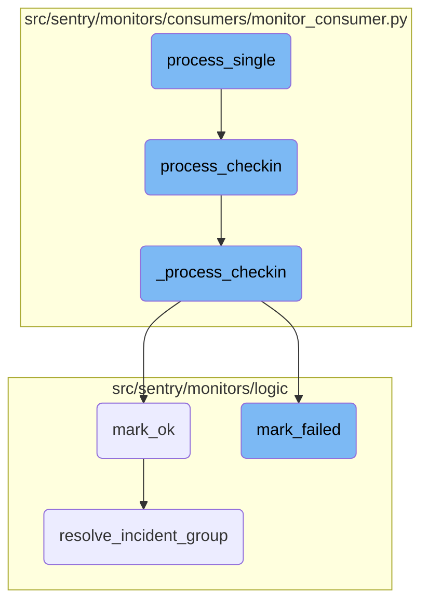

In this document, we will explain the flow of processing a single message in the system. The process involves decoding the message, handling <SwmToken path="src/sentry/monitors/consumers/monitor_consumer.py" pos="307:11:13" line-data="    # This check allows timeout check-ins to be updated by a">`check-ins`</SwmToken>, validating data, and updating the monitor status.

The flow starts with decoding a message from the Kafka queue. If the message is a <SwmToken path="src/sentry/monitors/consumers/monitor_consumer.py" pos="1018:13:13" line-data="        if wrapper[&quot;message_type&quot;] == &quot;clock_pulse&quot;:">`clock_pulse`</SwmToken>, it stops further processing. Otherwise, it extracts relevant information and processes the <SwmToken path="src/sentry/monitors/consumers/monitor_consumer.py" pos="918:7:9" line-data="    Process an individual check-in">`check-in`</SwmToken>. The <SwmToken path="src/sentry/monitors/consumers/monitor_consumer.py" pos="918:7:9" line-data="    Process an individual check-in">`check-in`</SwmToken> is validated, and the monitor status is updated accordingly. If the <SwmToken path="src/sentry/monitors/consumers/monitor_consumer.py" pos="918:7:9" line-data="    Process an individual check-in">`check-in`</SwmToken> is successful, the status is marked as OK; if it fails, it is marked as failed.

# Flow drill down



<SwmSnippet path="/src/sentry/monitors/consumers/monitor_consumer.py" line="1003">

---

## Processing Single Message

The function <SwmToken path="src/sentry/monitors/consumers/monitor_consumer.py" pos="1003:2:2" line-data="def process_single(message: Message[KafkaPayload | FilteredPayload]):">`process_single`</SwmToken> is responsible for processing a single message from the Kafka queue. It decodes the message payload, extracts relevant information such as timestamp and partition, and then calls <SwmToken path="src/sentry/monitors/consumers/monitor_consumer.py" pos="916:2:2" line-data="def process_checkin(item: CheckinItem):">`process_checkin`</SwmToken> to handle the <SwmToken path="src/sentry/monitors/consumers/monitor_consumer.py" pos="918:7:9" line-data="    Process an individual check-in">`check-in`</SwmToken> logic. If the message type is <SwmToken path="src/sentry/monitors/consumers/monitor_consumer.py" pos="1018:13:13" line-data="        if wrapper[&quot;message_type&quot;] == &quot;clock_pulse&quot;:">`clock_pulse`</SwmToken>, it returns early as no further processing is needed.

```python
def process_single(message: Message[KafkaPayload | FilteredPayload]):
    assert not isinstance(message.payload, FilteredPayload)
    assert isinstance(message.value, BrokerValue)

    try:
        wrapper: IngestMonitorMessage = MONITOR_CODEC.decode(message.payload.value)
        ts = message.value.timestamp
        partition = message.value.partition.index

        try:
            try_monitor_clock_tick(ts, partition)
        except Exception:
            logger.exception("Failed to trigger monitor tasks")

        # Nothing else to do with clock pulses
        if wrapper["message_type"] == "clock_pulse":
            return

        item = CheckinItem(
            ts=ts,
            partition=partition,
```

---

</SwmSnippet>

<SwmSnippet path="/src/sentry/monitors/consumers/monitor_consumer.py" line="916">

---

## Handling <SwmToken path="src/sentry/monitors/consumers/monitor_consumer.py" pos="307:11:13" line-data="    # This check allows timeout check-ins to be updated by a">`check-ins`</SwmToken>

The function <SwmToken path="src/sentry/monitors/consumers/monitor_consumer.py" pos="916:2:2" line-data="def process_checkin(item: CheckinItem):">`process_checkin`</SwmToken> processes an individual <SwmToken path="src/sentry/monitors/consumers/monitor_consumer.py" pos="918:7:9" line-data="    Process an individual check-in">`check-in`</SwmToken> by starting a new transaction and calling <SwmToken path="src/sentry/monitors/consumers/monitor_consumer.py" pos="922:4:4" line-data="            op=&quot;_process_checkin&quot;,">`_process_checkin`</SwmToken>. If any <SwmToken path="src/sentry/monitors/consumers/monitor_consumer.py" pos="926:4:4" line-data="            # `ProcessingErrorsException`">`ProcessingErrorsException`</SwmToken> occurs, it handles the errors accordingly.

```python
def process_checkin(item: CheckinItem):
    """
    Process an individual check-in
    """
    try:
        with sentry_sdk.start_transaction(
            op="_process_checkin",
            name="monitors.monitor_consumer",
        ) as txn:
            # Deepcopy the checkin here so that it's not modified. We need the original when we get a
            # `ProcessingErrorsException`
            _process_checkin(deepcopy(item), txn)
    except ProcessingErrorsException as e:
        handle_processing_errors(item, e)
    except Exception:
        logger.exception("Failed to process check-in")
```

---

</SwmSnippet>

<SwmSnippet path="/src/sentry/monitors/consumers/monitor_consumer.py" line="409">

---

### Validating and Processing <SwmToken path="src/sentry/monitors/consumers/monitor_consumer.py" pos="307:11:13" line-data="    # This check allows timeout check-ins to be updated by a">`check-ins`</SwmToken>

The function <SwmToken path="src/sentry/monitors/consumers/monitor_consumer.py" pos="409:2:2" line-data="def _process_checkin(item: CheckinItem, txn: Transaction | Span):">`_process_checkin`</SwmToken> performs the core logic for processing a <SwmToken path="src/sentry/monitors/consumers/monitor_consumer.py" pos="918:7:9" line-data="    Process an individual check-in">`check-in`</SwmToken>. It validates the <SwmToken path="src/sentry/monitors/consumers/monitor_consumer.py" pos="918:7:9" line-data="    Process an individual check-in">`check-in`</SwmToken> data, checks for rate limits and quotas, and ensures the monitor and its environment are correctly configured. If any validation or processing errors occur, it raises appropriate exceptions.

```python
def _process_checkin(item: CheckinItem, txn: Transaction | Span):
    params = item.payload

    start_time = to_datetime(float(item.message["start_time"]))
    project_id = int(item.message["project_id"])
    source_sdk = item.message["sdk"]

    monitor_slug = item.valid_monitor_slug
    environment = params.get("environment")

    project = Project.objects.get_from_cache(id=project_id)

    # Strip sdk version to reduce metric cardinality
    sdk_platform = source_sdk.split("/")[0] if source_sdk else "none"

    metric_kwargs = {
        "source": "consumer",
        "sdk_platform": sdk_platform,
    }

    if check_killswitch(metric_kwargs, project):
```

---

</SwmSnippet>

<SwmSnippet path="/src/sentry/monitors/logic/mark_ok.py" line="23">

---

## Marking <SwmToken path="src/sentry/monitors/consumers/monitor_consumer.py" pos="918:7:9" line-data="    Process an individual check-in">`check-in`</SwmToken> as OK

The function <SwmToken path="src/sentry/monitors/logic/mark_ok.py" pos="23:2:2" line-data="def mark_ok(checkin: MonitorCheckIn, ts: datetime) -&gt; None:">`mark_ok`</SwmToken> updates the monitor environment status to OK if the <SwmToken path="src/sentry/monitors/consumers/monitor_consumer.py" pos="918:7:9" line-data="    Process an individual check-in">`check-in`</SwmToken> is successful. It also handles incident resolution if the monitor was previously in a failed state.

```python
def mark_ok(checkin: MonitorCheckIn, ts: datetime) -> None:
    monitor_env = checkin.monitor_environment

    if monitor_env is None:
        return None

    next_checkin = monitor_env.monitor.get_next_expected_checkin(ts)
    next_checkin_latest = monitor_env.monitor.get_next_expected_checkin_latest(ts)

    params: _Params = {
        "last_checkin": checkin.date_added,
        "next_checkin": next_checkin,
        "next_checkin_latest": next_checkin_latest,
    }

    if monitor_env.status != MonitorStatus.OK and checkin.status == CheckInStatus.OK:
        recovery_threshold = monitor_env.monitor.config.get("recovery_threshold", 1)
        if not recovery_threshold:
            recovery_threshold = 1

        # Run incident logic if recovery threshold is set
```

---

</SwmSnippet>

<SwmSnippet path="/src/sentry/monitors/logic/mark_failed.py" line="29">

---

## Marking <SwmToken path="src/sentry/monitors/logic/mark_failed.py" pos="35:7:9" line-data="    Given a failing check-in, mark the monitor environment as failed and trigger">`check-in`</SwmToken> as Failed

The function <SwmToken path="src/sentry/monitors/logic/mark_failed.py" pos="29:2:2" line-data="def mark_failed(">`mark_failed`</SwmToken> updates the monitor environment status to failed and triggers side effects such as creating incidents and issues. It calculates the next expected <SwmToken path="src/sentry/monitors/logic/mark_failed.py" pos="35:7:9" line-data="    Given a failing check-in, mark the monitor environment as failed and trigger">`check-in`</SwmToken> time and updates the monitor environment accordingly.

```python
def mark_failed(
    failed_checkin: MonitorCheckIn,
    ts: datetime,
    received: datetime | None = None,
) -> bool:
    """
    Given a failing check-in, mark the monitor environment as failed and trigger
    side effects for creating monitor incidents and issues.

    The provided `ts` is the reference time for when the next check-in time is
    calculated from. This typically would be the failed check-in's `date_added`
    or completion time. Though for the missed and timedout tasks this may be
    computed based on the tasks reference time.
    """
    monitor_env = failed_checkin.monitor_environment

    if monitor_env is None:
        return False

    failure_issue_threshold = monitor_env.monitor.config.get("failure_issue_threshold", 1)
    if not failure_issue_threshold:
```

---

</SwmSnippet>

<SwmSnippet path="/src/sentry/monitors/logic/mark_ok.py" line="99">

---

### Resolving Incident Group

The function <SwmToken path="src/sentry/monitors/logic/mark_ok.py" pos="99:2:2" line-data="def resolve_incident_group(">`resolve_incident_group`</SwmToken> resolves any open incidents associated with the monitor environment by producing a status change message to Kafka.

```python
def resolve_incident_group(
    fingerprint: str,
    project_id: int,
):
    from sentry.issues.producer import PayloadType, produce_occurrence_to_kafka
    from sentry.issues.status_change_message import StatusChangeMessage
    from sentry.models.group import GroupStatus

    status_change = StatusChangeMessage(
        fingerprint=[fingerprint],
        project_id=project_id,
        new_status=GroupStatus.RESOLVED,
        new_substatus=None,
    )

    produce_occurrence_to_kafka(
        payload_type=PayloadType.STATUS_CHANGE,
        status_change=status_change,
    )
```

---

</SwmSnippet>

&nbsp;

*This is an auto-generated document by Swimm AI 🌊 and has not yet been verified by a human*

<SwmMeta version="3.0.0" repo-id="Z2l0aHViJTNBJTNBc2VudHJ5LWRlbW8tMSUzQSUzQVN3aW1tLURlbW8=" repo-name="sentry-demo-1" doc-type="flows"><sup>Powered by [Swimm](/)</sup></SwmMeta>
