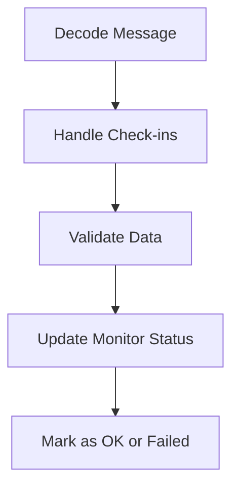

This document will cover the flow of processing a single message in the system. We'll cover:

1. Decoding the message
2. Handling check-ins
3. Validating data
4. Updating the monitor status.

Technical document: <SwmLink doc-title="Processing a Single Message Flow">[Processing a Single Message Flow](/.swm/processing-a-single-message-flow.ihybh8cb.sw.md)</SwmLink>

# [Decoding the Message](https://app.swimm.io/repos/Z2l0aHViJTNBJTNBc2VudHJ5LWRlbW8tMSUzQSUzQVN3aW1tLURlbW8=/docs/ihybh8cb#processing-single-message)

The process begins by decoding a message from the Kafka queue. This step involves extracting relevant information such as the timestamp and partition from the message payload. If the message type is identified as 'clock_pulse', it is ignored and no further processing occurs. This ensures that only actionable messages proceed to the next steps.

# [Handling Check-ins](https://app.swimm.io/repos/Z2l0aHViJTNBJTNBc2VudHJ5LWRlbW8tMSUzQSUzQVN3aW1tLURlbW8=/docs/ihybh8cb#handling-check-ins)

Once the message is decoded, the next step is to handle the check-in. This involves starting a new transaction to ensure that the check-in process is tracked and any errors can be managed effectively. The check-in data is then passed to the core processing logic. If any errors occur during this step, they are handled appropriately to ensure system stability.

# [Validating Data](https://app.swimm.io/repos/Z2l0aHViJTNBJTNBc2VudHJ5LWRlbW8tMSUzQSUzQVN3aW1tLURlbW8=/docs/ihybh8cb#validating-and-processing-check-ins)

The core logic for processing a check-in involves validating the check-in data. This includes checking for rate limits and quotas, and ensuring that the monitor and its environment are correctly configured. If any validation errors occur, appropriate exceptions are raised. This step is crucial for maintaining data integrity and ensuring that only valid check-ins are processed.

# [Updating the Monitor Status](https://app.swimm.io/repos/Z2l0aHViJTNBJTNBc2VudHJ5LWRlbW8tMSUzQSUzQVN3aW1tLURlbW8=/docs/ihybh8cb#marking-check-in-as-ok)

After the check-in data is validated, the monitor status is updated accordingly. If the check-in is successful, the status is marked as OK. This involves updating the monitor environment status and handling any incident resolution if the monitor was previously in a failed state. This step ensures that the system accurately reflects the current status of the monitor.

# [Marking Check-in as Failed](https://app.swimm.io/repos/Z2l0aHViJTNBJTNBc2VudHJ5LWRlbW8tMSUzQSUzQVN3aW1tLURlbW8=/docs/ihybh8cb#marking-check-in-as-failed)

If the check-in fails, the monitor status is marked as failed. This involves updating the monitor environment status and triggering side effects such as creating incidents and issues. The next expected check-in time is calculated and the monitor environment is updated accordingly. This step ensures that any issues are promptly identified and addressed.

# [Resolving Incident Group](https://app.swimm.io/repos/Z2l0aHViJTNBJTNBc2VudHJ5LWRlbW8tMSUzQSUzQVN3aW1tLURlbW8=/docs/ihybh8cb#resolving-incident-group)

If the monitor status is updated to OK, any open incidents associated with the monitor environment are resolved. This involves producing a status change message to Kafka, which updates the status of the incidents to resolved. This step ensures that the system accurately reflects the resolution of any issues.

&nbsp;

*This is an auto-generated document by Swimm AI 🌊 and has not yet been verified by a human*

<SwmMeta version="3.0.0" repo-id="Z2l0aHViJTNBJTNBc2VudHJ5LWRlbW8tMSUzQSUzQVN3aW1tLURlbW8=" repo-name="sentry-demo-1" doc-type="product-flows">Powered by [Swimm](/)</SwmMeta>
